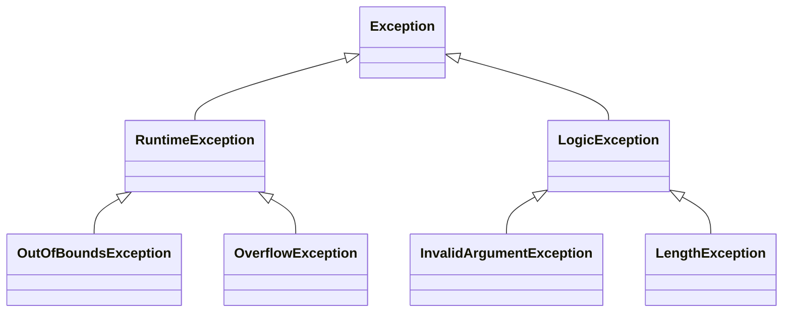

# PHP 异常层次结构

在PHP中，异常处理是编写健壮代码的关键部分。异常是一种在程序执行过程中发生的错误或意外情况，它允许我们在代码中捕获并处理这些错误，而不是让程序崩溃。PHP的异常机制基于面向对象的设计，通过异常类的层次结构来实现。本文将详细介绍PHP异常层次结构，并通过示例代码和实际案例帮助你理解其工作原理。

## 什么是异常层次结构？

PHP中的异常是通过类来实现的，这些类形成了一个层次结构。所有的异常类都继承自一个基类 `Exception`。这个基类提供了异常处理的基本功能，比如获取异常消息、代码行号等。通过继承 `Exception` 类，PHP允许开发者创建自定义的异常类，以便更精确地处理不同类型的错误。

### 异常层次结构图



如上图所示，`Exception` 是所有异常类的基类。`RuntimeException` 和 `LogicException` 是 `Exception` 的直接子类，分别用于处理运行时错误和逻辑错误。`RuntimeException` 的子类包括 `OutOfBoundsException` 和 `OverflowException`，而 `LogicException` 的子类包括 `InvalidArgumentException` 和 `LengthException`。

## 异常类的继承关系

### 1. `Exception` 基类

`Exception` 是所有异常类的基类，它提供了以下常用方法：

- `getMessage()`：获取异常消息。
- `getCode()`：获取异常代码。
- `getFile()`：获取发生异常的文件名。
- `getLine()`：获取发生异常的代码行号。
- `getTrace()`：获取异常的调用栈。
- `getTraceAsString()`：获取异常的调用栈字符串。

### 2. `RuntimeException`

`RuntimeException` 是 `Exception` 的子类，用于表示运行时发生的错误。这些错误通常是由于外部因素引起的，比如文件不存在、网络连接失败等。

### 3. `LogicException`

`LogicException` 也是 `Exception` 的子类，用于表示逻辑错误。这些错误通常是由于代码逻辑问题引起的，比如传递了无效的参数、数组越界等。

## 代码示例

### 示例1：捕获 `RuntimeException`

```php
try {
    $file = fopen("nonexistent_file.txt", "r");
    if (!$file) {
        throw new RuntimeException("文件不存在");
    }
} catch (RuntimeException $e) {
    echo "捕获到运行时异常: " . $e->getMessage();
}
```

**输出：**
```
捕获到运行时异常: 文件不存在
```

### 示例2：捕获 `LogicException`

```php
function divide($a, $b) {
    if ($b == 0) {
        throw new LogicException("除数不能为零");
    }
    return $a / $b;
}

try {
    echo divide(10, 0);
} catch (LogicException $e) {
    echo "捕获到逻辑异常: " . $e->getMessage();
}
```

**输出：**
```
捕获到逻辑异常: 除数不能为零
```

## 实际应用场景

### 场景1：文件上传处理

在文件上传功能中，可能会遇到文件大小超出限制、文件类型不匹配等问题。通过自定义异常类，可以更精确地处理这些错误。

```php
class FileUploadException extends RuntimeException {}

function uploadFile($file) {
    if ($file['size'] > 1000000) {
        throw new FileUploadException("文件大小超出限制");
    }
    // 其他上传逻辑
}

try {
    uploadFile($_FILES['file']);
} catch (FileUploadException $e) {
    echo "文件上传失败: " . $e->getMessage();
}
```

### 场景2：用户输入验证

在用户注册功能中，需要对用户输入进行验证。如果输入不符合要求，可以抛出 `InvalidArgumentException`。

```php
function registerUser($username, $password) {
    if (strlen($username) < 5) {
        throw new InvalidArgumentException("用户名至少需要5个字符");
    }
    // 其他注册逻辑
}

try {
    registerUser("abc", "password");
} catch (InvalidArgumentException $e) {
    echo "用户注册失败: " . $e->getMessage();
}
```

## 总结

PHP的异常层次结构为开发者提供了一种灵活且强大的错误处理机制。通过继承 `Exception` 类，你可以创建自定义的异常类，以便更精确地处理不同类型的错误。理解并合理使用异常层次结构，可以显著提升代码的健壮性和可维护性。

## 附加资源与练习

- **练习1**：尝试创建一个自定义异常类 `DatabaseConnectionException`，并在数据库连接失败时抛出该异常。
- **练习2**：编写一个函数，接受一个数组和一个索引作为参数，如果索引超出数组范围，抛出 `OutOfBoundsException`。

:::tip
深入学习PHP异常处理的最佳方式是实践。尝试在你的项目中引入异常处理机制，并观察其对代码质量的影响。
:::