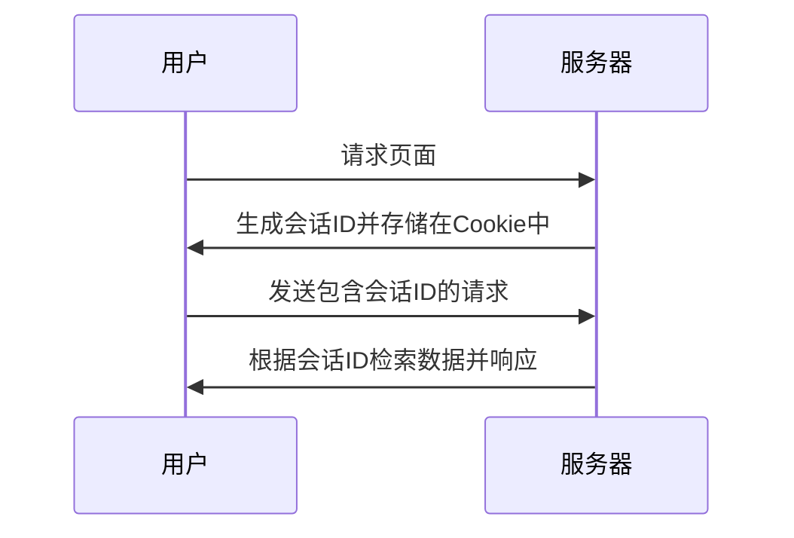

## 介绍

在Web开发中，会话（Session）是一种用于在多个页面之间存储和传递用户数据的机制。与Cookie不同，会话数据存储在服务器端，而客户端仅保存一个会话ID。这使得会话更加安全，适合存储敏感信息。

PHP提供了内置的会话管理功能，使得开发者可以轻松地创建、读取、更新和销毁会话数据。本文将详细介绍PHP会话的基础知识，并通过代码示例和实际案例帮助你快速掌握这一重要概念。

## 会话的工作原理

当用户访问一个启用会话的PHP页面时，PHP会自动生成一个唯一的会话ID，并将其存储在客户端的Cookie中（默认情况下）。这个会话ID用于在后续请求中识别用户，并从服务器端检索对应的会话数据。



## 启动会话

在PHP中，使用 `session_start()` 函数启动会话。这个函数必须在任何输出发送到浏览器之前调用，因为它会尝试发送一个包含会话ID的Cookie。

```php
<?php
// 启动会话
session_start();

// 设置会话变量
$_SESSION['username'] = 'JohnDoe';

// 输出会话变量
echo '用户名: ' . $_SESSION['username'];
?>
```

**输出：**
```
用户名: JohnDoe
```

:::note
如果 `session_start()` 之前有任何输出（包括空格或换行符），PHP会抛出一个警告。确保在脚本的最开始调用此函数。
:::

## 存储和读取会话数据

会话数据存储在 `$_SESSION` 超全局数组中。你可以像操作普通数组一样操作 `$_SESSION`。

```php
<?php
session_start();

// 存储数据
$_SESSION['user_id'] = 123;
$_SESSION['logged_in'] = true;

// 读取数据
if ($_SESSION['logged_in']) {
    echo '用户ID: ' . $_SESSION['user_id'];
}
?>
```

**输出：**
```
用户ID: 123
```

## 销毁会话

当用户注销或会话不再需要时，可以使用 `session_destroy()` 函数销毁会话。这将删除服务器上的会话数据，但不会立即删除客户端的会话ID Cookie。

```php
<?php
session_start();

// 销毁会话
session_destroy();

// 清除会话变量
$_SESSION = array();
?>
```

:::caution
`session_destroy()` 只会删除服务器上的会话数据，而不会立即删除客户端的会话ID Cookie。如果需要立即删除客户端的Cookie，可以使用 `setcookie()` 函数。
:::

## 实际案例：用户登录系统

以下是一个简单的用户登录系统示例，展示了如何使用会话来管理用户登录状态。

```php
<?php
session_start();

// 模拟用户登录
if ($_POST['username'] === 'admin' && $_POST['password'] === 'password') {
    $_SESSION['logged_in'] = true;
    $_SESSION['username'] = 'admin';
    echo '登录成功！';
} else {
    echo '登录失败，请检查用户名和密码。';
}

// 检查登录状态
if ($_SESSION['logged_in']) {
    echo '欢迎回来, ' . $_SESSION['username'];
} else {
    echo '请先登录。';
}
?>
```

**输入：**
```
username: admin
password: password
```

**输出：**
```
登录成功！
欢迎回来, admin
```

## 总结

PHP会话是管理用户数据的强大工具，特别适合在多个页面之间共享数据。通过 `session_start()`、`$_SESSION` 和 `session_destroy()`，你可以轻松地创建、读取、更新和销毁会话数据。

在实际开发中，会话常用于用户登录系统、购物车、个性化设置等场景。掌握会话的基础知识是成为一名合格PHP开发者的重要一步。

## 附加资源与练习

- **练习1**：创建一个简单的购物车系统，使用会话来存储用户选择的商品。
- **练习2**：实现一个用户注销功能，确保会话数据被正确销毁。
- **阅读**：PHP官方文档中的[会话管理](https://www.php.net/manual/en/book.session.php)部分，了解更多高级用法和配置选项。

希望本文能帮助你理解PHP会话的基础知识，并为你的Web开发之旅打下坚实的基础！