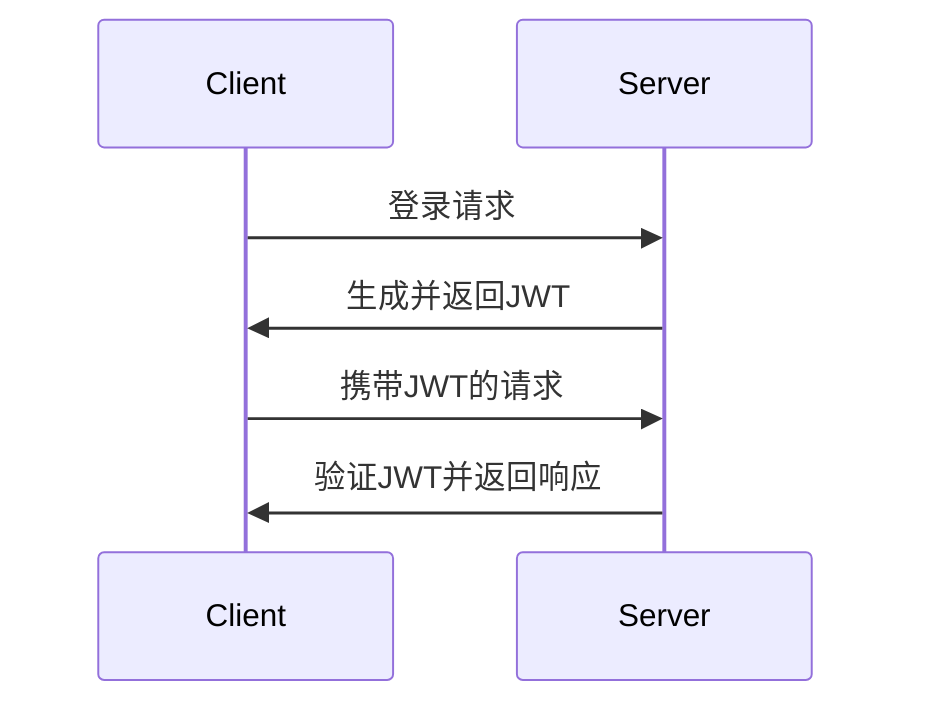

# PHP 无状态会话

在Web开发中，会话（Session）是管理用户状态的重要机制。PHP提供了多种会话管理方式，其中**无状态会话**是一种常见且高效的方式。本文将详细介绍PHP无状态会话的概念、实现方法以及实际应用场景。

## 什么是无状态会话？

无状态会话（Stateless Session）是指服务器不存储任何会话数据，而是将会话信息存储在客户端（通常是浏览器）中。这种方式的核心思想是**服务器不保存用户状态**，而是通过客户端传递的会话信息来识别用户。

与传统的会话管理（如PHP的`$_SESSION`）不同，无状态会话不需要在服务器端存储会话数据，因此更适合分布式系统或需要高扩展性的应用场景。

## 无状态会话的工作原理

在无状态会话中，服务器生成一个包含用户信息的令牌（通常是JSON Web Token，简称JWT），并将其发送给客户端。客户端在后续请求中携带该令牌，服务器通过验证令牌来识别用户。

以下是一个简单的无状态会话流程：



## 实现无状态会话

在PHP中，可以通过JWT来实现无状态会话。以下是一个简单的示例：

### 1. 安装JWT库

首先，使用Composer安装一个JWT库，例如`firebase/php-jwt`：

```bash
composer require firebase/php-jwt
```

### 2. 生成JWT

在用户登录成功后，生成一个JWT并返回给客户端：

```php
<?php
require 'vendor/autoload.php';

use Firebase\JWT\JWT;

$key = "example_key"; // 密钥
$payload = array(
    "user_id" => 123,
    "username" => "john_doe",
    "exp" => time() + 3600 // 设置过期时间为1小时后
);

$jwt = JWT::encode($payload, $key);
echo $jwt;
```

### 3. 验证JWT

在后续请求中，客户端需要携带JWT。服务器通过验证JWT来识别用户：

```php
<?php
require 'vendor/autoload.php';

use Firebase\JWT\JWT;
use Firebase\JWT\Key;

$key = "example_key"; // 密钥
$jwt = $_SERVER['HTTP_AUTHORIZATION'] ?? ''; // 从请求头中获取JWT

try {
    $decoded = JWT::decode($jwt, new Key($key, 'HS256'));
    print_r($decoded);
} catch (Exception $e) {
    echo '验证失败: ' . $e->getMessage();
}
```

:::note
在实际应用中，JWT通常通过HTTP请求头（如`Authorization`）传递。
:::

## 实际应用场景

无状态会话在以下场景中非常有用：

1. **分布式系统**：在多个服务器之间共享用户状态时，无状态会话可以避免会话数据同步的问题。
2. **微服务架构**：每个微服务可以独立验证JWT，而不需要依赖中央会话存储。
3. **移动应用**：移动应用可以通过JWT与后端API进行无状态通信。

## 总结

无状态会话是一种高效且灵活的会话管理方式，特别适合分布式系统和高扩展性应用。通过JWT，PHP开发者可以轻松实现无状态会话，从而提升应用的性能和可维护性。

## 附加资源

- [JWT官方网站](https://jwt.io/)
- [PHP JWT库文档](https://github.com/firebase/php-jwt)

## 练习

1. 尝试在PHP中实现一个完整的无状态会话流程，包括生成JWT和验证JWT。
2. 探索如何在分布式系统中使用无状态会话来管理用户状态。