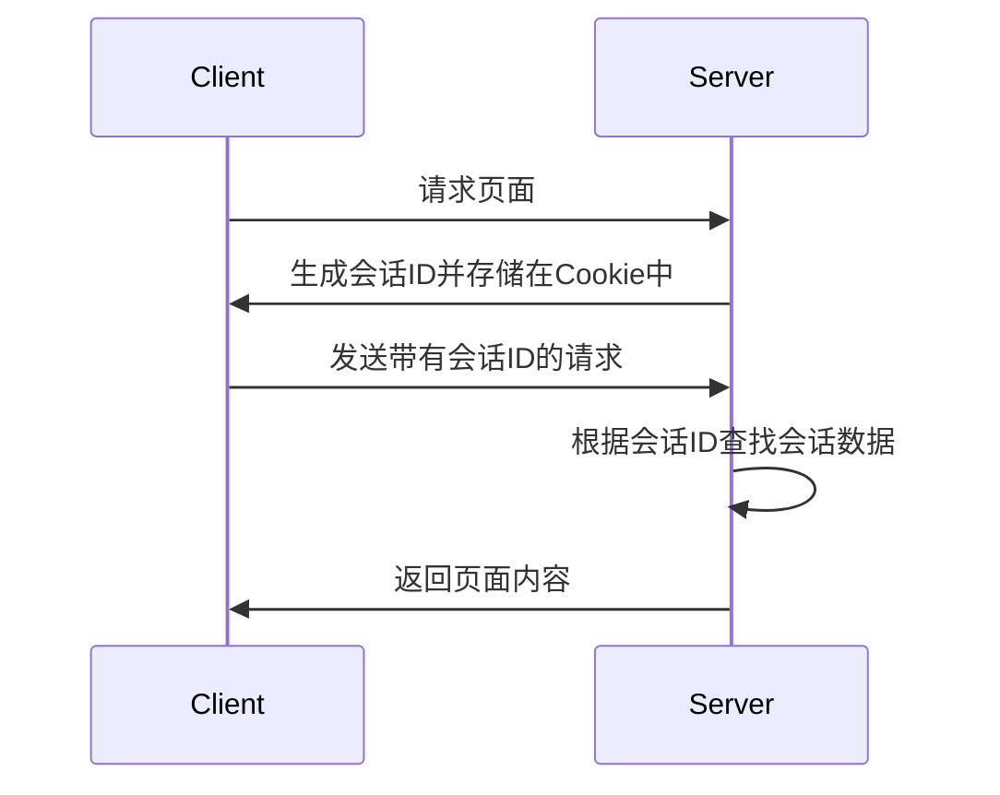

# PHP 会话存储

在Web开发中，会话（Session）是一种用于在不同页面之间存储和传递用户数据的机制。与Cookie不同，会话数据存储在服务器端，而Cookie则存储在客户端。PHP提供了内置的会话管理功能，使得开发者可以轻松地管理用户会话。

## 什么是PHP会话存储？

PHP会话存储是一种在服务器端存储用户数据的机制。当用户访问网站时，PHP会为该用户创建一个唯一的会话ID，并将该ID存储在客户端的Cookie中（默认情况下）。服务器使用这个会话ID来识别用户，并在服务器端存储与该用户相关的数据。

会话数据通常用于存储用户的登录状态、购物车内容、表单数据等。由于会话数据存储在服务器端，因此比Cookie更安全，适合存储敏感信息。

## 如何启动PHP会话

在PHP中，使用 `session_start()` 函数来启动会话。这个函数必须在任何输出（包括HTML标签和空格）之前调用，因为它会发送HTTP头信息。

```php
<?php
// 启动会话
session_start();

// 设置会话变量
$_SESSION['username'] = 'JohnDoe';

// 输出会话变量
echo 'Welcome, ' . $_SESSION['username'];
?>
```

在上面的例子中，`session_start()` 启动了会话，并将 `username` 存储在 `$_SESSION` 超全局数组中。之后，可以在其他页面中访问这个会话变量。

## 会话的工作原理

当用户访问网站时，PHP会为该用户生成一个唯一的会话ID，并将该ID存储在客户端的Cookie中。服务器使用这个会话ID来识别用户，并在服务器端存储与该用户相关的数据。



## 实际应用场景

### 用户登录系统

会话存储最常见的应用场景之一是用户登录系统。当用户登录时，服务器会将用户的登录状态存储在会话中，以便在用户浏览其他页面时保持登录状态。

```php
<?php
session_start();

// 假设用户已经登录
$_SESSION['logged_in'] = true;
$_SESSION['user_id'] = 123;

// 在其他页面中检查用户是否登录
if (isset($_SESSION['logged_in']) && $_SESSION['logged_in']) {
    echo 'User is logged in. User ID: ' . $_SESSION['user_id'];
} else {
    echo 'User is not logged in.';
}
?>
```

### 购物车系统

另一个常见的应用场景是购物车系统。用户可以将商品添加到购物车中，购物车的内容会存储在会话中，直到用户完成购买。

```php
<?php
session_start();

// 添加商品到购物车
if (!isset($_SESSION['cart'])) {
    $_SESSION['cart'] = [];
}

$_SESSION['cart'][] = 'Product 1';
$_SESSION['cart'][] = 'Product 2';

// 显示购物车内容
echo 'Shopping Cart:';
print_r($_SESSION['cart']);
?>
```

## 会话的安全性

虽然会话存储比Cookie更安全，但仍然需要注意一些安全问题。例如，会话劫持（Session Hijacking）是一种常见的攻击方式，攻击者通过获取用户的会话ID来冒充用户。

为了防止会话劫持，可以采取以下措施：

1. **使用HTTPS**：确保所有会话数据通过加密的HTTPS连接传输。
2. **设置会话Cookie为HttpOnly**：防止JavaScript访问会话Cookie。
3. **定期更换会话ID**：使用 `session_regenerate_id()` 函数定期更换会话ID。

```php
<?php
session_start();
session_regenerate_id(true); // 更换会话ID并删除旧的会话数据
?>
```

## 总结

PHP会话存储是一种强大的机制，用于在服务器端存储用户数据。通过会话，开发者可以轻松地管理用户的登录状态、购物车内容等。虽然会话存储比Cookie更安全，但仍然需要注意一些安全问题，如会话劫持。

## 附加资源与练习

- **PHP官方文档**：[PHP Sessions](https://www.php.net/manual/en/book.session.php)
- **练习**：尝试创建一个简单的用户登录系统，使用会话存储用户的登录状态，并在其他页面中检查用户是否已登录。

:::tip
在实际开发中，建议使用框架（如Laravel）提供的会话管理功能，这些框架通常会处理更多的安全细节，并提供更高级的功能。
:::