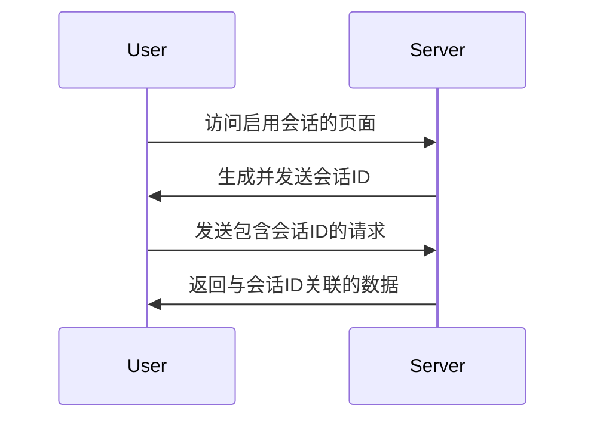

## 介绍

在Web开发中，会话（Session）是一种用于在不同页面之间存储和传递用户数据的机制。PHP会话变量是会话管理的核心，允许我们在服务器端存储用户信息，并在用户浏览网站时保持这些信息的状态。

与Cookie不同，会话数据存储在服务器端，而Cookie存储在客户端。会话变量通常用于存储用户的登录状态、购物车内容等敏感信息，因为它们更安全且不易被篡改。

## 会话的工作原理

当用户访问一个启用会话的PHP页面时，PHP会自动生成一个唯一的会话ID（Session ID），并将其存储在客户端的Cookie中（通常名为`PHPSESSID`）。这个会话ID用于在后续请求中识别用户，并检索存储在服务器端的会话数据。



## 使用PHP会话变量

### 启动会话

在使用会话变量之前，必须先启动会话。可以通过调用`session_start()`函数来实现：

```php
<?php
session_start();
?>
```

:::note
`session_start()`必须在任何输出（如HTML或`echo`）之前调用，否则会引发错误。
:::

### 设置会话变量

启动会话后，可以使用`$_SESSION`超全局数组来设置和访问会话变量。例如：

```php
<?php
session_start();
$_SESSION['username'] = 'JohnDoe';
?>
```

### 访问会话变量

要访问已设置的会话变量，只需通过`$_SESSION`数组获取：

```php
<?php
session_start();
echo 'Welcome, ' . $_SESSION['username'];
?>
```

输出：
```
Welcome, JohnDoe
```

### 销毁会话

当用户注销或会话不再需要时，可以通过`session_destroy()`函数销毁会话：

```php
<?php
session_start();
session_destroy();
?>
```

:::caution
`session_destroy()`只会销毁会话数据，但不会立即删除`$_SESSION`数组中的内容。如果需要立即清除会话变量，可以手动清空`$_SESSION`数组：

```php
<?php
session_start();
$_SESSION = array();
session_destroy();
?>
```
:::

## 实际应用场景

### 用户登录系统

会话变量常用于用户登录系统。以下是一个简单的示例：

```php
<?php
session_start();

// 假设用户已通过表单提交了用户名和密码
$username = 'JohnDoe';
$password = 'password123';

// 验证用户（此处为简化示例）
if ($username === 'JohnDoe' && $password === 'password123') {
    $_SESSION['logged_in'] = true;
    $_SESSION['username'] = $username;
    echo 'Login successful!';
} else {
    echo 'Invalid credentials!';
}
?>
```

在后续页面中，可以通过检查`$_SESSION['logged_in']`来验证用户是否已登录：

```php
<?php
session_start();

if (isset($_SESSION['logged_in']) && $_SESSION['logged_in'] === true) {
    echo 'Welcome back, ' . $_SESSION['username'];
} else {
    echo 'Please log in.';
}
?>
```

### 购物车系统

会话变量也可用于实现简单的购物车功能：

```php
<?php
session_start();

// 添加商品到购物车
if (!isset($_SESSION['cart'])) {
    $_SESSION['cart'] = array();
}
$_SESSION['cart'][] = 'Product 1';

// 显示购物车内容
echo 'Your cart contains: ' . implode(', ', $_SESSION['cart']);
?>
```

## 总结

PHP会话变量是Web开发中管理用户状态的重要工具。通过`$_SESSION`超全局数组，我们可以在不同页面之间存储和访问用户数据。会话变量适用于用户登录、购物车、个性化设置等多种场景。

:::tip
为了确保会话的安全性，建议在`php.ini`中配置`session.cookie_secure`和`session.cookie_httponly`选项，以防止会话劫持和XSS攻击。
:::

## 附加资源与练习

- **练习1**：创建一个简单的用户登录系统，使用会话变量存储用户登录状态。
- **练习2**：实现一个购物车系统，允许用户添加和删除商品。
- **进一步阅读**：查阅PHP官方文档中关于[会话管理](https://www.php.net/manual/en/book.session.php)的更多内容。

通过掌握PHP会话变量，你将能够构建更复杂、更安全的Web应用程序。继续练习并探索更多高级用法吧！