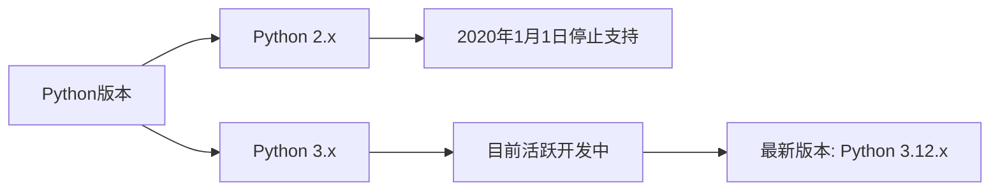
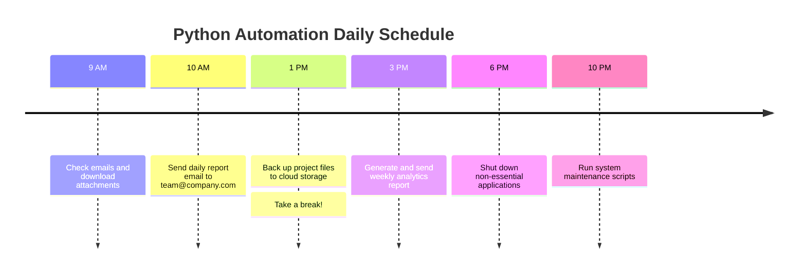

import Image from '@theme/IdealImage';


# Python 简介

## 什么是Python？

Python是一种高级、解释型、通用编程语言，由荷兰人Guido van Rossum于1989年创造并在1991年首次发布。Python的设计哲学强调代码的可读性，使用大量缩进和简洁的语法，使程序员能够用更少的代码行表达概念。

:::tip Python名称的由来
Python的名字并非来源于蟒蛇，而是Guido van Rossum向自己喜爱的英国喜剧团体Monty Python致敬。
:::

## Python 的主要特点

<div style={{
    "width": "50%",
    "margin": "0 auto",
}}>
    <Image img={require('./img/logo/python-logo-master-v3-TM.png')}/>
</div>

Python作为一种编程语言，具有许多独特的特点，使其成为初学者和专业开发者的理想选择：

1. **简单易学**：Python语法简洁明了，接近自然语言，降低了学习难度。

2. **可读性强**：Python强制使用缩进来组织代码块，使代码结构清晰。

3. **解释型语言**：无需编译，直接运行，便于调试和测试。

4. **跨平台性**：可在Windows、macOS、Linux等多种操作系统上运行。

5. **丰富的库资源**：Python拥有庞大的标准库和第三方库生态系统。

6. **支持多种编程范式**：包括面向对象编程、命令式编程和函数式编程。

7. **动态类型**：变量无需声明类型，由解释器自动推断。

8. **开源免费**：Python是开源的，任何人都可以使用和贡献。

## Python 的版本

Python主要有两个活跃的版本系列：



:::caution 版本选择提醒
现在学习Python，强烈建议直接学习Python 3，因为Python 2已于2020年1月1日终止官方支持。
:::

## 安装Python

### Windows系统安装

1. 访问[Python官方网站](https://www.python.org/downloads/)
2. 下载最新版本的Python安装程序
3. 运行安装程序，并勾选"Add Python to PATH"
4. 点击"Install Now"完成安装

### macOS系统安装

macOS通常预装了Python，但可能不是最新版本。可以通过以下方式安装：

1. 使用Homebrew（推荐）：
```bash
brew install python
```

2. 或直接从Python官网下载安装程序

### Linux系统安装

大多数Linux发行版已预装Python。可以使用包管理器进行安装或升级：

- Ubuntu/Debian:
```bash
sudo apt update
sudo apt install python3 python3-pip
```

- CentOS/RHEL:
```bash
sudo yum install python3 python3-pip
```

## 验证安装

安装完成后，可以通过命令行验证Python是否安装成功：

```bash
python --version
# 或
python3 --version
```

如果显示Python版本号，说明安装成功。

## 第一个Python程序

让我们创建一个简单的"Hello World"程序，这是学习任何编程语言的传统第一步：

1. 打开任何文本编辑器（如记事本、VS Code、PyCharm等）
2. 输入以下代码：

```python
print("Hello, World!")
```

3. 保存文件为`hello.py`
4. 通过命令行运行：

```bash
python hello.py
# 或
python3 hello.py
```

输出:
```
Hello, World!
```

恭喜！你已经成功运行了第一个Python程序。

## Python 的应用领域

Python因其灵活性和强大的库支持，被广泛应用于多个领域：

### 1. 数据科学与分析

|                  Pandas                  |                 Numpy                  |                     Scikit-learn                     |
|:----------------------------------------:|:--------------------------------------:|:----------------------------------------------------:|
|  |  |  |


Python拥有NumPy、Pandas、Matplotlib等库，使其成为数据分析的首选语言。


```python
import pandas as pd

# 创建一个简单的数据框
data = {'姓名': ['小明', '小红', '小张'],
        '年龄': [18, 20, 19],
        '成绩': [85, 92, 78]}
df = pd.DataFrame(data)

print(df)
```

输出:
```
   姓名  年龄  成绩
0  小明  18  85
1  小红  20  92
2  小张  19  78
```

### 2. 人工智能和机器学习

|                    TensorFlow                    |                  PyTorch                   |
|:------------------------------------------------:|:------------------------------------------:|
|  |  |


TensorFlow、PyTorch、scikit-learn等框架使Python成为AI研究和应用的主导语言。

### 3. Web开发

Django和Flask等框架可以用于构建功能强大的Web应用程序。

```python
# 使用Flask创建简单的Web应用
from flask import Flask
app = Flask(__name__)

@app.route('/')
def hello_world():
    return '欢迎访问我的第一个Web应用!'

if __name__ == '__main__':
    app.run(debug=True)
```

### 4. 自动化脚本



Python可以轻松创建自动化脚本，处理日常任务。

```python
# 批量重命名文件示例
import os

def batch_rename(folder, prefix):
    for count, filename in enumerate(os.listdir(folder)):
        src = os.path.join(folder, filename)
        dst = os.path.join(folder, f"{prefix}{count}{os.path.splitext(filename)[1]}")
        os.rename(src, dst)
        
# 使用示例: batch_rename("我的文件夹", "文档_")
```

### 5. 游戏开发

使用Pygame库可以开发2D游戏。

### 6. 科学计算

在物理、化学、生物学等科学领域，Python是进行计算和模拟的重要工具。

### 7. 网络爬虫

使用Requests和BeautifulSoup等库，Python可以轻松抓取网页数据。

## Python 开发环境

### 1. 集成开发环境(IDE)

- **PyCharm**: 功能全面的Python IDE，有免费社区版和付费专业版。
- **Visual Studio Code**: 免费、轻量级代码编辑器，配合Python扩展可提供强大功能。
- **Jupyter Notebook**: 交互式开发环境，特别适合数据分析和可视化。

### 2. 在线编程平台

- **Google Colab**: 基于云的Jupyter Notebook环境，无需安装，支持GPU加速。
- **Replit**: 在线IDE，支持多种语言，包括Python。

## 总结

Python是一门功能强大、语法简洁且应用广泛的编程语言。作为初学者，你已经了解了：

- Python的基本特性和历史
- 如何在不同操作系统上安装Python
- 如何运行第一个Python程序
- Python的主要应用领域
- 常用的Python开发工具

Python的学习曲线相对平缓，非常适合编程新手。随着你知识的不断积累，你将能够利用Python解决越来越复杂的问题。

## 练习与资源

### 练习

1. 在你的电脑上安装Python，并验证安装成功。
2. 创建并运行一个打印"Hello, Python World!"的程序。
3. 使用`input()`函数创建一个简单的交互式程序，询问用户名并打印问候语。

```python
name = input("请输入你的名字: ")
print(f"你好, {name}! 欢迎学习Python编程。")
```

### 进一步学习的资源

1. [Python官方文档](https://docs.python.org/zh-cn/3/)
2. [Python标准库参考](https://docs.python.org/zh-cn/3/library/)
3. 《Python编程：从入门到实践》- Eric Matthes著
4. 《Python Crash Course》- Eric Matthes著

:::note 学习建议
学习编程最好的方式是通过实践。每学习一个新概念，尝试编写一些小程序来巩固你的理解。不要害怕犯错，调试错误是提升编程能力的重要部分。
:::

接下来的章节将深入探讨Python的语法、数据类型、控制结构和函数等基本概念。做好准备，开始你的Python编程之旅吧！