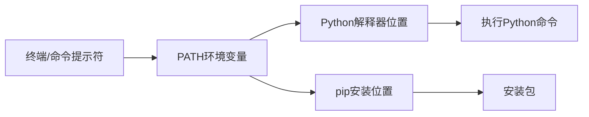

# Python 环境设置

## 什么是Python环境？

在开始编写Python代码之前，我们需要先设置一个适合开发的环境。Python环境包括Python解释器、相关工具和库，以及代码编辑器或集成开发环境(IDE)。一个良好配置的环境能够让你的编程之旅更加顺畅高效。

## 安装Python

### Windows系统安装Python

1. 访问[Python官网](https://www.python.org/downloads/)下载最新版本
2. 运行安装程序，勾选"Add Python to PATH"选项
3. 点击"Install Now"进行标准安装

安装完成后，打开命令提示符(cmd)验证安装：

```bash
python --version
```

输出应该显示类似：

```
Python 3.10.0
```

### macOS系统安装Python

macOS通常预装了Python 2.7，但我们需要Python 3：

1. 推荐使用Homebrew包管理器安装：
   ```bash
   brew install python3
   ```

2. 安装完成后验证：
   ```bash
   python3 --version
   ```

### Linux系统安装Python

大多数Linux发行版已预装Python。如果需要安装Python 3：

**Ubuntu/Debian：**
```bash
sudo apt update
sudo apt install python3 python3-pip
```

**Fedora/RHEL/CentOS：**
```bash
sudo dnf install python3 python3-pip
```

## 包管理工具pip

pip是Python的标准包管理工具，用于安装和管理Python包。

### 验证pip安装

```bash
pip --version  # Windows通常使用pip
# 或
pip3 --version  # macOS/Linux通常使用pip3
```

### 更新pip

```bash
pip install --upgrade pip
# 或
pip3 install --upgrade pip
```

## 创建虚拟环境

:::tip
虚拟环境是Python开发的最佳实践，它能够为不同项目创建隔离的Python环境，避免依赖冲突。
:::

### 使用venv创建虚拟环境（Python 3.3+内置）

**创建虚拟环境:**

```bash
# Windows
python -m venv myproject_env

# macOS/Linux
python3 -m venv myproject_env
```

**激活虚拟环境:**

Windows:
```bash
myproject_env\Scripts\activate
```

macOS/Linux:
```bash
source myproject_env/bin/activate
```

激活后，命令提示符前会显示环境名称，如`(myproject_env)`。

**退出虚拟环境:**

```bash
deactivate
```

### 使用Conda创建虚拟环境

Anaconda是一个流行的Python发行版，特别适合数据科学和科学计算。

1. 从[Anaconda官网](https://www.anaconda.com/products/distribution)下载并安装
2. 创建环境:
   ```bash
   conda create --name myproject_env python=3.10
   ```
3. 激活环境:
   ```bash
   # Windows
   conda activate myproject_env
   
   # macOS/Linux
   conda activate myproject_env
   ```

## 选择IDE或代码编辑器

一个好的IDE可以提高编程效率。以下是适合Python开发的流行选择：

### Visual Studio Code

免费、轻量级、功能丰富，支持各种扩展。

1. 从[VS Code官网](https://code.visualstudio.com/)下载并安装
2. 安装Python扩展：在扩展市场搜索"Python"并安装

### PyCharm

功能全面的Python专用IDE，有社区版(免费)和专业版。

1. 从[PyCharm官网](https://www.jetbrains.com/pycharm/)下载并安装
2. 选择安装社区版或专业版
3. 初次启动时配置Python解释器

### Jupyter Notebook

适合数据分析和交互式编程的网页应用。

```bash
# 在虚拟环境中安装
pip install notebook

# 启动
jupyter notebook
```

## 配置开发环境示例

下面是一个设置Python项目开发环境的完整示例：

```bash
# 创建项目目录
mkdir my_python_project
cd my_python_project

# 创建虚拟环境
python -m venv venv

# 激活环境
# Windows
venv\Scripts\activate
# macOS/Linux
# source venv/bin/activate

# 安装必要的包
pip install requests pandas matplotlib

# 创建项目结构
mkdir src tests docs

# 创建主文件
echo "print('Hello, Python!')" > src/main.py

# 运行测试
python src/main.py
```

输出:
```
Hello, Python!
```

## 环境变量和PATH设置

环境变量对Python开发很重要，特别是PATH变量。



### 检查Python PATH

```bash
# Windows
echo %PATH%

# macOS/Linux
echo $PATH
```

## 真实应用场景

### 场景一：数据分析项目

```bash
# 创建专门的数据分析环境
python -m venv data_analysis_env
source data_analysis_env/bin/activate  # macOS/Linux
# 或 data_analysis_env\Scripts\activate  # Windows

# 安装数据科学包
pip install numpy pandas matplotlib jupyter scikit-learn

# 启动Jupyter
jupyter notebook
```

### 场景二：Web开发项目

```bash
# 创建Web开发环境
python -m venv web_dev_env
source web_dev_env/bin/activate  # macOS/Linux
# 或 web_dev_env\Scripts\activate  # Windows

# 安装Web框架
pip install flask django requests

# 创建requirements.txt记录依赖
pip freeze > requirements.txt
```

## 常见问题及解决方案

:::warning
初学者经常遇到环境问题，这里是一些常见问题及解决方法。
:::

1. **"Python不是内部或外部命令"**
   - 解决方案：检查PATH环境变量，确保Python已添加到PATH中

2. **pip安装包失败**
   - 解决方案：尝试使用`pip install --upgrade pip`更新pip，或使用`pip install package-name -v`查看详细错误信息

3. **多个Python版本冲突**
   - 解决方案：使用虚拟环境隔离不同项目的Python版本

4. **ModuleNotFoundError**
   - 解决方案：检查是否在正确的虚拟环境中，并使用`pip install missing-module`安装缺失的模块

## 总结

正确设置Python环境是开始Python编程旅程的关键一步。本文涵盖了：

- Python解释器的安装
- 包管理工具pip的使用
- 虚拟环境的创建与管理
- IDE和代码编辑器的选择
- 实际项目环境配置案例

掌握这些基础知识后，你就可以开始专注于Python编程而不是环境问题了。

## 练习

1. 安装Python并验证版本
2. 创建一个名为"my_first_env"的虚拟环境
3. 在该环境中安装requests和beautifulsoup4包
4. 创建一个简单的Python脚本，打印"Hello World"并运行它
5. 尝试使用不同的IDE或编辑器编写Python代码，找到最适合你的工具

## 进一步学习资源

- [Python官方文档 - 安装和使用](https://docs.python.org/3/using/index.html)
- [Real Python - Python虚拟环境入门](https://realpython.com/python-virtual-environments-a-primer/)
- [VS Code Python开发官方教程](https://code.visualstudio.com/docs/python/python-tutorial)

学习愉快！随着你对Python的深入了解，你会发现良好的环境设置为你的编程之旅奠定了坚实的基础。