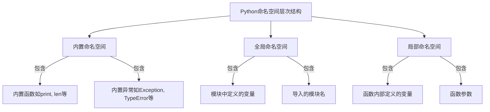

# Python 命名空间

在开始编写Python代码时，你可能会遇到一些问题，比如为什么同样名称的变量在不同地方的值会不同？为什么函数内部和外部的变量会相互影响或者互不干扰？这些问题的答案，都与Python的命名空间概念密切相关。

## 什么是命名空间？

命名空间（Namespace）是Python中用来存储变量名称与对象之间映射关系的一个容器。简单来说，命名空间就是一个**名称到对象的映射**，类似于一本字典，其中键是变量名，值是变量所指向的对象。

当我们在Python中创建一个变量、函数或类时，Python解释器会将其名称存储在相应的命名空间中。这样，当我们使用这个名称时，Python就知道该去哪里查找它所对应的对象。

:::tip
命名空间帮助我们避免命名冲突，使得同一个名称可以在不同的命名空间中表示不同的对象。
:::

## Python 中的三种命名空间

Python中主要有三种命名空间：

1. **内置命名空间**（Built-in Namespace）：包含Python内置的函数和异常名称
2. **全局命名空间**（Global Namespace）：包含模块中定义的名称
3. **局部命名空间**（Local Namespace）：包含函数或方法内定义的名称

这三种命名空间有不同的生命周期：

- 内置命名空间在Python解释器启动时创建，直到解释器退出才销毁
- 全局命名空间在导入模块时创建，直到解释器退出才销毁
- 局部命名空间在函数调用时创建，函数返回或抛出异常时销毁



## 命名空间的访问顺序

当我们在代码中引用一个变量时，Python会按照以下顺序查找它：

1. 首先在当前的局部命名空间中查找
2. 如果未找到，则在全局命名空间中查找
3. 如果仍未找到，最后在内置命名空间中查找
4. 如果所有命名空间中都没有找到，则抛出`NameError`异常

让我们通过一个例子来理解这个查找过程：

```python
def outer_function():
    a = 20
    
    def inner_function():
        a = 30
        print("内部函数中a的值:", a)
    
    inner_function()
    print("外部函数中a的值:", a)

a = 10
outer_function()
print("全局作用域中a的值:", a)
```

输出结果：

```
内部函数中a的值: 30
外部函数中a的值: 20
全局作用域中a的值: 10
```

在这个例子中，我们看到三个不同的命名空间中都定义了变量`a`，但它们之间互不干扰。

## 命名空间与作用域

命名空间与作用域（Scope）是紧密相关的概念，但有所不同：

- **命名空间**定义了在特定上下文中可用的名称及其对应的对象。
- **作用域**定义了程序中可以访问这些名称的区域。

Python中有四种作用域：

1. **局部作用域**（Local）：函数内部
2. **嵌套作用域**（Enclosing）：闭包函数或嵌套函数
3. **全局作用域**（Global）：模块级别
4. **内置作用域**（Built-in）：包含内置名称

Python的作用域遵循LEGB规则：Local → Enclosing → Global → Built-in。

## global和nonlocal关键字

当我们想在局部作用域中修改全局变量时，需要使用`global`关键字：

```python
x = 10

def modify_global():
    global x
    x = 20
    print("函数内部x的值:", x)

modify_global()
print("函数外部x的值:", x)
```

输出结果：

```
函数内部x的值: 20
函数外部x的值: 20
```

类似地，`nonlocal`关键字用于在嵌套函数中修改外层函数的变量：

```python
def outer():
    x = 10
    
    def inner():
        nonlocal x
        x = 20
        print("内层函数中x的值:", x)
    
    inner()
    print("外层函数中x的值:", x)

outer()
```

输出结果：

```
内层函数中x的值: 20
外层函数中x的值: 20
```

:::caution
过度使用`global`和`nonlocal`可能会导致代码难以理解和维护，因为它们打破了变量的局部性。应谨慎使用。
:::

## 使用dir()和locals()查看命名空间

Python提供了一些内置函数，帮助我们查看不同的命名空间：

- `dir()`：返回当前作用域中的名称列表
- `locals()`：返回当前局部命名空间的字典
- `globals()`：返回当前全局命名空间的字典

```python
# 查看全局命名空间
print("全局命名空间:", list(globals().keys())[:5])  # 只显示前5个键以简化输出

def demo_function():
    x = 10
    y = 20
    # 查看局部命名空间
    print("局部命名空间:", locals())
    # 查看当前作用域中的名称
    print("当前作用域的名称:", dir())

demo_function()
```

可能的输出（输出会根据实际环境有所不同）：

```
全局命名空间: ['__name__', '__doc__', '__package__', '__loader__', '__spec__']
局部命名空间: {'x': 10, 'y': 20}
当前作用域的名称: ['x', 'y']
```

## 命名空间的实际应用

### 1. 模块组织

Python的模块系统大量利用了命名空间的概念，使得不同模块中的同名函数或变量可以共存：

```python
# math_operations.py
def add(a, b):
    return a + b

# string_operations.py
def add(s1, s2):
    return s1 + s2

# main.py
import math_operations
import string_operations

print(math_operations.add(5, 3))       # 8
print(string_operations.add("Hello, ", "World!"))  # Hello, World!
```

### 2. 避免命名冲突

当使用第三方库时，命名空间可以防止您的代码与库代码之间的命名冲突：

```python
# 假设有一个名为'random'的自定义模块
# 可以使用import...as语法创建别名，避免与内置random模块冲突
import random as my_random
import random as py_random

# 现在可以同时使用两个模块
result1 = my_random.some_function()
result2 = py_random.randint(1, 10)
```

### 3. 类作为命名空间

Python类也可以作为命名空间使用，将相关的常量或函数组织在一起：

```python
class MathConstants:
    PI = 3.14159
    E = 2.71828
    GOLDEN_RATIO = 1.61803

class ScreenSizes:
    HD = (1280, 720)
    FULL_HD = (1920, 1080)
    UHD_4K = (3840, 2160)

# 访问类命名空间中的常量
area = MathConstants.PI * (radius ** 2)
screen_width, screen_height = ScreenSizes.FULL_HD
```

## 命名空间的最佳实践

1. **避免使用过多的全局变量**：过多的全局变量会使代码难以维护。
2. **谨慎使用`global`和`nonlocal`关键字**：这些关键字会改变变量的作用域，可能导致意外行为。
3. **使用有意义的命名约定**：比如使用下划线前缀`_`表示私有变量。
4. **利用模块组织代码**：将相关功能放在同一个模块中，可以更好地组织命名空间。
5. **使用导入别名避免命名冲突**：当导入的模块名称可能与本地名称冲突时，使用`import ... as ...`。

## 总结

Python的命名空间是管理变量、函数和类名称的重要机制，它帮助我们避免命名冲突，并使代码组织更加清晰。理解命名空间和作用域的工作原理，能够帮助我们编写更加健壮和可维护的代码，避免许多常见的编程错误。

在Python编程中，命名空间是一个基础但又深刻的概念，掌握它将使你对Python程序的执行流程有更深入的理解。

## 练习与思考

1. 尝试编写一个程序，在不同的作用域中使用相同的变量名，并观察其行为。
2. 使用`global`关键字修改全局变量，然后尝试使用`nonlocal`关键字修改闭包中的变量。
3. 创建两个模块，每个模块中定义相同名称的函数，然后在第三个模块中导入它们并调用这些函数。

:::note
要深入理解Python的命名空间，建议阅读Python官方文档中关于[作用域和命名空间](https://docs.python.org/3/tutorial/classes.html#python-scopes-and-namespaces)的部分。
:::