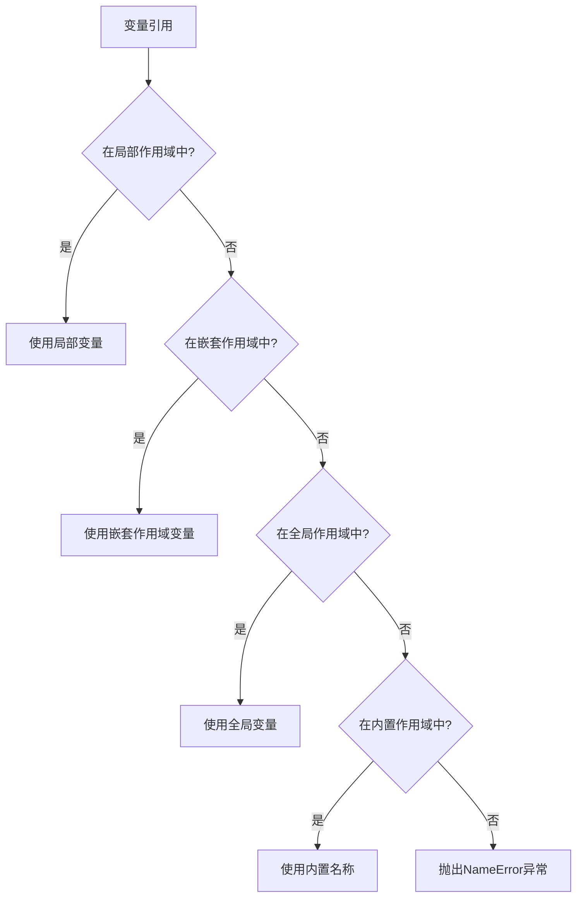

# Python 作用域规则

在编程中，"作用域"是一个非常重要的概念，它决定了变量在程序的哪些部分是可见和可访问的。理解Python的作用域规则不仅能帮助你避免变量命名冲突，还能让你更好地组织和管理代码。

## 什么是作用域？

作用域（Scope）是变量的可见范围，即在程序的哪些部分可以访问或引用该变量。简单来说，作用域决定了变量的"生命周期"和"可见性"。

Python有四种不同级别的作用域：

1. **局部作用域（Local Scope）**：在函数内定义的变量
2. **嵌套作用域（Enclosing Scope）**：在外层函数中定义的变量
3. **全局作用域（Global Scope）**：在模块层次中定义的变量
4. **内置作用域（Built-in Scope）**：Python预定义的变量名

这四种作用域构成了Python的LEGB规则：Local -> Enclosing -> Global -> Built-in。Python按照这个顺序查找变量。

## 局部作用域（Local Scope）

局部作用域是指在函数内部定义的变量，这些变量只在函数内部可见，函数执行结束后就会被销毁。

```python
def my_function():
    x = 10  # 局部变量
    print(f"函数内部x的值: {x}")

my_function()
# 下面这行会报错，因为x只在函数内部有定义
# print(f"函数外部x的值: {x}")  # NameError: name 'x' is not defined
```

输出：
```
函数内部x的值: 10
```

## 全局作用域（Global Scope）

全局作用域是在模块（即.py文件）中最外层定义的变量，它们在整个模块中都是可见的。

```python
y = 20  # 全局变量

def my_function():
    print(f"函数内部y的值: {y}")  # 可以访问全局变量

my_function()
print(f"函数外部y的值: {y}")
```

输出：
```
函数内部y的值: 20
函数外部y的值: 20
```

### global关键字

如果你想在函数内部修改全局变量，需要使用`global`关键字：

```python
z = 30  # 全局变量

def modify_global():
    global z  # 声明z是全局变量
    z = 40    # 修改全局变量的值
    print(f"函数内部z的值: {z}")

print(f"修改前z的值: {z}")
modify_global()
print(f"修改后z的值: {z}")
```

输出：
```
修改前z的值: 30
函数内部z的值: 40
修改后z的值: 40
```

:::caution 注意
如果不使用`global`关键字，函数内部的赋值会创建一个新的局部变量，而不是修改全局变量。
:::

## 嵌套作用域（Enclosing Scope）

嵌套作用域出现在函数嵌套的情况下，内层函数可以访问外层函数定义的变量。

```python
def outer_function():
    outer_var = 50  # 外层函数的局部变量
    
    def inner_function():
        print(f"内层函数访问外层变量: {outer_var}")
    
    inner_function()

outer_function()
```

输出：
```
内层函数访问外层变量: 50
```

### nonlocal关键字

如果你想在内层函数中修改外层函数的变量，需要使用`nonlocal`关键字：

```python
def outer_function():
    outer_var = 50  # 外层函数的局部变量
    
    def inner_function():
        nonlocal outer_var  # 声明outer_var是外层函数的变量
        outer_var = 60      # 修改外层函数的变量
        print(f"内层函数修改后: {outer_var}")
    
    print(f"修改前: {outer_var}")
    inner_function()
    print(f"修改后: {outer_var}")

outer_function()
```

输出：
```
修改前: 50
内层函数修改后: 60
修改后: 60
```

## 内置作用域（Built-in Scope）

内置作用域包含了Python预定义的名称，如内置函数和异常等。

```python
# print, len, str等都是内置作用域中的名称
print(len("Hello"))  # 使用内置函数len
```

输出：
```
5
```

## LEGB规则详解

当Python遇到一个变量时，它会按照LEGB的顺序查找该变量：

1. **Local**：首先在当前函数的局部作用域查找
2. **Enclosing**：然后在外层函数的作用域查找
3. **Global**：如果前两者都没找到，则在全局作用域查找
4. **Built-in**：最后在内置作用域查找

如果所有作用域中都没找到该变量，Python会抛出`NameError`异常。



## 实际案例：游戏得分系统

下面是一个简单的游戏得分系统，展示了不同作用域的使用：

```python
# 全局变量
total_score = 0
game_active = True

def add_score(points):
    """增加玩家得分"""
    global total_score
    total_score += points
    print(f"获得{points}分! 当前总分: {total_score}")
    
    # 检查得分，显示不同消息
    def check_achievement():
        # 使用外层函数的变量
        if points >= 100:
            print("太棒了! 大丰收!")
        elif points >= 50:
            print("干得好!")
    
    check_achievement()

def game_over():
    """游戏结束"""
    global game_active
    game_active = False
    print(f"游戏结束! 最终得分: {total_score}")

# 游戏主循环
while game_active:
    # 模拟玩家获得分数
    user_input = input("按回车获得分数，输入'q'退出: ")
    if user_input.lower() == 'q':
        game_over()
    else:
        import random
        score = random.randint(10, 100)
        add_score(score)
```

在这个例子中：
- `total_score`和`game_active`是全局变量
- `add_score`函数中使用`global`关键字修改全局变量
- `check_achievement`是一个嵌套函数，它可以访问外层函数的变量`points`
- `random.randint`是内置作用域中的函数

## 作用域的最佳实践

1. **尽量减少全局变量的使用**：全局变量会使代码难以理解和维护。
2. **函数参数优于全局变量**：如果函数需要外部数据，优先使用参数传递而不是全局变量。
3. **谨慎使用`global`和`nonlocal`**：过度使用这些关键字会使代码逻辑变得复杂。
4. **变量命名要有意义**：清晰的命名可以减少作用域引起的混淆。

:::tip 提示
在大型项目中，可以使用类来管理状态，这通常比使用全局变量更清晰和可维护。
:::

## 总结

Python的作用域规则遵循LEGB顺序（Local -> Enclosing -> Global -> Built-in），理解这些规则对于编写清晰、无错误的Python代码至关重要。正确使用作用域可以：
- 避免命名冲突
- 控制变量的生命周期
- 提高代码的可读性和可维护性
- 减少意外的副作用

## 练习

1. 编写一个函数，在不使用global关键字的情况下，修改一个全局列表。
2. 创建一个计数器函数，该函数每次调用时返回一个递增的数字。
3. 编写一个带有内部函数的外部函数，内部函数可以修改外部函数中定义的变量。

## 进一步学习资源

- Python官方文档中关于[作用域和命名空间](https://docs.python.org/3/tutorial/classes.html#python-scopes-and-namespaces)的章节
- PEP 227 - [嵌套作用域的静态语义](https://www.python.org/dev/peps/pep-0227/)
- 了解Python的`locals()`和`globals()`函数，它们可以返回当前的局部和全局变量

掌握Python的作用域规则将帮助你成为一名更优秀的Python程序员，让你能够编写更干净、更有组织的代码！