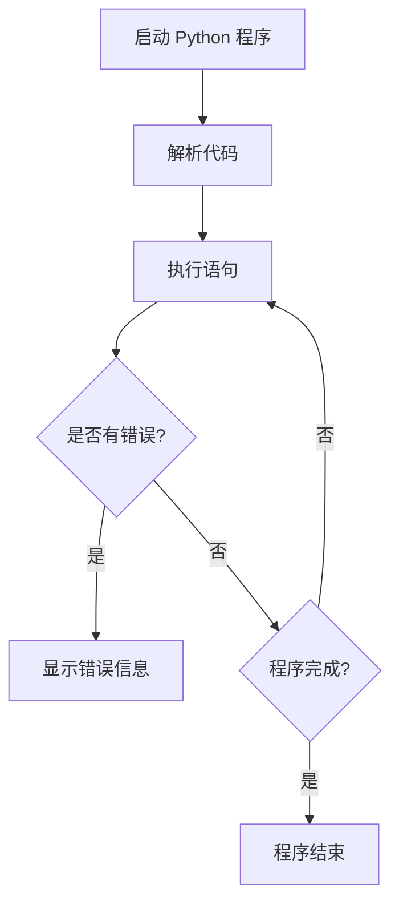

# Python 语法

## 介绍

Python 是一种高级、解释型、通用型编程语言，以其简洁明了的语法和易读性著称。Python 的设计哲学强调代码的可读性，其语法结构允许程序员用更少的代码行数完成更多的工作。本文将为您介绍 Python 的基本语法，帮助初学者迈出编程的第一步。

## Python 基本语法规则

### 缩进

Python 使用缩进来表示代码块，而不是像其他语言使用的大括号 `{}`。标准的 Python 缩进是 4 个空格。

```python
# 正确的缩进
if True:
    print("这是缩进的代码块")
    if True:
        print("更深层的缩进")

# 错误的缩进
if True:
print("这会导致语法错误")
```

:::caution
不一致的缩进会导致 Python 抛出 `IndentationError`，所以请保持一致的缩进风格！
:::

### 注释

Python 中的注释以 `#` 开始，到行尾结束。多行注释可以使用三重引号 `'''` 或 `"""` 来实现。

```python
# 这是一个单行注释

"""
这是一个多行注释
可以跨越多行
非常方便
"""

'''
这也是一个多行注释
作用相同
'''
```

### 变量与数据类型

Python 是动态类型语言，变量不需要声明类型，可以直接赋值使用。

```python
# 整数
age = 25

# 浮点数
price = 19.99

# 字符串
name = "Python编程"

# 布尔值
is_active = True

# 列表（可变序列）
fruits = ["苹果", "香蕉", "橙子"]

# 元组（不可变序列）
coordinates = (10, 20)

# 字典（键值对）
person = {"name": "小明", "age": 18}

# 集合（无序不重复集合）
unique_numbers = {1, 2, 3, 4, 5}
```

### 输出与输入

使用 `print()` 函数输出内容，使用 `input()` 函数获取用户输入。

```python
# 输出
print("Hello, World!")

# 格式化输出
name = "Python"
age = 30
print(f"{name} 已经 {age} 岁了")

# 获取用户输入
user_input = input("请输入您的名字：")
print(f"您好，{user_input}!")
```

输出结果：
```
Hello, World!
Python 已经 30 岁了
请输入您的名字：小明
您好，小明!
```

### 运算符

Python 支持多种运算符，包括算术运算符、比较运算符、逻辑运算符等。

```python
# 算术运算符
a = 10
b = 3
print(a + b)  # 13（加法）
print(a - b)  # 7（减法）
print(a * b)  # 30（乘法）
print(a / b)  # 3.3333333333333335（除法，返回浮点数）
print(a // b) # 3（整除，返回整数）
print(a % b)  # 1（取余）
print(a ** b) # 1000（幂运算）

# 比较运算符
print(a == b)  # False（等于）
print(a != b)  # True（不等于）
print(a > b)   # True（大于）
print(a < b)   # False（小于）
print(a >= b)  # True（大于等于）
print(a <= b)  # False（小于等于）

# 逻辑运算符
x = True
y = False
print(x and y)  # False（逻辑与）
print(x or y)   # True（逻辑或）
print(not x)    # False（逻辑非）
```

## 控制流结构

### 条件语句

Python 使用 `if`、`elif` 和 `else` 关键字来实现条件判断。

```python
score = 85

if score >= 90:
    print("优秀")
elif score >= 80:
    print("良好")
elif score >= 60:
    print("及格")
else:
    print("不及格")
```

输出结果：
```
良好
```

### 循环语句

Python 提供 `for` 和 `while` 两种循环结构。

**for循环**

```python
# 遍历列表
fruits = ["苹果", "香蕉", "橙子"]
for fruit in fruits:
    print(f"我喜欢吃{fruit}")

# 使用range()函数
for i in range(5):  # 生成 0, 1, 2, 3, 4
    print(i)
```

输出结果：
```
我喜欢吃苹果
我喜欢吃香蕉
我喜欢吃橙子
0
1
2
3
4
```

**while循环**

```python
count = 0
while count < 5:
    print(f"当前计数: {count}")
    count += 1
```

输出结果：
```
当前计数: 0
当前计数: 1
当前计数: 2
当前计数: 3
当前计数: 4
```

### break 和 continue

`break` 用于提前退出循环，`continue` 用于跳过当前循环的剩余部分，进入下一次循环。

```python
# break 示例
for i in range(10):
    if i == 5:
        break
    print(i)

print("---")

# continue 示例
for i in range(10):
    if i % 2 == 0:
        continue
    print(i)
```

输出结果：
```
0
1
2
3
4
---
1
3
5
7
9
```

## 函数定义与调用

函数是组织好的，可重复使用的，用来实现特定功能的代码块。

```python
# 定义一个简单的函数
def greet(name):
    """这是函数的文档字符串，用于解释函数的功能"""
    return f"你好，{name}！"

# 调用函数
message = greet("小明")
print(message)

# 带有默认参数的函数
def power(x, n=2):
    return x ** n

print(power(2))     # 默认计算平方：4
print(power(2, 3))  # 计算立方：8
```

输出结果：
```
你好，小明！
4
8
```

## 数据结构

### 列表（List）

列表是Python中最常用的数据结构之一，用于存储有序的项集合。

```python
# 创建列表
fruits = ["苹果", "香蕉", "橙子"]

# 访问列表元素
print(fruits[0])  # 苹果（第一个元素）
print(fruits[-1])  # 橙子（最后一个元素）

# 修改列表元素
fruits[1] = "葡萄"
print(fruits)  # ['苹果', '葡萄', '橙子']

# 添加元素
fruits.append("草莓")
print(fruits)  # ['苹果', '葡萄', '橙子', '草莓']

# 插入元素
fruits.insert(1, "梨子")
print(fruits)  # ['苹果', '梨子', '葡萄', '橙子', '草莓']

# 删除元素
fruits.remove("葡萄")
print(fruits)  # ['苹果', '梨子', '橙子', '草莓']

# 获取列表长度
print(len(fruits))  # 4

# 列表切片
print(fruits[1:3])  # ['梨子', '橙子']
```

### 字典（Dictionary）

字典是一种映射类型，它存储键值对。

```python
# 创建字典
student = {
    "name": "小明",
    "age": 18,
    "grade": "高三",
    "subjects": ["数学", "物理", "化学"]
}

# 访问字典元素
print(student["name"])  # 小明

# 修改字典元素
student["age"] = 19
print(student["age"])  # 19

# 添加新键值对
student["school"] = "第一中学"
print(student)

# 删除键值对
del student["subjects"]
print(student)

# 检查键是否存在
print("grade" in student)  # True
print("subjects" in student)  # False

# 获取所有键和值
print(student.keys())
print(student.values())
print(student.items())
```

### 元组（Tuple）

元组是不可变的有序集合。

```python
# 创建元组
coordinates = (10, 20, 30)

# 访问元组元素
print(coordinates[0])  # 10

# 尝试修改元组会引发错误
# coordinates[0] = 15  # TypeError

# 元组解包
x, y, z = coordinates
print(x, y, z)  # 10 20 30

# 单元素元组需要逗号
single_item = (42,)
print(type(single_item))  # <class 'tuple'>
```

### 集合（Set）

集合是无序的不重复元素集合。

```python
# 创建集合
unique_numbers = {1, 2, 3, 4, 5}
print(unique_numbers)

# 添加元素
unique_numbers.add(6)
print(unique_numbers)

# 删除元素
unique_numbers.remove(3)
print(unique_numbers)

# 集合操作
set1 = {1, 2, 3, 4, 5}
set2 = {4, 5, 6, 7, 8}

# 并集
print(set1 | set2)  # {1, 2, 3, 4, 5, 6, 7, 8}

# 交集
print(set1 & set2)  # {4, 5}

# 差集
print(set1 - set2)  # {1, 2, 3}
```

## Python 编程流程可视化

以下是一个简单的 Python 程序执行流程图：



## 实际案例：学生成绩管理系统

以下是一个简单的学生成绩管理系统，综合运用了前面介绍的各种语法元素：

```python
# 定义学生成绩管理系统函数
def student_management_system():
    # 初始化学生数据字典
    students = {}

    while True:
        print("\n=== 学生成绩管理系统 ===")
        print("1. 添加学生")
        print("2. 查询学生成绩")
        print("3. 修改学生成绩")
        print("4. 删除学生")
        print("5. 显示所有学生")
        print("6. 退出系统")

        choice = input("请选择操作 (1-6): ")

        if choice == '1':
            name = input("请输入学生姓名: ")
            if name in students:
                print(f"学生 {name} 已存在!")
                continue

            try:
                chinese = float(input("请输入语文成绩: "))
                math = float(input("请输入数学成绩: "))
                english = float(input("请输入英语成绩: "))
                
                students[name] = {
                    "语文": chinese,
                    "数学": math,
                    "英语": english,
                    "总分": chinese + math + english,
                    "平均分": (chinese + math + english) / 3
                }
                print(f"学生 {name} 添加成功!")
            except ValueError:
                print("成绩必须是数字，请重新尝试!")

        elif choice == '2':
            name = input("请输入要查询的学生姓名: ")
            if name in students:
                print(f"\n--- {name} 的成绩信息 ---")
                for subject, score in students[name].items():
                    print(f"{subject}: {score:.2f}")
            else:
                print(f"学生 {name} 不存在!")

        elif choice == '3':
            name = input("请输入要修改成绩的学生姓名: ")
            if name in students:
                try:
                    chinese = float(input("请输入新的语文成绩: "))
                    math = float(input("请输入新的数学成绩: "))
                    english = float(input("请输入新的英语成绩: "))
                    
                    students[name] = {
                        "语文": chinese,
                        "数学": math,
                        "英语": english,
                        "总分": chinese + math + english,
                        "平均分": (chinese + math + english) / 3
                    }
                    print(f"学生 {name} 的成绩修改成功!")
                except ValueError:
                    print("成绩必须是数字，请重新尝试!")
            else:
                print(f"学生 {name} 不存在!")

        elif choice == '4':
            name = input("请输入要删除的学生姓名: ")
            if name in students:
                del students[name]
                print(f"学生 {name} 已删除!")
            else:
                print(f"学生 {name} 不存在!")

        elif choice == '5':
            if not students:
                print("当前没有学生信息!")
            else:
                print("\n=== 所有学生信息 ===")
                for name, info in students.items():
                    print(f"\n--- {name} ---")
                    for subject, score in info.items():
                        print(f"{subject}: {score:.2f}")

        elif choice == '6':
            print("感谢使用学生成绩管理系统，再见!")
            break
        else:
            print("无效的选择，请重新输入!")

# 运行系统
if __name__ == "__main__":
    student_management_system()
```

:::tip
这个案例展示了如何综合运用 Python 的语法知识创建一个简单但功能完整的应用程序。它包含了各种控制结构、数据类型和异常处理等内容。
:::

## 总结

在本文中，我们学习了 Python 的基本语法规则，包括：

1. **缩进**：使用缩进来定义代码块
2. **注释**：单行注释和多行注释的使用
3. **变量与数据类型**：动态类型系统，常见数据类型的使用
4. **输入与输出**：使用 `print()` 和 `input()` 函数
5. **运算符**：算术运算符、比较运算符和逻辑运算符
6. **控制流结构**：条件语句和循环语句
7. **函数定义与调用**：如何创建和使用函数
8. **数据结构**：列表、字典、元组和集合的基本操作

Python 的语法简洁明了，对初学者非常友好。掌握这些基础语法，将为您学习更高级的 Python 编程打下坚实的基础。

## 练习与资源

### 练习题

1. 编写一个程序，接受用户输入的温度（摄氏度），并转换为华氏度。
   
2. 创建一个函数，接受一个列表作为参数，返回列表中的最大值和最小值。

3. 编写一个程序，生成一个包含 1 到 100 之间所有质数的列表。

4. 实现一个简单的计算器程序，支持加减乘除四则运算。

### 推荐资源

- [Python 官方文档](https://docs.python.org/)
- [Python 教程 - 菜鸟教程](https://www.runoob.com/python3/python3-tutorial.html)
- 《Python编程：从入门到实践》- Eric Matthes (著)
- 《流畅的Python》- Luciano Ramalho (著)