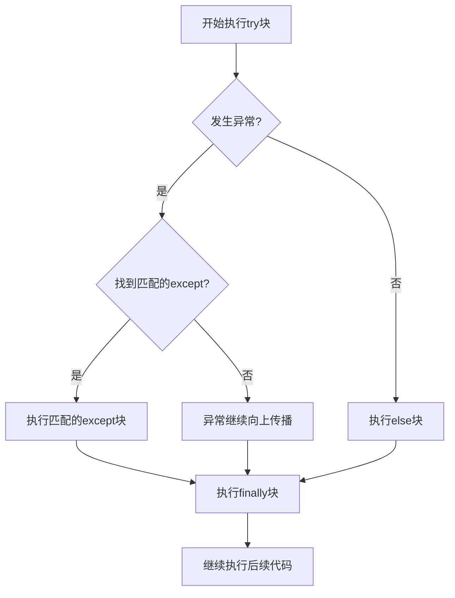

# Python 异常处理

## 什么是异常处理？

在编程中，错误是难以避免的。无论你的代码看起来多么完美，总会有一些意外情况出现：文件可能不存在、网络连接可能中断、用户可能输入了错误的数据类型等等。这些错误如果不妥善处理，会导致程序崩溃。

Python的异常处理机制提供了一种方式，让我们能够：
1. 识别程序运行过程中的错误
2. 优雅地处理这些错误
3. 执行必要的清理操作
4. 让程序继续运行，而不是直接崩溃

## 常见的Python异常类型

在深入学习异常处理之前，让我们先了解一些Python中最常见的异常类型：

| 异常类型 | 描述 |
|---------|------|
| `TypeError` | 当操作或函数应用于不适当类型的对象时 |
| `ValueError` | 当操作或函数接收到类型正确但值不合适的参数时 |
| `NameError` | 找不到局部或全局名称时 |
| `IndexError` | 序列索引超出范围时 |
| `KeyError` | 字典中找不到键时 |
| `FileNotFoundError` | 尝试打开不存在的文件时 |
| `ZeroDivisionError` | 除数为0时 |
| `ImportError` | 导入模块失败时 |
| `IOError` | 输入/输出操作失败时 |
| `SyntaxError` | 解析代码时的语法错误 |

## 基本的异常处理：try-except语句

Python使用`try`和`except`关键字来处理异常。基本结构是：

```python
try:
    # 可能产生异常的代码
    ...
except:
    # 异常发生时执行的代码
    ...
```

让我们看一个简单的例子：

```python
try:
    number = int(input("请输入一个整数: "))
    result = 10 / number
    print(f"10 除以 {number} 等于 {result}")
except:
    print("发生了错误！")
```

如果用户输入0或非数字字符串，程序不会崩溃，而是会打印"发生了错误！"

:::caution
使用裸露的`except:`语句（不指定具体的异常类型）通常不是好习惯，因为它会捕获所有异常，包括键盘中断（Ctrl+C）。最好指定要捕获的具体异常类型。
:::

## 捕获特定类型的异常

更好的做法是指定你想要捕获的异常类型：

```python
try:
    number = int(input("请输入一个整数: "))
    result = 10 / number
    print(f"10 除以 {number} 等于 {result}")
except ValueError:
    print("输入无效！请输入一个整数。")
except ZeroDivisionError:
    print("除数不能为零！")
```

现在程序能够提供更具体的错误信息：
- 如果用户输入"abc"，会触发`ValueError`并显示相应信息
- 如果用户输入"0"，会触发`ZeroDivisionError`并显示相应信息

## 多个异常的处理

你可以在一个`except`子句中处理多个异常：

```python
try:
    # 一些可能产生异常的代码
    ...
except (ValueError, ZeroDivisionError, TypeError):
    # 处理这三种异常
    ...
```

## 获取异常信息

使用`as`关键字可以将异常对象赋值给变量，以便访问其详细信息：

```python
try:
    number = int(input("请输入一个整数: "))
    result = 10 / number
    print(f"10 除以 {number} 等于 {result}")
except Exception as e:
    print(f"发生了错误: {e}")
    print(f"错误类型: {type(e)}")
```

这样，当错误发生时，你可以看到详细的错误信息和错误类型。

## else子句：无异常时执行的代码

`try-except`语句还可以包含`else`子句，当`try`块中的代码成功执行没有异常时，会执行`else`块：

```python
try:
    number = int(input("请输入一个整数: "))
    result = 10 / number
except ValueError:
    print("输入无效！请输入一个整数。")
except ZeroDivisionError:
    print("除数不能为零！")
else:
    print(f"计算成功！10 除以 {number} 等于 {result}")
    # 在这里可以执行依赖于try块成功的其他操作
```

## finally子句：无论是否有异常都执行的代码

`finally`子句定义了无论是否发生异常都必须执行的代码块，通常用于释放资源或执行清理操作：

```python
try:
    f = open("example.txt", "r")
    content = f.read()
    print(content)
except FileNotFoundError:
    print("文件不存在！")
finally:
    print("清理操作...")
    try:
        f.close()  # 如果文件成功打开，关闭它
    except:
        pass  # 文件没有打开，不需要关闭
```

:::tip
在处理文件、网络连接或数据库连接等资源时，`finally`子句特别有用，因为不管操作是否成功，都需要确保释放这些资源。
:::

## with语句：上下文管理器

对于需要清理的资源（如文件），Python提供了`with`语句作为一种更优雅的方式：

```python
try:
    with open("example.txt", "r") as f:
        content = f.read()
        print(content)
except FileNotFoundError:
    print("文件不存在！")
```

使用`with`语句，无论是否发生异常，文件都会被自动关闭。这种方式比使用`try-finally`更加简洁和安全。

## 主动抛出异常：raise语句

有时你需要在代码中主动抛出异常，这可以使用`raise`语句：

```python
def validate_age(age):
    if age < 0:
        raise ValueError("年龄不能为负数")
    if age > 120:
        raise ValueError("年龄不太可能超过120岁")
    return True

try:
    user_age = int(input("请输入您的年龄: "))
    validate_age(user_age)
    print(f"你的年龄是: {user_age}岁")
except ValueError as e:
    print(f"错误: {e}")
```

## 创建自定义异常

Python允许你创建自己的异常类型，从而使你的代码更加清晰和有组织：

```python
class AgeError(Exception):
    """当年龄值出现问题时抛出的异常"""
    pass

class NegativeAgeError(AgeError):
    """当年龄为负数时抛出的异常"""
    pass

class ExtremeAgeError(AgeError):
    """当年龄不太可能时抛出的异常"""
    pass

def validate_age(age):
    if age < 0:
        raise NegativeAgeError("年龄不能为负数")
    if age > 120:
        raise ExtremeAgeError("年龄不太可能超过120岁")
    return True

try:
    user_age = int(input("请输入您的年龄: "))
    validate_age(user_age)
    print(f"你的年龄是: {user_age}岁")
except NegativeAgeError as e:
    print(f"输入错误: {e}")
except ExtremeAgeError as e:
    print(f"可能的输入错误: {e}")
except ValueError:
    print("请输入有效的数字")
```

自定义异常使得代码更可读，并允许更精细的异常处理。

## 实际应用案例

### 案例1：处理用户输入

一个简单的计算器程序，能够处理各种可能的错误输入：

```python
def calculator():
    try:
        num1 = float(input("请输入第一个数字: "))
        operator = input("请输入运算符 (+, -, *, /): ")
        num2 = float(input("请输入第二个数字: "))
        
        if operator == '+':
            result = num1 + num2
        elif operator == '-':
            result = num1 - num2
        elif operator == '*':
            result = num1 * num2
        elif operator == '/':
            if num2 == 0:
                raise ZeroDivisionError("除数不能为零")
            result = num1 / num2
        else:
            raise ValueError(f"不支持的运算符: {operator}")
            
        print(f"结果: {num1} {operator} {num2} = {result}")
        
    except ValueError as e:
        if "could not convert string to float" in str(e):
            print("错误: 请输入有效的数字")
        else:
            print(f"错误: {e}")
    except ZeroDivisionError as e:
        print(f"错误: {e}")
    except Exception as e:
        print(f"发生意外错误: {e}")
    else:
        print("计算成功完成!")
    finally:
        print("感谢使用计算器")

calculator()
```

### 案例2：文件处理

一个读取CSV文件并处理数据的程序，包含完善的异常处理：

```python
import csv

def process_csv_file(filename):
    try:
        with open(filename, 'r', newline='', encoding='utf-8') as file:
            reader = csv.reader(file)
            header = next(reader)  # 读取表头
            print(f"文件表头: {header}")
            
            row_count = 0
            total_age = 0
            
            for row in reader:
                try:
                    row_count += 1
                    name = row[0]
                    age = int(row[1])
                    total_age += age
                    print(f"处理行 {row_count}: 姓名={name}, 年龄={age}")
                except IndexError:
                    print(f"警告: 行 {row_count} 数据不完整: {row}")
                except ValueError:
                    print(f"警告: 行 {row_count} 年龄值无效: {row}")
            
            if row_count > 0:
                avg_age = total_age / row_count
                print(f"处理完成: {row_count}行数据, 平均年龄: {avg_age:.2f}")
            else:
                print("文件中没有数据行")
                
    except FileNotFoundError:
        print(f"错误: 找不到文件 '{filename}'")
    except PermissionError:
        print(f"错误: 没有权限读取文件 '{filename}'")
    except UnicodeDecodeError:
        print(f"错误: 文件编码有问题, 请尝试其他编码格式")
    except Exception as e:
        print(f"发生意外错误: {e}")

# 调用函数
process_csv_file("people.csv")
```

## 异常处理的最佳实践

1. **只捕获具体的异常** - 避免使用裸露的`except:`语句
2. **保持`try`块尽量小巧** - 只包含可能会引发异常的代码
3. **不要忽略异常** - 至少记录或打印异常信息
4. **合理使用`finally`和`with`语句** - 确保资源正确释放
5. **避免在异常处理中使用复杂的控制流** - 保持代码可读性
6. **异常处理不是控制流工具** - 不要用异常来替代基本的if-else逻辑

## 异常处理流程图



## 总结

异常处理是Python编程中的一个基础但非常重要的概念：
- 它允许你优雅地处理程序运行时可能出现的错误情况
- 通过`try-except-else-finally`结构，你可以全面控制异常处理流程
- 使用具体的异常类型而不是笼统的捕获可以使代码更健壮
- `with`语句简化了资源管理
- 自定义异常可以提高代码的可读性和组织性

掌握异常处理能力对开发可靠的Python应用程序至关重要，无论是命令行工具、Web应用还是数据分析脚本。

## 练习题

1. 编写一个函数，从用户那里获取一个列表索引和一个列表，正确处理可能的`IndexError`。
2. 创建一个简单的文件读写程序，处理所有可能的文件操作异常。
3. 设计一个自定义的`InvalidEmailError`异常类，并在一个验证电子邮件地址的函数中使用它。
4. 编写一个程序，处理字典查找时可能出现的`KeyError`。
5. 创建一个函数，将字符串转换为整数，并处理所有可能的异常。

:::note
记住：处理异常是一门艺术，需要平衡代码的健壮性和简洁性。通过实践和经验，你会逐渐掌握在什么情况下使用什么样的异常处理技术。
:::