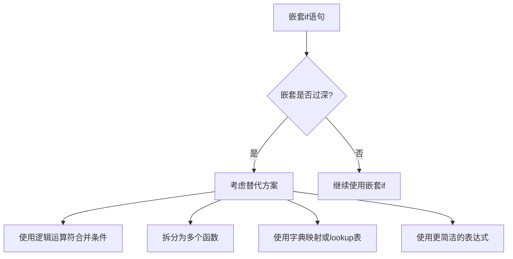

# Python 嵌套If

## 什么是嵌套if语句？

在Python编程中，嵌套if语句是指在一个if语句的代码块内部再放置另一个if语句。这种结构允许我们创建更复杂的条件逻辑，可以基于多个条件做出更精细的决策。

嵌套if语句的基本结构如下：

```python
if 外部条件:
    # 外部条件为True时执行的代码
    if 内部条件:
        # 内部条件也为True时执行的代码
    else:
        # 内部条件为False时执行的代码
else:
    # 外部条件为False时执行的代码
```

## 嵌套if的工作原理

当Python解释器执行嵌套的if语句时，它首先评估外部if语句的条件。如果该条件为True，解释器会进入外部if的代码块，然后再评估内部if语句的条件。只有当外部和内部条件都为True时，内部if的代码块才会被执行。

:::tip
Python使用缩进来定义代码块，所以在编写嵌套if语句时，正确的缩进非常重要，以确保代码的逻辑结构清晰。
:::

## 简单示例

让我们来看一个简单的嵌套if语句示例：

```python
age = 25
has_license = True

if age >= 18:
    print("年龄检查通过")
    if has_license:
        print("您可以开车")
    else:
        print("您需要先获取驾照")
else:
    print("您年龄不足，不能开车")
```

输出：
```
年龄检查通过
您可以开车
```

在这个例子中：
1. 首先检查年龄是否大于或等于18
2. 如果年龄条件满足，再检查是否有驾照
3. 根据这两个条件的组合，输出不同的消息

## 多层嵌套if

我们可以创建多层的嵌套if语句，但随着嵌套层次的增加，代码会变得更加复杂，可读性可能会下降。

```python
score = 85
attendance = 90
extra_credit = True

if score >= 60:
    print("考试通过")
    if attendance >= 80:
        print("出勤率良好")
        if extra_credit:
            print("最终成绩：A")
        else:
            print("最终成绩：B")
    else:
        print("出勤率不足")
        print("最终成绩：C")
else:
    print("考试不通过")
    print("最终成绩：F")
```

输出：
```
考试通过
出勤率良好
最终成绩：A
```

## 嵌套if-elif-else语句

我们也可以在嵌套结构中使用if-elif-else组合，使得条件逻辑更加灵活：

```python
temperature = 25
humidity = 60

if temperature > 30:
    if humidity > 70:
        print("又热又潮湿，不太舒适")
    elif humidity > 50:
        print("热且湿度适中")
    else:
        print("热但干燥")
elif temperature > 20:
    if humidity > 70:
        print("温暖但潮湿")
    elif humidity > 50:
        print("天气宜人")
    else:
        print("温暖且干燥")
else:
    if humidity > 70:
        print("凉爽且潮湿")
    else:
        print("凉爽且干燥")
```

输出：
```
温暖但潮湿
```

## 实际应用案例

### 案例1：电子商务优惠券系统

```python
user_type = "会员"
purchase_amount = 1200
is_holiday = False

if user_type == "会员":
    if purchase_amount > 1000:
        if is_holiday:
            discount = 0.15  # 假期会员高额消费折扣
        else:
            discount = 0.20  # 非假期会员高额消费折扣
    else:
        discount = 0.10  # 会员普通折扣
else:
    if purchase_amount > 1000:
        discount = 0.05  # 非会员高额消费折扣
    else:
        discount = 0.00  # 无折扣

final_amount = purchase_amount * (1 - discount)
print(f"初始金额: ¥{purchase_amount}")
print(f"折扣: {discount*100}%")
print(f"最终付款金额: ¥{final_amount}")
```

输出：
```
初始金额: ¥1200
折扣: 20.0%
最终付款金额: ¥960.0
```

### 案例2：学生成绩评估系统

```python
def evaluate_grade(score, attendance, submitted_all_assignments):
    if score >= 90:
        if attendance >= 90:
            if submitted_all_assignments:
                return "A+"
            else:
                return "A"
        else:
            return "B+"
    elif score >= 80:
        if attendance >= 80:
            if submitted_all_assignments:
                return "B+"
            else:
                return "B"
        else:
            return "C+"
    elif score >= 70:
        if attendance >= 70:
            return "C"
        else:
            return "D+"
    else:
        return "F"

# 测试函数
student1 = evaluate_grade(95, 98, True)
student2 = evaluate_grade(88, 75, True)
student3 = evaluate_grade(72, 65, False)

print(f"学生1的成绩: {student1}")
print(f"学生2的成绩: {student2}")
print(f"学生3的成绩: {student3}")
```

输出：
```
学生1的成绩: A+
学生2的成绩: C+
学生3的成绩: D+
```

## 嵌套if的最佳实践

使用嵌套if语句时，请遵循以下最佳实践：

1. **控制嵌套深度**：通常建议将嵌套深度限制在2-3层内，过深的嵌套会使代码难以理解和维护。

2. **使用适当的缩进**：确保每一级嵌套使用一致的缩进（Python标准是4个空格）。

3. **考虑替代方案**：当嵌套过深时，考虑使用逻辑运算符（`and`、`or`）合并条件，或将复杂逻辑拆分为函数。

4. **添加注释**：对于复杂的嵌套条件，添加注释说明每个分支的意图。

## 何时避免使用嵌套if

虽然嵌套if语句很有用，但在以下情况下可能需要考虑其他替代方案：



当嵌套if的层次过多时，代码可能会变成所谓的"箭头代码"或"圣诞树代码"，阅读和维护都会变得困难。

### 使用逻辑运算符简化代码

```python
# 嵌套if版本
if age >= 18:
    if has_license:
        print("您可以开车")

# 使用逻辑运算符简化
if age >= 18 and has_license:
    print("您可以开车")
```

## 练习题

:::info 练习1
编写一个嵌套if语句，根据温度（temperature）和天气状况（weather_condition，可能是"sunny"、"rainy"或"snowy"）来决定推荐的活动。
:::

:::info 练习2
创建一个函数，使用嵌套if语句来评估一个密码的强度。考虑密码长度、是否包含大小写字母、数字和特殊字符等条件。
:::

:::info 练习3
编写一个程序，根据用户的年龄、会员状态和购买金额，计算电影票的最终价格。使用嵌套if结构实现不同的折扣逻辑。
:::

## 总结

嵌套if语句是Python中一种强大的控制流工具，允许我们基于多个条件创建复杂的决策逻辑。通过将一个if语句嵌套在另一个if语句中，我们可以构建更精细和多层次的条件检查。

关键要点：

- 嵌套if允许基于多个条件做出决策
- 正确的缩进对于嵌套结构至关重要
- 可以结合if-elif-else创建更复杂的逻辑
- 过深的嵌套会降低代码可读性，应当适度使用
- 在适当的情况下，考虑使用逻辑运算符或其他技术来简化嵌套结构

掌握嵌套if语句将帮助你编写更灵活、功能更强大的Python程序，能够处理真实世界中的复杂决策场景。

## 延伸阅读

- Python官方文档中的条件语句部分
- 《Python编程：从入门到实践》中的控制流章节
- 《Clean Code》中关于代码结构和复杂条件处理的章节