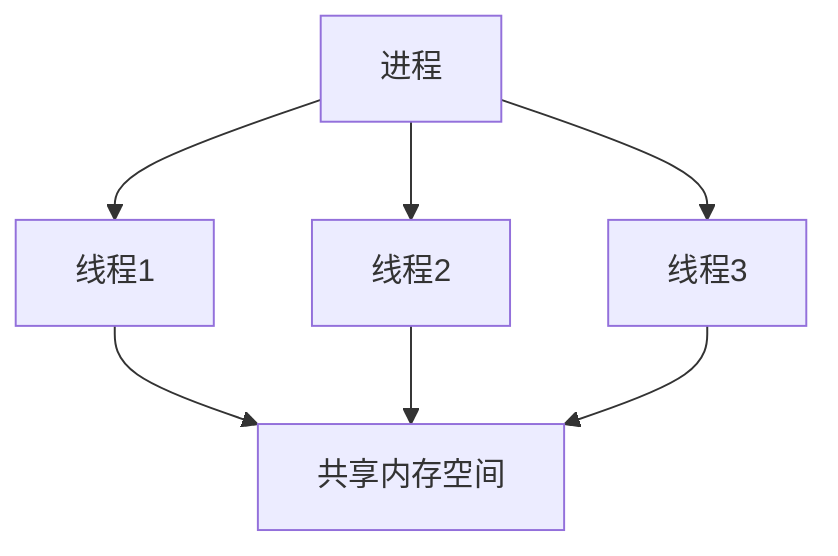
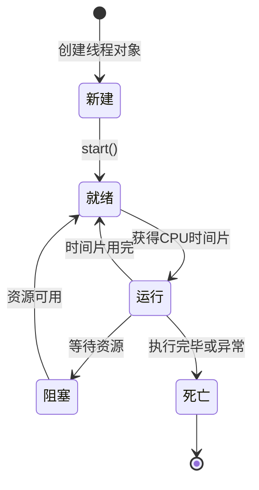
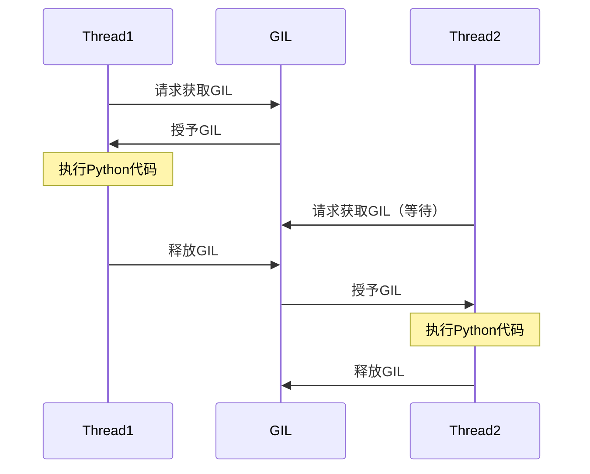

# Python 线程基础

## 什么是线程？

线程是程序执行的最小单位，它是进程内的一个实体，是被系统独立调度和分派的基本单位。一个进程可以包含多个线程，这些线程共享进程的资源，例如内存空间和文件句柄。

在Python中，线程可以帮助我们执行并发任务，提高程序的效率，尤其是在I/O密集型任务中。

:::note
虽然Python支持多线程编程，但由于全局解释器锁(GIL)的存在，Python中的多线程在CPU密集型任务中并不能真正实现并行计算。
:::



## Python 中的线程模块

Python提供了两个模块来处理线程：

1. `_thread` - 低级模块，提供基本的线程和锁定支持
2. `threading` - 高级模块，在`_thread`的基础上构建，提供完整的线程支持

我们主要使用`threading`模块，因为它提供了更高级的功能和更简单的API。

## 创建线程

在Python中，创建线程主要有两种方式：

### 1. 通过threading.Thread类直接创建

```python
import threading
import time

def print_numbers():
    for i in range(5):
        time.sleep(1)
        print(f"Number {i}")

# 创建线程
t = threading.Thread(target=print_numbers)

# 启动线程
t.start()

print("主线程继续执行")

# 等待线程结束
t.join()

print("所有线程执行完毕")
```

输出：
```
主线程继续执行
Number 0
Number 1
Number 2
Number 3
Number 4
所有线程执行完毕
```

### 2. 继承threading.Thread类

```python
import threading
import time

class MyThread(threading.Thread):
    def __init__(self, name):
        super().__init__()
        self.name = name
    
    def run(self):
        # 重写run方法，定义线程要执行的代码
        for i in range(3):
            time.sleep(1)
            print(f"线程 {self.name}: {i}")

# 创建线程实例
thread1 = MyThread("A")
thread2 = MyThread("B")

# 启动线程
thread1.start()
thread2.start()

# 等待所有线程完成
thread1.join()
thread2.join()

print("所有线程执行完毕")
```

输出：
```
线程 A: 0
线程 B: 0
线程 A: 1
线程 B: 1
线程 A: 2
线程 B: 2
所有线程执行完毕
```

## 线程的生命周期

线程的生命周期包含以下状态：

1. **新建（New）**：创建线程对象
2. **就绪（Runnable）**：调用`start()`方法后，线程进入就绪状态，等待CPU调度
3. **运行（Running）**：线程被CPU调度执行
4. **阻塞（Blocked）**：线程暂时停止执行，如等待I/O操作完成
5. **死亡（Dead）**：线程执行完毕或被终止



## 线程同步

当多个线程同时访问共享资源时，可能会导致数据不一致的问题，这就需要线程同步机制来确保数据的正确性。

### 1. 使用Lock（锁）

```python
import threading
import time

# 共享资源
counter = 0
# 创建锁对象
lock = threading.Lock()

def increment():
    global counter
    for _ in range(100000):
        # 获取锁
        lock.acquire()
        try:
            counter += 1
        finally:
            # 释放锁
            lock.release()

# 创建两个线程
t1 = threading.Thread(target=increment)
t2 = threading.Thread(target=increment)

# 启动线程
t1.start()
t2.start()

# 等待线程结束
t1.join()
t2.join()

print(f"最终计数: {counter}")
```

输出：
```
最终计数: 200000
```

:::tip
也可以使用`with`语句来自动管理锁的获取和释放：

```python
def increment():
    global counter
    for _ in range(100000):
        with lock:
            counter += 1
```
:::

### 2. 使用RLock（可重入锁）

```python
import threading

# 创建可重入锁
rlock = threading.RLock()

def outer_function():
    with rlock:
        print("获取外部锁")
        inner_function()
        
def inner_function():
    with rlock:
        print("获取内部锁")
        
t = threading.Thread(target=outer_function)
t.start()
t.join()
```

输出：
```
获取外部锁
获取内部锁
```

### 3. 使用Condition（条件变量）

```python
import threading
import time

# 创建条件变量
condition = threading.Condition()
# 共享资源
items = []
produced_count = 0

def producer():
    global produced_count
    for i in range(5):
        with condition:
            items.append(f"Item-{i}")
            produced_count += 1
            print(f"生产者添加了Item-{i}, 当前项目数: {len(items)}")
            # 通知消费者有新项目可用
            condition.notify()
        time.sleep(1)  # 模拟生产时间

def consumer():
    global produced_count
    consumed_count = 0
    while consumed_count < 5:  # 消费5个项目后停止
        with condition:
            while not items and consumed_count < produced_count:
                # 等待生产者通知
                condition.wait()
            if items:
                item = items.pop(0)
                consumed_count += 1
                print(f"消费者消费了{item}, 剩余项目数: {len(items)}")
        time.sleep(1.5)  # 模拟消费时间

# 创建生产者和消费者线程
producer_thread = threading.Thread(target=producer)
consumer_thread = threading.Thread(target=consumer)

# 启动线程
producer_thread.start()
consumer_thread.start()

# 等待线程结束
producer_thread.join()
consumer_thread.join()
```

输出可能如下：
```
生产者添加了Item-0, 当前项目数: 1
消费者消费了Item-0, 剩余项目数: 0
生产者添加了Item-1, 当前项目数: 1
消费者消费了Item-1, 剩余项目数: 0
生产者添加了Item-2, 当前项目数: 1
生产者添加了Item-3, 当前项目数: 2
消费者消费了Item-2, 剩余项目数: 1
生产者添加了Item-4, 当前项目数: 2
消费者消费了Item-3, 剩余项目数: 1
消费者消费了Item-4, 剩余项目数: 0
```

## 线程安全的数据结构

Python的标准库提供了几个线程安全的数据结构：

### 1. Queue（队列）

```python
import threading
import queue
import time
import random

# 创建队列
q = queue.Queue()

def producer():
    for i in range(5):
        item = f"Task-{i}"
        q.put(item)  # 将项目放入队列
        print(f"生产: {item}")
        time.sleep(random.random())

def consumer():
    while True:
        try:
            # 以非阻塞方式获取项目，超时时间3秒
            item = q.get(block=True, timeout=3)
            print(f"消费: {item}")
            # 标记任务完成
            q.task_done()
            time.sleep(random.random() * 2)
        except queue.Empty:
            print("队列为空，消费者退出")
            break

# 创建生产者和消费者线程
producer_thread = threading.Thread(target=producer)
consumer_thread = threading.Thread(target=consumer)

# 启动线程
producer_thread.start()
consumer_thread.start()

# 等待生产者线程完成
producer_thread.join()

# 等待队列中的所有项目被处理
q.join()

# 等待消费者线程完成
consumer_thread.join()

print("所有任务处理完毕")
```

## 实际应用案例：网页爬虫

下面是一个使用多线程实现的简单网页爬虫，可以并发下载多个网页内容：

```python
import threading
import requests
import time
from queue import Queue

# 要下载的URL列表
urls = [
    "https://www.python.org",
    "https://www.github.com",
    "https://www.stackoverflow.com",
    "https://www.wikipedia.org",
    "https://www.reddit.com",
]

# 创建队列存储URL
url_queue = Queue()
# 创建队列存储结果
results = Queue()

def download_page(worker_id):
    """工作线程函数：从队列中获取URL并下载内容"""
    while True:
        try:
            # 从队列获取URL，设置超时时间
            url = url_queue.get(timeout=3)
            print(f"线程 {worker_id}: 开始下载 {url}")
            
            # 下载网页
            response = requests.get(url, timeout=5)
            
            # 存储结果
            results.put({
                'url': url,
                'status': response.status_code,
                'content_length': len(response.text),
                'worker_id': worker_id
            })
            
            print(f"线程 {worker_id}: 完成下载 {url}")
            
            # 标记任务完成
            url_queue.task_done()
            
        except queue.Empty:
            # 队列为空，退出线程
            print(f"线程 {worker_id}: 没有更多任务，退出")
            break
        except Exception as e:
            # 处理其他异常
            print(f"线程 {worker_id}: 下载 {url} 时出错: {e}")
            url_queue.task_done()

# 将URL放入队列
for url in urls:
    url_queue.put(url)

# 创建并启动工作线程
num_threads = 3
threads = []
for i in range(num_threads):
    t = threading.Thread(target=download_page, args=(i,))
    t.daemon = True  # 设置为守护线程，主线程结束时自动终止
    threads.append(t)
    t.start()

# 等待所有URL被处理完
url_queue.join()

# 打印结果
print("\n下载结果:")
while not results.empty():
    result = results.get()
    print(f"URL: {result['url']}")
    print(f"状态码: {result['status']}")
    print(f"内容长度: {result['content_length']} 字节")
    print(f"下载线程: {result['worker_id']}")
    print("-" * 50)
```

:::caution
上述代码需要安装`requests`库：`pip install requests`
:::

## Python 线程的局限性：GIL

Python的全局解释器锁(Global Interpreter Lock, GIL)是Python解释器中的一个机制，它确保同一时刻只有一个线程可以执行Python字节码。这意味着，尽管Python支持多线程编程，但在CPU密集型任务中，由于GIL的存在，多线程并不能带来性能提升。



:::tip
对于CPU密集型任务，可以考虑使用`multiprocessing`模块来实现真正的并行计算，因为每个进程有自己的Python解释器和内存空间，从而避开GIL的限制。
:::

## 总结

在本文中，我们学习了以下内容：

1. Python中线程的基本概念和创建方法
2. 线程的生命周期
3. 线程同步机制，包括Lock、RLock和Condition
4. 线程安全的数据结构，如Queue
5. 使用线程实现并发网页爬虫的实际案例
6. Python线程的局限性：GIL

线程是并发编程的基础，掌握线程的基本用法对于编写高效的Python程序非常重要。对于I/O密集型任务，如网络请求、文件操作等，使用多线程可以显著提高程序性能。但对于CPU密集型任务，由于GIL的存在，应当考虑使用多进程来替代多线程。

## 练习

1. 编写一个程序，创建两个线程，一个线程负责计算从1到100的所有奇数之和，另一个负责计算从1到100的所有偶数之和。
2. 在上述网页爬虫示例的基础上，添加一个特性：限制同一时间内访问同一域名的请求数量。
3. 实现一个基于线程的文件拷贝程序，支持同时拷贝多个文件。

## 进一步阅读

- Python官方文档：[threading - Thread-based parallelism](https://docs.python.org/3/library/threading.html)
- Python官方文档：[queue - A synchronized queue class](https://docs.python.org/3/library/queue.html)
- David Beazley：[Understanding the Python GIL](http://www.dabeaz.com/python/UnderstandingGIL.pdf)