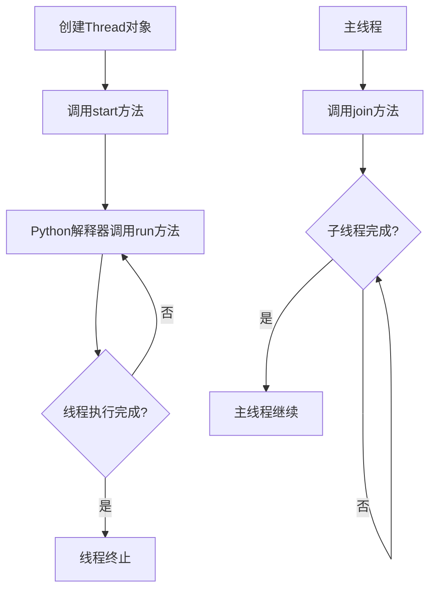

# Python 线程创建

## 线程的基本概念

线程（Thread）是程序执行的最小单元，它是轻量级的进程，可以与同一进程中的其他线程共享内存空间。在Python中，使用线程可以让程序同时执行多个任务，提高程序的执行效率，特别是在处理I/O密集型任务时。

:::note
在Python中，由于全局解释器锁（GIL）的限制，多线程在CPU密集型任务上并不会带来性能提升，但在I/O密集型任务上仍然非常有用。
:::

## Python 中的线程模块

Python提供了`threading`模块用于创建和管理线程。这个模块封装了低级的线程接口，使得线程创建和管理变得简单易用。

```python
import threading
```

## 创建线程的方法

### 方法一：通过Thread类直接创建

最简单的创建线程的方法是直接实例化`threading.Thread`类，并传入一个目标函数。

```python
import threading
import time

# 定义一个函数作为线程的目标
def print_numbers():
    for i in range(5):
        print(f"Number {i}")
        time.sleep(1)

# 创建一个线程
thread = threading.Thread(target=print_numbers)

# 启动线程
thread.start()

# 主线程继续执行
print("主线程继续执行其他任务")

# 等待线程完成
thread.join()
print("线程已经结束")
```

输出示例：
```
主线程继续执行其他任务
Number 0
Number 1
Number 2
Number 3
Number 4
线程已经结束
```

### 方法二：向线程函数传递参数

你可以通过`args`或`kwargs`参数向线程函数传递参数。

```python
import threading
import time

def print_message(message, delay):
    for i in range(5):
        print(f"{message}: {i}")
        time.sleep(delay)

# 使用位置参数
thread1 = threading.Thread(target=print_message, args=("你好", 1))

# 使用关键字参数
thread2 = threading.Thread(target=print_message, kwargs={"message": "世界", "delay": 1.5})

thread1.start()
thread2.start()

thread1.join()
thread2.join()
print("所有线程已完成")
```

输出示例：
```
你好: 0
世界: 0
你好: 1
世界: 1
你好: 2
你好: 3
世界: 2
你好: 4
世界: 3
世界: 4
所有线程已完成
```

### 方法三：继承Thread类

更面向对象的方法是通过继承`threading.Thread`类并重写它的`run`方法。

```python
import threading
import time

class MyThread(threading.Thread):
    def __init__(self, name, delay):
        # 调用父类的初始化方法
        super().__init__()
        self.name = name
        self.delay = delay
    
    # 重写run方法
    def run(self):
        print(f"线程 {self.name} 开始执行")
        for i in range(5):
            print(f"线程 {self.name}: {i}")
            time.sleep(self.delay)
        print(f"线程 {self.name} 执行完毕")

# 创建线程实例
thread1 = MyThread("A", 0.5)
thread2 = MyThread("B", 1)

# 启动线程
thread1.start()
thread2.start()

# 等待线程完成
thread1.join()
thread2.join()
print("所有线程已完成")
```

输出示例：
```
线程 A 开始执行
线程 A: 0
线程 B 开始执行
线程 B: 0
线程 A: 1
线程 A: 2
线程 B: 1
线程 A: 3
线程 A: 4
线程 A 执行完毕
线程 B: 2
线程 B: 3
线程 B: 4
线程 B 执行完毕
所有线程已完成
```

## 线程的基本操作

### 启动线程

使用`start()`方法启动线程，它会调用线程的`run()`方法。

```python
thread.start()
```

:::caution
每个线程对象的`start()`方法只能调用一次，多次调用会引发异常。
:::

### 等待线程完成

使用`join()`方法等待线程执行完成。

```python
thread.join()  # 无限等待
# 或者
thread.join(timeout=5)  # 最多等待5秒
```

### 检查线程状态

使用`is_alive()`方法检查线程是否仍在运行。

```python
if thread.is_alive():
    print("线程正在运行")
else:
    print("线程已完成")
```

### 设置和获取线程名称

```python
thread = threading.Thread(name="MyThread")  # 在创建时设置名称
thread.name = "NewName"  # 修改名称
print(thread.name)  # 获取名称
```

### 获取当前线程

```python
current_thread = threading.current_thread()
print(f"当前线程名称: {current_thread.name}")
```

## 线程的实际应用场景

### 场景一：网页爬虫

使用多线程可以同时爬取多个网页，提高爬虫效率。

```python
import threading
import requests
import time

def download_page(url):
    print(f"开始下载: {url}")
    response = requests.get(url)
    print(f"完成下载: {url}, 状态码: {response.status_code}, 长度: {len(response.text)}")

# 要下载的网页列表
urls = [
    "https://www.python.org",
    "https://www.github.com",
    "https://www.stackoverflow.com",
    "https://www.wikipedia.org"
]

# 创建并启动线程
threads = []
start_time = time.time()

for url in urls:
    thread = threading.Thread(target=download_page, args=(url,))
    threads.append(thread)
    thread.start()

# 等待所有线程完成
for thread in threads:
    thread.join()

end_time = time.time()
print(f"所有下载完成，总耗时: {end_time - start_time:.2f}秒")
```

### 场景二：图片处理

使用多线程可以同时处理多张图片，加快处理速度。

```python
import threading
import time
from PIL import Image, ImageFilter

def process_image(image_path, output_path, filter_type):
    print(f"开始处理: {image_path}")
    # 打开图片
    img = Image.open(image_path)
    
    # 应用滤镜
    if filter_type == "模糊":
        processed = img.filter(ImageFilter.BLUR)
    elif filter_type == "边缘增强":
        processed = img.filter(ImageFilter.EDGE_ENHANCE)
    else:
        processed = img
    
    # 保存处理后的图片
    processed.save(output_path)
    print(f"完成处理: {output_path}")

# 图片处理任务列表
tasks = [
    ("image1.jpg", "image1_blur.jpg", "模糊"),
    ("image2.jpg", "image2_edge.jpg", "边缘增强"),
    ("image3.jpg", "image3_blur.jpg", "模糊"),
    ("image4.jpg", "image4_edge.jpg", "边缘增强")
]

# 创建并启动线程
threads = []
for task in tasks:
    thread = threading.Thread(target=process_image, args=task)
    threads.append(thread)
    thread.start()

# 等待所有线程完成
for thread in threads:
    thread.join()

print("所有图片处理完成")
```

## 多线程的工作流程

下面是一个简单的多线程工作流程图：



## 线程安全性问题

当多个线程同时访问和修改共享数据时，可能会导致数据不一致，这就是所谓的线程安全性问题。

```python
import threading

# 共享变量
counter = 0

def increment():
    global counter
    for _ in range(100000):
        counter += 1

# 创建两个线程
thread1 = threading.Thread(target=increment)
thread2 = threading.Thread(target=increment)

thread1.start()
thread2.start()

thread1.join()
thread2.join()

# 理论上结果应该是200000
print(f"最终计数: {counter}")
```

输出示例（可能会有所不同）：
```
最终计数: 127385
```

:::warning
上述示例中，最终的计数可能小于预期的200000，这是因为多个线程同时修改共享变量造成的数据竞争。在后续的课程中，我们将学习如何使用锁、信号量等同步机制来解决这些问题。
:::

## 总结

在本篇文章中，我们学习了：
- Python中线程的基本概念
- 通过`threading`模块创建线程的三种方法
- 线程的基本操作，如启动、等待和状态检查
- 线程的实际应用场景
- 多线程工作流程
- 线程安全性问题的初步介绍

线程是并发编程的重要组成部分，掌握线程的创建和基本操作是学习Python并发编程的第一步。

## 练习题

1. 创建一个程序，使用多线程同时计算多个数字的斐波那契数列。
2. 编写一个多线程下载器，能够同时从多个URL下载文件。
3. 使用继承`Thread`类的方式，创建一个可以周期性执行任务的线程类。

## 进一步学习资源

- Python官方文档中的[threading模块](https://docs.python.org/3/library/threading.html)
- 《Python并行编程》，作者：Jan Palach
- 《Effective Python：编写高质量Python代码的59个有效方法》，作者：Brett Slatkin

在下一篇文章中，我们将深入探讨Python线程同步的概念和方法，帮助你解决线程安全性问题。