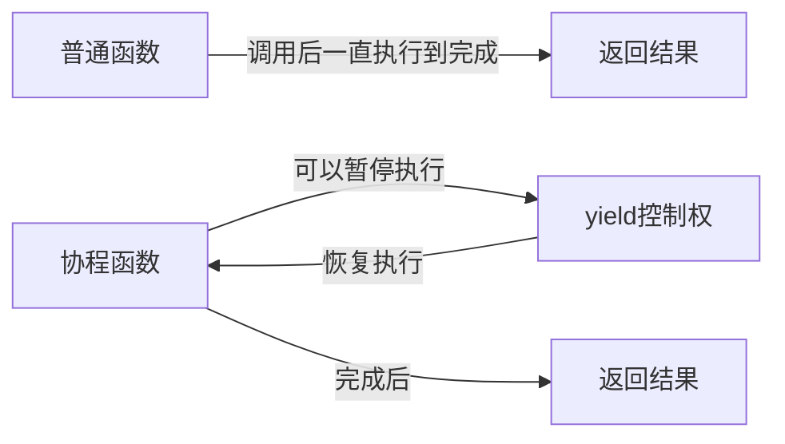

# Python 协程

## 什么是协程？

协程(Coroutine)是Python中一种特殊的函数，它能够在执行过程中暂停并稍后恢复执行。与普通函数不同，协程可以在执行到某个点时主动让出控制权，稍后再从那个点继续执行，这使得协程成为实现并发编程的强大工具。

协程的主要特点是：

- **非抢占式多任务处理**：协程自行决定何时交出控制权
- **单线程内实现并发**：不涉及线程上下文切换的开销
- **无需互斥锁**：因为在同一线程中执行



## Python 中协程的演变

Python中的协程经历了几个发展阶段：

1. **基于生成器的协程**：使用`yield`实现
2. **增强的生成器**：PEP 342添加的`yield from`表达式
3. **原生协程**：Python 3.5引入的`async/await`语法

## 基于生成器的协程

最初，Python通过生成器来模拟协程。生成器函数使用`yield`关键字可以暂停执行并返回一个值，下次调用时会从暂停的地方继续执行。

```python
def simple_coroutine():
    print("-> 协程开始")
    x = yield 1  # 暂停并返回1，等待下一次send()传入的值
    print("-> 收到值:", x)
    y = yield 2  # 暂停并返回2，等待下一次send()传入的值
    print("-> 收到值:", y)
    return "协程完成"  # 返回最终结果

# 创建协程
co = simple_coroutine()

# 启动协程，执行到第一个yield
first_yield = next(co)  
print("第一个yield返回:", first_yield)

# 发送值给协程，并获取第二个yield的返回值
second_yield = co.send("Hello")  
print("第二个yield返回:", second_yield)

try:
    # 发送值给协程，触发协程完成
    co.send("World")
except StopIteration as e:
    # 捕获StopIteration异常，获取协程的返回值
    print("协程返回值:", e.value)
```

输出结果：
```
-> 协程开始
第一个yield返回: 1
-> 收到值: Hello
第二个yield返回: 2
-> 收到值: World
协程返回值: 协程完成
```

:::note
在协程中，必须先调用`next()`或`send(None)`来"预激"协程，使其执行到第一个`yield`语句，然后才能向其发送值。
:::

## yield from 语法

Python 3.3引入了`yield from`语法，简化了协程的组合与嵌套：

```python
def inner_coroutine():
    print("Inner coroutine start")
    yield 1
    yield 2
    print("Inner coroutine end")

def outer_coroutine():
    print("Outer coroutine start")
    yield from inner_coroutine()  # 委托给inner_coroutine
    print("Outer coroutine end")
    yield 3

# 使用外层协程
co = outer_coroutine()
for value in co:
    print(f"Got value: {value}")
```

输出结果：
```
Outer coroutine start
Inner coroutine start
Got value: 1
Got value: 2
Inner coroutine end
Outer coroutine end
Got value: 3
```

## 现代Python协程: async/await

自Python 3.5起，引入了`async`和`await`关键字，提供了原生的协程支持，这是目前推荐的协程实现方式。

```python
import asyncio

async def hello_world():
    print("Hello")
    await asyncio.sleep(1)  # 非阻塞等待1秒
    print("World")
    return "完成"

# 运行协程
async def main():
    result = await hello_world()
    print(f"结果: {result}")

# Python 3.7+
asyncio.run(main())
```

输出结果：
```
Hello
World
结果: 完成
```

### 使用asyncio.gather并发执行多个协程

```python
import asyncio
import time

async def count(name, delay):
    print(f"协程 {name} 开始")
    await asyncio.sleep(delay)  # 模拟I/O操作
    print(f"协程 {name} 完成")
    return f"{name} 的结果"

async def main():
    start = time.time()
    
    # 并发执行三个协程
    results = await asyncio.gather(
        count("A", 3),
        count("B", 2),
        count("C", 1)
    )
    
    end = time.time()
    print(f"总执行时间: {end - start:.2f}秒")
    print(f"所有结果: {results}")

asyncio.run(main())
```

输出结果：
```
协程 A 开始
协程 B 开始
协程 C 开始
协程 C 完成
协程 B 完成
协程 A 完成
总执行时间: 3.01秒
所有结果: ['A 的结果', 'B 的结果', 'C 的结果']
```

:::tip
注意虽然总执行时间约为3秒（最长的任务时间），但三个任务实际上是并发执行的！这就是协程的魅力所在。
:::

## 实际应用案例：网页爬虫

下面是一个使用`aiohttp`库实现的异步网页爬虫，展示了协程在实际场景中的应用：

```python
import asyncio
import aiohttp
import time

async def fetch_url(url, session):
    start = time.time()
    async with session.get(url) as response:
        result = await response.text()
        end = time.time()
        print(f"获取 {url} 完成，用时 {end-start:.2f}秒")
        return len(result)

async def main():
    urls = [
        "https://www.python.org",
        "https://docs.python.org",
        "https://pypi.org",
        "https://github.com",
        "https://stackoverflow.com"
    ]
    
    start = time.time()
    
    async with aiohttp.ClientSession() as session:
        tasks = [fetch_url(url, session) for url in urls]
        results = await asyncio.gather(*tasks)
        
        for url, size in zip(urls, results):
            print(f"{url}: 大小 {size} 字节")
    
    end = time.time()
    print(f"总共用时: {end-start:.2f}秒")

# 运行主协程
if __name__ == "__main__":
    asyncio.run(main())
```

输出示例：
```
获取 https://www.python.org 完成，用时 0.32秒
获取 https://pypi.org 完成，用时 0.35秒
获取 https://docs.python.org 完成，用时 0.38秒
获取 https://github.com 完成，用时 0.43秒
获取 https://stackoverflow.com 完成，用时 0.45秒
https://www.python.org: 大小 49327 字节
https://docs.python.org: 大小 12658 字节
https://pypi.org: 大小 87954 字节
https://github.com: 大小 153867 字节
https://stackoverflow.com: 大小 257391 字节
总共用时: 0.46秒
```

:::caution
使用`aiohttp`库需要先安装：`pip install aiohttp`
:::

## 协程的优缺点

### 优点
- **高效的I/O处理**：当遇到I/O操作时可以切换到其他任务
- **内存占用低**：比线程更轻量
- **没有锁的并发**：避免了复杂的同步问题
- **易于调试**：单线程执行，减少了竞态条件

### 缺点
- **不适合CPU密集型任务**：因为协程是在单个线程中执行的
- **学习曲线陡峭**：特别是对于异步编程思维的转变
- **库支持**：需要使用支持异步的库

## 最佳实践

1. **使用`async/await`语法**：放弃旧式的基于生成器的协程
2. **避免阻塞操作**：任何阻塞操作都会阻塞整个事件循环
3. **合理分组任务**：使用`asyncio.gather`或`asyncio.TaskGroup`(Python 3.11+)
4. **异常处理**：正确捕获和处理异步代码中的异常
5. **不要混用同步和异步代码**：可能导致事件循环阻塞

```python
# 不推荐：在协程中使用同步阻塞操作
async def bad_practice():
    import time
    time.sleep(1)  # 阻塞整个事件循环!

# 推荐：使用异步版本
async def good_practice():
    await asyncio.sleep(1)  # 不会阻塞事件循环
```

## 总结

Python协程是一种强大的并发编程工具，特别适合I/O密集型任务。通过`async/await`语法，Python提供了一种优雅的方式来编写非阻塞代码，使得在不引入线程复杂性的情况下实现并发成为可能。

协程的核心优势在于能够在等待I/O操作完成时执行其他任务，而不是让CPU空闲等待。这使得协程特别适用于网络编程、Web应用和任何涉及大量I/O操作的场景。

## 练习和进一步学习

1. **基础练习**：编写一个协程，模拟多个任务的并发执行
2. **中级练习**：实现一个异步文件读写程序
3. **高级练习**：创建一个使用协程的简单Web爬虫

### 进一步学习资源

- [Python官方asyncio文档](https://docs.python.org/3/library/asyncio.html)
- [Real Python上的异步编程教程](https://realpython.com/async-io-python/)
- 《Fluent Python》第二版中的协程相关章节
- [asyncio: 使用Python进行并发编程](https://superfastpython.com/learning-paths/#AsyncIO_Learning_Path)

:::tip
记住，掌握协程需要时间和实践。从小型项目开始，逐步构建你的异步编程技能。
:::