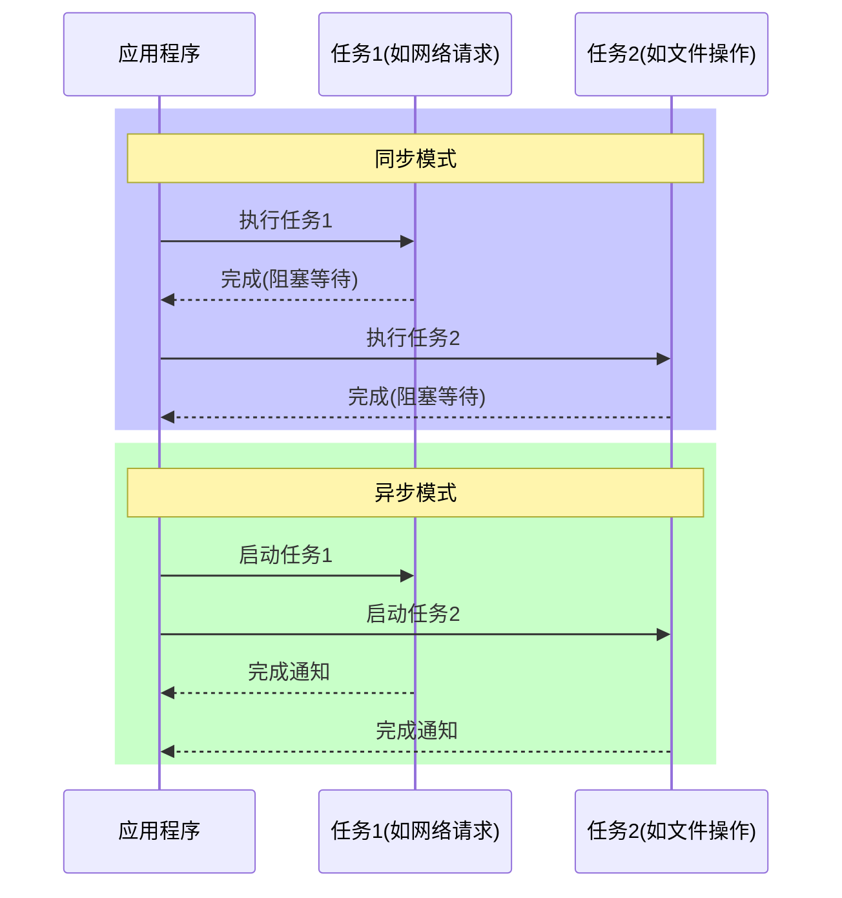

# Python AsyncIO

## 什么是异步IO？

异步IO (AsyncIO) 是Python中处理并发操作的一种方式，它允许程序在等待I/O操作完成时执行其他任务，而不是一直等待当前操作完成。这种编程模式在处理网络请求、文件操作和其他I/O密集型任务时特别有效，可以显著提升程序性能。

:::note
AsyncIO 并不是多线程，而是使用单线程通过协程(coroutines)进行任务切换，从而实现并发效果。
:::

## 同步与异步的对比

为了理解AsyncIO的优势，让我们先对比同步和异步编程模式：



## AsyncIO 的核心概念

### 1. 协程 (Coroutines)

协程是实现Python异步编程的基础。它们类似于函数，但可以在执行过程中暂停，允许其他代码运行，然后恢复执行。

在Python 3.5+中，协程是通过`async def`语法定义的：

```python
async def my_coroutine():
    print("开始执行")
    await asyncio.sleep(1)  # 暂停协程，允许其他协程运行
    print("执行完成")
```

### 2. await 关键字

`await`关键字用于暂停协程，直到被等待的对象完成。只能在协程函数中使用：

```python
async def fetch_data():
    print("开始获取数据")
    await asyncio.sleep(2)  # 模拟网络延迟
    print("数据获取完成")
    return {"data": "这是一些数据"}

async def main():
    result = await fetch_data()  # 等待fetch_data完成并获取结果
    print(f"获得结果: {result}")
```

### 3. 事件循环 (Event Loop)

事件循环是AsyncIO的核心，它管理协程的执行、网络IO操作、子进程和其他事件。

```python
import asyncio

async def main():
    print("Hello")
    await asyncio.sleep(1)
    print("World")

# 获取事件循环并运行协程
asyncio.run(main())  # Python 3.7+的推荐方法
```

## 使用AsyncIO的基本步骤

### 步骤1: 导入asyncio模块

```python
import asyncio
```

### 步骤2: 定义异步函数

```python
async def say_after(delay, what):
    await asyncio.sleep(delay)
    print(what)
```

### 步骤3: 创建并运行协程

```python
async def main():
    print(f"开始时间: {asyncio.get_event_loop().time()}")
    
    await say_after(1, '你好')
    await say_after(2, '世界')
    
    print(f"结束时间: {asyncio.get_event_loop().time()}")

asyncio.run(main())
```

输出:
```
开始时间: 0.0
你好
世界
结束时间: 3.0103720220001537
```

这个例子是顺序执行的，两个任务总共花费了约3秒。让我们看看如何并发执行：

### 步骤4: 并发执行多个协程

```python
async def main():
    print(f"开始时间: {asyncio.get_event_loop().time()}")
    
    # 使用asyncio.gather并发执行多个协程
    await asyncio.gather(
        say_after(1, '你好'),
        say_after(2, '世界')
    )
    
    print(f"结束时间: {asyncio.get_event_loop().time()}")

asyncio.run(main())
```

输出:
```
开始时间: 0.0
你好
世界
结束时间: 2.0031230439997465
```

现在两个任务并发执行，总时间只有约2秒（由最长的任务决定）。

## AsyncIO常用功能

### 1. asyncio.gather() - 并发执行多个协程

```python
async def main():
    # 同时执行多个任务并收集所有结果
    results = await asyncio.gather(
        get_weather("北京"),
        get_weather("上海"),
        get_weather("广州")
    )
    
    for city, temp in results:
        print(f"{city}: {temp}°C")
```

### 2. asyncio.wait_for() - 设置超时

```python
async def main():
    try:
        # 如果get_weather超过2秒未完成，会抛出TimeoutError
        result = await asyncio.wait_for(get_weather("北京"), timeout=2.0)
        print(f"北京: {result}°C")
    except asyncio.TimeoutError:
        print("请求超时")
```

### 3. asyncio.create_task() - 创建任务

```python
async def main():
    # 创建任务后立即运行在后台
    task1 = asyncio.create_task(say_after(1, '你好'))
    task2 = asyncio.create_task(say_after(2, '世界'))
    
    print("任务已创建")
    
    # 此处可以执行其他代码
    
    # 等待任务完成
    await task1
    await task2
```

### 4. asyncio.sleep() - 异步等待

```python
async def delayed_greeting(name):
    print(f"准备问候 {name}")
    await asyncio.sleep(1)  # 非阻塞延迟
    print(f"你好, {name}!")
```

## 实际应用案例：异步网页爬虫

让我们创建一个简单的异步网页爬虫，同时抓取多个网站：

```python
import asyncio
import aiohttp  # 需要安装: pip install aiohttp
import time

async def fetch_webpage(session, url):
    print(f"开始获取: {url}")
    async with session.get(url) as response:
        content = await response.text()
        print(f"完成获取: {url}, 获取到 {len(content)} 字节")
        return len(content)

async def main():
    websites = [
        "https://www.python.org",
        "https://www.github.com",
        "https://www.stackoverflow.com",
        "https://www.wikipedia.org",
        "https://www.reddit.com"
    ]
    
    start_time = time.time()
    
    async with aiohttp.ClientSession() as session:
        tasks = [fetch_webpage(session, url) for url in websites]
        results = await asyncio.gather(*tasks)
    
    end_time = time.time()
    
    print(f"总共获取了 {sum(results)} 字节的数据")
    print(f"总用时: {end_time - start_time:.2f} 秒")

if __name__ == "__main__":
    asyncio.run(main())
```

输出示例:
```
开始获取: https://www.python.org
开始获取: https://www.github.com
开始获取: https://www.stackoverflow.com
开始获取: https://www.wikipedia.org
开始获取: https://www.reddit.com
完成获取: https://www.wikipedia.org, 获取到 75842 字节
完成获取: https://www.python.org, 获取到 50993 字节
完成获取: https://www.github.com, 获取到 162453 字节
完成获取: https://www.stackoverflow.com, 获取到 257534 字节
完成获取: https://www.reddit.com, 获取到 381927 字节
总共获取了 928749 字节的数据
总用时: 1.23 秒
```

使用异步IO，我们可以同时发起多个网络请求，大大减少总体等待时间。如果采用同步方式，总时间将是每个请求时间的总和。

## 案例：异步文件读写

```python
import asyncio
import aiofiles  # 需要安装: pip install aiofiles

async def read_file(filename):
    async with aiofiles.open(filename, 'r') as file:
        content = await file.read()
        print(f"从 {filename} 读取了 {len(content)} 字符")
        return content

async def write_file(filename, content):
    async with aiofiles.open(filename, 'w') as file:
        await file.write(content)
        print(f"写入了 {len(content)} 字符到 {filename}")

async def main():
    # 并行读取多个文件
    contents = await asyncio.gather(
        read_file('file1.txt'),
        read_file('file2.txt'),
        read_file('file3.txt')
    )
    
    # 合并内容
    combined = '\n'.join(contents)
    
    # 写入合并后的内容
    await write_file('combined.txt', combined)
    
    print("所有操作完成")

# 注意：要运行此示例，需要先创建三个示例文件
```

## 异步上下文管理器

Python 3.7+提供了异步上下文管理器，可以使用`async with`语句：

```python
class AsyncResource:
    async def __aenter__(self):
        print("获取资源")
        await asyncio.sleep(1)  # 模拟资源获取延迟
        return self
        
    async def __aexit__(self, exc_type, exc_value, traceback):
        print("释放资源")
        await asyncio.sleep(0.5)  # 模拟资源释放延迟
        
    async def process(self):
        print("使用资源")
        await asyncio.sleep(1)

async def main():
    async with AsyncResource() as resource:
        await resource.process()
        
asyncio.run(main())
```

输出:
```
获取资源
使用资源
释放资源
```

## 注意事项与最佳实践

### 1. 不要在异步函数中使用阻塞调用

```python
async def bad_practice():
    # 错误：time.sleep是阻塞调用，会阻止事件循环运行
    time.sleep(1)
    
async def good_practice():
    # 正确：使用asyncio.sleep代替
    await asyncio.sleep(1)
```

### 2. 处理CPU密集型任务

AsyncIO主要适用于I/O密集型任务，而非CPU密集型任务。对于CPU密集型任务，考虑使用`concurrent.futures.ProcessPoolExecutor`：

```python
import asyncio
import concurrent.futures

def cpu_bound_task(n):
    # 计算密集型任务
    result = 0
    for i in range(n * 1000000):
        result += i
    return result

async def main():
    loop = asyncio.get_running_loop()
    
    # 使用进程池执行CPU密集型任务
    with concurrent.futures.ProcessPoolExecutor() as pool:
        results = await asyncio.gather(
            loop.run_in_executor(pool, cpu_bound_task, 1),
            loop.run_in_executor(pool, cpu_bound_task, 2),
            loop.run_in_executor(pool, cpu_bound_task, 3)
        )
    
    print(results)

asyncio.run(main())
```

### 3. 避免嵌套使用asyncio.run()

```python
# 错误做法：在协程内部调用asyncio.run()
async def nested_coroutine():
    # 这会导致错误！
    asyncio.run(another_coroutine())

# 正确做法：直接使用await
async def correct_coroutine():
    # 正确的方式
    await another_coroutine()
```

## 总结

Python AsyncIO是一个强大的并发编程模型，通过协程和事件循环实现非阻塞的异步操作。它特别适合处理I/O密集型任务，如网络请求、文件操作等，可以显著提高程序性能。

主要优点包括：
- 使用单线程实现并发，避免了线程切换的开销和多线程的复杂性
- 代码结构清晰，读起来接近同步代码
- 性能高效，尤其在处理大量I/O操作时

本教程介绍了AsyncIO的基本概念、语法和应用场景，帮助你开始使用Python进行异步编程。随着实践的增加，你将能够构建更复杂、高效的异步应用程序。

## 练习与进阶

### 练习1：创建一个异步计时器

创建一个异步函数，每隔一秒打印一次当前时间，运行10次后停止。

### 练习2：并发API请求

使用`aiohttp`库，同时向多个公共API发送请求，并比较异步与同步方法的性能差异。

### 练习3：异步文件处理系统

创建一个程序，异步监控某个目录中的文件变化，当有新文件时，异步读取并处理其内容。

### 进阶资源

- [Python官方AsyncIO文档](https://docs.python.org/3/library/asyncio.html)
- [aiohttp库文档](https://docs.aiohttp.org/)
- [asyncio: 充分理解](https://realpython.com/async-io-python/)

:::tip
要掌握AsyncIO，最好的方法是实践！尝试将你现有的同步代码转换为异步，观察性能提升。
:::