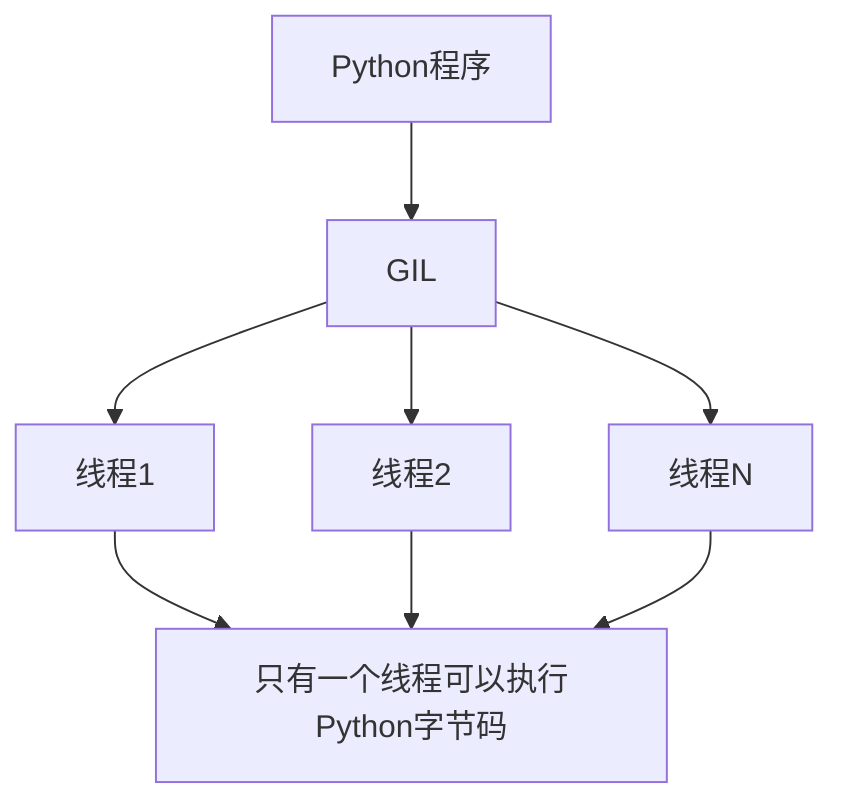

# Python 并发性能优化

当你开始使用Python进行并发编程后，你可能会发现简单地添加线程或进程并不总是能带来预期的性能提升。在本文中，我们将探讨如何优化Python并发程序的性能，使其真正发挥并发编程的优势。

## 理解Python的并发限制

在深入优化之前，我们需要理解Python并发编程的一些基础限制：

### GIL (全局解释器锁)

:::note 什么是GIL？
GIL是Python解释器CPython的一个机制，它确保同一时刻只有一个线程在执行Python字节码。这意味着在CPU密集型任务中，多线程可能不会带来性能提升。
:::



## 并发性能优化策略

### 1. 选择合适的并发模型

根据你的任务类型选择适当的并发方式：

- **I/O密集型任务**: 使用`threading`、`asyncio`
- **CPU密集型任务**: 使用`multiprocessing`或`concurrent.futures`的ProcessPoolExecutor

以下代码片段展示了如何根据任务类型选择并发模型：

```python
# I/O密集型任务 - 使用线程
from concurrent.futures import ThreadPoolExecutor
import requests

urls = ["https://example.com"] * 100

def fetch_url(url):
    return requests.get(url).text

with ThreadPoolExecutor(max_workers=20) as executor:
    results = list(executor.map(fetch_url, urls))
```

```python
# CPU密集型任务 - 使用进程
from concurrent.futures import ProcessPoolExecutor
import math

numbers = list(range(1000000))

def compute_intensive_task(n):
    return sum(math.factorial(i) for i in range(1, n % 10 + 1))

with ProcessPoolExecutor(max_workers=8) as executor:
    results = list(executor.map(compute_intensive_task, numbers))
```

### 2. 优化任务粒度

任务粒度太小会导致调度开销超过性能收益，太大会影响负载均衡。

```python
# 优化前：粒度太小
def process_item(item):
    return item * 2

with ProcessPoolExecutor(max_workers=4) as executor:
    results = list(executor.map(process_item, range(1000)))

# 优化后：增加粒度
def process_batch(batch):
    return [item * 2 for item in batch]

# 将1000个项分成4批
batches = [list(range(i, i + 250)) for i in range(0, 1000, 250)]

with ProcessPoolExecutor(max_workers=4) as executor:
    results = []
    for batch_result in executor.map(process_batch, batches):
        results.extend(batch_result)
```

### 3. 减少进程/线程间通信

进程间通信和同步会带来额外开销，应尽量减少：

```python
# 优化前：频繁的进程通信
def worker(queue_in, queue_out):
    while True:
        item = queue_in.get()
        if item is None:
            break
        # 每处理一个项就发送结果
        queue_out.put(item * 2)

# 优化后：批量处理和通信
def worker(queue_in, queue_out):
    results = []
    while True:
        item = queue_in.get()
        if item is None:
            break
        # 本地收集结果
        results.append(item * 2)
        # 当积累了足够数量或队列为空时发送
        if len(results) >= 100 or queue_in.empty():
            queue_out.put(results)
            results = []
    # 确保发送所有结果
    if results:
        queue_out.put(results)
```

### 4. 使用适当的数据结构

选择适合并发访问的数据结构可以显著提升性能：

```python
# 优化前：普通字典加锁
from threading import Lock

shared_dict = {}
dict_lock = Lock()

def update_dict(key, value):
    with dict_lock:
        shared_dict[key] = value

# 优化后：使用线程安全的数据结构
from concurrent.futures import ThreadPoolExecutor
import queue

shared_queue = queue.Queue()

def update_queue(item):
    shared_queue.put(item)  # 线程安全，无需额外加锁
```

### 5. 优化线程/进程池大小

线程/进程数过多会导致资源竞争，过少则无法充分利用资源：

```python
import concurrent.futures
import multiprocessing
import time

# 获取CPU核心数
cpu_count = multiprocessing.cpu_count()

def optimal_worker_count():
    # I/O密集型任务，可以使用更多线程
    if task_is_io_bound():
        return cpu_count * 2
    # CPU密集型任务，通常使用与CPU核心数相当的进程数
    else:
        return cpu_count

# 使用优化后的工作线程/进程数量
with concurrent.futures.ProcessPoolExecutor(max_workers=optimal_worker_count()) as executor:
    # 执行任务
    pass
```

## 性能分析与测量

优化之前，应该测量基准性能，确定瓶颈所在：

```python
import time
import cProfile

def measure_time(func, *args, **kwargs):
    start_time = time.time()
    result = func(*args, **kwargs)
    end_time = time.time()
    print(f"执行时间: {end_time - start_time:.4f} 秒")
    return result

# 使用cProfile进行更详细的分析
def profile_function(func, *args, **kwargs):
    cProfile.runctx('func(*args, **kwargs)', globals(), locals())
```

## 实际案例：网页爬虫性能优化

让我们看一个优化网页爬虫性能的实例：

```python
import requests
import time
from concurrent.futures import ThreadPoolExecutor, as_completed

urls = ["https://example.com"] * 50

# 未优化的顺序执行
def sequential_crawler():
    results = []
    for url in urls:
        response = requests.get(url)
        results.append(response.text[:100])  # 只保存前100个字符
    return results

# 优化版本1：简单线程池
def threaded_crawler_v1():
    results = []
    with ThreadPoolExecutor(max_workers=10) as executor:
        future_to_url = {executor.submit(requests.get, url): url for url in urls}
        for future in as_completed(future_to_url):
            results.append(future.result().text[:100])
    return results

# 优化版本2：添加会话复用和超时控制
def threaded_crawler_v2():
    results = []
    
    def fetch_with_session(session, url):
        try:
            response = session.get(url, timeout=5)
            return response.text[:100]
        except Exception as e:
            return f"Error: {str(e)}"
    
    with ThreadPoolExecutor(max_workers=10) as executor:
        with requests.Session() as session:
            futures = [executor.submit(fetch_with_session, session, url) for url in urls]
            for future in as_completed(futures):
                results.append(future.result())
    return results

# 测量性能
print("顺序执行:")
measure_time(sequential_crawler)

print("\n线程池执行 v1:")
measure_time(threaded_crawler_v1)

print("\n线程池执行 v2 (带会话复用):")
measure_time(threaded_crawler_v2)

# 输出示例：
# 顺序执行:
# 执行时间: 25.3245 秒
#
# 线程池执行 v1:
# 执行时间: 3.1840 秒
#
# 线程池执行 v2 (带会话复用):
# 执行时间: 2.8730 秒
```

这个例子展示了通过以下几点优化并发爬虫：
1. 使用线程池代替顺序执行
2. 复用HTTP会话减少连接开销
3. 添加超时控制防止阻塞

## 高级优化技巧

### 使用Cython绕过GIL

对于CPU密集型任务，可以考虑使用Cython将关键部分编译为C扩展，这样可以绕过GIL限制：

```python
# example.pyx - 需要编译为C扩展
def compute_intensive(int n):
    cdef int i, result = 0
    for i in range(n):
        result += i * i
    return result
```

### 使用共享内存减少数据传输

在多进程环境中，可以使用共享内存减少数据复制开销：

```python
from multiprocessing import Process, shared_memory
import numpy as np

def worker(shm_name, shape, dtype):
    # 连接到已存在的共享内存
    existing_shm = shared_memory.SharedMemory(name=shm_name)
    # 创建NumPy数组，与共享内存关联
    array = np.ndarray(shape, dtype=dtype, buffer=existing_shm.buf)
    # 在共享内存中处理数据
    for i in range(shape[0]):
        array[i] = array[i] * 2
    # 清理
    existing_shm.close()

if __name__ == "__main__":
    # 创建数据和共享内存
    data = np.ones(10000, dtype=np.int64)
    shm = shared_memory.SharedMemory(create=True, size=data.nbytes)
    
    # 创建与共享内存关联的数组
    shared_array = np.ndarray(data.shape, dtype=data.dtype, buffer=shm.buf)
    shared_array[:] = data[:]  # 复制数据到共享内存
    
    # 创建进程
    p = Process(target=worker, args=(shm.name, data.shape, data.dtype))
    p.start()
    p.join()
    
    # 验证数据已被修改
    print(shared_array[:5])  # 应该打印 [2 2 2 2 2]
    
    # 清理
    shm.close()
    shm.unlink()
```

## 总结与最佳实践

1. **了解任务特性**：区分I/O密集型和CPU密集型任务，选择合适的并发模型
2. **适当的任务粒度**：既不过大也不过小，寻找平衡点
3. **减少通信和同步**：尽量降低线程/进程间的通信和同步开销
4. **优化工作单元数量**：根据硬件和任务特性选择合适的线程/进程数
5. **使用专业工具分析性能**：使用cProfile、line_profiler等工具找出瓶颈
6. **考虑使用异步I/O**：对于I/O密集型任务，使用asyncio可能比多线程更高效
7. **利用专业库**：考虑使用Dask、Joblib等库来简化并行计算

:::tip
记住：过早优化是万恶之源。始终先衡量性能，确定瓶颈，再进行有针对性的优化。
:::

## 练习

1. 比较threading和asyncio在处理网络请求时的性能差异
2. 实现一个图像处理程序，使用multiprocessing进行并行处理，并测量不同粒度任务的性能
3. 优化一个现有的并发程序，通过减少线程/进程间通信来提高性能
4. 实现一个生产者-消费者模型，并测试不同数量生产者和消费者的性能影响
5. 使用共享内存在多进程环境中处理大型数据集，并与普通多进程比较性能差异

## 扩展资源

- 《High Performance Python》- Micha Gorelick & Ian Ozsvald
- 《Effective Python》- Brett Slatkin
- Python官方文档：
  - [threading模块](https://docs.python.org/zh-cn/3/library/threading.html)
  - [multiprocessing模块](https://docs.python.org/zh-cn/3/library/multiprocessing.html)
  - [asyncio模块](https://docs.python.org/zh-cn/3/library/asyncio.html)
- [Python Concurrency: The Tricky Bits](https://python.hamel.dev/concurrency/) - 处理并发编程中的常见问题

掌握Python的并发性能优化是提升程序效率的关键步骤，通过本文介绍的技巧，你应该能够显著提高并发程序的性能。记住，优化是一个持续的过程，需要不断测量、分析和改进。