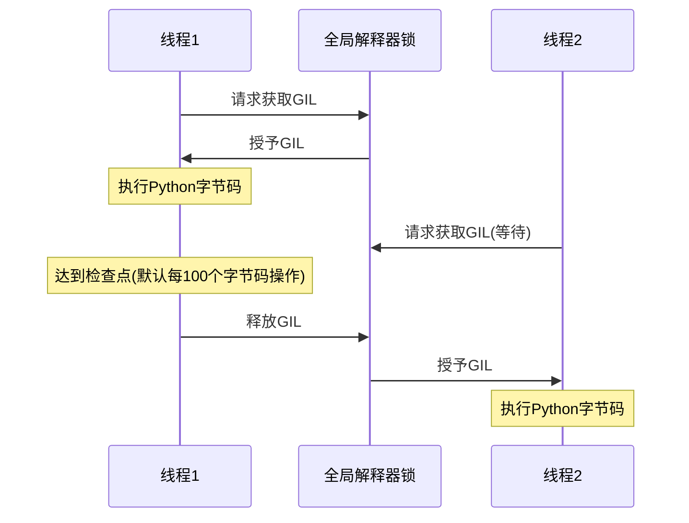

# Python 全局解释器锁

## 什么是全局解释器锁(GIL)?

全局解释器锁(Global Interpreter Lock，简称GIL)是Python解释器CPython中的一个机制，它确保同一时刻只有一个线程可以执行Python字节码。换句话说，无论你的计算机有多少个CPU核心，标准的Python实现在任何时候只能执行一个线程的Python代码。

:::note 历史背景
GIL最初设计于1990年代，当时是为了简化CPython实现并解决多线程编程中的内存管理问题。那时候多核处理器还不常见，所以GIL的限制影响相对较小。
:::

## GIL如何工作

为了理解GIL的工作原理，让我们看看Python中线程执行的基本流程：



在CPython中，GIL的工作方式如下：

1. 当一个线程想要执行Python代码时，它必须首先获取GIL
2. 获取到GIL的线程可以执行一定数量的字节码操作(在Python 3中默认是100个)
3. 达到检查点后，线程释放GIL，允许其他线程获取锁并执行
4. 如果有I/O操作，线程会主动释放GIL，让其他线程执行

## GIL对并发编程的影响

### CPU密集型任务

让我们通过一个简单的计算密集型任务来观察GIL的影响：

```python
import time
import threading

def cpu_bound_task(n):
    # 执行CPU密集型计算
    count = 0
    for i in range(n):
        count += i
    return count

def single_thread():
    start = time.time()
    cpu_bound_task(100000000)
    cpu_bound_task(100000000)
    end = time.time()
    return end - start

def multi_thread():
    start = time.time()
    
    t1 = threading.Thread(target=cpu_bound_task, args=(100000000,))
    t2 = threading.Thread(target=cpu_bound_task, args=(100000000,))
    
    t1.start()
    t2.start()
    
    t1.join()
    t2.join()
    
    end = time.time()
    return end - start

print(f"单线程执行时间: {single_thread():.4f}秒")
print(f"双线程执行时间: {multi_thread():.4f}秒")
```

输出可能是：
```
单线程执行时间: 8.4521秒
双线程执行时间: 8.9782秒
```

:::caution
令人惊讶的是，多线程版本实际上可能比单线程版本更慢！这是因为线程之间切换GIL有开销，而且由于GIL的存在，Python实际上仍然是在单核上执行这些计算。
:::

### I/O密集型任务

对于I/O密集型任务，GIL的影响不那么明显，因为在I/O操作期间，Python线程会释放GIL：

```python
import time
import threading
import requests

def io_bound_task(url):
    # 执行I/O密集型操作（网络请求）
    response = requests.get(url)
    return len(response.text)

def single_thread():
    start = time.time()
    io_bound_task("https://python.org")
    io_bound_task("https://pypi.org")
    end = time.time()
    return end - start

def multi_thread():
    start = time.time()
    
    t1 = threading.Thread(target=io_bound_task, args=("https://python.org",))
    t2 = threading.Thread(target=io_bound_task, args=("https://pypi.org",))
    
    t1.start()
    t2.start()
    
    t1.join()
    t2.join()
    
    end = time.time()
    return end - start

print(f"单线程执行时间: {single_thread():.4f}秒")
print(f"双线程执行时间: {multi_thread():.4f}秒")
```

输出可能是：
```
单线程执行时间: 1.2456秒
双线程执行时间: 0.6872秒
```

:::tip
对于I/O密集型任务，多线程仍然很有用！这是因为当一个线程在等待I/O时，它会释放GIL，让其他线程可以执行。
:::

## 如何在有GIL的情况下进行高效并发编程

尽管GIL存在限制，但Python仍然提供了几种方法来实现高效的并发编程：

### 1. 使用多进程替代多线程

对于CPU密集型任务，可以使用`multiprocessing`模块，它会为每个进程创建一个独立的Python解释器实例，每个实例都有自己的GIL：

```python
import time
import multiprocessing

def cpu_bound_task(n):
    # 执行CPU密集型计算
    count = 0
    for i in range(n):
        count += i
    return count

def run_in_parallel():
    start = time.time()
    
    # 创建两个进程
    p1 = multiprocessing.Process(target=cpu_bound_task, args=(100000000,))
    p2 = multiprocessing.Process(target=cpu_bound_task, args=(100000000,))
    
    p1.start()
    p2.start()
    
    p1.join()
    p2.join()
    
    end = time.time()
    return end - start

print(f"双进程执行时间: {run_in_parallel():.4f}秒")
```

输出可能是：
```
双进程执行时间: 4.5678秒
```

在多核系统上，这种方法可以实现真正的并行计算。

### 2. 使用异步编程

对于I/O密集型任务，可以使用`asyncio`模块进行异步编程：

```python
import asyncio
import time
import aiohttp

async def fetch_url(url):
    async with aiohttp.ClientSession() as session:
        async with session.get(url) as response:
            return await response.text()

async def main():
    start = time.time()
    
    # 并发执行两个异步任务
    results = await asyncio.gather(
        fetch_url("https://python.org"),
        fetch_url("https://pypi.org")
    )
    
    # 处理结果
    for i, result in enumerate(results):
        print(f"URL {i+1} 内容长度: {len(result)}")
    
    end = time.time()
    print(f"异步执行时间: {end - start:.4f}秒")

# 运行异步主函数
asyncio.run(main())
```

异步编程允许单线程内并发执行多个I/O操作，避免了线程切换的开销，并且不受GIL限制（因为是在单线程内执行）。

### 3. 使用第三方库或替代解释器

一些Python库通过C扩展绕过了GIL的限制：

- **NumPy**：许多数值计算操作在C层面执行，可以释放GIL
- **Pandas**：基于NumPy，也可以在某些操作中释放GIL
- **Numba**：可以将Python代码即时编译成机器码，并在某些情况下释放GIL

还有一些Python的替代实现不使用GIL：

- **Jython**：在JVM上运行的Python实现，没有GIL
- **IronPython**：在.NET平台上运行的Python实现，没有GIL
- **PyPy**：带有JIT编译器的Python实现，有GIL但在并发性能方面有所改进

## 案例研究：图像处理应用

考虑一个需要处理大量图像的应用程序。这是一个典型的既有CPU密集型操作（图像转换）也有I/O密集型操作（读写文件）的案例。

### 方案1：传统多线程（不理想）

```python
import threading
from PIL import Image
import os
import time

def process_image(image_path, save_path):
    # 打开图像
    img = Image.open(image_path)
    
    # 应用一些处理（CPU密集）
    # 转为灰度
    img = img.convert('L')
    # 应用模糊效果
    img = img.filter(ImageFilter.GaussianBlur(radius=2))
    
    # 保存图像（I/O密集）
    img.save(save_path)

def process_images_with_threads(image_folder, output_folder):
    threads = []
    
    for filename in os.listdir(image_folder):
        if filename.endswith(('.png', '.jpg', '.jpeg')):
            input_path = os.path.join(image_folder, filename)
            output_path = os.path.join(output_folder, filename)
            
            thread = threading.Thread(target=process_image, args=(input_path, output_path))
            threads.append(thread)
            thread.start()
    
    for thread in threads:
        thread.join()
```

这种方案的问题在于图像处理（CPU密集）部分会受到GIL的限制，导致性能不佳。

### 方案2：混合方式（推荐）

```python
from concurrent.futures import ProcessPoolExecutor, ThreadPoolExecutor
from PIL import Image, ImageFilter
import os
import time

# CPU密集型任务 - 使用多进程
def process_image_data(img_data):
    img = Image.open(img_data)
    img = img.convert('L')
    img = img.filter(ImageFilter.GaussianBlur(radius=2))
    return img

# I/O密集型任务 - 使用多线程
def load_image(image_path):
    return image_path

def save_image(img, save_path):
    img.save(save_path)

def process_images_hybrid(image_folder, output_folder, max_workers=4):
    # 获取所有图像文件路径
    image_paths = [
        os.path.join(image_folder, f) 
        for f in os.listdir(image_folder) 
        if f.endswith(('.png', '.jpg', '.jpeg'))
    ]
    
    # 使用线程池加载图像（I/O密集）
    with ThreadPoolExecutor(max_workers=max_workers) as executor:
        loaded_images = list(executor.map(load_image, image_paths))
    
    # 使用进程池处理图像（CPU密集）
    with ProcessPoolExecutor(max_workers=max_workers) as executor:
        processed_images = list(executor.map(process_image_data, loaded_images))
    
    # 使用线程池保存图像（I/O密集）
    save_paths = [
        os.path.join(output_folder, os.path.basename(path))
        for path in image_paths
    ]
    
    with ThreadPoolExecutor(max_workers=max_workers) as executor:
        list(executor.map(save_image, processed_images, save_paths))
```

这种混合方式充分利用了多进程处理CPU密集型任务（避开GIL限制），同时使用多线程处理I/O密集型任务（在I/O等待时释放GIL）。

## 总结

全局解释器锁(GIL)是CPython解释器中的一个机制，它限制了Python在多线程环境中的并行性能，特别是对于CPU密集型任务。了解GIL的工作原理对于编写高效的Python并发代码至关重要。

关键要点：

- GIL确保同一时刻只有一个线程可以执行Python字节码
- 对CPU密集型任务，多线程不会提供性能改善，甚至可能因线程切换而降低性能
- 对I/O密集型任务，多线程仍然有效，因为线程在I/O等待时会释放GIL
- 可以使用多进程(`multiprocessing`)绕过GIL限制，实现真正的并行计算
- 异步编程(`asyncio`)是处理大量I/O操作的高效方式
- 一些第三方库(NumPy, Pandas)通过C扩展在关键操作中释放GIL

尽管GIL带来了一些限制，但通过选择合适的并发策略，你仍然可以使用Python编写高效的并发程序。

## 练习与思考

1. 分析你当前的Python项目，确定哪些部分是CPU密集型的，哪些是I/O密集型的。
2. 尝试将一个CPU密集型任务分别用单线程、多线程和多进程实现，比较它们的性能差异。
3. 思考：在什么情况下移除GIL可能会导致Python程序出现问题？
4. 挑战：使用`ctypes`或`Cython`编写一个简单的C扩展，并观察它如何在执行期间释放GIL。

:::tip 进一步学习
要深入了解Python并发编程，建议探索以下资源：
- Python官方文档中的[threading](https://docs.python.org/3/library/threading.html)、[multiprocessing](https://docs.python.org/3/library/multiprocessing.html)和[asyncio](https://docs.python.org/3/library/asyncio.html)模块
- David Beazley关于GIL的精彩演讲："[Understanding the Python GIL](https://www.youtube.com/watch?v=Obt-vMVdM8s)"
- Anthony Shaw的文章："[Speed Up Your Python Program With Concurrency](https://realpython.com/python-concurrency/)"
:::