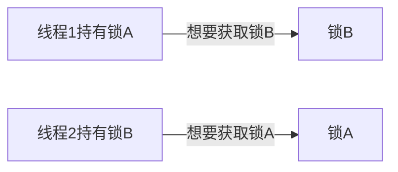

# Python 线程同步

在多线程编程世界中，线程同步是一个至关重要的概念。当多个线程同时访问共享资源时，如果没有适当的同步机制，可能会导致数据不一致、程序崩溃等问题。本文将带你全面了解Python中的线程同步机制，帮助你编写安全高效的多线程程序。

## 为什么需要线程同步？

当多个线程并发执行时，它们可能会同时访问和修改共享的数据。这种情况下可能会导致"竞争条件"(Race Condition)，使得程序的结果变得不可预测。

### 竞争条件示例

考虑下面这个简单的例子，两个线程同时对一个共享变量进行递增操作：

```python
import threading

counter = 0

def increment():
    global counter
    for _ in range(100000):
        counter += 1

# 创建两个线程
thread1 = threading.Thread(target=increment)
thread2 = threading.Thread(target=increment)

# 启动线程
thread1.start()
thread2.start()

# 等待线程完成
thread1.join()
thread2.join()

print(f"最终计数: {counter}")  # 预期结果为200000
```

输出结果可能是：

```
最终计数: 127394
```

:::warning
你会发现输出结果可能小于预期的200000，这就是典型的竞争条件问题。
:::

这是因为 `counter += 1` 操作不是原子的，它实际上包含三个步骤：
1. 读取 `counter` 的当前值
2. 将值加1
3. 将结果写回 `counter`

当两个线程同时执行这些操作时，它们可能会覆盖对方的结果，从而导致计数不准确。

## Python 中的线程同步机制

Python提供了多种线程同步机制来解决这类问题：

### 1. 互斥锁(Mutex)

互斥锁是最基本的同步机制，它确保在同一时间只有一个线程可以执行受保护的代码块：

```python
import threading

counter = 0
lock = threading.Lock()

def increment():
    global counter
    for _ in range(100000):
        lock.acquire()  # 获取锁
        try:
            counter += 1
        finally:
            lock.release()  # 释放锁

thread1 = threading.Thread(target=increment)
thread2 = threading.Thread(target=increment)

thread1.start()
thread2.start()

thread1.join()
thread2.join()

print(f"最终计数: {counter}")  # 现在结果将是200000
```

输出结果：

```
最终计数: 200000
```

使用 `with` 语句可以更优雅地使用锁：

```python
def increment():
    global counter
    for _ in range(100000):
        with lock:  # 自动获取和释放锁
            counter += 1
```

### 2. 可重入锁(RLock)

普通的锁(Lock)不能被同一个线程多次获取，否则会导致死锁。而可重入锁允许同一个线程多次获取该锁：

```python
import threading

rlock = threading.RLock()

def outer_function():
    with rlock:
        print("外层函数获取了锁")
        inner_function()
        print("外层函数释放了锁")

def inner_function():
    with rlock:  # 同一线程可以再次获取同一个RLock
        print("内层函数获取了锁")
        print("内层函数释放了锁")

thread = threading.Thread(target=outer_function)
thread.start()
thread.join()
```

输出结果：

```
外层函数获取了锁
内层函数获取了锁
内层函数释放了锁
外层函数释放了锁
```

### 3. 条件变量(Condition)

条件变量允许线程等待特定条件发生，并在条件满足时被其他线程唤醒：

```python
import threading
import time
import random

# 模拟生产者-消费者问题
condition = threading.Condition()
queue = []
MAX_SIZE = 10

def producer():
    while True:
        with condition:
            while len(queue) == MAX_SIZE:  # 队列满了，等待消费者消费
                print("队列已满，生产者等待...")
                condition.wait()
                
            item = random.randint(1, 100)
            queue.append(item)
            print(f"生产了: {item}, 队列大小: {len(queue)}")
            
            condition.notify()  # 通知消费者可以消费了
        time.sleep(random.random())  # 模拟生产时间

def consumer():
    while True:
        with condition:
            while len(queue) == 0:  # 队列空了，等待生产者生产
                print("队列为空，消费者等待...")
                condition.wait()
                
            item = queue.pop(0)
            print(f"消费了: {item}, 队列大小: {len(queue)}")
            
            condition.notify()  # 通知生产者可以生产了
        time.sleep(random.random() * 2)  # 模拟消费时间

# 启动生产者和消费者线程
producer_thread = threading.Thread(target=producer)
consumer_thread = threading.Thread(target=consumer)

producer_thread.daemon = True
consumer_thread.daemon = True

producer_thread.start()
consumer_thread.start()

# 让程序运行5秒后退出
time.sleep(5)
print("程序结束")
```

输出示例（结果会因随机性而不同）：

```
生产了: 42, 队列大小: 1
消费了: 42, 队列大小: 0
队列为空，消费者等待...
生产了: 78, 队列大小: 1
消费者等待...
消费了: 78, 队列大小: 0
队列为空，消费者等待...
生产了: 13, 队列大小: 1
消费者等待...
消费了: 13, 队列大小: 0
程序结束
```

### 4. 信号量(Semaphore)

信号量控制对资源的并发访问数量：

```python
import threading
import time
import random

# 模拟有限的资源池，例如数据库连接池
semaphore = threading.Semaphore(3)  # 最多3个线程可以同时访问资源

def worker(id):
    print(f"工作线程 {id} 正在尝试访问资源...")
    with semaphore:
        print(f"工作线程 {id} 获取了资源")
        time.sleep(random.randint(1, 3))  # 模拟使用资源
        print(f"工作线程 {id} 释放了资源")

# 创建多个工作线程
threads = []
for i in range(10):
    thread = threading.Thread(target=worker, args=(i,))
    threads.append(thread)
    thread.start()

# 等待所有线程完成
for thread in threads:
    thread.join()

print("所有工作完成")
```

输出示例：

```
工作线程 0 正在尝试访问资源...
工作线程 0 获取了资源
工作线程 1 正在尝试访问资源...
工作线程 1 获取了资源
工作线程 2 正在尝试访问资源...
工作线程 2 获取了资源
工作线程 3 正在尝试访问资源...
工作线程 4 正在尝试访问资源...
工作线程 5 正在尝试访问资源...
工作线程 6 正在尝试访问资源...
工作线程 7 正在尝试访问资源...
工作线程 8 正在尝试访问资源...
工作线程 9 正在尝试访问资源...
工作线程 2 释放了资源
工作线程 3 获取了资源
工作线程 1 释放了资源
工作线程 4 获取了资源
...
所有工作完成
```

### 5. 事件(Event)

事件用于线程间的通信，一个线程可以等待事件被设置，而另一个线程可以设置该事件：

```python
import threading
import time

# 模拟系统启动流程
system_initialized = threading.Event()

def initialization():
    print("系统初始化中...")
    time.sleep(3)  # 模拟初始化耗时
    print("系统初始化完成")
    system_initialized.set()  # 设置事件，通知等待的线程

def worker():
    print("工作线程等待系统初始化...")
    system_initialized.wait()  # 等待事件被设置
    print("系统已初始化，工作线程开始执行任务")

# 创建初始化线程和工作线程
init_thread = threading.Thread(target=initialization)
worker_threads = [threading.Thread(target=worker) for _ in range(3)]

init_thread.start()
for thread in worker_threads:
    thread.start()

init_thread.join()
for thread in worker_threads:
    thread.join()

print("所有线程已完成")
```

输出结果：

```
系统初始化中...
工作线程等待系统初始化...
工作线程等待系统初始化...
工作线程等待系统初始化...
系统初始化完成
系统已初始化，工作线程开始执行任务
系统已初始化，工作线程开始执行任务
系统已初始化，工作线程开始执行任务
所有线程已完成
```

## 实际应用案例：并发网页爬虫

下面是一个使用线程同步的实际应用案例，创建一个简单的并发网页爬虫，同时限制并发请求数量：

```python
import threading
import requests
import time
from queue import Queue
from urllib.parse import urlparse

class WebCrawler:
    def __init__(self, urls, max_threads=5):
        self.urls = urls
        self.results = {}
        self.queue = Queue()
        self.lock = threading.Lock()
        self.semaphore = threading.Semaphore(max_threads)
        
        # 对同一域名的请求使用单独的锁进行限制（避免对同一网站发送过多请求）
        self.domain_locks = {}
        self.domain_lock = threading.Lock()
        
        # 将所有URL放入队列
        for url in urls:
            self.queue.put(url)
    
    def get_domain_lock(self, url):
        domain = urlparse(url).netloc
        with self.domain_lock:
            if domain not in self.domain_locks:
                self.domain_locks[domain] = threading.Semaphore(2)  # 每个域名最多2个并发请求
            return self.domain_locks[domain]
    
    def crawl_worker(self):
        while not self.queue.empty():
            try:
                url = self.queue.get(block=False)
            except:
                break
                
            domain_semaphore = self.get_domain_lock(url)
            
            with self.semaphore, domain_semaphore:
                try:
                    print(f"爬取 {url}")
                    start_time = time.time()
                    response = requests.get(url, timeout=10)
                    elapsed = time.time() - start_time
                    
                    with self.lock:
                        self.results[url] = {
                            'status_code': response.status_code,
                            'content_length': len(response.content),
                            'time': elapsed
                        }
                except Exception as e:
                    with self.lock:
                        self.results[url] = {'error': str(e)}
                finally:
                    self.queue.task_done()
    
    def crawl(self):
        threads = []
        start_time = time.time()
        
        # 创建工作线程
        for _ in range(10):  # 创建10个工作线程
            thread = threading.Thread(target=self.crawl_worker)
            thread.daemon = True
            thread.start()
            threads.append(thread)
        
        # 等待所有线程完成
        for thread in threads:
            thread.join()
            
        total_time = time.time() - start_time
        print(f"爬取完成，总耗时: {total_time:.2f}秒")
        return self.results

# 使用爬虫
urls = [
    "https://www.python.org",
    "https://www.github.com",
    "https://www.stackoverflow.com",
    "https://www.wikipedia.org",
    "https://www.reddit.com",
    "https://www.google.com",
    "https://www.youtube.com",
    "https://www.microsoft.com"
]

crawler = WebCrawler(urls)
results = crawler.crawl()

# 显示结果
print("\n爬取结果:")
for url, result in results.items():
    if 'error' in result:
        print(f"{url} - 错误: {result['error']}")
    else:
        print(f"{url} - 状态码: {result['status_code']}, 内容大小: {result['content_length']/1024:.2f} KB, 耗时: {result['time']:.2f}s")
```

这个爬虫程序使用了多种线程同步机制：
- `Queue` 安全地在线程间共享待爬取的URL
- `Lock` 保护共享的结果字典
- `Semaphore` 限制总体并发请求数
- 基于域名的 `Semaphore` 限制对同一网站的并发请求数

## 线程同步的性能考虑

虽然线程同步机制可以保证程序的正确性，但也会带来性能开销。以下是一些性能优化建议：

1. **最小化锁定范围**：只在必要的代码段使用锁，避免长时间持有锁。
2. **使用细粒度锁**：为不同的资源使用不同的锁，而不是使用一个全局锁。
3. **考虑无锁数据结构**：某些情况下可以使用原子操作或无锁数据结构。
4. **避免死锁**：按照一致的顺序获取多个锁，防止死锁发生。

## Python 中的全局解释器锁(GIL)

:::note
Python的标准实现(CPython)中有一个全局解释器锁(GIL)，它限制了同一时刻只能有一个线程执行Python字节码。这意味着在CPU密集型任务中，Python的多线程可能不会提供真正的并行性。
:::

GIL对线程同步的影响：
- 某些操作因为GIL的存在而变成"原子的"，但并不是所有操作都如此
- 即使有GIL，还是需要使用恰当的同步机制来保护共享数据
- 对于I/O密集型任务，多线程仍然可以提供显著的性能提升

## 死锁及其预防

死锁是指两个或更多线程互相等待对方持有的资源，导致所有线程都无法继续执行。



预防死锁的常用方法：

1. **锁的顺序化**：始终按照相同的顺序获取多个锁
2. **超时机制**：使用带超时的锁获取方法，如 `lock.acquire(timeout=1)`
3. **一次性获取多个锁**：有些高级并发库提供同时获取多个锁的功能
4. **避免嵌套锁**：尽量减少在已经持有锁的情况下再获取其他锁

## 总结

线程同步是多线程编程中不可或缺的一部分，恰当地使用同步机制可以保证程序的正确性和可靠性。Python提供了丰富的同步工具，包括锁、条件变量、信号量、事件等，可以满足各种多线程应用的需求。

在实际应用中，选择合适的同步机制，保持锁的粒度尽可能小，并小心避免死锁，将有助于构建高效、可靠的多线程程序。

## 练习

1. 修改最初的计数器示例，使用不同的同步机制（如RLock或Semaphore）来保护共享计数器。
2. 实现一个简单的线程安全缓存，支持多线程对缓存的读写操作。
3. 编写一个多线程程序，模拟银行账户的存款和取款操作，确保账户余额的一致性。
4. 设计一个线程池实现，使用条件变量来管理工作线程和任务队列。

## 进一步学习资源

- [Python官方文档中的threading模块](https://docs.python.org/3/library/threading.html)
- [Python并发编程实战](https://realpython.com/python-concurrency/)
- [高性能Python](https://www.oreilly.com/library/view/high-performance-python/9781492055013/)

了解并掌握线程同步机制将帮助你编写更加安全、可靠的并发程序，为你的Python编程技能增添重要的一环。