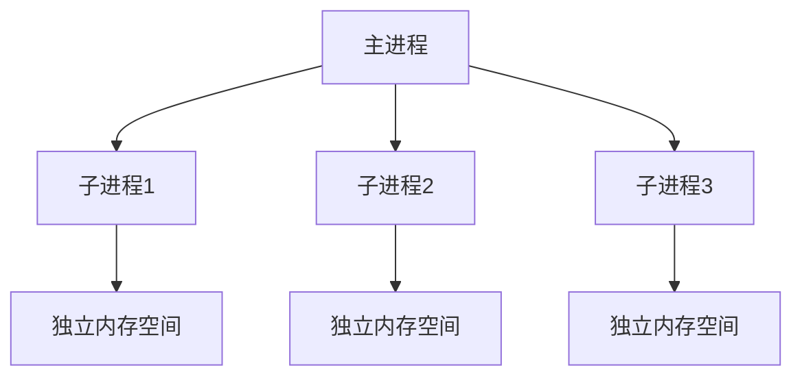
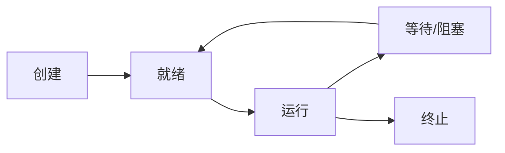

# Python 进程

## 什么是进程

在计算机科学中，进程是计算机中正在运行的程序的实例。每个进程都有自己的内存空间，包含了程序的代码、数据和系统资源。Python提供了强大的多进程支持，允许程序员利用多核处理器的能力来并行执行任务。

:::note
Python中的多进程编程主要通过`multiprocessing`模块实现，该模块是Python标准库的一部分，无需额外安装。
:::



## 为什么需要多进程

在Python中，由于全局解释器锁(GIL)的存在，使得Python的多线程在CPU密集型任务上无法实现真正的并行。而多进程可以绕过这个限制，因为每个进程都有自己独立的Python解释器和内存空间，不受GIL的影响。

多进程的主要优势：

1. **真正的并行执行**：可以利用多核CPU进行计算
2. **内存隔离**：每个进程有独立的内存空间，更安全
3. **稳定性**：一个进程崩溃不会影响其他进程

## 基础：创建进程

### 使用Process类

最基本的创建进程方法是使用`multiprocessing.Process`类：

```python
import multiprocessing
import os

def worker():
    print(f"工作进程ID: {os.getpid()}")
    print(f"父进程ID: {os.getppid()}")

if __name__ == "__main__":
    print(f"主进程ID: {os.getpid()}")
    
    # 创建进程
    p = multiprocessing.Process(target=worker)
    
    # 启动进程
    p.start()
    
    # 等待进程结束
    p.join()
    
    print("所有进程已完成")
```

输出示例：
```
主进程ID: 12345
工作进程ID: 12346
父进程ID: 12345
所有进程已完成
```

### 向进程函数传递参数

你可以通过`args`或`kwargs`参数向进程函数传递参数：

```python
import multiprocessing
import time

def worker(name, seconds):
    print(f"{name} 开始工作")
    time.sleep(seconds)
    print(f"{name} 工作完成")

if __name__ == "__main__":
    # 使用位置参数
    p1 = multiprocessing.Process(target=worker, args=('进程A', 2))
    
    # 使用关键字参数
    p2 = multiprocessing.Process(target=worker, kwargs={'name': '进程B', 'seconds': 3})
    
    p1.start()
    p2.start()
    
    p1.join()
    p2.join()
    
    print("所有进程已完成")
```

输出示例：
```
进程A 开始工作
进程B 开始工作
进程A 工作完成
进程B 工作完成
所有进程已完成
```

## 进程池

当需要管理大量进程时，手动创建和管理每个进程会变得复杂。Python的`multiprocessing.Pool`可以帮助你管理进程池。

```python
import multiprocessing
import time

def process_task(item):
    print(f"处理任务 {item}, 进程ID: {multiprocessing.current_process().pid}")
    time.sleep(1)  # 模拟耗时操作
    return item * 2

if __name__ == "__main__":
    # 创建含有3个进程的进程池
    with multiprocessing.Pool(processes=3) as pool:
        # 映射函数到多个输入值
        results = pool.map(process_task, [1, 2, 3, 4, 5, 6, 7, 8])
        print(f"处理结果: {results}")
```

输出示例：
```
处理任务 1, 进程ID: 12346
处理任务 2, 进程ID: 12347
处理任务 3, 进程ID: 12348
处理任务 4, 进程ID: 12346
处理任务 5, 进程ID: 12347
处理任务 6, 进程ID: 12348
处理任务 7, 进程ID: 12346
处理任务 8, 进程ID: 12347
处理结果: [2, 4, 6, 8, 10, 12, 14, 16]
```

### 异步进程池方法

进程池还提供了几种异步执行任务的方法：

- `apply_async()`：异步应用函数到参数
- `map_async()`：异步映射函数到多个参数
- `starmap_async()`：类似于`map_async()`，但可以接受多个参数

```python
import multiprocessing
import time

def long_task(name):
    print(f"任务 {name} 开始")
    time.sleep(2)
    return f"任务 {name} 结果"

if __name__ == "__main__":
    with multiprocessing.Pool(processes=2) as pool:
        # 异步执行任务
        result1 = pool.apply_async(long_task, args=('A',))
        result2 = pool.apply_async(long_task, args=('B',))
        
        print("任务已提交，继续执行主进程代码")
        
        # 获取结果（会等待任务完成）
        print(result1.get())
        print(result2.get())
```

输出示例：
```
任务 A 开始
任务 B 开始
任务已提交，继续执行主进程代码
任务 A 结果
任务 B 结果
```

## 进程间通信

由于每个进程有独立的内存空间，进程间不能像线程那样直接共享变量，需要使用专门的IPC（进程间通信）机制。

### 使用Queue进行通信

Queue是一个进程安全的队列，可用于在进程间传递消息：

```python
import multiprocessing

def producer(queue):
    for i in range(5):
        print(f"生产者放入：{i}")
        queue.put(i)
    # 放入结束标志
    queue.put(None)

def consumer(queue):
    while True:
        item = queue.get()
        if item is None:
            break
        print(f"消费者获取：{item}")

if __name__ == "__main__":
    # 创建进程间共享的队列
    queue = multiprocessing.Queue()
    
    # 创建生产者和消费者进程
    prod_proc = multiprocessing.Process(target=producer, args=(queue,))
    cons_proc = multiprocessing.Process(target=consumer, args=(queue,))
    
    # 启动进程
    prod_proc.start()
    cons_proc.start()
    
    # 等待进程结束
    prod_proc.join()
    cons_proc.join()
```

输出示例：
```
生产者放入：0
生产者放入：1
生产者放入：2
生产者放入：3
生产者放入：4
消费者获取：0
消费者获取：1
消费者获取：2
消费者获取：3
消费者获取：4
```

### 使用Pipe进行通信

Pipe提供了一种双向通信通道：

```python
import multiprocessing

def sender(conn):
    conn.send("你好，接收者!")
    response = conn.recv()
    print(f"发送者收到回复: {response}")
    conn.close()

def receiver(conn):
    msg = conn.recv()
    print(f"接收者收到消息: {msg}")
    conn.send("收到消息了!")
    conn.close()

if __name__ == "__main__":
    # 创建管道
    parent_conn, child_conn = multiprocessing.Pipe()
    
    # 创建进程
    p1 = multiprocessing.Process(target=sender, args=(parent_conn,))
    p2 = multiprocessing.Process(target=receiver, args=(child_conn,))
    
    # 启动进程
    p1.start()
    p2.start()
    
    # 等待进程结束
    p1.join()
    p2.join()
```

输出示例：
```
接收者收到消息: 你好，接收者!
发送者收到回复: 收到消息了!
```

### 共享内存

对于需要在进程间共享的数据，可以使用共享内存对象：

```python
import multiprocessing
import time

def increment(value, lock):
    for _ in range(10):
        # 获取锁
        lock.acquire()
        try:
            # 修改共享值
            value.value += 1
        finally:
            # 释放锁
            lock.release()
        time.sleep(0.1)

if __name__ == "__main__":
    # 创建共享内存值
    shared_value = multiprocessing.Value('i', 0)
    # 创建锁以保证操作的原子性
    lock = multiprocessing.Lock()
    
    # 创建多个进程同时操作共享值
    processes = [
        multiprocessing.Process(target=increment, args=(shared_value, lock))
        for _ in range(4)
    ]
    
    # 启动所有进程
    for p in processes:
        p.start()
    
    # 等待所有进程结束
    for p in processes:
        p.join()
    
    print(f"最终值: {shared_value.value}")
```

输出示例：
```
最终值: 40
```

## 进程的生命周期和管理

进程有几种不同的状态，需要了解如何正确管理：

### 进程的状态



### 检查进程状态和终止进程

```python
import multiprocessing
import time
import os
import signal

def worker():
    print(f"工作进程 {os.getpid()} 启动")
    try:
        while True:
            time.sleep(0.5)
    except KeyboardInterrupt:
        pass
    finally:
        print(f"工作进程 {os.getpid()} 退出")

if __name__ == "__main__":
    p = multiprocessing.Process(target=worker)
    
    # 启动进程
    p.start()
    print(f"进程是否活动: {p.is_alive()}")
    
    # 等待一段时间
    time.sleep(2)
    
    # 终止进程
    p.terminate()
    print("已经发送终止信号")
    
    # 等待进程真正结束
    time.sleep(0.5)
    print(f"进程是否存活: {p.is_alive()}")
    
    # 确保进程完全终止
    p.join()
    
    # 检查进程结束状态
    print(f"进程退出代码: {p.exitcode}")
```

输出示例：
```
工作进程 12346 启动
进程是否活动: True
已经发送终止信号
进程是否存活: False
进程退出代码: -15
```

## 守护进程

守护进程是在后台运行的进程，当主进程结束时，所有守护进程也会自动终止。

```python
import multiprocessing
import time

def daemon_worker():
    print("守护进程开始")
    while True:
        print("守护进程工作中...")
        time.sleep(1)

def non_daemon_worker():
    print("普通进程开始")
    time.sleep(3)
    print("普通进程结束")

if __name__ == "__main__":
    # 创建守护进程
    daemon = multiprocessing.Process(target=daemon_worker, daemon=True)
    
    # 创建普通进程
    non_daemon = multiprocessing.Process(target=non_daemon_worker)
    
    daemon.start()
    non_daemon.start()
    
    # 等待普通进程完成
    non_daemon.join()
    
    print("主进程结束，守护进程将自动终止")
```

输出示例：
```
守护进程开始
守护进程工作中...
普通进程开始
守护进程工作中...
守护进程工作中...
普通进程结束
主进程结束，守护进程将自动终止
```

## 实际应用案例

### 图像处理

多进程非常适合处理CPU密集型任务，如图像处理：

```python
from multiprocessing import Pool
from PIL import Image, ImageFilter
import os
import time

def process_image(image_path):
    """对图像应用高斯模糊滤镜"""
    img = Image.open(image_path)
    img = img.filter(ImageFilter.GaussianBlur(radius=10))
    
    # 创建输出文件名
    base_name = os.path.basename(image_path)
    save_path = f"blurred_{base_name}"
    
    # 保存处理后的图像
    img.save(save_path)
    return save_path

def sequential_processing(image_paths):
    """顺序处理图像"""
    start_time = time.time()
    for path in image_paths:
        process_image(path)
    return time.time() - start_time

def parallel_processing(image_paths, num_processes):
    """并行处理图像"""
    start_time = time.time()
    with Pool(processes=num_processes) as pool:
        pool.map(process_image, image_paths)
    return time.time() - start_time

if __name__ == "__main__":
    # 这里需要替换为实际的图像路径列表
    images = ["image1.jpg", "image2.jpg", "image3.jpg", "image4.jpg"]
    
    print("顺序处理...")
    sequential_time = sequential_processing(images)
    print(f"顺序处理耗时: {sequential_time:.2f}秒")
    
    print("\n并行处理...")
    parallel_time = parallel_processing(images, 4)
    print(f"并行处理耗时: {parallel_time:.2f}秒")
    
    print(f"\n加速比: {sequential_time / parallel_time:.2f}x")
```

### 网络爬虫

多进程也可以用于网络爬虫，同时爬取多个页面：

```python
import multiprocessing
import requests
import time
from bs4 import BeautifulSoup
from urllib.parse import urljoin

def fetch_url(url):
    """获取网页内容并提取标题"""
    try:
        response = requests.get(url, timeout=10)
        soup = BeautifulSoup(response.text, 'html.parser')
        title = soup.title.string if soup.title else "No title"
        return {"url": url, "title": title, "status": response.status_code}
    except Exception as e:
        return {"url": url, "error": str(e)}

def crawl_parallel(urls, num_processes=4):
    """并行爬取多个URL"""
    with multiprocessing.Pool(processes=num_processes) as pool:
        results = pool.map(fetch_url, urls)
    return results

if __name__ == "__main__":
    # 示例URL列表
    urls_to_crawl = [
        "https://www.python.org",
        "https://docs.python.org",
        "https://pypi.org",
        "https://www.djangoproject.com",
        "https://flask.palletsprojects.com",
        "https://pandas.pydata.org",
        "https://numpy.org",
        "https://matplotlib.org"
    ]
    
    start_time = time.time()
    results = crawl_parallel(urls_to_crawl)
    end_time = time.time()
    
    print(f"爬取 {len(urls_to_crawl)} 个URL用时: {end_time - start_time:.2f}秒")
    
    # 显示结果
    for result in results:
        if "error" in result:
            print(f"{result['url']} - 错误: {result['error']}")
        else:
            print(f"{result['url']} - {result['status']} - {result['title'][:50]}...")
```

## 总结

本文介绍了Python中的多进程编程：

1. **基础知识**：了解了什么是进程以及为什么需要多进程
2. **创建和管理进程**：学习了如何使用`Process`类创建进程
3. **进程池**：掌握了使用进程池高效管理大量进程
4. **进程间通信**：学习了使用Queue、Pipe和共享内存在进程间通信
5. **进程生命周期**：了解了如何管理进程状态和守护进程
6. **实际应用**：探索了多进程在图像处理和网络爬虫中的应用

Python的多进程编程为处理CPU密集型任务提供了强大的工具，可以有效利用现代多核处理器的计算能力。与多线程相比，多进程可以避开GIL的限制，实现真正的并行计算。

:::tip
在开发多进程应用时，请记住在Windows上`multiprocessing`模块的代码应该始终放在`if __name__ == "__main__":`块中，以避免意外的递归进程创建。
:::

## 练习

1. 创建一个包含10个进程的进程池，并使用它来计算1到100万之间所有质数的数量。
2. 实现一个生产者-消费者模型，使用多个生产者进程生成数据，多个消费者进程处理数据。
3. 使用多进程和共享内存对象计算一个大数组中的元素总和。
4. 创建一个简单的多进程文件搜索工具，可以并行搜索多个目录中的文件。

## 延伸阅读

- [Python官方文档：multiprocessing](https://docs.python.org/zh-cn/3/library/multiprocessing.html)
- [Python并发编程：实用指南](https://realpython.com/python-concurrency/)
- [深入理解计算机系统](https://book.douban.com/subject/26912767/)中关于进程的章节