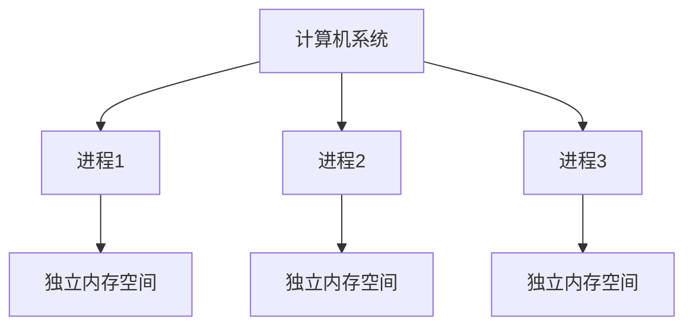

# Python 多进程

## 引言

在计算机程序中，处理大量数据或执行复杂计算时，程序运行速度可能会变慢。Python作为一种解释型语言，受到全局解释器锁(GIL)的限制，使得多线程在CPU密集型任务上难以充分利用多核心处理器的优势。这时，**多进程编程**就成为了一个强大的解决方案。

本教程将全面介绍Python中的多进程编程，从基本概念到实际应用，帮助你学习如何利用计算机的多个核心来加速程序执行。

## 什么是进程？

在深入了解多进程编程之前，我们需要理解什么是进程：

:::info
**进程(Process)**是计算机中的程序执行实例，包含代码和当前活动。每个进程拥有独立的内存空间，一个进程无法直接访问另一个进程的变量和数据结构。
:::

与线程不同，进程之间是相互隔离的，这意味着一个进程的崩溃通常不会影响其他进程。



## Python 中的`multiprocessing`模块

Python的标准库提供了`multiprocessing`模块，它允许我们创建和管理进程。这个模块提供了类似于`threading`模块的接口，使得从多线程转换到多进程变得简单。

### 创建进程的基本方法

在Python中创建进程的最简单方法是使用`Process`类：

```python
from multiprocessing import Process

def worker_function():
    print("Worker process is running")

if __name__ == "__main__":
    # 创建一个进程
    process = Process(target=worker_function)
    
    # 启动进程
    process.start()
    
    # 等待进程完成
    process.join()
    
    print("Main process continues")
```

输出：
```
Worker process is running
Main process continues
```

:::caution
在Windows系统中，多进程代码必须放在`if __name__ == "__main__":`条件下执行，否则会导致递归创建进程的问题。
:::

## 进程之间的数据共享

由于进程间内存隔离，不同进程之间无法直接共享数据。`multiprocessing`模块提供了几种方式来实现进程间通信：

### 1. 使用Queue进行数据交换

```python
from multiprocessing import Process, Queue
import time

def producer(q):
    """生产者进程将数据放入队列"""
    for i in range(5):
        q.put(f"Item {i}")
        print(f"Producer put: Item {i}")
        time.sleep(0.5)

def consumer(q):
    """消费者进程从队列获取数据"""
    while True:
        if not q.empty():
            item = q.get()
            print(f"Consumer got: {item}")
            if item == "Item 4":  # 收到最后一个项目后退出
                break
        time.sleep(0.5)

if __name__ == "__main__":
    # 创建一个队列
    q = Queue()
    
    # 创建生产者和消费者进程
    p1 = Process(target=producer, args=(q,))
    p2 = Process(target=consumer, args=(q,))
    
    # 启动进程
    p1.start()
    p2.start()
    
    # 等待进程完成
    p1.join()
    p2.join()
    
    print("All processes finished")
```

输出：
```
Producer put: Item 0
Consumer got: Item 0
Producer put: Item 1
Consumer got: Item 1
Producer put: Item 2
Consumer got: Item 2
Producer put: Item 3
Consumer got: Item 3
Producer put: Item 4
Consumer got: Item 4
All processes finished
```

### 2. 使用Pipe进行双向通信

```python
from multiprocessing import Process, Pipe

def send_data(conn):
    """发送数据的进程"""
    conn.send("Hello from sender process")
    conn.close()

def receive_data(conn):
    """接收数据的进程"""
    msg = conn.recv()
    print(f"Received: {msg}")
    conn.close()

if __name__ == "__main__":
    # 创建管道
    parent_conn, child_conn = Pipe()
    
    # 创建进程
    p1 = Process(target=send_data, args=(child_conn,))
    p2 = Process(target=receive_data, args=(parent_conn,))
    
    # 启动进程
    p1.start()
    p2.start()
    
    # 等待进程完成
    p1.join()
    p2.join()
```

输出：
```
Received: Hello from sender process
```

### 3. 使用Manager共享数据

```python
from multiprocessing import Process, Manager

def modify_shared_dict(shared_dict):
    """修改共享字典的进程"""
    shared_dict['key'] = 'value'
    shared_dict['list'].append(1)

if __name__ == "__main__":
    # 创建管理器
    with Manager() as manager:
        # 创建共享字典
        shared_dict = manager.dict()
        shared_dict['list'] = manager.list()
        
        # 创建进程
        p = Process(target=modify_shared_dict, args=(shared_dict,))
        p.start()
        p.join()
        
        # 查看共享字典内容
        print(f"Shared dictionary: {dict(shared_dict)}")
        print(f"Shared list: {list(shared_dict['list'])}")
```

输出：
```
Shared dictionary: {'key': 'value', 'list': [1]}
Shared list: [1]
```

## 进程池

当需要执行大量相似任务时，创建大量进程会消耗系统资源。`multiprocessing`模块提供了`Pool`类来管理固定数量的工作进程池：

```python
from multiprocessing import Pool
import time

def worker(x):
    """计算立方的函数"""
    time.sleep(1)  # 模拟耗时操作
    return x ** 3

if __name__ == "__main__":
    # 创建包含4个进程的进程池
    with Pool(processes=4) as pool:
        # 映射函数到参数列表
        results = pool.map(worker, range(8))
        
    print(f"Results: {results}")
```

输出：
```
Results: [0, 1, 8, 27, 64, 125, 216, 343]
```

### 异步处理任务

`Pool`还提供了异步执行任务的功能：

```python
from multiprocessing import Pool
import time

def worker(x):
    """耗时计算函数"""
    print(f"Processing {x}...")
    time.sleep(2)
    return x * x

if __name__ == "__main__":
    start_time = time.time()
    
    with Pool(processes=4) as pool:
        # 异步执行任务
        results = []
        for i in range(8):
            results.append(pool.apply_async(worker, (i,)))
        
        # 收集结果
        output = [res.get() for res in results]
    
    end_time = time.time()
    print(f"Results: {output}")
    print(f"Time taken: {end_time - start_time:.2f} seconds")
```

输出：
```
Processing 0...
Processing 1...
Processing 2...
Processing 3...
Processing 4...
Processing 5...
Processing 6...
Processing 7...
Results: [0, 1, 4, 9, 16, 25, 36, 49]
Time taken: 4.03 seconds
```

## 实际应用案例：图像处理

下面是一个使用多进程加速图像处理的实例，我们将处理多张图片并应用简单的灰度转换：

```python
from multiprocessing import Pool
import time
from PIL import Image
import os

def convert_to_grayscale(image_path):
    """将图像转换为灰度"""
    try:
        with Image.open(image_path) as img:
            # 转换为灰度
            gray_img = img.convert('L')
            
            # 创建输出路径
            output_path = os.path.join(
                "output",
                os.path.basename(image_path).split('.')[0] + "_gray.jpg"
            )
            
            # 保存灰度图像
            gray_img.save(output_path)
            
            return f"Processed: {os.path.basename(image_path)}"
    except Exception as e:
        return f"Error processing {os.path.basename(image_path)}: {str(e)}"

def process_images_parallel(image_paths, num_processes=4):
    """并行处理多张图片"""
    # 确保输出目录存在
    os.makedirs("output", exist_ok=True)
    
    start_time = time.time()
    
    with Pool(processes=num_processes) as pool:
        results = pool.map(convert_to_grayscale, image_paths)
    
    end_time = time.time()
    
    for result in results:
        print(result)
    
    print(f"Time taken with {num_processes} processes: {end_time - start_time:.2f} seconds")

if __name__ == "__main__":
    # 获取所有图片路径（假设在images文件夹中）
    image_folder = "images"
    if not os.path.exists(image_folder):
        print(f"Image folder '{image_folder}' not found.")
    else:
        image_paths = [
            os.path.join(image_folder, filename) 
            for filename in os.listdir(image_folder) 
            if filename.endswith(('.jpg', '.png', '.jpeg'))
        ]
        
        if image_paths:
            process_images_parallel(image_paths)
        else:
            print("No images found in the specified folder.")
```

:::note
要运行此示例，你需要创建一个"images"文件夹并放入几张图片。此代码会将图片转为灰度并保存到"output"文件夹中。
:::

## 多进程的优缺点

### 优点

1. **绕过GIL限制**：多进程不受Python全局解释器锁的限制，可以真正实现并行计算。
2. **更好的稳定性**：一个进程崩溃通常不会影响其他进程。
3. **充分利用多核CPU**：可以充分发挥现代多核处理器的优势。

### 缺点

1. **资源开销大**：创建进程比创建线程消耗更多的系统资源。
2. **进程间通信复杂**：进程之间共享数据需要特殊的机制。
3. **启动慢**：进程的创建和销毁比线程要慢。

## 何时使用多进程

多进程适合以下场景：

1. **CPU密集型任务**：如数值计算、图像处理、机器学习算法等。
2. **需要绕过GIL的Python程序**：当您需要真正并行执行Python代码时。
3. **需要隔离的任务**：当任务需要更好的隔离性和容错性时。

## 总结

Python的`multiprocessing`模块提供了强大的多进程编程能力，使我们能够充分利用现代多核处理器。通过本教程，你已经学习了：

- 进程的基本概念
- 如何创建和管理进程
- 进程间通信的不同方法
- 使用进程池高效处理任务
- 多进程在实际应用中的使用

多进程编程是Python并发编程的重要组成部分，特别适合CPU密集型任务。合理使用多进程可以显著提高程序性能，充分发挥计算机硬件的潜力。

## 练习

1. 创建一个多进程程序，计算1到1000000的素数。
2. 实现一个并行文件处理程序，统计多个文本文件中的单词数。
3. 使用`Pool`类实现矩阵乘法的并行计算。
4. 编写一个多进程爬虫，同时爬取多个网页的内容。

## 进一步阅读

- Python官方文档中的[multiprocessing模块](https://docs.python.org/3/library/multiprocessing.html)
- 了解操作系统中的进程概念
- 学习进程与线程的区别和适用场景
- 探索更复杂的进程通信和同步机制

通过多进程编程，你可以充分释放Python在高性能计算方面的潜力，克服GIL的限制，实现真正的并行计算。