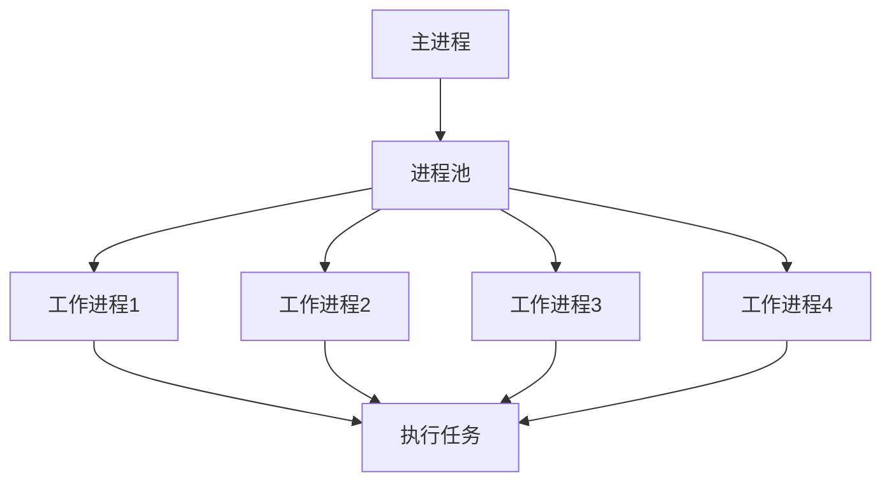

# Python 进程池

## 什么是进程池？

进程池（Process Pool）是一种并行计算的设计模式，它预先创建一组工作进程，然后将任务分配给这些进程来执行。进程池可以有效地管理系统资源，避免频繁创建和销毁进程的开销，同时可以控制并发执行的进程数量。

在Python中，`multiprocessing`模块提供了`Pool`类，使我们能够轻松地创建和管理进程池。



## 为什么需要进程池？

使用进程池有以下几个优势：

1. **资源管理**：限制并发进程数量，防止系统资源耗尽
2. **性能优化**：避免频繁创建和销毁进程的开销
3. **任务分配**：自动将工作分配给可用的进程
4. **结果收集**：提供便捷的方式收集多个进程的执行结果

:::tip 进程 vs 线程
Python的多线程受到全局解释器锁(GIL)的限制，不能实现真正的并行计算。而多进程可以绕过GIL，在多核CPU上实现真正的并行执行。
:::

## 基本使用方法

### 创建进程池

使用`multiprocessing.Pool`创建进程池非常简单：

```python
from multiprocessing import Pool

# 创建包含4个工作进程的进程池
pool = Pool(processes=4)
```

如果不指定`processes`参数，默认会使用CPU核心数作为进程数。

### 常用方法

进程池提供了几种将任务提交给工作进程的方法：

1. `apply()`: 同步执行单个任务
2. `apply_async()`: 异步执行单个任务
3. `map()`: 同步执行多个任务，并按顺序返回结果
4. `map_async()`: 异步执行多个任务
5. `starmap()`: 类似于`map()`，但可以处理有多个参数的函数
6. `starmap_async()`: `starmap()`的异步版本

## 同步与异步执行

### 同步执行(apply)

```python
from multiprocessing import Pool
import time

def square(x):
    time.sleep(1)  # 模拟耗时操作
    return x * x

if __name__ == "__main__":
    pool = Pool(processes=4)
    
    start_time = time.time()
    
    # 同步执行，会等待每个任务完成后再继续
    results = [pool.apply(square, args=(i,)) for i in range(10)]
    
    end_time = time.time()
    print(f"Results: {results}")
    print(f"Time taken: {end_time - start_time:.2f} seconds")
```

输出:
```
Results: [0, 1, 4, 9, 16, 25, 36, 49, 64, 81]
Time taken: 10.05 seconds
```

使用`apply()`时，每个任务会依次执行，等待前一个任务完成后才会开始下一个，因此没有实现真正的并行。

### 异步执行(apply_async)

```python
from multiprocessing import Pool
import time

def square(x):
    time.sleep(1)  # 模拟耗时操作
    return x * x

if __name__ == "__main__":
    pool = Pool(processes=4)
    
    start_time = time.time()
    
    # 异步执行，立即返回结果对象
    result_objects = [pool.apply_async(square, args=(i,)) for i in range(10)]
    
    # 获取实际结果（会等待所有任务完成）
    results = [r.get() for r in result_objects]
    
    end_time = time.time()
    print(f"Results: {results}")
    print(f"Time taken: {end_time - start_time:.2f} seconds")
    
    # 关闭进程池
    pool.close()
    pool.join()
```

输出:
```
Results: [0, 1, 4, 9, 16, 25, 36, 49, 64, 81]
Time taken: 3.03 seconds
```

使用`apply_async()`时，任务会被提交到进程池并立即返回，然后我们调用`.get()`来获取结果。由于有4个进程并行工作，10个任务大约需要3秒完成（10÷4，向上取整，乘以每个任务1秒）。

### 使用map方法

`map()`是一种更简洁的方式来并行执行相同函数的多个任务：

```python
from multiprocessing import Pool
import time

def square(x):
    time.sleep(1)  # 模拟耗时操作
    return x * x

if __name__ == "__main__":
    pool = Pool(processes=4)
    
    start_time = time.time()
    
    # 使用map并行执行任务
    results = pool.map(square, range(10))
    
    end_time = time.time()
    print(f"Results: {results}")
    print(f"Time taken: {end_time - start_time:.2f} seconds")
    
    # 关闭进程池
    pool.close()
    pool.join()
```

输出:
```
Results: [0, 1, 4, 9, 16, 25, 36, 49, 64, 81]
Time taken: 3.02 seconds
```

`map()`方法会自动等待所有任务完成并返回结果列表，顺序与输入列表相同。

## 关闭进程池

进程池使用完毕后，应该正确关闭：

```python
# 通知进程池不再接受新任务
pool.close()

# 等待所有工作进程完成
pool.join()
```

如果需要立即终止所有工作进程，可以使用：

```python
pool.terminate()
```

:::caution
使用`terminate()`会立即终止工作进程，可能导致数据丢失或损坏。只应在必要时使用。
:::

## 使用上下文管理器

更好的做法是使用Python的上下文管理器（`with`语句）来自动管理进程池的生命周期：

```python
from multiprocessing import Pool

def square(x):
    return x * x

if __name__ == "__main__":
    with Pool(processes=4) as pool:
        results = pool.map(square, range(10))
        print(results)
    # 退出with块时会自动调用pool.close()和pool.join()
```

## 传递多个参数

如果你的函数接受多个参数，可以使用`starmap()`方法：

```python
from multiprocessing import Pool

def multiply(x, y):
    return x * y

if __name__ == "__main__":
    with Pool(processes=4) as pool:
        inputs = [(1, 2), (2, 3), (3, 4), (4, 5)]
        results = pool.starmap(multiply, inputs)
        print(results)  # [2, 6, 12, 20]
```

## 错误处理

进程池中的任务可能会抛出异常。使用`apply_async()`时，异常会在调用`get()`方法时被重新抛出：

```python
from multiprocessing import Pool

def risky_function(x):
    if x == 0:
        raise ValueError("Cannot process zero!")
    return 10 / x

if __name__ == "__main__":
    with Pool(processes=2) as pool:
        results = [pool.apply_async(risky_function, (i,)) for i in range(5)]
        
        # 安全获取结果
        for i, result in enumerate(results):
            try:
                value = result.get()
                print(f"Task {i} result: {value}")
            except Exception as e:
                print(f"Task {i} failed: {e}")
```

输出:
```
Task 0 failed: Cannot process zero!
Task 1 result: 10.0
Task 2 result: 5.0
Task 3 result: 3.3333333333333335
Task 4 result: 2.5
```

## 超时处理

你可以在调用`get()`方法时设置超时，以避免长时间等待某个任务：

```python
from multiprocessing import Pool
import time

def slow_function(seconds):
    time.sleep(seconds)
    return f"Slept for {seconds} seconds"

if __name__ == "__main__":
    with Pool(processes=2) as pool:
        result = pool.apply_async(slow_function, (10,))
        
        try:
            # 如果3秒内没有完成，会抛出TimeoutError
            value = result.get(timeout=3)
            print(value)
        except TimeoutError:
            print("Task took too long to complete!")
```

输出:
```
Task took too long to complete!
```

## 实际应用案例

### 案例1: 并行图像处理

假设我们需要处理大量图像，可以使用进程池来并行执行这些操作：

```python
from multiprocessing import Pool
from PIL import Image, ImageFilter
import os

def process_image(image_path):
    try:
        img = Image.open(image_path)
        
        # 应用模糊滤镜
        blurred_img = img.filter(ImageFilter.GaussianBlur(radius=5))
        
        # 保存处理后的图像
        output_path = image_path.replace('.jpg', '_blurred.jpg')
        blurred_img.save(output_path)
        
        return f"Processed {image_path}"
    except Exception as e:
        return f"Error processing {image_path}: {str(e)}"

if __name__ == "__main__":
    # 获取所有jpg图像文件
    image_files = [f for f in os.listdir('images') if f.endswith('.jpg')]
    image_paths = [os.path.join('images', f) for f in image_files]
    
    # 使用进程池并行处理图像
    with Pool() as pool:
        results = pool.map(process_image, image_paths)
    
    for result in results:
        print(result)
```

### 案例2: 网页爬取

使用进程池可以并行爬取多个网页，提高效率：

```python
from multiprocessing import Pool
import requests
from bs4 import BeautifulSoup
import time

def fetch_url(url):
    try:
        response = requests.get(url, timeout=10)
        if response.status_code == 200:
            soup = BeautifulSoup(response.text, 'html.parser')
            title = soup.title.string if soup.title else "No title found"
            return f"URL: {url} - Title: {title}"
        else:
            return f"Failed to fetch {url}: Status code {response.status_code}"
    except Exception as e:
        return f"Error fetching {url}: {str(e)}"

if __name__ == "__main__":
    urls = [
        "https://www.python.org",
        "https://www.google.com",
        "https://www.github.com",
        "https://www.stackoverflow.com",
        "https://www.wikipedia.org"
    ]
    
    start_time = time.time()
    
    # 串行执行
    print("Sequential execution:")
    for url in urls:
        print(fetch_url(url))
    
    seq_time = time.time() - start_time
    print(f"Sequential time: {seq_time:.2f} seconds")
    
    # 并行执行
    start_time = time.time()
    print("\nParallel execution:")
    with Pool(processes=5) as pool:
        results = pool.map(fetch_url, urls)
        for result in results:
            print(result)
    
    par_time = time.time() - start_time
    print(f"Parallel time: {par_time:.2f} seconds")
    print(f"Speedup: {seq_time/par_time:.2f}x")
```

## 最佳实践

使用进程池时，请记住以下最佳实践：

1. **合理设置进程数量**：进程数通常不应超过CPU核心数，否则会导致性能下降。
2. **避免使用共享状态**：进程间通信比线程更复杂，尽量避免共享状态。
3. **任务粒度**：为了最大化效率，每个任务应该足够大以抵消进程创建和通信的开销。
4. **注意内存使用**：每个进程都有自己的内存空间，多进程可能会消耗大量内存。
5. **使用上下文管理器**：使用`with`语句可以确保进程池正确关闭。
6. **谨慎处理异常**：捕获并处理子进程中可能出现的异常。
7. **考虑使用`Pool.imap`或`Pool.imap_unordered`**：对于大量数据，这些方法可以以迭代方式处理结果，减少内存使用。

## 总结

Python的进程池（`multiprocessing.Pool`）提供了一种简单而强大的方式来实现并行计算，特别适合CPU密集型任务。通过分配任务给多个工作进程，可以充分利用多核CPU的优势，显著提高程序的执行效率。

本文介绍了进程池的基本概念、创建和使用方法，以及在实际应用中的示例。掌握这些知识将帮助你编写更高效的Python程序，特别是在需要处理大量数据或执行计算密集型任务时。

## 练习

1. 创建一个进程池来计算斐波那契数列中的前20个数字，比较串行计算和并行计算的时间差异。
2. 使用进程池并行处理一个目录中的所有文本文件，计算每个文件的单词数量。
3. 实现一个简单的网络端口扫描器，使用进程池并行检查多个端口是否开放。
4. 编写一个程序，使用进程池来并行计算大量随机数的统计信息（最小值、最大值、平均值、标准差等）。

## 更多资源

- [Python官方文档: multiprocessing.Pool](https://docs.python.org/3/library/multiprocessing.html#multiprocessing.pool.Pool)
- [Python并行编程: Pool vs Process](https://docs.python.org/3/library/multiprocessing.html#module-multiprocessing.pool)
- [Python进程池与线程池的比较](https://docs.python.org/3/library/concurrent.futures.html)