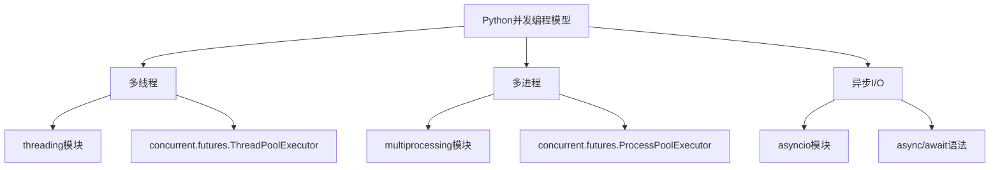

# Python 并发编程模型

在当今计算世界中，并发编程已经成为提高程序性能和响应能力的关键技术。Python作为一种流行的编程语言，提供了多种并发编程模型，帮助开发者解决复杂的计算问题和提升程序效率。

## 什么是并发编程？

并发编程指的是程序能够同时(看起来是同时)执行多个任务的能力。这与传统的顺序编程形成鲜明对比，顺序编程中任务是一个接一个执行的。

:::note
并发（Concurrency）与并行（Parallelism）是两个相关但不同的概念：
- **并发**：程序的不同部分可以"同时"（交替）执行，但不一定真的同时运行
- **并行**：程序的不同部分真正同时在不同处理器上执行
:::

## Python 中的并发编程模型

Python主要支持三种并发编程模型：



让我们详细探讨这三种模型。

## 1. 多线程（Threading）

多线程是实现并发的传统方式，允许在同一个程序中同时运行多个操作。

### 基本概念

**线程**是程序执行中的最小单元。一个进程可以包含多个线程，它们共享进程的资源（如内存空间）。

### Python 中的多线程实现

Python的标准库提供了`threading`模块来创建和管理线程。

```python
import threading
import time

def worker(name):
    print(f"线程 {name} 开始")
    time.sleep(2)  # 模拟耗时操作
    print(f"线程 {name} 结束")

# 创建5个线程
threads = []
for i in range(5):
    t = threading.Thread(target=worker, args=(f"线程-{i}",))
    threads.append(t)
    t.start()

# 等待所有线程完成
for t in threads:
    t.join()

print("所有线程已完成")
```

**输出**:
```
线程 线程-0 开始
线程 线程-1 开始
线程 线程-2 开始
线程 线程-3 开始
线程 线程-4 开始
线程 线程-0 结束
线程 线程-1 结束
线程 线程-2 结束
线程 线程-3 结束
线程 线程-4 结束
所有线程已完成
```

### Python 中的GIL（全局解释器锁）

在讨论Python多线程时，不得不提到GIL（Global Interpreter Lock，全局解释器锁）。

:::caution
由于GIL的存在，Python的多线程在**CPU密集型**任务上并不能实现真正的并行执行，但在**I/O密集型**任务（如网络请求、文件操作等）上仍然非常有效。
:::

### 使用concurrent.futures简化多线程编程

Python 3.2引入的`concurrent.futures`模块提供了更高级的接口用于异步执行可调用对象。

```python
from concurrent.futures import ThreadPoolExecutor
import time

def task(n):
    print(f"处理任务 {n}")
    time.sleep(1)
    return n * n

# 使用线程池执行器
with ThreadPoolExecutor(max_workers=3) as executor:
    results = executor.map(task, range(5))
    
    for result in results:
        print(f"结果: {result}")
```

**输出**:
```
处理任务 0
处理任务 1
处理任务 2
处理任务 3
处理任务 4
结果: 0
结果: 1
结果: 4
结果: 9
结果: 16
```

## 2. 多进程（Multiprocessing）

为了绕过GIL的限制，Python提供了`multiprocessing`模块，允许使用类似于`threading`模块的API来利用多个处理器。

### 基本概念

**进程**是计算机中正在执行的程序的实例，每个进程都有自己的内存空间、文件句柄和系统资源。

### Python 中的多进程实现

```python
from multiprocessing import Process
import os
import time

def worker(name):
    print(f"进程 {name} 开始，PID: {os.getpid()}")
    time.sleep(2)  # 模拟耗时操作
    print(f"进程 {name} 结束，PID: {os.getpid()}")

if __name__ == "__main__":
    print(f"主进程 PID: {os.getpid()}")
    
    # 创建3个进程
    processes = []
    for i in range(3):
        p = Process(target=worker, args=(f"进程-{i}",))
        processes.append(p)
        p.start()
    
    # 等待所有进程完成
    for p in processes:
        p.join()
    
    print("所有进程已完成")
```

**输出** (PID值会根据实际运行情况变化):
```
主进程 PID: 12345
进程 进程-0 开始，PID: 12346
进程 进程-1 开始，PID: 12347
进程 进程-2 开始，PID: 12348
进程 进程-0 结束，PID: 12346
进程 进程-1 结束，PID: 12347
进程 进程-2 结束，PID: 12348
所有进程已完成
```

### 使用进程池

多进程模块也提供了进程池的概念，可以更高效地管理多个进程：

```python
from multiprocessing import Pool
import time

def f(x):
    return x*x

if __name__ == "__main__":
    with Pool(processes=4) as pool:
        # 并行执行
        print(pool.map(f, range(10)))
        
        # 异步并行执行
        result = pool.apply_async(f, (10,))
        print(result.get(timeout=1))  # 打印 100
```

**输出**:
```
[0, 1, 4, 9, 16, 25, 36, 49, 64, 81]
100
```

### 进程间通信

由于每个进程都有自己的内存空间，因此需要特定的机制来实现进程间通信：

```python
from multiprocessing import Process, Queue
import time

def producer(q):
    for i in range(5):
        q.put(i)
        print(f"生产: {i}")
        time.sleep(1)

def consumer(q):
    while True:
        try:
            item = q.get(timeout=3)  # 设置超时避免无限等待
            print(f"消费: {item}")
        except:
            print("队列为空，消费者退出")
            break

if __name__ == "__main__":
    # 创建一个队列
    q = Queue()
    
    # 创建生产者和消费者进程
    p1 = Process(target=producer, args=(q,))
    p2 = Process(target=consumer, args=(q,))
    
    # 启动进程
    p1.start()
    p2.start()
    
    # 等待进程结束
    p1.join()
    p2.join()
```

**输出**:
```
生产: 0
消费: 0
生产: 1
消费: 1
生产: 2
消费: 2
生产: 3
消费: 3
生产: 4
消费: 4
队列为空，消费者退出
```

## 3. 异步IO（asyncio）

Python 3.4引入的`asyncio`模块提供了基于事件循环的异步编程模型，允许编写单线程的异步代码。

### 基本概念

**异步IO**允许在等待IO操作完成时执行其他代码，而不是阻塞线程，从而实现高效的并发。

### 协程和事件循环

Python的异步IO基于协程（coroutines）和事件循环：

```python
import asyncio

async def say_after(delay, what):
    await asyncio.sleep(delay)
    print(what)

async def main():
    print("开始")
    
    # 创建任务
    task1 = asyncio.create_task(say_after(1, "你好"))
    task2 = asyncio.create_task(say_after(2, "世界"))
    
    # 等待任务完成
    await task1
    await task2
    
    print("结束")

# Python 3.7+
asyncio.run(main())
```

**输出**:
```
开始
你好
世界
结束
```

### 使用async/await语法

Python 3.5引入的`async`和`await`关键字使异步编程更加直观：

```python
import asyncio
import time

async def fetch_data(id):
    print(f"开始获取数据 {id}")
    await asyncio.sleep(2)  # 模拟IO操作，比如网络请求
    print(f"数据 {id} 获取完成")
    return f"数据 {id}"

async def main():
    start = time.time()
    
    # 并发执行多个数据获取任务
    tasks = [fetch_data(i) for i in range(5)]
    results = await asyncio.gather(*tasks)
    
    print(f"所有数据: {results}")
    print(f"总耗时: {time.time() - start:.2f} 秒")

asyncio.run(main())
```

**输出**:
```
开始获取数据 0
开始获取数据 1
开始获取数据 2
开始获取数据 3
开始获取数据 4
数据 0 获取完成
数据 1 获取完成
数据 2 获取完成
数据 3 获取完成
数据 4 获取完成
所有数据: ['数据 0', '数据 1', '数据 2', '数据 3', '数据 4']
总耗时: 2.00 秒
```

### 实际应用：异步网络请求

异步IO在网络编程中尤为强大。这里是一个使用`aiohttp`库的例子：

```python
import asyncio
import aiohttp
import time

async def fetch_url(url):
    async with aiohttp.ClientSession() as session:
        async with session.get(url) as response:
            return await response.text()

async def main():
    urls = [
        "http://python.org",
        "http://pypi.org",
        "http://docs.python.org"
    ]
    
    start = time.time()
    
    tasks = [fetch_url(url) for url in urls]
    pages = await asyncio.gather(*tasks)
    
    for url, page in zip(urls, pages):
        print(f"{url}: 页面大小 {len(page)} 字节")
        
    print(f"总耗时: {time.time() - start:.2f} 秒")

# 需要安装 aiohttp: pip install aiohttp
# asyncio.run(main())  # 取消注释并运行
```

## 选择合适的并发模型

各种并发模型适用于不同的场景：

1. **多线程（Threading）**:
   - 适用于IO密集型任务（文件IO、网络IO等）
   - 编程模型相对简单
   - 受GIL限制，不适合CPU密集型任务

2. **多进程（Multiprocessing）**:
   - 适用于CPU密集型任务（计算、数据处理等）
   - 可以充分利用多核CPU
   - 进程创建和通信开销较大

3. **异步IO（asyncio）**:
   - 适用于高并发IO操作（网络服务器、爬虫等）
   - 单线程模型，避免了线程切换开销和锁问题
   - 要求代码使用异步风格编写，可能需要重构已有代码

## 实际应用案例：并发网络爬虫

以下是一个实际应用案例，展示了如何使用不同的并发模型来实现网络爬虫：

### 多线程爬虫

```python
import threading
import requests
import time
from queue import Queue

# 网页URL队列
url_queue = Queue()
# 添加一些URL
for i in range(10):
    url_queue.put(f"https://httpbin.org/delay/1")

def worker():
    while not url_queue.empty():
        url = url_queue.get()
        try:
            response = requests.get(url)
            print(f"线程 {threading.current_thread().name} 获取 {url} 状态码: {response.status_code}")
        except Exception as e:
            print(f"处理 {url} 时出错: {e}")
        finally:
            url_queue.task_done()

def main():
    start_time = time.time()
    
    # 创建5个工作线程
    threads = []
    for i in range(5):
        t = threading.Thread(target=worker, name=f"Thread-{i}")
        t.daemon = True
        threads.append(t)
        t.start()
    
    # 等待队列处理完毕
    url_queue.join()
    
    end_time = time.time()
    print(f"多线程版本总耗时: {end_time - start_time:.2f} 秒")

# 不运行，仅作示例
# main()
```

### 多进程爬虫

```python
from multiprocessing import Pool
import requests
import time

def fetch_url(url):
    try:
        response = requests.get(url)
        return url, response.status_code
    except Exception as e:
        return url, str(e)

def main():
    urls = [f"https://httpbin.org/delay/1" for _ in range(10)]
    start_time = time.time()
    
    # 使用进程池
    with Pool(processes=5) as pool:
        results = pool.map(fetch_url, urls)
    
    for url, status in results:
        print(f"获取 {url} 状态码: {status}")
    
    end_time = time.time()
    print(f"多进程版本总耗时: {end_time - start_time:.2f} 秒")

# 不运行，仅作示例
# if __name__ == "__main__":
#     main()
```

### 异步IO爬虫

```python
import asyncio
import aiohttp
import time

async def fetch_url(session, url):
    try:
        async with session.get(url) as response:
            return url, response.status
    except Exception as e:
        return url, str(e)

async def main():
    urls = [f"https://httpbin.org/delay/1" for _ in range(10)]
    start_time = time.time()
    
    async with aiohttp.ClientSession() as session:
        tasks = [fetch_url(session, url) for url in urls]
        results = await asyncio.gather(*tasks)
    
    for url, status in results:
        print(f"获取 {url} 状态码: {status}")
    
    end_time = time.time()
    print(f"异步IO版本总耗时: {end_time - start_time:.2f} 秒")

# 不运行，仅作示例
# asyncio.run(main())
```

:::tip
在实际测试中，三个版本的性能表现会有显著差异：
- 多线程版本：约2-3秒（受网络延迟影响）
- 多进程版本：约2-3秒（进程创建有一定开销）
- 异步IO版本：约1-1.5秒（通常是最快的，特别是任务数量增加时）
:::

## 总结

Python提供了三种主要的并发编程模型，每种都有其优缺点和适用场景：

1. **多线程（Threading）**：适合IO密集型任务，但受GIL限制。
2. **多进程（Multiprocessing）**：适合CPU密集型任务，可以充分利用多核CPU。
3. **异步IO（asyncio）**：适合高并发IO操作，单线程模型避免了多线程的复杂性。

选择合适的并发模型取决于你的具体需求和应用场景。对于初学者来说，从简单的多线程开始，然后逐步探索其他模型是一个不错的学习路径。

## 练习与资源

### 练习题

1. 使用多线程下载多个网页并统计每个网页的字符数。
2. 实现一个多进程版本的批量图片处理程序（如调整大小或应用滤镜）。
3. 使用asyncio创建一个简单的异步网络爬虫，从多个网站获取信息。

### 进一步学习的资源

- Python官方文档中的[threading](https://docs.python.org/3/library/threading.html)模块
- Python官方文档中的[multiprocessing](https://docs.python.org/3/library/multiprocessing.html)模块
- Python官方文档中的[asyncio](https://docs.python.org/3/library/asyncio.html)模块
- [《Python并行编程》](https://www.packtpub.com/product/python-parallel-programming-cookbook-second-edition/9781789533736)一书

通过掌握这些并发编程模型，你将能够开发出更高效、响应更快的Python应用程序，特别是在处理大规模数据、网络通信或CPU密集型任务时。