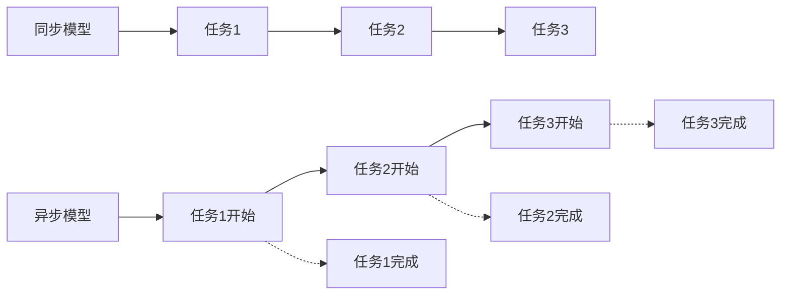

# Python 异步IO

## 什么是异步IO？

异步IO（Asynchronous I/O）是一种编程模型，允许程序在等待I/O操作（如网络请求、文件读写等）完成的同时继续执行其他任务，而不是被阻塞在这些操作上。在传统的同步编程中，当程序执行I/O操作时，它会暂停执行，直到操作完成。而在异步编程中，程序可以在发起I/O请求后立即继续执行其他代码，等I/O操作完成后再处理结果。



## 为什么需要异步IO？

在处理I/O密集型任务时，异步IO可以显著提高程序的效率。考虑以下场景：

1. 网络应用需要处理数千个并发连接
2. 需要从多个API获取数据
3. 读写大量文件

在这些场景中，使用同步IO会导致大量时间浪费在等待I/O操作上，而异步IO能够充分利用这些等待时间执行其他任务。

:::tip
异步IO特别适合I/O密集型任务，但对于CPU密集型任务，多进程可能是更好的选择。
:::

## Python 中的异步IO

Python提供了几种实现异步IO的方式，其中最现代且推荐使用的是`asyncio`库和`async/await`语法。

### asyncio基础

`asyncio`是Python的标准库，专门用于编写单线程的异步代码。它的核心概念包括：

- **事件循环(Event Loop)**: 管理和执行异步任务的中央调度器
- **协程(Coroutine)**: 可以暂停执行并稍后恢复的特殊函数
- **Future**: 表示异步操作最终结果的对象
- **Task**: 是Future的子类，用于包装和管理协程

### async/await语法

从Python 3.5开始，`async`和`await`关键字被引入，使异步编程变得更加直观：

- `async def`: 定义一个协程函数
- `await`: 等待一个协程或Future对象完成

## 基本示例

让我们从一个简单的例子开始：

```python
import asyncio

async def say_hello(delay, name):
    await asyncio.sleep(delay)  # 非阻塞的睡眠
    print(f"Hello, {name}!")

async def main():
    # 并发执行三个协程
    await asyncio.gather(
        say_hello(1, "Alice"),
        say_hello(2, "Bob"),
        say_hello(3, "Charlie")
    )

# 运行主协程
asyncio.run(main())
```

输出结果：
```
Hello, Alice!
Hello, Bob!
Hello, Charlie!
```

虽然每个`say_hello`函数都有延迟，但它们是并发执行的，总耗时约为3秒（最长的延迟时间），而不是6秒（所有延迟之和）。

## 理解协程

协程是异步编程的核心。它们类似于生成器，可以在执行过程中暂停并稍后恢复。

```python
import asyncio

async def my_coroutine():
    print("协程开始执行")
    await asyncio.sleep(1)  # 暂停协程，让出控制权
    print("协程恢复执行")
    return "完成"

async def main():
    result = await my_coroutine()
    print(f"协程返回结果: {result}")

asyncio.run(main())
```

输出结果：
```
协程开始执行
协程恢复执行
协程返回结果: 完成
```

### await关键字的作用

`await`关键字用于等待一个协程完成。当执行到`await`语句时：

1. 当前协程暂停执行
2. 控制权返回给事件循环
3. 事件循环可以调度其他任务
4. 当等待的操作完成后，当前协程恢复执行

## 使用asyncio创建并发任务

`asyncio.create_task()`函数可以创建一个Task对象，立即调度协程执行：

```python
import asyncio
import time

async def say_after(delay, what):
    await asyncio.sleep(delay)
    print(what)
    return delay

async def main():
    start = time.time()
    
    # 创建任务
    task1 = asyncio.create_task(say_after(1, '任务1'))
    task2 = asyncio.create_task(say_after(2, '任务2'))
    
    # 等待任务完成
    result1 = await task1
    result2 = await task2
    
    end = time.time()
    
    print(f"任务1返回: {result1}")
    print(f"任务2返回: {result2}")
    print(f"执行时间: {end - start:.2f} 秒")

asyncio.run(main())
```

输出结果：
```
任务1
任务2
任务1返回: 1
任务2返回: 2
执行时间: 2.00 秒
```

通过创建任务，我们实现了真正的并发执行。

## 处理多个协程

`asyncio.gather()`允许我们同时等待多个协程完成：

```python
import asyncio

async def fetch_data(id):
    print(f"开始获取数据 {id}")
    await asyncio.sleep(1)  # 模拟网络请求
    print(f"数据 {id} 获取完成")
    return f"数据 {id}"

async def main():
    # 并发执行多个协程
    results = await asyncio.gather(
        fetch_data(1),
        fetch_data(2),
        fetch_data(3)
    )
    
    print(f"所有结果: {results}")

asyncio.run(main())
```

输出结果：
```
开始获取数据 1
开始获取数据 2
开始获取数据 3
数据 1 获取完成
数据 2 获取完成
数据 3 获取完成
所有结果: ['数据 1', '数据 2', '数据 3']
```

## 实际应用案例：异步Web请求

以下是使用`aiohttp`库（一个异步HTTP客户端/服务器库）发送多个并发请求的示例：

```python
import asyncio
import aiohttp
import time

async def fetch_url(session, url):
    async with session.get(url) as response:
        return await response.text()

async def main():
    urls = [
        "http://python.org",
        "http://google.com",
        "http://github.com"
    ]
    
    start = time.time()
    
    async with aiohttp.ClientSession() as session:
        tasks = []
        for url in urls:
            tasks.append(fetch_url(session, url))
        
        results = await asyncio.gather(*tasks)
        
        for url, html in zip(urls, results):
            print(f"{url}: {len(html)} bytes")
    
    end = time.time()
    print(f"总耗时: {end - start:.2f} 秒")

asyncio.run(main())
```

这个示例展示了如何异步获取多个网站的内容，大大减少了总体执行时间。

:::caution
上述代码需要安装`aiohttp`库：`pip install aiohttp`
:::

## 异步上下文管理器

Python的`async with`语句允许你使用异步上下文管理器：

```python
import asyncio

class AsyncContextManager:
    async def __aenter__(self):
        print("进入上下文")
        await asyncio.sleep(1)
        return "上下文资源"
    
    async def __aexit__(self, exc_type, exc_val, exc_tb):
        print("退出上下文")
        await asyncio.sleep(1)

async def main():
    async with AsyncContextManager() as resource:
        print(f"获得资源: {resource}")
        await asyncio.sleep(1)
        print("在上下文中执行操作")

asyncio.run(main())
```

输出结果：
```
进入上下文
获得资源: 上下文资源
在上下文中执行操作
退出上下文
```

## 异步迭代

`async for`语句允许你异步迭代：

```python
import asyncio

class AsyncIterator:
    def __init__(self, limit):
        self.limit = limit
        self.counter = 0
    
    def __aiter__(self):
        return self
    
    async def __anext__(self):
        if self.counter < self.limit:
            self.counter += 1
            await asyncio.sleep(0.5)
            return self.counter
        else:
            raise StopAsyncIteration

async def main():
    async for number in AsyncIterator(5):
        print(f"异步迭代得到: {number}")

asyncio.run(main())
```

输出结果：
```
异步迭代得到: 1
异步迭代得到: 2
异步迭代得到: 3
异步迭代得到: 4
异步迭代得到: 5
```

## 错误处理

在异步代码中处理异常与同步代码类似，使用`try/except`：

```python
import asyncio

async def risky_operation():
    await asyncio.sleep(1)
    raise ValueError("发生错误")

async def main():
    try:
        await risky_operation()
    except ValueError as e:
        print(f"捕获异常: {e}")
    
    print("程序继续执行")

asyncio.run(main())
```

输出结果：
```
捕获异常: 发生错误
程序继续执行
```

## 高级模式：超时处理

`asyncio.wait_for()`允许你为异步操作设置超时：

```python
import asyncio

async def long_operation():
    print("开始长时间操作")
    await asyncio.sleep(5)
    print("操作完成")
    return "操作结果"

async def main():
    try:
        # 设置2秒超时
        result = await asyncio.wait_for(long_operation(), timeout=2)
        print(f"得到结果: {result}")
    except asyncio.TimeoutError:
        print("操作超时")

asyncio.run(main())
```

输出结果：
```
开始长时间操作
操作超时
```

## 实际应用：构建异步Web服务器

下面是一个使用`asyncio`构建简单异步Web服务器的示例：

```python
import asyncio

async def handle_client(reader, writer):
    # 读取请求
    request = await reader.read(100)
    message = request.decode()
    addr = writer.get_extra_info('peername')
    
    print(f"收到来自 {addr} 的消息: {message}")
    
    # 发送响应
    response = f"收到您的消息: {message}"
    writer.write(response.encode())
    await writer.drain()
    
    print(f"关闭与 {addr} 的连接")
    writer.close()

async def main():
    server = await asyncio.start_server(
        handle_client, '127.0.0.1', 8888)
    
    addr = server.sockets[0].getsockname()
    print(f'服务器启动于 {addr}')
    
    async with server:
        await server.serve_forever()

if __name__ == "__main__":
    try:
        asyncio.run(main())
    except KeyboardInterrupt:
        print("服务器关闭")
```

这个简单的服务器可以同时处理多个客户端连接，无需使用线程或进程。

## 最佳实践

使用异步IO时，请记住以下最佳实践：

1. **避免阻塞操作**：在协程中使用的所有IO操作都应该是异步的
2. **使用异步库**：使用如`aiohttp`、`asyncpg`等专为异步设计的库
3. **不要混用同步和异步代码**：如果必须调用阻塞函数，使用`run_in_executor`
4. **合理使用`create_task`和`gather`**：前者立即调度协程，后者等待多个协程完成
5. **处理异常**：确保所有异常都被妥善处理

```python
import asyncio
import time

async def blocking_io():
    # 模拟阻塞IO操作
    time.sleep(1)  # 这会阻塞事件循环！不要这样做
    return "result"

async def correct_way():
    # 使用run_in_executor进行阻塞操作
    loop = asyncio.get_running_loop()
    result = await loop.run_in_executor(None, time.sleep, 1)
    return "result"
```

## 总结

Python的异步IO通过`asyncio`库和`async/await`语法提供了强大的并发编程能力，尤其适合IO密集型应用。主要优点包括：

- 提高应用程序的响应性和效率
- 使用单线程处理多个并发操作
- 代码结构清晰，避免回调地狱
- 减少系统资源消耗

掌握异步IO可以帮助你编写更高效的Python程序，特别是在网络编程、Web开发和数据处理等领域。

## 练习与进一步学习

### 练习

1. 编写一个异步程序，同时从多个URL下载内容并统计总字节数
2. 实现一个异步版本的生产者-消费者模式
3. 使用`asyncio.Queue`创建一个简单的异步任务队列系统
4. 改进上面的Web服务器示例，添加更多功能

### 进一步学习资源

- [Python官方asyncio文档](https://docs.python.org/3/library/asyncio.html)
- [aiohttp库](https://docs.aiohttp.org/) - 异步HTTP客户端/服务器
- [asyncpg](https://magicstack.github.io/asyncpg/current/) - 异步PostgreSQL驱动
- [FastAPI框架](https://fastapi.tiangolo.com/) - 基于异步的现代Web框架

异步IO是Python并发编程的强大工具，随着你的学习深入，你将发现它在各种场景中的应用价值。祝你学习愉快！