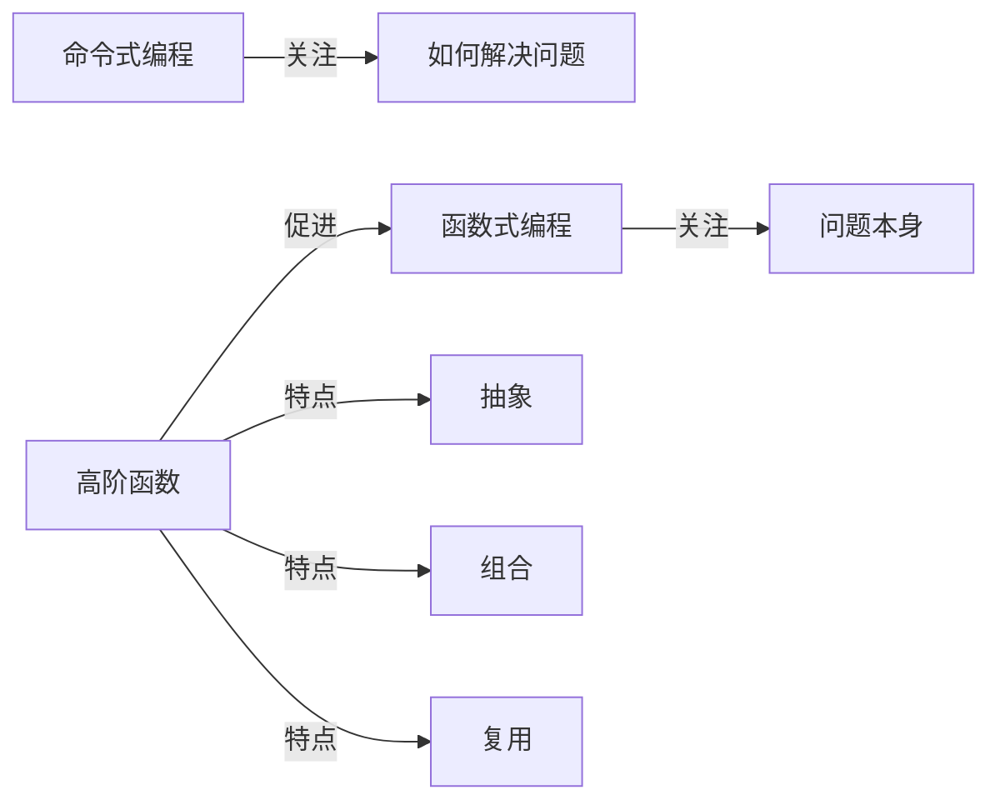

# Python 高阶函数

## 什么是高阶函数？

在Python的函数式编程中，高阶函数是一个重要且强大的概念。简单来说，**高阶函数**是指满足以下条件之一的函数：

1. 接受一个或多个函数作为输入参数
2. 返回一个函数作为输出结果

高阶函数让我们能够抽象出常见的操作模式，使代码更加简洁、可读性更强，同时提高代码的复用性。它是函数式编程范式的核心特性之一。

:::tip 为什么要学习高阶函数？
高阶函数可以帮助你写出更简洁、更具表达力的代码，减少重复代码，并使程序逻辑更加清晰。掌握高阶函数是迈向Python函数式编程的关键一步。
:::

## Python 内置的高阶函数

Python提供了多个内置的高阶函数，下面我们来介绍几个最常用的：

### 1. map()

`map()`函数接受一个函数和一个可迭代对象作为参数，将函数应用于可迭代对象的每个元素，并返回结果的迭代器。

**语法**：`map(function, iterable, ...)`

**示例**：将列表中的每个数字平方

```python
# 使用普通方法
numbers = [1, 2, 3, 4, 5]
squared = []
for num in numbers:
    squared.append(num ** 2)
print(squared)  # 输出: [1, 4, 9, 16, 25]

# 使用map()函数
numbers = [1, 2, 3, 4, 5]
squared = list(map(lambda x: x ** 2, numbers))
print(squared)  # 输出: [1, 4, 9, 16, 25]
```

### 2. filter()

`filter()`函数用于过滤序列中的元素，返回一个由符合条件的元素组成的迭代器。

**语法**：`filter(function, iterable)`

**示例**：过滤出列表中的偶数

```python
# 使用普通方法
numbers = [1, 2, 3, 4, 5, 6, 7, 8, 9, 10]
even_numbers = []
for num in numbers:
    if num % 2 == 0:
        even_numbers.append(num)
print(even_numbers)  # 输出: [2, 4, 6, 8, 10]

# 使用filter()函数
numbers = [1, 2, 3, 4, 5, 6, 7, 8, 9, 10]
even_numbers = list(filter(lambda x: x % 2 == 0, numbers))
print(even_numbers)  # 输出: [2, 4, 6, 8, 10]
```

### 3. reduce()

`reduce()`函数将一个二元函数依次应用到可迭代对象的元素上，从而将该可迭代对象"减少"为单个值。

**注意**：从Python 3开始，`reduce()`被移到了`functools`模块中。

**语法**：`reduce(function, iterable[, initializer])`

**示例**：计算列表中所有元素的乘积

```python
from functools import reduce

# 使用普通方法
numbers = [1, 2, 3, 4, 5]
product = 1
for num in numbers:
    product *= num
print(product)  # 输出: 120

# 使用reduce()函数
numbers = [1, 2, 3, 4, 5]
product = reduce(lambda x, y: x * y, numbers)
print(product)  # 输出: 120
```

### 4. sorted()

`sorted()`函数用于对可迭代对象进行排序，它可以接受一个key函数来自定义排序逻辑。

**语法**：`sorted(iterable, *, key=None, reverse=False)`

**示例**：根据字符串长度对列表进行排序

```python
# 按照字符串长度排序
words = ["apple", "banana", "cherry", "date", "elderberry"]
sorted_words = sorted(words, key=len)
print(sorted_words)  # 输出: ['date', 'apple', 'banana', 'cherry', 'elderberry']

# 按照字符串长度逆序排序
sorted_words_reverse = sorted(words, key=len, reverse=True)
print(sorted_words_reverse)  # 输出: ['elderberry', 'banana', 'cherry', 'apple', 'date']
```

## 创建自定义高阶函数

除了使用内置的高阶函数外，你还可以创建自己的高阶函数。这通常涉及到函数的定义和返回。

### 1. 接受函数作为参数

```python
def apply_twice(func, arg):
    """应用函数两次于参数"""
    return func(func(arg))

def add_five(x):
    return x + 5

result = apply_twice(add_five, 10)
print(result)  # 输出: 20 (10 + 5 + 5)
```

### 2. 返回函数的函数（闭包）

```python
def power_function(n):
    """返回一个计算x的n次方的函数"""
    def power(x):
        return x ** n
    return power

square = power_function(2)
cube = power_function(3)

print(square(4))  # 输出: 16
print(cube(4))    # 输出: 64
```

## 函数装饰器：高阶函数的应用

装饰器是Python中高阶函数的一个重要应用。装饰器是一个接受函数作为参数，并返回一个新函数的函数。

### 基本装饰器示例

```python
def timer_decorator(func):
    """一个用于测量函数执行时间的装饰器"""
    import time
    
    def wrapper(*args, **kwargs):
        start_time = time.time()
        result = func(*args, **kwargs)
        end_time = time.time()
        print(f"函数 {func.__name__} 执行时间: {end_time - start_time:.4f} 秒")
        return result
    
    return wrapper

@timer_decorator
def slow_function():
    """一个执行较慢的函数"""
    import time
    time.sleep(1)
    print("函数执行完毕！")

slow_function()
# 输出:
# 函数执行完毕！
# 函数 slow_function 执行时间: 1.0012 秒
```

:::note 装饰器语法糖
`@timer_decorator` 语法是Python的"装饰器语法糖"，它等同于：
```python
slow_function = timer_decorator(slow_function)
```
这使得代码更加简洁和可读。
:::

## 实际应用案例

### 案例1：数据处理流水线

使用高阶函数创建一个简单的数据处理流水线：

```python
def create_pipeline(*funcs):
    """创建一个数据处理流水线"""
    def pipeline(data):
        result = data
        for func in funcs:
            result = func(result)
        return result
    return pipeline

# 定义一些数据处理函数
def remove_duplicates(data):
    return list(set(data))

def sort_data(data):
    return sorted(data)

def keep_even_numbers(data):
    return list(filter(lambda x: x % 2 == 0, data))

# 创建一个流水线：去重 -> 排序 -> 仅保留偶数
process_data = create_pipeline(
    remove_duplicates,
    sort_data,
    keep_even_numbers
)

# 使用流水线处理数据
data = [4, 7, 2, 5, 8, 4, 9, 2, 6, 3]
result = process_data(data)
print(result)  # 输出: [2, 4, 6, 8]
```

### 案例2：构建一个简单的事件系统

```python
class EventSystem:
    def __init__(self):
        self.listeners = {}
        
    def on(self, event_name, callback):
        """注册事件监听器"""
        if event_name not in self.listeners:
            self.listeners[event_name] = []
        self.listeners[event_name].append(callback)
        
    def emit(self, event_name, *args, **kwargs):
        """触发事件"""
        if event_name in self.listeners:
            for callback in self.listeners[event_name]:
                callback(*args, **kwargs)
                
# 使用事件系统
events = EventSystem()

# 定义事件处理函数
def handle_user_login(user):
    print(f"用户 {user} 已登录")

def send_welcome_email(user):
    print(f"给用户 {user} 发送欢迎邮件")

# 注册事件监听器
events.on("user_login", handle_user_login)
events.on("user_login", send_welcome_email)

# 触发事件
events.emit("user_login", "Alice")
# 输出:
# 用户 Alice 已登录
# 给用户 Alice 发送欢迎邮件
```

## 高阶函数与编程范式

高阶函数是函数式编程范式的核心组成部分。理解高阶函数可以帮助你：

1. **更加专注于"做什么"而非"怎么做"**
2. **减少可变状态和副作用**
3. **提高代码的可组合性和复用性**
4. **编写更简洁、更具表达力的代码**



## 总结

高阶函数是Python函数式编程的强大工具，它们允许我们：

- 将函数作为参数传递给其他函数
- 从函数中返回函数
- 创建更加抽象和通用的代码
- 实现更简洁、更具表达力的编程风格

通过掌握Python的内置高阶函数（如`map()`、`filter()`、`reduce()`和`sorted()`）以及学习创建自己的高阶函数，你可以提升代码质量，并能更好地利用Python的函数式编程特性。

## 练习题

1. 使用`map()`函数将字符串列表中的每个字符串转换为大写。
2. 使用`filter()`函数过滤出列表中所有的质数。
3. 使用`reduce()`函数计算列表中所有数字的总和。
4. 创建一个高阶函数，它接受一个函数和一个重复次数，返回一个将原函数重复执行指定次数的新函数。
5. 实现一个装饰器，用于记录函数被调用的次数。

## 额外资源

- [Python官方文档：函数式编程模块](https://docs.python.org/3/library/functional.html)
- [Python `functools` 模块](https://docs.python.org/3/library/functools.html)
- [函数式编程与Python](https://docs.python.org/3/howto/functional.html)
- 《Python函数式编程》作者：David Mertz

通过学习高阶函数，你已经迈出了掌握Python函数式编程的重要一步。继续探索并练习这些概念，将帮助你成为一个更全面的Python程序员！