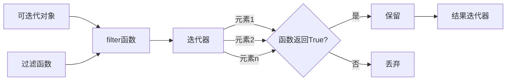

# Python Filter函数

在Python的函数式编程工具箱中，`filter()`函数是一个强大而实用的工具，它允许我们从可迭代对象中筛选出符合特定条件的元素。本文将详细介绍`filter()`函数的用法、语法和应用场景，帮助你掌握这一重要的函数式编程工具。

## 什么是filter()函数？

`filter()`函数是Python内置的高阶函数，用于从可迭代对象（如列表、元组或字符串）中筛选出满足特定条件的元素。它接受一个函数和一个可迭代对象作为参数，返回一个迭代器，该迭代器包含所有使函数返回`True`的元素。

### 基本语法

```python
filter(function, iterable)
```

其中：
- `function`：一个函数，用于测试每个元素。如果函数返回`True`，则元素被保留；如果返回`False`，则元素被过滤掉。
- `iterable`：一个可迭代对象，如列表、元组等。

:::note
如果`function`参数为`None`，则`filter()`将返回`iterable`中所有计算为True的元素（相当于使用`bool`函数作为过滤条件）。
:::

## filter()函数基本用法

### 示例1：过滤列表中的偶数

```python
# 定义一个检查偶数的函数
def is_even(num):
    return num % 2 == 0

numbers = [1, 2, 3, 4, 5, 6, 7, 8, 9, 10]
even_numbers = list(filter(is_even, numbers))

print("原始列表:", numbers)
print("偶数列表:", even_numbers)
```

输出：
```
原始列表: [1, 2, 3, 4, 5, 6, 7, 8, 9, 10]
偶数列表: [2, 4, 6, 8, 10]
```

### 示例2：使用lambda表达式

我们也可以使用lambda表达式作为`filter()`的第一个参数，这在简单条件下非常方便：

```python
numbers = [1, 2, 3, 4, 5, 6, 7, 8, 9, 10]
odd_numbers = list(filter(lambda x: x % 2 != 0, numbers))

print("原始列表:", numbers)
print("奇数列表:", odd_numbers)
```

输出：
```
原始列表: [1, 2, 3, 4, 5, 6, 7, 8, 9, 10]
奇数列表: [1, 3, 5, 7, 9]
```

### 示例3：使用None作为函数参数

当我们使用`None`作为函数参数时，`filter()`会返回所有计算为`True`的元素：

```python
mixed_list = [0, 1, False, True, '', 'hello', [], [1, 2], None, 42]
truthy_values = list(filter(None, mixed_list))

print("原始列表:", mixed_list)
print("True值列表:", truthy_values)
```

输出：
```
原始列表: [0, 1, False, True, '', 'hello', [], [1, 2], None, 42]
True值列表: [1, True, 'hello', [1, 2], 42]
```

## filter()的工作原理

下面是`filter()`函数的工作流程图：



需要注意的是，`filter()`返回的是一个迭代器，而不是列表。如果需要列表形式的结果，需要使用`list()`函数进行转换。

## 高级用法和实际应用案例

### 案例1：过滤文本数据

假设我们有一个包含多个句子的列表，我们想要提取所有包含特定关键词的句子：

```python
sentences = [
    "Python is a programming language",
    "Filter is a built-in function in Python",
    "Learning programming is fun",
    "Python has many built-in functions",
    "This example demonstrates filter function"
]

# 找出所有包含"Python"的句子
python_sentences = list(filter(lambda s: "Python" in s, sentences))
print("包含'Python'的句子:")
for sentence in python_sentences:
    print("- " + sentence)
```

输出：
```
包含'Python'的句子:
- Python is a programming language
- Filter is a built-in function in Python
- Python has many built-in functions
```

### 案例2：数据清洗

`filter()`函数在数据清洗中非常有用，可以帮助我们移除无效或不需要的数据：

```python
# 假设我们有一个包含一些测量数据的列表，其中有些是无效的（表示为None或负值）
measurements = [23.5, None, 19.8, -5.2, 30.1, None, -2.0, 25.3]

# 清洗数据，只保留有效值（不为None且为正）
valid_measurements = list(filter(lambda x: x is not None and x > 0, measurements))

print("原始数据:", measurements)
print("清洗后的数据:", valid_measurements)
```

输出：
```
原始数据: [23.5, None, 19.8, -5.2, 30.1, None, -2.0, 25.3]
清洗后的数据: [23.5, 19.8, 30.1, 25.3]
```

### 案例3：过滤字典列表

我们可以使用`filter()`函数来处理更复杂的数据结构，如字典列表：

```python
# 一个包含学生信息的字典列表
students = [
    {'name': 'Alice', 'grade': 85, 'active': True},
    {'name': 'Bob', 'grade': 92, 'active': False},
    {'name': 'Charlie', 'grade': 78, 'active': True},
    {'name': 'David', 'grade': 95, 'active': True},
    {'name': 'Eve', 'grade': 88, 'active': False}
]

# 过滤出成绩大于等于90且状态为活跃的学生
top_active_students = list(filter(lambda s: s['grade'] >= 90 and s['active'], students))

print("优秀且活跃的学生:")
for student in top_active_students:
    print(f"- {student['name']}: 成绩 {student['grade']}")
```

输出：
```
优秀且活跃的学生:
- David: 成绩 95
```

## filter()与列表推导式的比较

虽然`filter()`函数在函数式编程中很有用，但Python还提供了列表推导式，它在某些情况下可能更加清晰和简洁：

```python
numbers = [1, 2, 3, 4, 5, 6, 7, 8, 9, 10]

# 使用filter()获取偶数
even_numbers_filter = list(filter(lambda x: x % 2 == 0, numbers))

# 使用列表推导式获取偶数
even_numbers_comprehension = [x for x in numbers if x % 2 == 0]

print("使用filter():", even_numbers_filter)
print("使用列表推导式:", even_numbers_comprehension)
```

输出：
```
使用filter(): [2, 4, 6, 8, 10]
使用列表推导式: [2, 4, 6, 8, 10]
```

:::tip
- 当需要使用更复杂的函数逻辑或想要重用过滤函数时，`filter()`可能更合适。
- 对于简单的过滤条件，列表推导式通常更加清晰和简洁。
- `filter()`返回的是迭代器，这在处理大量数据时可能更加内存高效。
:::

## 结合其他函数式编程工具

`filter()`函数经常与其他函数式编程工具如`map()`和`reduce()`结合使用：

```python
from functools import reduce

# 一个数字列表
numbers = [1, 2, 3, 4, 5, 6, 7, 8, 9, 10]

# 先过滤出偶数，然后将每个偶数平方，最后求和
result = reduce(lambda x, y: x + y, 
               map(lambda x: x**2, 
                  filter(lambda x: x % 2 == 0, numbers)))

print("偶数平方和:", result)  # (2²+4²+6²+8²+10²) = 4+16+36+64+100 = 220
```

输出：
```
偶数平方和: 220
```

## 总结

Python的`filter()`函数是函数式编程中的一个重要工具，它允许我们：

1. 从可迭代对象中筛选出满足特定条件的元素
2. 使用自定义函数或lambda表达式定义过滤条件
3. 结合其他函数式编程工具进行复杂的数据处理

通过学习和使用`filter()`函数，你可以编写更加简洁、高效的Python代码，特别是在处理数据集和集合时。

## 练习题

为了巩固你对`filter()`函数的理解，尝试完成以下练习：

1. 使用`filter()`函数从字符串列表中过滤出所有回文字符串（正着读和倒着读一样的字符串）。
2. 结合`filter()`和`map()`函数，从一个整数列表中找出所有质数并返回它们的平方。
3. 使用`filter()`函数从一个字典列表中找出所有满足特定条件的项（例如价格在某个范围内的产品）。

:::caution
记住，`filter()`返回的是迭代器，如果需要多次遍历结果，应该先将其转换为列表或其他容器类型。
:::

## 拓展阅读

若想深入了解Python的函数式编程特性，可以参考以下资源：

- Python官方文档中关于`filter()`函数的说明
- 学习`map()`和`reduce()`函数，它们与`filter()`一起构成了Python函数式编程的核心
- 了解Python中的其他迭代器工具，如`itertools`模块

通过掌握`filter()`函数及其相关概念，你将能够更有效地使用Python进行数据处理和分析。