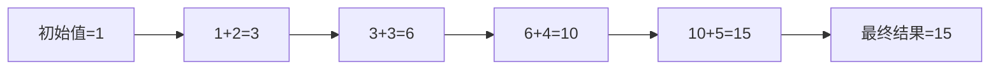
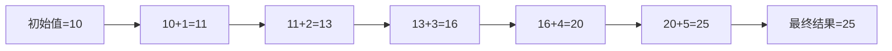

# Python Reduce函数

## 什么是reduce函数？

在Python的函数式编程中，`reduce()`是一个非常强大的工具，它可以将一个函数连续应用到一个序列的元素上，累积地产生一个单一的结果。简单来说，`reduce()`会把一个序列"减少"(归约)为一个单一的值。

在Python 3中，`reduce()`被移出了内置函数列表，现在需要从`functools`模块导入：

```python
from functools import reduce
```

## reduce函数的语法

`reduce()`函数接受两个必须参数和一个可选参数：

```python
reduce(function, sequence[, initial])
```

- **function**: 接受两个参数的函数
- **sequence**: 可迭代对象，如列表、元组等
- **initial**: 可选的初始值

## reduce函数的工作原理

`reduce()`的工作流程如下：

1. 如果提供了`initial`参数，将其作为第一个值，否则使用序列的第一个元素
2. 对当前累积值和序列中的下一个元素应用`function`
3. 重复步骤2，直到处理完序列中所有元素
4. 返回最终的累积值

让我们通过一个简单的例子来理解这个过程：

```python
from functools import reduce

# 计算列表中所有元素的和
numbers = [1, 2, 3, 4, 5]
sum_result = reduce(lambda x, y: x + y, numbers)
print(sum_result)  # 输出: 15
```

这个计算过程相当于：
```
((((1 + 2) + 3) + 4) + 5)
```

为了更好地理解，让我们看看执行过程：



## 使用初始值

当提供了`initial`参数时，reduce会将其作为计算的起点：

```python
from functools import reduce

# 计算列表中所有元素的和，并加上初始值10
numbers = [1, 2, 3, 4, 5]
sum_result = reduce(lambda x, y: x + y, numbers, 10)
print(sum_result)  # 输出: 25 (10 + 1 + 2 + 3 + 4 + 5)
```

执行过程：



## reduce函数的实际应用

### 1. 计算阶乘

```python
from functools import reduce

def factorial(n):
    return reduce(lambda x, y: x * y, range(1, n + 1))

print(factorial(5))  # 输出: 120 (1*2*3*4*5)
```

### 2. 找出列表中的最大值

```python
from functools import reduce

numbers = [3, 7, 2, 9, 5, 8]
max_number = reduce(lambda x, y: x if x > y else y, numbers)
print(max_number)  # 输出: 9
```

### 3. 将列表拼接成字符串

```python
from functools import reduce

words = ['Hello', 'world', 'of', 'Python']
sentence = reduce(lambda x, y: x + ' ' + y, words)
print(sentence)  # 输出: "Hello world of Python"
```

### 4. 将十进制数转换为二进制字符串

```python
from functools import reduce

def to_binary(n):
    digits = []
    while n > 0:
        digits.append(n % 2)
        n //= 2
    
    digits.reverse()
    return reduce(lambda x, y: x * 10 + y, digits, 0)

print(to_binary(42))  # 输出: 101010
```

## 与map和filter的结合使用

`reduce()`常常与`map()`和`filter()`一起使用，构成强大的数据处理管道：

```python
from functools import reduce

# 计算列表中所有偶数的乘积
numbers = [1, 2, 3, 4, 5, 6]

even_product = reduce(
    lambda x, y: x * y,
    filter(lambda n: n % 2 == 0, numbers)
)

print(even_product)  # 输出: 48 (2*4*6)
```

## 使用自定义函数

虽然我们通常使用lambda表达式作为reduce的函数参数，但也可以使用已定义的函数：

```python
from functools import reduce

def add(x, y):
    print(f"Adding {x} + {y}")
    return x + y

numbers = [1, 2, 3, 4]
sum_result = reduce(add, numbers)
print(f"Result: {sum_result}")
```

输出：
```
Adding 1 + 2
Adding 3 + 3
Adding 6 + 4
Result: 10
```

:::tip 提示
使用已定义的函数而非lambda表达式，可以在函数中添加调试信息，帮助你理解reduce的执行过程。
:::

## reduce函数常见错误及注意事项

### 1. 空序列错误

如果传给`reduce()`的序列为空且没有提供初始值，会引发TypeError：

```python
from functools import reduce

# 这会引发错误
try:
    reduce(lambda x, y: x + y, [])
except TypeError as e:
    print(f"错误: {e}")

# 正确做法 - 提供初始值
print(reduce(lambda x, y: x + y, [], 0))  # 输出: 0
```

### 2. 函数参数顺序

注意，在`reduce()`中，函数的第一个参数是累积值，第二个参数是当前元素。混淆这个顺序可能导致意外结果：

```python
from functools import reduce

# 正确的减法实现
result1 = reduce(lambda x, y: x - y, [10, 1, 2, 3])
print(result1)  # 输出: 4 (((10-1)-2)-3)

# 如果参数顺序颠倒
result2 = reduce(lambda x, y: y - x, [10, 1, 2, 3])
print(result2)  # 输出: -8 (3-(2-(1-10)))
```

## 性能考虑

`reduce()`在处理大量数据时非常有效，因为：

1. 它是用C语言实现的，运行速度快
2. 它避免了显式循环和中间变量
3. 它可以与其他函数式工具链接使用

然而，对于非常简单的操作，如求和，Python内置函数通常会更快：

```python
from functools import reduce
import time

numbers = list(range(1000000))

# 使用reduce
start = time.time()
reduce_sum = reduce(lambda x, y: x + y, numbers)
reduce_time = time.time() - start
print(f"Reduce时间: {reduce_time:.6f}秒")

# 使用内置sum
start = time.time()
builtin_sum = sum(numbers)
builtin_time = time.time() - start
print(f"内置sum时间: {builtin_time:.6f}秒")

print(f"结果是否相同: {reduce_sum == builtin_sum}")
```

:::caution 注意
对于简单操作，如求和、求最大值等，优先使用Python内置函数(`sum()`, `max()`, `min()`等)，它们通常更快且更易读。对于复杂的归约操作，`reduce()`则更为适合。
:::

## 总结

`reduce()`函数是Python函数式编程的强大工具，它允许你将一个序列归约为单一值。主要优点包括：

- 简洁地表达复杂的累积操作
- 与其他函数式工具（如`map()`和`filter()`）良好集成
- 可读性高且易于维护

理解`reduce()`的工作原理和适用场景，对于编写更简洁、更高效的Python代码至关重要。

## 练习题

为了巩固对`reduce()`的理解，尝试完成以下练习：

1. 使用`reduce()`计算一个数字列表的乘积
2. 使用`reduce()`将一个字符列表连接成一个字符串
3. 使用`reduce()`寻找列表中的最小值
4. 结合`map()`和`reduce()`，计算一个字符串中每个单词的长度之和
5. 使用`reduce()`实现一个简单的展平列表函数（将列表的列表转换为单一列表）

## 进一步学习资源

- [Python官方文档 - functools.reduce](https://docs.python.org/3/library/functools.html#functools.reduce)
- [Python函数式编程指南](https://docs.python.org/3/howto/functional.html)
- [Python Lambda函数与匿名函数](https://docs.python.org/3/tutorial/controlflow.html#lambda-expressions)

通过不断实践和学习，你将能够充分利用`reduce()`函数的强大功能，编写更加优雅高效的Python代码。