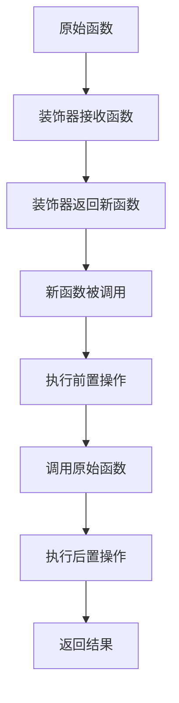

# Python 装饰器高级用法

在Python函数式编程中，装饰器是一种强大而优雅的工具，它允许我们在不修改函数代码的情况下，增强或修改函数的行为。如果你已经掌握了基本的装饰器概念，那么是时候探索一些更高级的用法了。

## 回顾装饰器基础

装饰器本质上是一个接受函数作为参数并返回一个新函数的函数。基本形式如下：

```python
def decorator(func):
    def wrapper(*args, **kwargs):
        # 在调用原始函数前执行的代码
        result = func(*args, **kwargs)
        # 在调用原始函数后执行的代码
        return result
    return wrapper

# 使用装饰器
@decorator
def my_function():
    pass
```

:::note
上面的`@decorator`语法是Python的语法糖，等同于`my_function = decorator(my_function)`。
:::

## 高级装饰器技术

### 1. 带参数的装饰器

当我们需要自定义装饰器的行为时，可以创建带参数的装饰器。这实际上是一个返回装饰器的函数。

```python
def repeat(n=1):
    def decorator(func):
        def wrapper(*args, **kwargs):
            result = None
            for _ in range(n):
                result = func(*args, **kwargs)
            return result
        return wrapper
    return decorator

# 使用带参数的装饰器
@repeat(3)
def say_hello(name):
    print(f"Hello, {name}!")
    return name

# 测试
say_hello("Alice")
```

输出：
```
Hello, Alice!
Hello, Alice!
Hello, Alice!
```

这个例子中，`repeat(3)`返回一个装饰器，该装饰器使函数`say_hello`重复执行3次。

### 2. 保留原函数元数据

当使用装饰器时，被装饰函数的一些元数据（如函数名、文档字符串等）会丢失。可以使用`functools.wraps`来保留这些信息：

```python
import functools

def my_decorator(func):
    @functools.wraps(func)  # 保留原函数的元数据
    def wrapper(*args, **kwargs):
        print("Something is happening before the function is called.")
        result = func(*args, **kwargs)
        print("Something is happening after the function is called.")
        return result
    return wrapper

@my_decorator
def say_hello(name):
    """这是一个打招呼的函数"""
    print(f"Hello, {name}!")

# 查看函数的名称和文档
print(say_hello.__name__)  # 输出: say_hello（而不是wrapper）
print(say_hello.__doc__)   # 输出: 这是一个打招呼的函数
```

### 3. 类装饰器

装饰器不仅可以装饰函数，还可以装饰类。类装饰器通常用于修改类的属性或行为。

```python
def add_greeting(cls):
    cls.greet = lambda self: f"Hello, I'm {self.name}"
    return cls

@add_greeting
class Person:
    def __init__(self, name):
        self.name = name

# 测试
person = Person("Alice")
print(person.greet())  # 输出: Hello, I'm Alice
```

### 4. 类作为装饰器

类本身也可以作为装饰器使用，只需要实现`__call__`方法：

```python
class CountCalls:
    def __init__(self, func):
        functools.update_wrapper(self, func)
        self.func = func
        self.calls = 0

    def __call__(self, *args, **kwargs):
        self.calls += 1
        print(f"Function {self.func.__name__} has been called {self.calls} times")
        return self.func(*args, **kwargs)

@CountCalls
def say_hello(name):
    print(f"Hello, {name}!")

# 测试
say_hello("Alice")  # 输出: Function say_hello has been called 1 times, Hello, Alice!
say_hello("Bob")    # 输出: Function say_hello has been called 2 times, Hello, Bob!
```

### 5. 装饰器链

可以将多个装饰器应用于同一个函数，形成装饰器链。执行顺序是从最靠近函数的装饰器开始，向外执行。

```python
def bold(func):
    def wrapper(*args, **kwargs):
        return f"<b>{func(*args, **kwargs)}</b>"
    return wrapper

def italic(func):
    def wrapper(*args, **kwargs):
        return f"<i>{func(*args, **kwargs)}</i>"
    return wrapper

@bold
@italic
def format_text(text):
    return text

print(format_text("Hello"))  # 输出: <b><i>Hello</i></b>
```

:::tip
装饰器的执行顺序是从下到上的。在上面的例子中，先执行`italic`装饰器，然后执行`bold`装饰器。
:::

## 实际应用案例

### 1. 性能计时器

这个装饰器可以用来测量函数的执行时间：

```python
import time
import functools

def timer(func):
    @functools.wraps(func)
    def wrapper(*args, **kwargs):
        start_time = time.time()
        result = func(*args, **kwargs)
        end_time = time.time()
        print(f"Function {func.__name__} took {end_time - start_time:.4f} seconds to complete")
        return result
    return wrapper

@timer
def slow_function():
    time.sleep(1)
    print("Function execution completed")

# 测试
slow_function()
```

输出：
```
Function execution completed
Function slow_function took 1.0010 seconds to complete
```

### 2. 缓存装饰器

用于缓存函数的计算结果，避免重复计算：

```python
def cache(func):
    cached_values = {}
    @functools.wraps(func)
    def wrapper(*args):
        if args in cached_values:
            print(f"Returning cached result for {args}")
            return cached_values[args]
        
        result = func(*args)
        cached_values[args] = result
        print(f"Caching result for {args}")
        return result
    return wrapper

@cache
def fibonacci(n):
    if n <= 1:
        return n
    return fibonacci(n-1) + fibonacci(n-2)

# 测试
print(fibonacci(10))
print(fibonacci(10))  # 第二次调用将使用缓存结果
```

:::note
Python标准库有`functools.lru_cache`装饰器，它提供了更高效的缓存功能。
:::

### 3. 权限验证装饰器

在Web应用中，常用装饰器来检查用户权限：

```python
def require_permission(permission):
    def decorator(func):
        @functools.wraps(func)
        def wrapper(user, *args, **kwargs):
            if permission in user.permissions:
                return func(user, *args, **kwargs)
            else:
                raise PermissionError(f"User does not have {permission} permission")
        return wrapper
    return decorator

# 模拟用户类
class User:
    def __init__(self, name, permissions):
        self.name = name
        self.permissions = permissions

@require_permission("admin")
def delete_user(user, target_user):
    print(f"{target_user} has been deleted by {user.name}")

# 测试
admin_user = User("Admin", ["admin", "edit"])
normal_user = User("User", ["view", "edit"])

try:
    delete_user(admin_user, "John")  # 成功
    delete_user(normal_user, "John") # 失败，抛出PermissionError
except PermissionError as e:
    print(e)
```

## 装饰器的工作原理可视化

装饰器的工作过程可以通过以下流程图来理解：



## 总结

装饰器是Python中一个强大的高级特性，它让代码复用和功能扩展变得更加优雅。高级装饰器技术包括：

1. 带参数的装饰器
2. 使用`functools.wraps`保留元数据
3. 类装饰器
4. 将类用作装饰器
5. 装饰器链

装饰器在实际应用中有广泛的用途，如性能测量、缓存结果、权限验证等。掌握这些高级技术，能让你的Python代码更加简洁、模块化和可维护。

## 练习与挑战

1. 创建一个重试装饰器，当函数抛出异常时，尝试重新执行函数，最多重试指定的次数。
2. 实现一个日志装饰器，记录函数的调用参数和返回结果。
3. 创建一个装饰器，限制函数每秒最多被调用的次数。
4. 尝试组合多个装饰器解决实际问题，如创建一个既有缓存功能又能记录执行时间的装饰器组合。

## 进一步阅读

- Python官方文档中的装饰器章节
- PEP 318 – 函数和方法的装饰器
- functools模块文档，特别是`wraps`和`lru_cache`函数

通过这些高级技术的学习和实践，你将能够充分发挥装饰器在Python编程中的潜力，写出更加优雅和高效的代码。