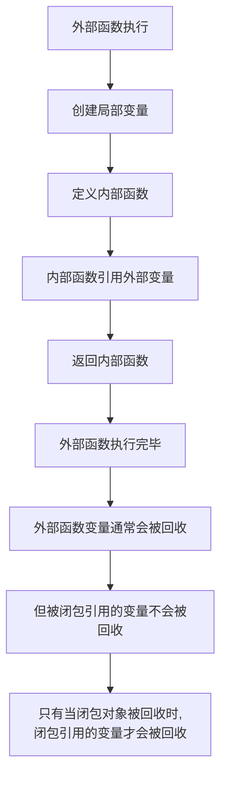

# Python 闭包

## 什么是闭包？

在Python中，闭包(Closure)是一个很特殊的函数技术，它允许一个函数访问并操作其词法作用域之外定义的变量。简单来说，闭包是一个函数，它记住了它被创建时的环境。

闭包的特点是**内部函数能够访问外部函数的变量**，即使外部函数已经执行完毕。这是函数式编程中一个非常强大的特性。

## 闭包的基本结构

一个闭包通常由两部分组成：

1. 一个外部函数，定义了一个或多个局部变量或参数
2. 一个内部函数，使用或引用了外部函数的变量或参数

```python
def 外部函数(参数):
    # 外部函数的变量
    def 内部函数():
        # 使用外部函数的变量
        # ...
    return 内部函数  # 返回内部函数而不是调用它
```

## 一个简单的闭包示例

下面是一个基本的闭包例子：

```python
def greeting(message):
    def greeter(name):
        return message + ", " + name + "!"
    return greeter

# 创建特定信息的问候函数
hello = greeting("Hello")
goodbye = greeting("Goodbye")

# 使用闭包
print(hello("Alice"))    # 输出: Hello, Alice!
print(goodbye("Bob"))    # 输出: Goodbye, Bob!
```

在上面的例子中：
- `greeting`是外部函数，它接收一个`message`参数
- `greeter`是内部函数，它可以访问外部函数的`message`参数
- 当我们调用`greeting("Hello")`时，它返回`greeter`函数，但这个函数记住了`message`的值是"Hello"

:::note
`hello`和`goodbye`是闭包函数，它们"记住"了各自创建时`message`的值。
:::

## 闭包如何工作？

要理解闭包如何工作，我们需要了解Python中的作用域和命名空间。当一个函数被定义时，它可以访问三个作用域：

1. 局部作用域（函数内部定义的变量）
2. 闭包作用域（外部函数中定义的变量）
3. 全局作用域（模块级别定义的变量）

当内部函数引用外部函数的变量时，这个变量被称为**自由变量**。Python会将这些自由变量的引用保存在内部函数对象的`__closure__`属性中，从而创建一个闭包。

```python
def counter():
    count = 0
    def increment():
        nonlocal count
        count += 1
        return count
    return increment

counter_func = counter()
print(counter_func())  # 输出: 1
print(counter_func())  # 输出: 2
print(counter_func())  # 输出: 3
```

这个例子中，`count`是一个自由变量，它被`increment`函数引用。即使`counter`函数执行完毕，`count`变量也会被保留，因为它被闭包捕获了。

:::caution
注意`nonlocal`关键字的使用。如果要在内部函数中修改外部函数的变量，必须使用`nonlocal`声明，否则Python会在内部函数中创建一个新的局部变量。
:::

## 闭包的应用场景

### 1. 数据封装

闭包提供了一种数据封装的方式，可以保护变量不被外部直接访问：

```python
def create_account(initial_balance):
    balance = initial_balance
    
    def deposit(amount):
        nonlocal balance
        balance += amount
        return balance
    
    def withdraw(amount):
        nonlocal balance
        if amount > balance:
            return "余额不足"
        balance -= amount
        return balance
    
    def get_balance():
        return balance
    
    # 返回一个字典，包含操作账户的函数
    return {
        'deposit': deposit,
        'withdraw': withdraw,
        'balance': get_balance
    }

# 创建一个账户
account = create_account(1000)

# 存款和取款
print(account['balance']())  # 输出: 1000
print(account['deposit'](500))  # 输出: 1500
print(account['withdraw'](200))  # 输出: 1300
print(account['withdraw'](2000))  # 输出: 余额不足
```

这个例子实现了一个简单的银行账户，通过闭包保护`balance`变量，只能通过提供的方法来操作它。

### 2. 函数工厂

闭包可以用来创建定制的函数：

```python
def power_function(n):
    def power(x):
        return x ** n
    return power

# 创建计算平方和立方的函数
square = power_function(2)
cube = power_function(3)

print(square(4))  # 输出: 16
print(cube(4))    # 输出: 64
```

这个例子创建了可以计算任意次方的函数，展示了闭包作为函数工厂的应用。

### 3. 回调和事件处理

闭包在回调函数中非常有用，可以捕获执行上下文：

```python
def create_event_handler(event_type):
    def handler(data):
        print(f"处理{event_type}事件: {data}")
    return handler

click_handler = create_event_handler("点击")
submit_handler = create_event_handler("提交")

click_handler("按钮被点击")  # 输出: 处理点击事件: 按钮被点击
submit_handler("表单已提交")  # 输出: 处理提交事件: 表单已提交
```

### 4. 装饰器

Python装饰器大量使用闭包概念：

```python
def logger(func):
    def wrapper(*args, **kwargs):
        print(f"调用函数: {func.__name__}")
        result = func(*args, **kwargs)
        print(f"函数 {func.__name__} 返回: {result}")
        return result
    return wrapper

@logger
def add(a, b):
    return a + b

add(3, 5)  # 输出:
# 调用函数: add
# 函数 add 返回: 8
```

## 闭包与Python内存管理

闭包会影响Python的内存管理，因为被内部函数引用的外部函数的变量不会被垃圾回收。这可能导致一些潜在的内存问题，尤其是当闭包保存了大量数据时。



## 闭包的优缺点

### 优点

1. **封装性** - 可以隐藏实现细节，只暴露需要的功能
2. **状态保持** - 可以保存函数的状态信息
3. **避免全局变量** - 提供了一种替代全局变量的方式
4. **实现高阶函数** - 为函数式编程提供基础

### 缺点

1. **内存占用** - 闭包会持有外部变量的引用，可能导致内存不能及时释放
2. **可读性** - 如果过度使用，可能使代码难以理解
3. **调试困难** - 闭包内部的变量不容易检查和测试

## 什么时候使用闭包

以下情况适合使用闭包：

- 需要一个"记忆"先前状态的函数
- 需要避免使用全局变量
- 需要隐藏数据，提供有限的访问接口
- 实现装饰器模式
- 创建函数工厂

## 练习题

1. 创建一个闭包函数，可以给任何函数添加重试功能，当函数失败时自动重试指定次数。

2. 使用闭包实现一个缓存装饰器，能够缓存函数的计算结果，避免重复计算。

3. 创建一个计数器工厂函数，可以生成多个独立的计数器，每个计数器记录自己被调用的次数。

## 总结

闭包是Python中一个强大的函数式编程特性，它允许函数访问并操作其词法范围之外定义的变量。通过闭包，我们可以实现数据封装、函数工厂、回调函数和装饰器等高级功能。

掌握闭包的概念和用法，对于编写简洁、高效的Python代码非常重要，也是理解更高级Python特性(如装饰器)的基础。然而，使用闭包时需要注意内存管理问题，避免因闭包引用导致的内存泄漏。

## 进一步学习资源

- Python官方文档关于[嵌套函数作用域](https://docs.python.org/3/tutorial/classes.html#python-scopes-and-namespaces)的讨论
- 《Fluent Python》第七章：函数装饰器和闭包
- 《Python Cookbook》中关于闭包和装饰器的章节