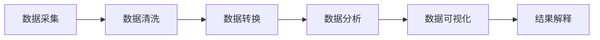

# Python 数据处理概述

在当今数据驱动的世界，能够有效地处理和分析数据已经成为一项不可或缺的技能。Python凭借其简洁的语法、丰富的库和强大的社区支持，已经成为数据处理和分析的首选语言之一。

## 为什么选择Python进行数据处理？

Python在数据处理领域有着无可比拟的优势：

1. **易于学习和使用**：Python语法简洁明了，对初学者非常友好
2. **丰富的数据处理库**：NumPy、Pandas、SciPy等专业库
3. **强大的可视化工具**：Matplotlib、Seaborn、Plotly等
4. **活跃的社区支持**：大量在线资源和实时更新的文档
5. **跨平台兼容性**：几乎所有操作系统上都能运行

## Python 数据处理的核心库

### NumPy：数值计算基础

NumPy（Numerical Python）是Python科学计算的基础库，提供高性能的多维数组对象和处理这些数组的工具。

```python
import numpy as np

# 创建一个简单的数组
arr = np.array([1, 2, 3, 4, 5])
print("数组:", arr)
print("数组平均值:", np.mean(arr))
print("数组标准差:", np.std(arr))
```

输出：
```
数组: [1 2 3 4 5]
数组平均值: 3.0
数组标准差: 1.4142135623730951
```

NumPy的核心是`ndarray`（N-dimensional array）对象，它比Python原生列表更加高效，在进行大规模数值计算时性能卓越。

### Pandas：数据分析利器

Pandas构建在NumPy之上，提供了DataFrames（类似Excel表格）和Series（一维数组）等数据结构，使数据操作更加方便。

```python
import pandas as pd

# 创建一个简单的DataFrame
data = {
    '姓名': ['张三', '李四', '王五'],
    '年龄': [28, 32, 25],
    '城市': ['北京', '上海', '广州']
}
df = pd.DataFrame(data)
print(df)
```

输出：
```
   姓名  年龄  城市
0  张三  28  北京
1  李四  32  上海
2  王五  25  广州
```

Pandas提供了丰富的功能，包括数据清洗、转换、聚合和分析等，是数据科学工作流程中不可或缺的工具。

### Matplotlib：数据可视化

Matplotlib是Python主要的绘图库，用于创建各种静态、动态或交互式的可视化图表。

```python
import matplotlib.pyplot as plt
import numpy as np

# 创建简单的折线图
x = np.linspace(0, 10, 100)
y = np.sin(x)

plt.figure(figsize=(8, 4))
plt.plot(x, y, 'b-', linewidth=2)
plt.title('正弦波')
plt.xlabel('x轴')
plt.ylabel('y轴')
plt.grid(True)
plt.show()
```

:::tip
在Jupyter Notebook或JupyterLab中，使用`%matplotlib inline`魔术命令可以在笔记本中直接显示图表，提升工作效率。
:::

## 数据处理的基本流程

数据处理通常遵循以下几个步骤：



### 1. 数据采集

获取数据的渠道多种多样：

- 从文件中读取（CSV、Excel、JSON等）
- 从数据库中查询
- 通过API获取
- 网页爬虫采集

```python
# 从CSV文件读取数据
import pandas as pd
df = pd.read_csv('data.csv')

# 从Excel文件读取数据
excel_df = pd.read_excel('data.xlsx', sheet_name='Sheet1')

# 读取JSON数据
json_df = pd.read_json('data.json')
```

### 2. 数据清洗

原始数据通常包含缺失值、异常值或格式不一致的问题，需要进行清洗：

```python
# 处理缺失值
df.dropna()  # 删除包含缺失值的行
df.fillna(value=0)  # 用0填充缺失值

# 删除重复数据
df.drop_duplicates()

# 更改数据类型
df['年龄'] = df['年龄'].astype(int)
```

### 3. 数据转换

将数据转换为适合分析的格式：

```python
# 对类别数据进行编码
df_encoded = pd.get_dummies(df, columns=['城市'])

# 标准化数值特征
from sklearn.preprocessing import StandardScaler
scaler = StandardScaler()
df['年龄_标准化'] = scaler.fit_transform(df[['年龄']])
```

### 4. 数据分析

使用各种统计和机器学习方法对数据进行分析：

```python
# 基本统计描述
print(df.describe())

# 分组聚合
group_data = df.groupby('城市')['年龄'].mean()
print(group_data)

# 相关性分析
correlation = df.corr()
print(correlation)
```

### 5. 数据可视化

通过图表展示数据中的模式和趋势：

```python
import matplotlib.pyplot as plt
import seaborn as sns

# 绘制直方图
plt.figure(figsize=(10, 6))
sns.histplot(df['年龄'], bins=20, kde=True)
plt.title('年龄分布')
plt.show()

# 绘制散点图
plt.figure(figsize=(10, 6))
sns.scatterplot(x='特征1', y='特征2', hue='类别', data=df)
plt.title('特征关系散点图')
plt.show()
```

## 实际案例：电商销售数据分析

让我们通过一个简单的电商销售数据分析案例，展示Python数据处理的实际应用。

假设我们有一个包含以下信息的销售数据集：订单ID、产品名称、销售日期、销售金额和客户所在地区。

```python
import pandas as pd
import numpy as np
import matplotlib.pyplot as plt
import seaborn as sns

# 模拟创建电商销售数据
np.random.seed(42)
dates = pd.date_range('20220101', periods=1000)
regions = ['华东', '华北', '华南', '西部', '东北']
products = ['手机', '电脑', '平板', '耳机', '智能手表']

data = {
    '订单ID': np.arange(1, 1001),
    '产品': np.random.choice(products, 1000),
    '销售日期': np.random.choice(dates, 1000),
    '销售金额': np.random.randint(100, 10000, 1000),
    '地区': np.random.choice(regions, 1000)
}

sales_df = pd.DataFrame(data)
print(sales_df.head())
```

输出：
```
   订单ID  产品       销售日期  销售金额  地区
0     1  手机 2022-01-01   5434  华南
1     2  电脑 2022-02-14   7951  华东
2     3  耳机 2022-04-02   5360  东北
3     4  平板 2022-03-26   3631  华北
4     5  智能手表 2022-02-03   9124  华东
```

### 数据分析与可视化

```python
# 1. 按产品统计销售总额
product_sales = sales_df.groupby('产品')['销售金额'].sum().sort_values(ascending=False)
print("各产品销售总额:")
print(product_sales)

# 2. 按月份统计销售趋势
sales_df['月份'] = sales_df['销售日期'].dt.strftime('%Y-%m')
monthly_sales = sales_df.groupby('月份')['销售金额'].sum().reset_index()

# 3. 按地区统计销售分布
region_sales = sales_df.groupby('地区')['销售金额'].sum()

# 可视化：产品销售比例
plt.figure(figsize=(10, 6))
plt.pie(product_sales, labels=product_sales.index, autopct='%1.1f%%', startangle=90)
plt.title('各产品销售额占比')
plt.axis('equal')
plt.show()

# 可视化：销售趋势
plt.figure(figsize=(12, 6))
sns.lineplot(x='月份', y='销售金额', data=monthly_sales, marker='o')
plt.title('月度销售趋势')
plt.xticks(rotation=45)
plt.tight_layout()
plt.show()

# 可视化：地区销售分布
plt.figure(figsize=(10, 6))
sns.barplot(x=region_sales.index, y=region_sales.values)
plt.title('各地区销售总额')
plt.ylabel('销售金额')
plt.xlabel('地区')
plt.tight_layout()
plt.show()
```

:::note
在实际项目中，你需要根据具体情况调整可视化的样式和参数，以使图表更加清晰和信息丰富。
:::

## 数据处理中的常见挑战和解决方案

### 1. 处理大数据集

当数据量很大时，可能会遇到内存不足的问题：

```python
# 使用分块读取
chunks = []
for chunk in pd.read_csv('large_file.csv', chunksize=10000):
    # 对每个数据块进行处理
    processed_chunk = process_data(chunk)
    chunks.append(processed_chunk)

# 合并处理后的数据块
result = pd.concat(chunks)
```

### 2. 处理时间序列数据

时间序列数据需要特殊处理：

```python
# 将字符串转换为datetime
df['日期'] = pd.to_datetime(df['日期'])

# 设置日期为索引
df.set_index('日期', inplace=True)

# 重采样到月度数据
monthly_data = df.resample('M').mean()
```

### 3. 处理文本数据

文本数据需要进行自然语言处理：

```python
# 文本清洗示例
df['文本'] = df['文本'].str.lower()  # 转为小写
df['文本'] = df['文本'].str.replace('[^\w\s]', '')  # 移除标点符号

# 使用nltk进行更复杂的文本处理
import nltk
from nltk.corpus import stopwords

nltk.download('stopwords')
stop_words = set(stopwords.words('english'))

def remove_stopwords(text):
    words = text.split()
    filtered_words = [word for word in words if word.lower() not in stop_words]
    return ' '.join(filtered_words)

df['处理后文本'] = df['文本'].apply(remove_stopwords)
```

## 总结

Python数据处理是一个广阔而深入的领域，涵盖了从数据获取、清洗、转换、分析到可视化的全过程。通过本文的学习，你应该已经对Python数据处理有了基本的了解，包括：

1. Python数据处理的主要库：NumPy、Pandas、Matplotlib等
2. 数据处理的基本流程和每个步骤的关键技术
3. 如何应用这些技术解决实际问题
4. 常见挑战及其解决方案

作为初学者，建议从小型数据集开始练习，逐步掌握各种数据操作技术，然后再挑战更复杂的数据分析项目。

:::tip 学习建议
记住，数据处理是一门需要实践的技能。阅读文档很重要，但真正的学习来自于解决实际问题的过程。尝试获取一些公开数据集，如Kaggle上的数据，应用本文所学的知识进行分析。
:::

## 练习任务

1. **基础练习**：使用Pandas读取一个CSV文件，进行基本的数据清洗和探索性分析。
2. **中级练习**：对某个数据集进行完整的数据处理流程，包括清洗、转换、分析和可视化。
3. **进阶练习**：选择一个具有挑战性的数据集（如包含缺失值、异常值、非结构化数据等），应用适当的技术进行处理和分析。

## 延伸资源

- **官方文档**：
  - [NumPy文档](https://numpy.org/doc/)
  - [Pandas文档](https://pandas.pydata.org/docs/)
  - [Matplotlib文档](https://matplotlib.org/stable/contents.html)
  
- **在线教程**：
  - Python Data Science Handbook
  - 《利用Python进行数据分析》by Wes McKinney（Pandas作者）

- **实践平台**：
  - Kaggle: 提供数据科学竞赛和大量公开数据集
  - DataCamp：提供交互式Python数据科学课程

通过掌握Python数据处理技能，你将能够从原始数据中提取有价值的信息，为决策提供支持，这在当今数据驱动的世界中是一项极为宝贵的能力。