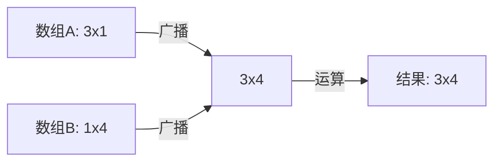

# Python NumPy基础

NumPy是Python中用于科学计算的核心库，它提供了高性能的多维数组对象和处理这些数组的工具。对于数据分析、机器学习和科学研究，NumPy几乎是必不可少的。本文将全面介绍NumPy的基础知识，帮助初学者快速上手。

## 为什么需要NumPy？

在学习NumPy之前，我们先了解为什么需要它：

1. **计算效率**：NumPy的数组运算比Python原生列表快很多
2. **内存效率**：NumPy数组更节省内存
3. **便捷性**：提供大量的数学函数和操作
4. **互操作性**：与其他科学计算库（如SciPy、Pandas、Matplotlib）完美配合

## 安装NumPy

使用pip安装NumPy非常简单：

```python
pip install numpy
```

## NumPy数组基础

### 创建数组

导入NumPy库后，我们可以用多种方式创建数组：

```python
import numpy as np

# 从Python列表创建
arr1 = np.array([1, 2, 3, 4, 5])
print(arr1)
```

输出：
```
[1 2 3 4 5]
```

创建多维数组：

```python
# 创建2维数组
arr2d = np.array([[1, 2, 3], [4, 5, 6]])
print(arr2d)
```

输出：
```
[[1 2 3]
 [4 5 6]]
```

### 特殊数组创建函数

NumPy提供了许多便捷的函数来创建特殊数组：

```python
# 创建0数组
zeros = np.zeros((3, 4))
print("Zeros array:")
print(zeros)

# 创建1数组
ones = np.ones((2, 3))
print("\nOnes array:")
print(ones)

# 创建单位矩阵
identity = np.eye(3)
print("\nIdentity matrix:")
print(identity)

# 创建等间隔数组
linear = np.linspace(0, 10, 5)  # 0到10之间的5个等间隔数字
print("\nLinspace array:")
print(linear)

# 创建范围数组
arange = np.arange(0, 10, 2)  # 0到10，步长为2
print("\nArange array:")
print(arange)

# 创建随机数组
random_arr = np.random.random((2, 2))
print("\nRandom array:")
print(random_arr)
```

输出：
```
Zeros array:
[[0. 0. 0. 0.]
 [0. 0. 0. 0.]
 [0. 0. 0. 0.]]

Ones array:
[[1. 1. 1.]
 [1. 1. 1.]]

Identity matrix:
[[1. 0. 0.]
 [0. 1. 0.]
 [0. 0. 1.]]

Linspace array:
[ 0.   2.5  5.   7.5 10. ]

Arange array:
[0 2 4 6 8]

Random array:
[[0.12345678 0.23456789]
 [0.34567891 0.45678912]]
```

:::tip 提示
`np.random.random`生成的是[0,1)之间的随机数，每次运行结果会不同。
:::

## 数组属性与信息

了解数组的基本属性对于操作数组非常重要：

```python
arr = np.array([[1, 2, 3], [4, 5, 6]])

# 形状
print("Shape:", arr.shape)

# 维度
print("Dimensions:", arr.ndim)

# 元素总数
print("Size:", arr.size)

# 数据类型
print("Data type:", arr.dtype)

# 每个元素的字节大小
print("Item size:", arr.itemsize, "bytes")

# 总字节大小
print("Total bytes:", arr.nbytes)
```

输出：
```
Shape: (2, 3)
Dimensions: 2
Size: 6
Data type: int64
Item size: 8 bytes
Total bytes: 48
```

## 数组索引与切片

### 基本索引

NumPy数组支持类似Python列表的索引操作，但功能更加强大：

```python
arr = np.array([1, 2, 3, 4, 5])

# 获取单个元素
print(arr[0])  # 第一个元素
print(arr[-1])  # 最后一个元素
```

输出：
```
1
5
```

### 多维数组索引

```python
arr_2d = np.array([[1, 2, 3], [4, 5, 6], [7, 8, 9]])

# 获取元素 (行, 列)
print(arr_2d[0, 0])  # 第一行第一列
print(arr_2d[1, 2])  # 第二行第三列
```

输出：
```
1
6
```

### 数组切片

```python
arr = np.array([0, 1, 2, 3, 4, 5, 6, 7, 8, 9])

# 基本切片
print(arr[1:6])  # 索引1到5的元素

# 带步长的切片
print(arr[1:8:2])  # 索引1到7的元素，步长为2

# 多维数组切片
arr_2d = np.array([[1, 2, 3], [4, 5, 6], [7, 8, 9]])
print(arr_2d[0:2, 1:3])  # 前两行，第2-3列
```

输出：
```
[1 2 3 4 5]
[1 3 5 7]
[[2 3]
 [5 6]]
```

### 布尔索引

可以使用布尔数组来选择元素：

```python
arr = np.array([1, 2, 3, 4, 5])
mask = np.array([True, False, True, False, True])
print(arr[mask])  # 选择mask为True的元素
```

输出：
```
[1 3 5]
```

也可以通过条件表达式创建布尔索引：

```python
arr = np.array([1, 2, 3, 4, 5])
print(arr[arr > 3])  # 选择大于3的元素
```

输出：
```
[4 5]
```

## 数组操作

### 数学运算

NumPy支持数组间的元素级数学运算：

```python
a = np.array([1, 2, 3])
b = np.array([4, 5, 6])

# 加法
print("a + b =", a + b)

# 减法
print("a - b =", a - b)

# 乘法
print("a * b =", a * b)

# 除法
print("a / b =", a / b)

# 幂运算
print("a ** 2 =", a ** 2)
```

输出：
```
a + b = [5 7 9]
a - b = [-3 -3 -3]
a * b = [4 10 18]
a / b = [0.25 0.4  0.5 ]
a ** 2 = [1 4 9]
```

### 数组统计

NumPy提供了许多统计函数：

```python
arr = np.array([1, 2, 3, 4, 5])

print("Sum:", np.sum(arr))
print("Mean:", np.mean(arr))
print("Median:", np.median(arr))
print("Standard deviation:", np.std(arr))
print("Min:", np.min(arr))
print("Max:", np.max(arr))
print("Argmin (index of min):", np.argmin(arr))
print("Argmax (index of max):", np.argmax(arr))
```

输出：
```
Sum: 15
Mean: 3.0
Median: 3.0
Standard deviation: 1.4142135623730951
Min: 1
Max: 5
Argmin (index of min): 0
Argmax (index of max): 4
```

### 数组变形

可以改变数组的形状而不改变其数据：

```python
arr = np.arange(12)

# 重塑为3x4数组
reshaped = arr.reshape(3, 4)
print("Reshaped array:")
print(reshaped)

# 转置
transposed = reshaped.T
print("\nTransposed array:")
print(transposed)

# 展平数组
flattened = reshaped.flatten()
print("\nFlattened array:")
print(flattened)
```

输出：
```
Reshaped array:
[[ 0  1  2  3]
 [ 4  5  6  7]
 [ 8  9 10 11]]

Transposed array:
[[ 0  4  8]
 [ 1  5  9]
 [ 2  6 10]
 [ 3  7 11]]

Flattened array:
[ 0  1  2  3  4  5  6  7  8  9 10 11]
```

## 广播机制

NumPy的广播机制允许对不同形状的数组进行算术运算。在某些情况下，较小的数组会被"广播"到较大数组的形状上：

```python
# 标量和数组运算
arr = np.array([1, 2, 3, 4])
print(arr * 2)  # 每个元素都乘以2

# 不同形状数组间运算
a = np.array([[1, 2, 3], [4, 5, 6]])  # 2x3
b = np.array([10, 20, 30])  # 1x3

print("\na + b:")
print(a + b)  # b被广播到a的形状，变为[[10,20,30], [10,20,30]]
```

输出：
```
[2 4 6 8]

a + b:
[[11 22 33]
 [14 25 36]]
```

### 广播规则

1. 如果两个数组的维度不同，维度较小的数组会在前面扩展
2. 如果两个数组在某个维度上的大小不同，大小为1的维度会被扩展



## 实际应用案例

### 图像处理

NumPy可用于图像处理。以下是一个简单的灰度图像处理例子：

```python
import numpy as np
import matplotlib.pyplot as plt

# 创建一个简单的10x10灰度图像 (0-255之间的值)
image = np.random.randint(0, 256, (10, 10))
print("原始图像:")
print(image)

# 增加亮度
brightened = np.clip(image + 50, 0, 255)  # 确保值在0-255之间
print("\n增亮后:")
print(brightened)

# 翻转图像
flipped = np.flipud(image)
print("\n垂直翻转后:")
print(flipped)
```

### 数据分析

NumPy在数据分析中也非常有用：

```python
# 模拟某产品一周销售数据
daily_sales = np.array([120, 85, 90, 140, 95, 180, 175])
days = np.array(['Mon', 'Tue', 'Wed', 'Thu', 'Fri', 'Sat', 'Sun'])

# 基本统计
print(f"平均每日销售额: {np.mean(daily_sales):.2f}")
print(f"最佳销售日: {days[np.argmax(daily_sales)]} (${daily_sales.max()})")
print(f"最差销售日: {days[np.argmin(daily_sales)]} (${daily_sales.min()})")
print(f"周末销售总额: ${np.sum(daily_sales[5:7])}")
print(f"工作日销售总额: ${np.sum(daily_sales[0:5])}")
print(f"销售额标准差: {np.std(daily_sales):.2f}")
```

输出：
```
平均每日销售额: 126.43
最佳销售日: Sat ($180)
最差销售日: Tue ($85)
周末销售总额: $355
工作日销售总额: $530
销售额标准差: 38.85
```

## 高级功能简介

NumPy还有许多高级功能，这里简单介绍几个：

### 随机数生成

```python
# 生成随机数
print("随机数组:")
print(np.random.rand(3, 3))  # 均匀分布[0,1)

print("\n标准正态分布随机数:")
print(np.random.randn(3, 3))  # 标准正态分布

print("\n指定范围的随机整数:")
print(np.random.randint(1, 100, size=(2, 4)))  # 1-99之间的随机整数
```

### 线性代数运算

```python
# 矩阵乘法
a = np.array([[1, 2], [3, 4]])
b = np.array([[5, 6], [7, 8]])

# 矩阵乘法
print("矩阵乘法 (a @ b):")
print(a @ b)  # 或使用 np.matmul(a, b)

# 求逆矩阵
print("\n逆矩阵:")
print(np.linalg.inv(a))

# 求特征值和特征向量
eigenvalues, eigenvectors = np.linalg.eig(a)
print("\n特征值:")
print(eigenvalues)
print("\n特征向量:")
print(eigenvectors)
```

## 总结

NumPy是Python科学计算的基础库，它提供了：

1. 高效的多维数组对象
2. 丰富的数学函数和操作
3. 强大的索引和切片功能
4. 广播机制使不同形状的数组计算更灵活
5. 许多科学计算所需的线性代数、统计学等功能

掌握NumPy基础为学习数据分析、机器学习和科学计算奠定了坚实的基础。

:::caution
NumPy数组与Python列表不同，它们是固定大小的，且所有元素必须是相同类型。修改NumPy数组时需要注意这些特性。
:::

## 练习题

为了巩固学习成果，试试以下练习：

1. 创建一个包含1到20的一维数组，然后将其重塑为4x5的二维数组
2. 从该数组中提取中间的2x2子数组
3. 计算该数组每一行的平均值
4. 找出数组中所有大于10的元素并将其替换为0
5. 创建一个5x5的单位矩阵，然后在其对角线上加10

## 附加资源

- [NumPy官方文档](https://numpy.org/doc/stable/)
- [NumPy速查表](https://numpy.org/doc/stable/user/numpy-for-matlab-users.html)
- [Python数据科学手册](https://jakevdp.github.io/PythonDataScienceHandbook/)

继续学习和实践，NumPy将成为你数据处理工具箱中最有价值的工具之一！