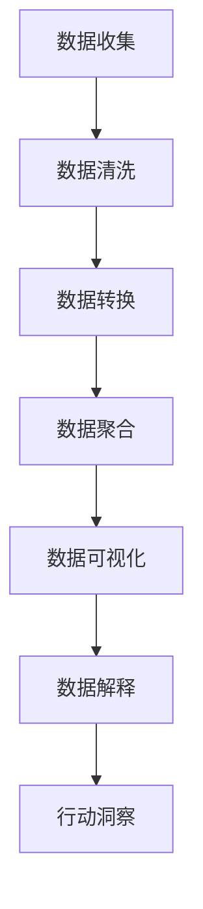

# Python 大数据处理

## 什么是大数据处理

在当今信息爆炸的时代，数据量呈指数级增长。大数据处理是指对超出常规数据库软件工具捕获、管理和处理能力的数据集进行处理和分析的技术。大数据通常具有"4V"特性：容量(Volume)、速度(Velocity)、多样性(Variety)和真实性(Veracity)。

Python因其简洁的语法、丰富的库生态系统和强大的数据处理能力，已经成为大数据领域的主要编程语言之一。

## Python 大数据处理的基础工具

### NumPy

NumPy是Python中用于科学计算的基础库，它提供了高性能的多维数组对象和用于操作这些数组的工具。

```python
import numpy as np

# 创建数组
arr = np.array([1, 2, 3, 4, 5])
print(arr)
print(type(arr))

# 基本操作
print(arr.shape)  # 形状
print(arr.ndim)   # 维度
print(arr.dtype)  # 数据类型
```

输出：
```
[1 2 3 4 5]
<class 'numpy.ndarray'>
(5,)
1
int64
```

### Pandas

Pandas是建立在NumPy之上的数据分析库，提供了高效的DataFrame和Series数据结构。

```python
import pandas as pd

# 创建DataFrame
data = {
    'Name': ['John', 'Anna', 'Peter', 'Linda'],
    'Age': [28, 34, 29, 42],
    'City': ['New York', 'Paris', 'Berlin', 'London']
}

df = pd.DataFrame(data)
print(df)

# 基本统计
print("\n基本统计信息：")
print(df.describe())
```

输出：
```
    Name  Age      City
0   John   28  New York
1   Anna   34     Paris
2  Peter   29    Berlin
3  Linda   42    London

基本统计信息：
             Age
count   4.000000
mean   33.250000
std     6.397887
min    28.000000
25%    28.750000
50%    31.500000
75%    36.000000
max    42.000000
```

## 处理大规模数据集

当数据集大小超过计算机内存时，我们需要使用特殊的工具和方法。

### Dask

Dask是一个并行计算库，允许你处理大于内存的数据集。

```python
import dask.dataframe as dd

# 从多个CSV文件创建Dask DataFrame
ddf = dd.read_csv('data/*.csv')  # 假设有多个大型CSV文件

# 执行计算
result = ddf.groupby('category').agg({'amount': 'sum'})
print(result.compute())  # compute()触发实际计算
```

:::note
Dask的API与Pandas非常相似，这使得从Pandas过渡到处理大数据集变得更加容易。
:::

### PySpark

PySpark是Apache Spark的Python API，它是一个用于大规模数据处理的分布式计算框架。

```python
from pyspark.sql import SparkSession

# 创建SparkSession
spark = SparkSession.builder \
    .appName("PythonBigData") \
    .getOrCreate()

# 从CSV文件创建DataFrame
df = spark.read.csv("data/large_dataset.csv", header=True, inferSchema=True)

# 执行SQL查询
df.createOrReplaceTempView("data")
result = spark.sql("""
    SELECT category, SUM(amount) as total_amount
    FROM data
    GROUP BY category
    ORDER BY total_amount DESC
""")

# 显示结果
result.show()
```

## 大数据可视化

在处理大数据时，可视化是理解和分析数据的关键步骤。

### Matplotlib和Seaborn

对于较小的数据集或大数据集的采样，Matplotlib和Seaborn是优秀的可视化库。

```python
import matplotlib.pyplot as plt
import seaborn as sns

# 使用Seaborn的样式
sns.set(style="whitegrid")

# 创建绘图
plt.figure(figsize=(10, 6))
sns.barplot(x='category', y='amount', data=result_df)
plt.title('各类别总金额')
plt.xlabel('类别')
plt.ylabel('总金额')
plt.xticks(rotation=45)
plt.tight_layout()
plt.savefig('category_amounts.png')
plt.show()
```

### Plotly和Bokeh

对于交互式可视化，Plotly和Bokeh提供了强大的功能。

```python
import plotly.express as px

# 创建交互式图表
fig = px.bar(result_df, x='category', y='amount',
             title='各类别总金额',
             labels={'category': '类别', 'amount': '总金额'})

# 显示图表
fig.show()
```

## 实际案例：电商数据分析

假设我们需要分析一个电子商务网站的大量销售数据，这些数据文件大小超过50GB。

```python
import dask.dataframe as dd
import pandas as pd
import matplotlib.pyplot as plt
import seaborn as sns

# 步骤1：加载大型数据集
sales = dd.read_csv('sales_data/*.csv', 
                   dtype={'user_id': 'str', 'product_id': 'str'})

# 步骤2：数据清洗和准备
sales = sales.dropna()  # 删除缺失值
sales['date'] = dd.to_datetime(sales['date'])
sales['month'] = sales['date'].dt.month
sales['year'] = sales['date'].dt.year

# 步骤3：计算每月销售额
monthly_sales = sales.groupby(['year', 'month'])['amount'].sum().compute()

# 步骤4：转换为pandas DataFrame进行可视化
monthly_sales_df = monthly_sales.reset_index()
monthly_sales_df['month_year'] = monthly_sales_df.apply(
    lambda x: f"{x['month']}-{x['year']}", axis=1)

# 步骤5：可视化结果
plt.figure(figsize=(12, 6))
sns.barplot(x='month_year', y='amount', data=monthly_sales_df)
plt.title('月度销售额')
plt.xlabel('月份-年份')
plt.ylabel('销售额')
plt.xticks(rotation=90)
plt.tight_layout()
plt.savefig('monthly_sales.png')
plt.show()

# 步骤6：计算热销产品
top_products = sales.groupby('product_id')['amount'].sum().nlargest(10).compute()
print("热销产品 (Top 10):")
print(top_products)
```

这个例子展示了如何使用Dask处理超大数据集，进行数据清洗、转换、聚合和可视化，最后得出有价值的业务洞察。

## 大数据处理流程

大数据处理通常遵循以下流程：



## 大数据处理的挑战与解决方案

### 1. 内存限制

**挑战**：内存无法容纳全部数据。

**解决方案**：
- 使用支持惰性计算的库，如Dask、PySpark
- 数据分块处理
- 增量处理数据

```python
# 使用Dask进行惰性计算
import dask.dataframe as dd

df = dd.read_csv('huge_data.csv')
result = df.groupby('column').mean().compute()  # 只在需要结果时计算
```

### 2. 性能问题

**挑战**：处理大数据集时计算速度慢。

**解决方案**：
- 使用并行处理
- 利用分布式计算
- 优化代码和算法

```python
# 使用Dask进行并行处理
from dask import delayed
import dask.multiprocessing

# 定义处理函数
@delayed
def process_chunk(filename):
    # 处理代码
    return result

# 并行处理多个文件
results = []
for file in files:
    result = process_chunk(file)
    results.append(result)

# 计算所有结果
final_results = dask.compute(*results)
```

### 3. 数据质量

**挑战**：大数据集中经常有脏数据、缺失值等问题。

**解决方案**：
- 实施强大的数据清洗流程
- 数据验证和监控
- 异常检测算法

## 总结

Python在大数据处理领域提供了丰富的工具和库，可以有效地处理和分析大量数据。从NumPy和Pandas等基础库，到Dask和PySpark等分布式计算框架，Python生态系统为各种大数据挑战提供了解决方案。

通过掌握这些工具和技术，你可以处理各种规模的数据集，从而获取有价值的洞察和知识。

## 练习

1. 使用Pandas加载一个中型CSV文件（约10MB），并计算基本统计信息。
2. 安装Dask并尝试处理一个超过计算机RAM大小的数据集。
3. 编写一个简单的PySpark应用程序，对一个大型数据集执行单词计数。
4. 使用Matplotlib或Seaborn创建数据可视化，展示数据集中的趋势。
5. 设计一个完整的大数据处理流程，从数据收集到可视化和解释。

## 进一步学习资源

- [Pandas官方文档](https://pandas.pydata.org/docs/)
- [Dask教程](https://tutorial.dask.org/)
- [Apache Spark官方文档](https://spark.apache.org/docs/latest/)
- [Python数据科学手册](https://jakevdp.github.io/PythonDataScienceHandbook/)
- [数据可视化与Matplotlib和Seaborn教程](https://seaborn.pydata.org/tutorial.html)

:::tip
学习大数据处理不仅需要掌握技术和工具，还需要理解数据科学原理和统计知识。建议从小型数据集开始，逐步过渡到更大的数据集。
:::