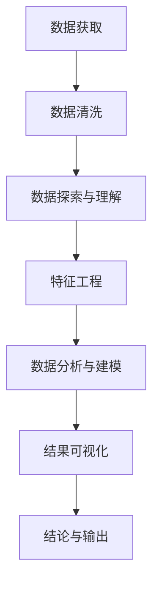

# Python 数据处理最佳实践

## 引言

在当今数据驱动的世界中，数据处理已经成为几乎所有编程工作的核心环节。Python凭借其简洁的语法和强大的库生态系统，已经成为数据处理的首选语言。然而，仅仅知道如何使用Python进行数据处理是不够的，掌握最佳实践才能让你的数据处理工作更高效、更可靠，同时产出更具可维护性的代码。

本文将全面介绍Python数据处理的最佳实践，从数据读取、清洗、转换到分析和可视化，涵盖整个数据处理工作流程中的关键技巧和注意事项。

## 数据处理的核心库

在Python中进行数据处理，几个核心库几乎是必不可少的：

```python
# 导入核心数据处理库
import numpy as np  # 科学计算库
import pandas as pd  # 数据分析库
import matplotlib.pyplot as plt  # 基础可视化库
import seaborn as sns  # 统计数据可视化
```

:::tip
为保证代码的可读性和可维护性，建议使用标准的库缩写名称，如上例所示。这些缩写已经成为Python数据科学社区的通用约定。
:::

## 最佳实践1：高效读取数据

### CSV文件读取

```python
# 高效读取CSV文件
df = pd.read_csv('data.csv')

# 仅读取需要的列，减少内存使用
df = pd.read_csv('data.csv', usecols=['name', 'age', 'salary'])

# 对大型文件使用分块读取技术
chunks = []
for chunk in pd.read_csv('large_data.csv', chunksize=10000):
    # 处理每个块
    processed_chunk = some_processing_function(chunk)
    chunks.append(processed_chunk)

# 合并所有处理过的块
result = pd.concat(chunks, ignore_index=True)
```

### 处理不同格式的数据

```python
# Excel文件
excel_df = pd.read_excel('data.xlsx', sheet_name='Sheet1')

# JSON文件
json_df = pd.read_json('data.json')

# SQL数据库
from sqlalchemy import create_engine
engine = create_engine('sqlite:///database.db')
sql_df = pd.read_sql('SELECT * FROM table_name', engine)
```

## 最佳实践2：数据清洗

数据清洗是数据处理过程中最重要也是最耗时的步骤之一。

### 处理缺失值

```python
# 检查缺失值
missing_values = df.isnull().sum()
print(missing_values)

# 删除含有缺失值的行
df_cleaned = df.dropna()

# 填充缺失值
df['age'] = df['age'].fillna(df['age'].mean())  # 用平均值填充年龄
df['category'] = df['category'].fillna('Unknown')  # 用字符串填充分类
```

**输出示例：**
```
name      0
age       5
salary    2
dtype: int64
```

### 处理重复数据

```python
# 检查重复行
duplicate_count = df.duplicated().sum()
print(f'发现 {duplicate_count} 条重复记录')

# 删除重复行
df = df.drop_duplicates()

# 仅基于特定列检查和删除重复
df = df.drop_duplicates(subset=['name', 'email'])
```

### 处理异常值

```python
# 使用箱线图检测异常值
plt.figure(figsize=(10, 6))
sns.boxplot(x=df['salary'])
plt.title('薪资分布箱线图')
plt.show()

# 使用Z分数识别异常值
from scipy import stats
z_scores = stats.zscore(df['salary'])
abs_z_scores = np.abs(z_scores)
filtered_entries = (abs_z_scores < 3)  # 过滤掉Z分数绝对值大于3的数据
df_no_outliers = df[filtered_entries]
```

## 最佳实践3：高效数据转换

### 使用向量化操作而非循环

```python
# 不推荐：使用循环处理数据
def slow_operation(df):
    result = []
    for i in range(len(df)):
        result.append(df.iloc[i]['value'] * 2)
    return result

# 推荐：使用向量化操作
def fast_operation(df):
    return df['value'] * 2

# 性能对比
import time

start = time.time()
slow_result = slow_operation(large_df)
print(f"循环操作时间: {time.time() - start:.4f}秒")

start = time.time()
fast_result = fast_operation(large_df)
print(f"向量化操作时间: {time.time() - start:.4f}秒")
```

**输出示例：**
```
循环操作时间: 2.3456秒
向量化操作时间: 0.0123秒
```

### 使用apply代替不可避免的循环

当真的需要应用复杂函数时，使用`apply`比循环更高效：

```python
# 定义需要应用到每行的函数
def process_row(row):
    if row['category'] == 'A':
        return row['value'] * 2
    else:
        return row['value'] / 2

# 应用到DataFrame的每一行
df['processed_value'] = df.apply(process_row, axis=1)
```

### 高效的数据合并

```python
# 合并两个DataFrame
df_combined = pd.merge(
    left=customers_df,
    right=orders_df,
    how='left',  # 保留左侧DataFrame的所有行
    left_on='customer_id',
    right_on='cust_id'
)

# 使用连接键的索引加速大型数据合并
customers_df.set_index('customer_id', inplace=True)
orders_df.set_index('cust_id', inplace=True)
df_combined = customers_df.join(orders_df, how='left')
```

## 最佳实践4：聚合与分组操作

### 高效的分组统计

```python
# 按类别分组并计算统计值
summary = df.groupby('category').agg({
    'value': ['min', 'max', 'mean', 'std'],
    'quantity': 'sum',
    'is_active': 'count'
})

print(summary)
```

**输出示例：**
```
          value                        quantity  is_active
            min    max     mean       std     sum     count
category                                                  
A          10.5  95.2  45.6789  25.4321    1200       100
B          12.3  87.6  52.3456  19.8765     950        95
C          15.7  79.8  48.7654  22.1234     800        80
```

### 高级分组技术

```python
# 多级分组
result = df.groupby(['category', 'region']).agg({
    'sales': ['sum', 'mean'],
    'profit': 'mean'
}).round(2)

# 过滤分组
def filter_groups(group):
    return group['sales'].mean() > 1000

filtered_groups = df.groupby('category').filter(filter_groups)
```

## 最佳实践5：数据可视化

可视化是理解数据的关键步骤，Python提供了强大的可视化工具。

### 使用Seaborn进行统计可视化

```python
# 设置风格
sns.set(style="whitegrid")

# 创建多子图
fig, axes = plt.subplots(1, 2, figsize=(16, 6))

# 子图1：数值分布
sns.histplot(df['value'], kde=True, ax=axes[0])
axes[0].set_title('数值分布直方图')

# 子图2：类别比较
sns.boxplot(x='category', y='value', data=df, ax=axes[1])
axes[1].set_title('不同类别的数值分布')

plt.tight_layout()
plt.show()
```

### 交互式可视化

```python
import plotly.express as px

# 创建交互式散点图
fig = px.scatter(df, 
                x='feature1', 
                y='feature2',
                color='category',
                size='value',
                hover_name='name',
                title='特征关系交互式散点图')

fig.show()
```

## 最佳实践6：数据导出与保存

处理完数据后，通常需要将结果保存以供进一步使用。

```python
# 保存为CSV文件
df.to_csv('processed_data.csv', index=False)

# 保存为Excel文件，包含多个工作表
with pd.ExcelWriter('processed_data.xlsx') as writer:
    df.to_excel(writer, sheet_name='Main Data', index=False)
    summary.to_excel(writer, sheet_name='Summary')
    
# 保存为数据库表
df.to_sql('processed_table', engine, if_exists='replace', index=False)
```

## 最佳实践7：内存优化

处理大型数据集时，内存优化至关重要。

```python
# 检查DataFrame的内存使用
def memory_usage(df):
    return f"Memory usage: {df.memory_usage().sum() / 1024**2:.2f} MB"

print(memory_usage(df))

# 优化数据类型，减少内存使用
def optimize_dtypes(df):
    # 优化整数列
    int_columns = df.select_dtypes(include=['int']).columns
    for col in int_columns:
        df[col] = pd.to_numeric(df[col], downcast='integer')
    
    # 优化浮点列
    float_columns = df.select_dtypes(include=['float']).columns
    for col in float_columns:
        df[col] = pd.to_numeric(df[col], downcast='float')
    
    return df

optimized_df = optimize_dtypes(df)
print(memory_usage(optimized_df))
```

**输出示例：**
```
Memory usage: 120.45 MB
Memory usage: 45.67 MB
```

## 实际案例：销售数据分析流程

让我们通过一个完整的销售数据分析案例，展示如何应用以上最佳实践。

```python
import numpy as np
import pandas as pd
import matplotlib.pyplot as plt
import seaborn as sns

# 1. 数据读取
sales_df = pd.read_csv('sales_data.csv', parse_dates=['date'])

# 2. 初步探索数据
print(f"数据形状: {sales_df.shape}")
print("\n前5行数据:")
print(sales_df.head())
print("\n数据信息:")
print(sales_df.info())
print("\n统计摘要:")
print(sales_df.describe())

# 3. 数据清洗
# 检查缺失值
missing = sales_df.isnull().sum()
print("\n缺失值统计:")
print(missing)

# 填充缺失值
sales_df['quantity'] = sales_df['quantity'].fillna(sales_df['quantity'].median())
sales_df['customer_id'] = sales_df['customer_id'].fillna('Unknown')

# 4. 特征工程
# 提取日期特征
sales_df['year'] = sales_df['date'].dt.year
sales_df['month'] = sales_df['date'].dt.month
sales_df['day'] = sales_df['date'].dt.day
sales_df['weekday'] = sales_df['date'].dt.weekday

# 计算销售额
sales_df['revenue'] = sales_df['quantity'] * sales_df['unit_price']

# 5. 数据聚合分析
# 按月份统计销售情况
monthly_sales = sales_df.groupby(['year', 'month']).agg({
    'revenue': 'sum',
    'order_id': 'nunique', # 订单数量
    'product_id': 'nunique' # 销售产品种类
}).reset_index()

# 按产品类别统计
category_sales = sales_df.groupby('product_category').agg({
    'revenue': ['sum', 'mean'],
    'quantity': 'sum'
}).sort_values(('revenue', 'sum'), ascending=False)

print("\n按产品类别的销售统计:")
print(category_sales)

# 6. 数据可视化
plt.figure(figsize=(12, 6))
sns.lineplot(data=monthly_sales, x='month', y='revenue', hue='year')
plt.title('月度销售趋势')
plt.xlabel('月份')
plt.ylabel('销售额')
plt.grid(True, alpha=0.3)
plt.tight_layout()
plt.show()

# 按产品类别可视化
plt.figure(figsize=(10, 6))
top_categories = category_sales.head(10).reset_index()
sns.barplot(x='product_category', y=('revenue', 'sum'), data=top_categories)
plt.title('销售额最高的前10个产品类别')
plt.xticks(rotation=45, ha='right')
plt.tight_layout()
plt.show()

# 7. 结果导出
monthly_sales.to_csv('monthly_sales_analysis.csv', index=False)
category_sales.to_excel('category_sales_analysis.xlsx')

print("数据分析完成，结果已导出到文件!")
```

## 数据处理工作流程图

以下是一个典型的Python数据处理工作流程：



## 总结

成功的Python数据处理项目需要结合技术知识和最佳实践。本文介绍的几个关键最佳实践包括：

1. **高效数据读取**：使用合适的参数和分块处理大型文件
2. **数据清洗**：充分处理缺失值、重复数据和异常值
3. **高效数据转换**：使用向量化操作代替循环，显著提高效率
4. **聚合与分组**：掌握高级分组和聚合技术，提取有意义的数据概要
5. **数据可视化**：选择合适的图表类型，清晰地传达数据故事
6. **数据导出**：以适当的格式保存处理结果
7. **内存优化**：处理大数据集时有效管理内存资源

掌握这些最佳实践不仅可以提高你的数据处理效率，还能确保你的分析结果更加可靠，代码更具可维护性，并能够更好地处理大型和复杂的数据集。

## 练习与进一步学习

为了巩固所学知识，建议完成以下练习：

1. 下载一个公开数据集（如Kaggle上的数据集），应用本文中的最佳实践进行完整的数据处理流程。
2. 尝试优化大型DataFrame（超过1GB）的内存使用，比较不同优化方法的效果。
3. 创建一个包含多个可视化的数据仪表板，展示数据的不同方面。

### 进一步学习资源

- [Pandas官方文档](https://pandas.pydata.org/docs/)
- [《Python for Data Analysis》](https://wesmckinney.com/book/)，作者Wes McKinney（Pandas创建者）
- [Kaggle Learn](https://www.kaggle.com/learn)上的数据处理课程
- [《Storytelling with Data》](http://www.storytellingwithdata.com/)，学习更有效的数据可视化

:::tip
数据处理是一项需要不断实践的技能。尝试应用这些最佳实践到各种不同的数据集，并持续学习新的技术和工具，将帮助你成为更高效的数据处理专家。
:::