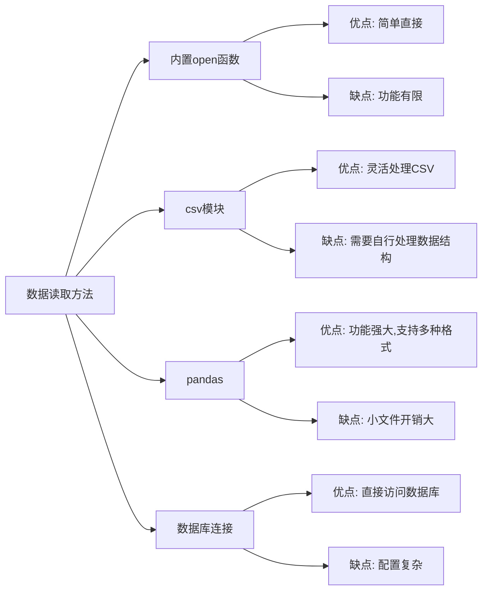

# Python 数据读取

在数据处理过程中，第一步通常是从外部源读取数据。Python提供了丰富的库和工具来读取各种格式的数据，让数据导入变得简单高效。本文将全面介绍Python数据读取的基本方法和常用技巧。

## 为什么数据读取很重要

在开始编写复杂的数据分析代码之前，我们需要先将数据加载到程序中。无论是处理简单的文本文件，还是复杂的数据库查询，掌握数据读取技巧都是数据处理的基础技能。

:::note
数据读取是数据处理流程中的第一步，也是整个数据分析工作流程的基础。
:::

## 文本文件读取

### 基本文件操作

Python内置了文件操作功能，可以轻松读取文本文件：

```python
# 读取整个文件内容
with open('example.txt', 'r', encoding='utf-8') as file:
    content = file.read()
    print(content)

# 逐行读取
with open('example.txt', 'r', encoding='utf-8') as file:
    for line in file:
        print(line.strip())  # strip()移除行尾换行符
```

### 使用`with`语句的好处

上面的例子使用了`with`语句，它能确保文件正确关闭，即使出现异常也会执行清理操作。这是处理文件的推荐方式。

:::tip
始终使用`with`语句来打开文件，避免忘记关闭文件导致资源泄露。
:::

## CSV文件读取

CSV(逗号分隔值)是存储表格数据的常用格式，Python的`csv`模块提供了读取CSV文件的功能：

```python
import csv

# 基本读取
with open('data.csv', 'r', encoding='utf-8') as file:
    csv_reader = csv.reader(file)
    for row in csv_reader:
        print(row)  # 每行是一个列表

# 使用DictReader读取（将每行转换为字典）
with open('data.csv', 'r', encoding='utf-8') as file:
    csv_reader = csv.DictReader(file)
    for row in csv_reader:
        print(row)  # 每行是一个字典，键为列名
```

### 实际案例：分析销售数据

假设我们有一个存储销售数据的CSV文件`sales.csv`：

```
日期,产品,价格,数量
2023-01-01,笔记本电脑,5999,10
2023-01-02,手机,3999,15
2023-01-03,平板电脑,2999,8
2023-01-03,笔记本电脑,5999,5
```

我们可以使用Python读取并计算总销售额：

```python
import csv

total_sales = 0
product_sales = {}

with open('sales.csv', 'r', encoding='utf-8') as file:
    csv_reader = csv.DictReader(file)
    for row in csv_reader:
        price = float(row['价格'])
        quantity = int(row['数量'])
        amount = price * quantity
        total_sales += amount
        
        # 按产品统计销售额
        product = row['产品']
        if product in product_sales:
            product_sales[product] += amount
        else:
            product_sales[product] = amount

print(f"总销售额: ¥{total_sales}")
print("各产品销售额:")
for product, sales in product_sales.items():
    print(f"{product}: ¥{sales}")
```

输出结果：
```
总销售额: ¥149965.0
各产品销售额:
笔记本电脑: ¥89985.0
手机: ¥59985.0
平板电脑: ¥23992.0
```

## 使用pandas读取数据

pandas是Python数据分析的核心库，提供了高效的数据结构和数据分析工具。它能够轻松读取多种格式的数据：

### 读取CSV文件

```python
import pandas as pd

# 读取CSV
df = pd.read_csv('data.csv')
print(df.head())  # 显示前5行
```

### 读取Excel文件

```python
import pandas as pd

# 读取Excel文件
df = pd.read_excel('data.xlsx', sheet_name='Sheet1')
print(df.head())
```

### 读取不同分隔符的文件

```python
# 读取制表符分隔的文件
df = pd.read_csv('data.tsv', sep='\t')

# 读取其他分隔符的文件
df = pd.read_csv('data.txt', sep='|')
```

### 处理缺失值和数据类型

```python
# 设置特定列的数据类型
df = pd.read_csv('data.csv', dtype={'id': int, 'price': float})

# 自定义缺失值标记
df = pd.read_csv('data.csv', na_values=['NA', 'Missing', 'N/A'])
```

## JSON数据读取

JSON是Web API最常用的数据格式之一，Python内置了`json`模块处理JSON数据：

```python
import json

# 从文件读取JSON
with open('data.json', 'r', encoding='utf-8') as file:
    data = json.load(file)
    print(data)

# 从字符串读取JSON
json_string = '{"name": "张三", "age": 30, "city": "北京"}'
data = json.loads(json_string)
print(data['name'])  # 输出: 张三
```

### 实际案例：处理API响应

```python
import requests
import json

# 发送API请求获取JSON数据
response = requests.get('https://api.example.com/data')
if response.status_code == 200:
    data = response.json()  # requests自动将JSON响应解析为Python对象
    
    # 处理数据
    print(f"获取到{len(data['items'])}条记录")
    
    # 提取特定信息
    for item in data['items']:
        print(f"ID: {item['id']}, 名称: {item['name']}")
else:
    print(f"请求失败，状态码: {response.status_code}")
```

## 数据库数据读取

Python可以连接多种类型的数据库，下面以SQLite为例：

```python
import sqlite3

# 连接到SQLite数据库
conn = sqlite3.connect('example.db')
cursor = conn.cursor()

# 执行查询
cursor.execute('SELECT * FROM users WHERE age > ?', (18,))
rows = cursor.fetchall()

# 显示结果
for row in rows:
    print(row)

# 关闭连接
conn.close()
```

使用pandas从数据库读取数据：

```python
import pandas as pd
import sqlite3

# 创建数据库连接
conn = sqlite3.connect('example.db')

# 直接读取SQL查询结果到DataFrame
df = pd.read_sql_query('SELECT * FROM users WHERE age > 18', conn)
print(df.head())

# 关闭连接
conn.close()
```

## 读取网络数据

### 使用requests库获取网页数据

```python
import requests

# 获取网页内容
response = requests.get('https://example.com')
if response.status_code == 200:
    html_content = response.text
    print(f"网页内容长度: {len(html_content)} 字符")
else:
    print(f"获取失败，状态码: {response.status_code}")
```

### 结合BeautifulSoup解析HTML

```python
import requests
from bs4 import BeautifulSoup

# 获取网页内容
response = requests.get('https://example.com')
if response.status_code == 200:
    # 创建BeautifulSoup对象解析HTML
    soup = BeautifulSoup(response.text, 'html.parser')
    
    # 提取标题
    title = soup.title.string
    print(f"网页标题: {title}")
    
    # 提取所有链接
    links = soup.find_all('a')
    print(f"网页中共有 {len(links)} 个链接")
    
    # 提取特定元素
    main_content = soup.find('div', class_='main-content')
    if main_content:
        print(main_content.get_text()[:100] + '...')
```

## 高级数据读取技巧

### 分块读取大文件

处理大文件时，一次性读取整个文件可能会导致内存不足。分块读取是一个更好的选择：

```python
# 使用pandas分块读取大CSV文件
import pandas as pd

chunk_size = 10000  # 每次读取10000行
total_rows = 0

for chunk in pd.read_csv('large_file.csv', chunksize=chunk_size):
    # 处理每个数据块
    total_rows += len(chunk)
    # 这里可以对chunk进行处理
    
print(f"总共处理了 {total_rows} 行数据")
```

### 并行数据处理

对于大数据集，可以使用并行处理加速：

```python
import pandas as pd
from concurrent.futures import ProcessPoolExecutor
import os

def process_file(filename):
    df = pd.read_csv(filename)
    # 进行数据处理
    result = df['value'].sum()
    return filename, result

# 假设我们有多个文件需要处理
files = ['data1.csv', 'data2.csv', 'data3.csv', 'data4.csv']

# 使用进程池并行处理
with ProcessPoolExecutor(max_workers=os.cpu_count()) as executor:
    results = list(executor.map(process_file, files))

# 显示结果
for filename, result in results:
    print(f"{filename}: {result}")
```

## 数据读取过程中的常见问题及解决方案

### 处理字符编码问题

```python
# 处理具有特定编码的文件
try:
    with open('data.csv', 'r', encoding='utf-8') as file:
        content = file.read()
except UnicodeDecodeError:
    # 如果UTF-8失败，尝试其他编码
    with open('data.csv', 'r', encoding='latin-1') as file:
        content = file.read()
```

### 处理损坏的数据

```python
import pandas as pd

# 处理CSV文件中的错误
df = pd.read_csv('data.csv', error_bad_lines=False, warn_bad_lines=True)
```

:::warning
在pandas 1.3.0版本后，`error_bad_lines`和`warn_bad_lines`参数被弃用，请使用`on_bad_lines`参数代替：
```python
df = pd.read_csv('data.csv', on_bad_lines='skip')
```
:::

## 数据读取方法对比

不同数据读取方法各有优劣，以下是简要对比：



## 总结

Python提供了丰富的数据读取工具和库，让我们能够轻松处理各种格式的数据：

1. 使用内置`open()`函数读取文本文件
2. 使用`csv`模块处理CSV文件
3. 使用`json`模块处理JSON数据
4. 使用pandas读取各种结构化数据
5. 通过数据库连接器读取数据库数据
6. 使用requests和BeautifulSoup获取网络数据

选择合适的数据读取方法取决于数据格式、数据大小和具体需求。对于大多数数据分析任务，pandas是最常用的选择，因为它提供了强大的数据结构和分析功能。

## 练习

1. 创建一个文本文件，使用Python读取并计算文件中的字符数、单词数和行数。
2. 下载一个公开的CSV数据集（如[Kaggle](https://www.kaggle.com/datasets)上的数据集），使用pandas读取并进行简单的数据探索。
3. 编写一个程序，从JSON API获取数据并提取特定信息（如天气API、新闻API等）。
4. 尝试读取一个Excel文件，并将特定列的数据提取出来进行分析。
5. 编写一个程序，从网页中抓取特定内容（如新闻标题、产品价格等）。

## 进一步学习资源

- [pandas官方文档](https://pandas.pydata.org/docs/)
- [Python官方CSV模块文档](https://docs.python.org/3/library/csv.html)
- [Python JSON模块文档](https://docs.python.org/3/library/json.html)
- [requests库文档](https://docs.python-requests.org/)
- [BeautifulSoup文档](https://www.crummy.com/software/BeautifulSoup/bs4/doc/)

掌握数据读取是数据处理的第一步，通过这些技巧，你可以从各种来源获取数据，为后续的数据处理和分析奠定坚实基础。