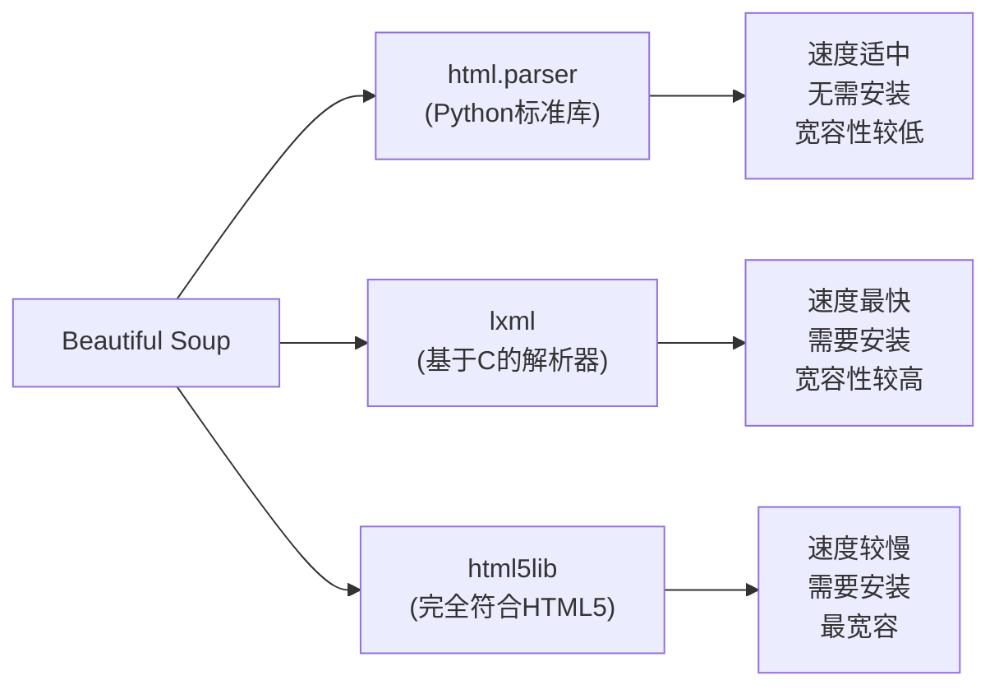

# Python Beautiful Soup

## 什么是Beautiful Soup？

Beautiful Soup是Python的一个库，用于从HTML和XML文件中提取数据。它与您喜欢的解析器一起工作，为导航、搜索和修改解析树提供习惯的方法。它通常可以节省程序员数小时的工作时间，是网络爬虫和数据提取工作的不二选择。

:::tip
Beautiful Soup 名字的由来是来自《爱丽丝梦游仙境》中的一首诗，名为"美丽汤"（Beautiful Soup）。
:::

## 安装Beautiful Soup

安装Beautiful Soup非常简单，可以使用pip进行安装：

```bash
pip install beautifulsoup4
```

Beautiful Soup依赖一个解析器来分析HTML/XML文档。常用的解析器包括：

- `html.parser`: Python标准库
- `lxml`: 基于C的解析器，速度快且灵活
- `html5lib`: 最符合HTML5规范的解析器

推荐安装lxml解析器:

```bash
pip install lxml
```

## 基础用法

### 创建Beautiful Soup对象

首先，需要从HTML或XML中创建一个Beautiful Soup对象：

```python
from bs4 import BeautifulSoup

# HTML文档示例
html_doc = """
<html>
    <head>
        <title>Python编程学习网站</title>
    </head>
    <body>
        <h1>欢迎来到Python编程世界</h1>
        <p class="introduction">Beautiful Soup是一个强大的<b>网页解析</b>工具。</p>
        <p class="content">我们将学习如何提取网页数据。</p>
        <ul>
            <li><a href="https://example.com/bs4">BS4教程</a></li>
            <li><a href="https://example.com/parsing">解析技巧</a></li>
        </ul>
    </body>
</html>
"""

# 创建Beautiful Soup对象
soup = BeautifulSoup(html_doc, 'lxml')

# 格式化输出解析后的HTML
print(soup.prettify())
```

输出将是格式化的HTML文档：

```
<html>
 <head>
  <title>
   Python编程学习网站
  </title>
 </head>
 <body>
  <h1>
   欢迎来到Python编程世界
  </h1>
  <p class="introduction">
   Beautiful Soup是一个强大的
   <b>
    网页解析
   </b>
   工具。
  </p>
  <p class="content">
   我们将学习如何提取网页数据。
  </p>
  <ul>
   <li>
    <a href="https://example.com/bs4">
     BS4教程
    </a>
   </li>
   <li>
    <a href="https://example.com/parsing">
     解析技巧
    </a>
   </li>
  </ul>
 </body>
</html>
```

### 导航解析树

Beautiful Soup提供了多种方法来导航和搜索解析树。

#### 直接访问标签

```python
print(soup.title)  # <title>Python编程学习网站</title>
print(soup.title.name)  # title
print(soup.title.string)  # Python 编程学习网站
print(soup.h1)  # <h1>欢迎来到Python编程世界</h1>
```

#### 获取属性

```python
print(soup.p['class'])  # ['introduction']
```

#### 获取文本内容

```python
print(soup.h1.text)  # 欢迎来到Python编程世界
print(soup.p.b.string)  # 网页解析
```

### 查找标签

#### find和find_all方法

`find`方法返回查找到的第一个标签，而`find_all`方法返回所有匹配的标签列表。

```python
# 查找所有<a>标签
links = soup.find_all('a')
print(f"找到 {len(links)} 个链接")
for link in links:
    print(f"链接文本: {link.text}, 链接URL: {link['href']}")

# 查找第一个class为"introduction"的<p>标签
intro = soup.find('p', class_='introduction')
print(f"介绍段落: {intro.text}")

# 使用CSS选择器查找元素
content = soup.select('p.content')
print(f"内容段落: {content[0].text}")
```

输出:

```
找到 2 个链接
链接文本: BS4教程, 链接URL: https://example.com/bs4
链接文本: 解析技巧, 链接URL: https://example.com/parsing
介绍段落: Beautiful Soup是一个强大的网页解析工具。
内容段落: 我们将学习如何提取网页数据。
```

## 高级用法

### CSS选择器

Beautiful Soup的`select`方法支持CSS选择器，这使得查找元素变得更加灵活和强大：

```python
# 选择所有<a>标签
links = soup.select('a')

# 选择class为introduction的<p>标签
intro = soup.select('p.introduction')

# 选择ul下的所有li标签
items = soup.select('ul li')
```

### 解析表格数据

表格数据在网页中很常见，Beautiful Soup可以轻松提取表格数据：

```python
html_table = """
<table>
  <tr>
    <th>语言</th>
    <th>创建年份</th>
    <th>特点</th>
  </tr>
  <tr>
    <td>Python</td>
    <td>1991</td>
    <td>简单易学，应用广泛</td>
  </tr>
  <tr>
    <td>Java</td>
    <td>1995</td>
    <td>面向对象，跨平台</td>
  </tr>
</table>
"""

soup = BeautifulSoup(html_table, 'lxml')

# 提取表头
headers = []
for th in soup.find_all('th'):
    headers.append(th.text.strip())
print(f"表头: {headers}")

# 提取行数据
rows = []
for tr in soup.find_all('tr')[1:]:  # 跳过表头行
    row = {}
    for i, td in enumerate(tr.find_all('td')):
        row[headers[i]] = td.text.strip()
    rows.append(row)

print("表格数据:")
for row in rows:
    print(row)
```

输出:

```
表头: ['语言', '创建年份', '特点']
表格数据:
{'语言': 'Python', '创建年份': '1991', '特点': '简单易学，应用广泛'}
{'语言': 'Java', '创建年份': '1995', '特点': '面向对象，跨平台'}
```

### 修改解析树

Beautiful Soup不仅可以提取数据，还可以修改HTML结构：

```python
# 修改标题
soup.title.string = "Python网络爬虫教程"

# 添加新标签
new_tag = soup.new_tag('p')
new_tag.string = "这是一个新段落"
new_tag['class'] = 'new-content'
soup.body.append(new_tag)

# 删除标签
soup.ul.decompose()

print(soup.prettify())
```

## 实际应用案例：爬取网页数据

下面是一个实际的例子，展示如何使用Beautiful Soup从网页中提取数据：

```python
import requests
from bs4 import BeautifulSoup

def scrape_python_blog():
    """
    从Python官方博客获取最新文章的标题和链接
    """
    url = "https://blog.python.org/"
    
    # 发送HTTP请求
    response = requests.get(url)
    
    # 检查请求是否成功
    if response.status_code == 200:
        # 创建Beautiful Soup对象
        soup = BeautifulSoup(response.text, 'lxml')
        
        # 查找文章条目
        articles = soup.select('article.entry')
        
        blog_data = []
        for article in articles:
            # 提取标题
            title_element = article.find('h1', class_='entry-title')
            if title_element and title_element.a:
                title = title_element.a.text.strip()
                link = title_element.a['href']
                
                # 提取日期
                date_element = article.find('time', class_='entry-date')
                date = date_element.text.strip() if date_element else "未知日期"
                
                blog_data.append({
                    'title': title,
                    'link': link,
                    'date': date
                })
        
        return blog_data
    else:
        print(f"请求失败，状态码: {response.status_code}")
        return []

# 执行爬虫函数
python_blog_articles = scrape_python_blog()

# 显示结果
print(f"找到 {len(python_blog_articles)} 篇文章:")
for i, article in enumerate(python_blog_articles[:5], 1):  # 只显示前5篇
    print(f"{i}. {article['title']} ({article['date']})")
    print(f"   链接: {article['link']}")
    print()
```

:::caution
在实际使用Web爬虫时，请务必遵守网站的robots.txt规则，并确保您的爬虫不会过度请求导致服务器负担。同时，尊重版权和使用条款。
:::

## Beautiful Soup的解析器比较

下面是Beautiful Soup支持的主要解析器之间的比较：



## 性能优化建议

使用Beautiful Soup爬取大量数据时，可以考虑以下优化技巧：

1. 使用lxml解析器以获得更好的性能
2. 精确定位元素，避免使用过于广泛的选择器
3. 在处理大型文档时，考虑使用SAX解析器或者增量解析
4. 对于简单的HTML提取，考虑使用正则表达式以提高速度

```python
# 性能对比示例
import time
from bs4 import BeautifulSoup

large_html = "<html>" + "<div>测试</div>" * 10000 + "</html>"

# 使用不同解析器测试性能
parsers = ['html.parser', 'lxml', 'html5lib']
for parser in parsers:
    start_time = time.time()
    soup = BeautifulSoup(large_html, parser)
    divs = soup.find_all('div')
    end_time = time.time()
    print(f"解析器 {parser} 找到 {len(divs)} 个div标签，用时: {end_time - start_time:.4f} 秒")
```

## 常见错误和解决方法

### 解析器导入错误

```
ImportError: No module named 'lxml'
```

**解决方法**: 安装lxml库 `pip install lxml`

### 无法找到元素

**原因**: 选择器不正确或元素结构与预期不同

**解决方法**: 使用`print(soup.prettify())`检查实际HTML结构，并调整选择器

### 编码问题

**原因**: Beautiful Soup可能无法正确检测HTML的编码

**解决方法**: 明确指定编码

```python
soup = BeautifulSoup(html_content, 'lxml', from_encoding='utf-8')
```

## 总结

Beautiful Soup是Python中处理HTML和XML数据的强大工具，它提供了简单直观的API来导航、搜索和修改解析树。主要优点包括：

- 易于学习和使用
- 支持多种解析器
- 灵活的查找方法
- 强大的导航功能
- 可以修改HTML结构

通过本教程，您已经学会了：

1. 安装和配置Beautiful Soup
2. 创建解析树并导航
3. 使用各种方法查找元素
4. 提取和操作数据
5. 实际应用案例

## 练习

1. 爬取一个技术博客网站的最新文章标题和链接
2. 从在线购物网站提取产品信息（名称、价格、评分等）
3. 解析维基百科页面，提取所有章节标题
4. 创建一个程序，从新闻网站提取最新的新闻标题和摘要
5. 尝试提取一个包含表格的网页，并将数据保存为CSV格式

## 附加资源

- [Beautiful Soup 官方文档](https://www.crummy.com/software/BeautifulSoup/bs4/doc/)
- [网络爬虫伦理指南](https://www.robotstxt.org/robotstxt.html)
- [HTML解析器比较](https://www.crummy.com/software/BeautifulSoup/bs4/doc/#installing-a-parser)

:::note
当您掌握了Beautiful Soup的基础知识后，可以探索更高级的工具如Scrapy框架，它提供了更完整的爬虫解决方案，特别适合大规模爬虫项目。
:::