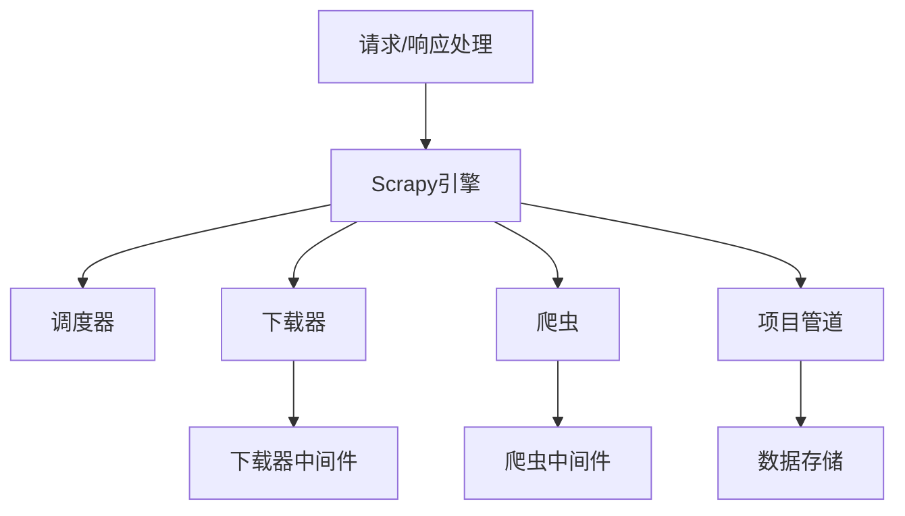

# Python Scrapy框架

## 什么是Scrapy？

Scrapy是一个用Python编写的开源协作框架，专为网络爬虫和网页数据提取而设计。作为一个高效、结构化的爬虫框架，Scrapy允许开发者以简洁的方式抓取网站并从中提取结构化数据，适用于数据挖掘、信息处理或历史存档等多种场景。

:::note 核心特点
- 内置XPath和CSS选择器，轻松提取数据
- 异步处理框架，高效处理并发请求
- 自动化的请求处理和失败重试机制
- 完善的中间件系统，便于扩展
- 强大的数据导出功能，支持多种格式（JSON, CSV, XML等）
:::

## Scrapy架构

Scrapy采用组件化设计，各组件之间松耦合，便于扩展和自定义。



### 主要组件

1. **引擎(Engine)**: 控制数据流在系统中所有组件间的流动，并在相应动作发生时触发事件。

2. **调度器(Scheduler)**: 接收引擎发来的请求，并将它们入队，以便之后引擎请求它们时提供给引擎。

3. **下载器(Downloader)**: 获取网页并将它们提供给引擎，而引擎将它们提供给爬虫。

4. **爬虫(Spiders)**: 用户编写的类，用来解析响应并提取数据或发现新的URL。

5. **项目管道(Item Pipeline)**: 负责处理爬虫从网页中抽取的项目，主要用于数据清洗和存储。

6. **中间件(Middlewares)**: 位于引擎与各组件之间的钩子框架，处理组件间传递的请求和响应。

## 安装Scrapy

使用pip安装Scrapy非常简单：

```python
pip install scrapy
```

### 创建项目

安装完成后，我们可以创建一个新的Scrapy项目：

```python
scrapy startproject myproject
```

这将生成以下目录结构：

```
myproject/
    scrapy.cfg            # 项目配置文件
    myproject/            # 项目的Python模块
        __init__.py
        items.py          # 项目定义的Item
        middlewares.py    # 项目中间件
        pipelines.py      # 项目管道
        settings.py       # 项目设置
        spiders/          # 放置爬虫的目录
            __init__.py
```

## 创建爬虫

在Scrapy项目中创建爬虫是关键步骤。下面创建一个简单的爬虫，爬取引用名言网站的内容：

```python
# 在myproject/spiders目录下创建quotes_spider.py文件
import scrapy

class QuotesSpider(scrapy.Spider):
    name = "quotes"  # 爬虫唯一标识
    start_urls = [
        'http://quotes.toscrape.com/page/1/',
    ]

    def parse(self, response):
        for quote in response.css('div.quote'):
            yield {
                'text': quote.css('span.text::text').get(),
                'author': quote.css('small.author::text').get(),
                'tags': quote.css('div.tags a.tag::text').getall(),
            }

        # 获取下一页链接并跟随
        next_page = response.css('li.next a::attr(href)').get()
        if next_page is not None:
            yield response.follow(next_page, self.parse)
```

### 运行爬虫

在项目根目录下运行爬虫：

```python
scrapy crawl quotes
```

默认情况下，输出会显示在控制台。如果要保存结果，可以使用：

```python
scrapy crawl quotes -o quotes.json
```

这将创建一个quotes.json文件，包含所有提取的数据。

## 数据提取工具

Scrapy提供了强大的数据提取工具，如CSS选择器和XPath表达式。

### CSS选择器示例

```python
# 提取所有h1标签
response.css('h1')

# 提取h1标签的文本
response.css('h1::text').get()

# 提取带特定类的元素
response.css('div.quote')

# 提取属性值
response.css('a::attr(href)').get()
```

### XPath选择器示例

```python
# 提取所有h1标签
response.xpath('//h1')

# 提取h1标签的文本
response.xpath('//h1/text()').get()

# 提取带特定类的元素
response.xpath('//div[@class="quote"]')

# 提取属性值
response.xpath('//a/@href').get()
```

## 处理表单和登录

Scrapy可以轻松处理表单提交和登录操作：

```python
import scrapy

class LoginSpider(scrapy.Spider):
    name = 'login'
    start_urls = ['http://quotes.toscrape.com/login']

    def parse(self, response):
        # 提取CSRF令牌（如果有）
        token = response.css('input[name="csrf_token"]::attr(value)').get()
        
        # 提交登录表单
        return scrapy.FormRequest.from_response(
            response,
            formdata={
                'username': 'your_username',
                'password': 'your_password',
                'csrf_token': token
            },
            callback=self.after_login
        )

    def after_login(self, response):
        # 检查登录是否成功
        if "错误信息" in response.text:
            self.logger.error("登录失败")
            return
        
        # 继续爬取登录后的页面
        self.logger.info("登录成功!")
        # 开始爬取受保护的页面
```

## 实际案例：爬取电商网站商品信息

下面是一个更复杂的实例，爬取某电商网站的商品信息：

```python
import scrapy
from myproject.items import ProductItem

class EcommerceSpider(scrapy.Spider):
    name = "ecommerce"
    start_urls = ['https://example-ecommerce-site.com/products']
    
    def parse(self, response):
        # 提取所有商品链接
        for product_link in response.css('a.product-card::attr(href)').getall():
            yield response.follow(product_link, self.parse_product)
            
        # 分页处理
        next_page = response.css('a.next-page::attr(href)').get()
        if next_page:
            yield response.follow(next_page, self.parse)
    
    def parse_product(self, response):
        product = ProductItem()
        product['name'] = response.css('h1.product-title::text').get().strip()
        product['price'] = response.css('span.price::text').get().strip()
        product['description'] = response.css('div.description::text').get().strip()
        product['image_url'] = response.css('img.main-image::attr(src)').get()
        product['category'] = response.css('ul.breadcrumb li:nth-child(2)::text').get().strip()
        product['stock'] = '有货' if response.css('span.in-stock') else '缺货'
        
        # 提取评论
        product['reviews'] = []
        for review in response.css('div.review'):
            product['reviews'].append({
                'author': review.css('span.author::text').get().strip(),
                'rating': int(review.css('div.stars span::text').get()),
                'content': review.css('p.review-text::text').get().strip()
            })
            
        yield product
```

## 中间件的使用

中间件是Scrapy处理流程中的重要组成部分，用于处理请求和响应。

### 下载器中间件示例

下面是一个设置随机User-Agent的中间件：

```python
# 在middlewares.py中添加
import random

class RandomUserAgentMiddleware:
    user_agents = [
        'Mozilla/5.0 (Windows NT 10.0; Win64; x64) AppleWebKit/537.36 (KHTML, like Gecko) Chrome/91.0.4472.124 Safari/537.36',
        'Mozilla/5.0 (X11; Linux x86_64) AppleWebKit/537.36 (KHTML, like Gecko) Chrome/92.0.4515.107 Safari/537.36',
        'Mozilla/5.0 (Windows NT 10.0; Win64; x64; rv:90.0) Gecko/20100101 Firefox/90.0'
    ]
    
    def process_request(self, request, spider):
        request.headers['User-Agent'] = random.choice(self.user_agents)
```

然后在settings.py中启用该中间件：

```python
DOWNLOADER_MIDDLEWARES = {
   'myproject.middlewares.RandomUserAgentMiddleware': 543,
}
```

## 项目管道示例

项目管道用于处理爬取到的数据，例如清洗、验证和存储：

```python
# 在pipelines.py中添加
import pymongo

class MongoPipeline:
    
    def __init__(self, mongo_uri, mongo_db):
        self.mongo_uri = mongo_uri
        self.mongo_db = mongo_db
    
    @classmethod
    def from_crawler(cls, crawler):
        return cls(
            mongo_uri=crawler.settings.get('MONGO_URI'),
            mongo_db=crawler.settings.get('MONGO_DATABASE', 'items')
        )
    
    def open_spider(self, spider):
        self.client = pymongo.MongoClient(self.mongo_uri)
        self.db = self.client[self.mongo_db]
    
    def close_spider(self, spider):
        self.client.close()
    
    def process_item(self, item, spider):
        collection = self.db[spider.name]
        collection.insert_one(dict(item))
        return item
```

在settings.py中启用该管道：

```python
ITEM_PIPELINES = {
   'myproject.pipelines.MongoPipeline': 300,
}

MONGO_URI = 'mongodb://localhost:27017'
MONGO_DATABASE = 'scrapy_data'
```

## 性能优化与调优

为了提高Scrapy的性能，可以调整以下设置：

```python
# settings.py中添加

# 并发请求数
CONCURRENT_REQUESTS = 16

# 对同一域名的并发请求数
CONCURRENT_REQUESTS_PER_DOMAIN = 8

# 下载延迟，单位为秒
DOWNLOAD_DELAY = 0.5

# 禁用cookies
COOKIES_ENABLED = False

# 使用AutoThrottle扩展自动调节爬取速度
AUTOTHROTTLE_ENABLED = True
AUTOTHROTTLE_START_DELAY = 5.0
AUTOTHROTTLE_MAX_DELAY = 60.0
AUTOTHROTTLE_TARGET_CONCURRENCY = 1.0
```

## 处理AJAX和JavaScript渲染页面

对于依赖JavaScript渲染的网页，可以结合Selenium或Splash等工具：

```python
from scrapy_splash import SplashRequest

class JavascriptSpider(scrapy.Spider):
    name = "javascript_spider"
    
    def start_requests(self):
        urls = ['https://example.com/javascript-page']
        for url in urls:
            yield SplashRequest(url=url, callback=self.parse, 
                                args={'wait': 0.5})
    
    def parse(self, response):
        # 现在可以处理JavaScript渲染后的页面
        title = response.css('h1::text').get()
        yield {'title': title}
```

:::caution
使用Selenium或Splash会大幅增加资源消耗，应尽量寻找API或其他数据来源。
:::

## 总结

Scrapy是一个功能强大、灵活且高效的网络爬虫框架，适合各种网络数据采集任务。通过本教程，我们学习了：

1. Scrapy的基本架构和组件
2. 如何创建并运行Scrapy项目
3. 如何使用选择器提取数据
4. 如何处理表单和登录
5. 如何实现中间件和项目管道
6. 如何优化爬虫性能
7. 如何处理JavaScript渲染的页面

掌握这些知识后，你已经具备使用Scrapy开发复杂爬虫的基本能力。随着实践经验的积累，你将能够处理更加复杂的爬虫任务。

## 练习建议

1. **初级练习**: 创建一个简单爬虫爬取新闻网站的标题和链接
2. **中级练习**: 实现一个爬虫爬取电影评论网站的评论和评分数据
3. **高级练习**: 开发一个需要登录的论坛爬虫，提取帖子内容和回复

## 扩展资源

- [Scrapy官方文档](https://docs.scrapy.org/)
- [Web Scraping with Python](https://www.oreilly.com/library/view/web-scraping-with/9781491985564/) - 推荐书籍
- [Scrapy GitHub仓库](https://github.com/scrapy/scrapy)
- [Scrapy云服务Zyte](https://www.zyte.com/) - 用于大规模部署爬虫

:::tip 学习建议
在学习爬虫的过程中，请务必遵守网站的robots.txt规则，遵守相关法律法规，避免对目标网站造成过大负担。爬虫技术应用于合法场景，如数据分析、学术研究等。
:::