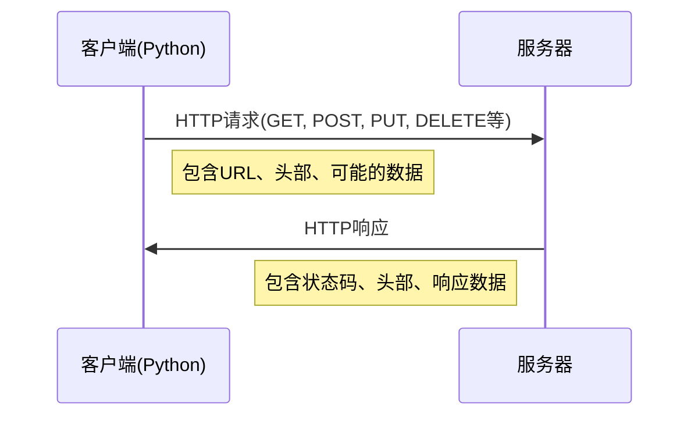

# Python HTTP请求

在现代Web开发和数据分析中，能够通过程序发送HTTP请求是一项基本而重要的技能。HTTP（超文本传输协议）是互联网上用于传输网页和其他数据的标准协议。Python提供了多种方法来发送HTTP请求，而其中最流行和易用的就是`requests`库。

## 什么是HTTP请求？

HTTP请求是客户端（如浏览器或程序）向服务器发送的消息，请求获取或修改数据。每个HTTP请求都包含：

1. 请求方法（如GET、POST、PUT、DELETE等）
2. 目标URL
3. 请求头（包含元数据）
4. 可选的请求体（包含要发送的数据）

服务器接收请求后会返回HTTP响应，包含状态码、响应头和响应体。



## 安装requests库

在开始之前，我们需要安装Python的requests库：

```bash
pip install requests
```

:::tip
requests库不是Python标准库的一部分，需要单独安装，但它是Python生态系统中最受欢迎的库之一。
:::

## 发送基本HTTP请求

### GET请求

GET请求用于从服务器获取数据，是最常用的HTTP方法：

```python
import requests

# 发送GET请求
response = requests.get('https://api.example.com/data')

# 检查响应状态码
print(f"状态码: {response.status_code}")

# 打印响应内容
print(f"响应内容: {response.text}")

# 如果响应是JSON格式，可以直接转换为Python字典
if response.headers.get('Content-Type') == 'application/json':
    data = response.json()
    print(f"JSON数据: {data}")
```

输出示例：
```
状态码: 200
响应内容: {"message": "Hello, World!", "status": "success"}
JSON数据: {'message': 'Hello, World!', 'status': 'success'}
```

### POST请求

POST请求用于向服务器发送数据，例如提交表单或创建新资源：

```python
import requests

# 要发送的数据
data = {
    'username': 'python_user',
    'password': 'secure_password'
}

# 发送POST请求
response = requests.post('https://api.example.com/login', data=data)

# 检查响应
print(f"状态码: {response.status_code}")
print(f"响应内容: {response.text}")
```

### 发送JSON数据

在现代Web API中，JSON是最常用的数据格式：

```python
import requests

# 要发送的JSON数据
json_data = {
    'name': '张三',
    'age': 30,
    'email': 'zhangsan@example.com'
}

# 发送POST请求，自动将Python字典转换为JSON
response = requests.post('https://api.example.com/users', json=json_data)

print(f"状态码: {response.status_code}")
print(f"响应内容: {response.text}")
```

## 请求头和参数

### 添加请求头

HTTP请求头包含有关请求的额外信息，如内容类型、认证信息等：

```python
import requests

headers = {
    'User-Agent': 'Python Requests Tutorial',
    'Authorization': 'Bearer YOUR_ACCESS_TOKEN',
    'Content-Type': 'application/json'
}

response = requests.get('https://api.example.com/protected-data', headers=headers)

print(f"状态码: {response.status_code}")
print(f"响应内容: {response.text}")
```

### 添加URL参数

URL参数通常用于过滤、分页或搜索：

```python
import requests

# 方法1：手动添加参数到URL
response = requests.get('https://api.example.com/search?q=python&page=1')

# 方法2：使用params参数（推荐）
params = {
    'q': 'python',
    'page': 1
}

response = requests.get('https://api.example.com/search', params=params)

# 两种方法等效
print(f"实际请求URL: {response.url}")
print(f"状态码: {response.status_code}")
```

输出示例：
```
实际请求URL: https://api.example.com/search?q=python&page=1
状态码: 200
```

## 处理响应

HTTP响应包含状态码、响应头和响应体。了解如何处理这些信息非常重要：

```python
import requests

response = requests.get('https://api.example.com/data')

# 1. 检查状态码
if response.status_code == 200:
    print("请求成功！")
elif response.status_code == 404:
    print("资源不存在！")
else:
    print(f"请求失败，状态码: {response.status_code}")

# 2. 查看响应头
print(f"内容类型: {response.headers.get('Content-Type')}")
print(f"服务器类型: {response.headers.get('Server')}")

# 3. 获取响应内容
# 文本形式
text_content = response.text
print(f"文本内容: {text_content[:50]}...") # 只打印前50个字符

# JSON形式（如果适用）
try:
    json_content = response.json()
    print(f"JSON内容: {json_content}")
except ValueError:
    print("响应不是有效的JSON格式")

# 4. 二进制内容（如下载文件）
binary_content = response.content
print(f"二进制内容大小: {len(binary_content)} 字节")
```

## 其他常用HTTP方法

除了GET和POST外，常用的HTTP方法还有：

```python
import requests

# PUT请求，用于更新资源
put_response = requests.put('https://api.example.com/users/1', 
                          json={'name': '李四', 'age': 35})

# DELETE请求，用于删除资源
delete_response = requests.delete('https://api.example.com/users/1')

# PATCH请求，用于部分更新资源
patch_response = requests.patch('https://api.example.com/users/1', 
                              json={'age': 36})

# HEAD请求，只获取响应头（不包含响应体）
head_response = requests.head('https://api.example.com/data')
print(f"HEAD请求内容类型: {head_response.headers.get('Content-Type')}")
```

## 高级用法

### 会话管理

使用会话可以在多个请求间保持某些参数，如cookie：

```python
import requests

# 创建会话对象
session = requests.Session()

# 登录操作
login_data = {'username': 'user', 'password': 'pass'}
session.post('https://api.example.com/login', data=login_data)

# 后续请求会自动包含前面获取的cookies
# 这对于需要认证的API非常有用
response = session.get('https://api.example.com/dashboard')
print(response.text)

# 会话使用完毕后关闭
session.close()
```

### 超时设置

设置超时可避免程序在网络不佳时无限等待：

```python
import requests

try:
    # 设置5秒连接超时，10秒读取超时
    response = requests.get('https://api.example.com/data', 
                          timeout=(5, 10))
    print(response.text)
except requests.exceptions.Timeout:
    print("请求超时！")
```

### 错误处理

妥善处理请求过程中可能出现的各种异常：

```python
import requests

try:
    response = requests.get('https://nonexistent-site.xyz')
    response.raise_for_status()  # 如果状态码不是200，抛出异常
    
    print(response.text)
except requests.exceptions.HTTPError as err:
    print(f"HTTP错误: {err}")
except requests.exceptions.ConnectionError:
    print("连接错误，请检查网络连接或URL")
except requests.exceptions.Timeout:
    print("请求超时")
except requests.exceptions.RequestException as err:
    print(f"请求出错: {err}")
```

## 实际案例

### 案例1：获取天气数据

以下示例展示如何使用公共API获取天气信息（使用OpenWeatherMap API）：

```python
import requests
import json

def get_weather(city, api_key):
    url = f"https://api.openweathermap.org/data/2.5/weather"
    
    # 设置请求参数
    params = {
        'q': city,
        'appid': api_key,
        'units': 'metric',  # 摄氏度
        'lang': 'zh_cn'     # 中文
    }
    
    try:
        response = requests.get(url, params=params)
        response.raise_for_status()
        
        # 解析结果
        weather_data = response.json()
        
        # 提取需要的信息
        temp = weather_data['main']['temp']
        humidity = weather_data['main']['humidity']
        description = weather_data['weather'][0]['description']
        
        print(f"{city}的天气: {description}")
        print(f"温度: {temp}°C")
        print(f"湿度: {humidity}%")
        
        return weather_data
    except requests.exceptions.HTTPError as err:
        print(f"HTTP错误: {err}")
    except Exception as e:
        print(f"发生错误: {e}")
        
    return None

# 使用示例（需要自己的OpenWeatherMap API密钥）
# api_key = "your_api_key_here"
# get_weather("北京", api_key)
```

### 案例2：下载文件

使用requests下载文件并显示进度：

```python
import requests
import os

def download_file(url, local_path):
    # 发送流式请求
    with requests.get(url, stream=True) as response:
        response.raise_for_status()
        
        # 获取文件总大小
        total_size = int(response.headers.get('content-length', 0))
        
        print(f"开始下载文件，总大小: {total_size / (1024*1024):.2f} MB")
        
        # 创建文件并写入
        with open(local_path, 'wb') as f:
            downloaded = 0
            for chunk in response.iter_content(chunk_size=8192):
                if chunk:
                    f.write(chunk)
                    downloaded += len(chunk)
                    
                    # 显示下载进度
                    done = int(50 * downloaded / total_size)
                    percent = int(100 * downloaded / total_size)
                    print(f"\r进度: [{('=' * done) + (' ' * (50-done))}] {percent}%", end='')
        
        print("\n下载完成!")
        return True
    
    return False

# 使用示例
# download_file("https://example.com/large-file.zip", "local-file.zip")
```

### 案例3：与GitHub API交互

展示如何使用GitHub的API获取仓库信息：

```python
import requests

def get_github_repo_info(username, repo_name):
    url = f"https://api.github.com/repos/{username}/{repo_name}"
    
    # 设置header使返回信息更友好
    headers = {
        'Accept': 'application/vnd.github.v3+json'
    }
    
    response = requests.get(url, headers=headers)
    
    if response.status_code == 200:
        repo_data = response.json()
        
        print(f"仓库名: {repo_data['name']}")
        print(f"描述: {repo_data['description']}")
        print(f"星标数: {repo_data['stargazers_count']}")
        print(f"Fork数: {repo_data['forks_count']}")
        print(f"最近更新: {repo_data['updated_at']}")
        print(f"开源协议: {repo_data.get('license', {}).get('name', '未指定')}")
        
        return repo_data
    else:
        print(f"获取仓库信息失败: {response.status_code}")
        print(f"错误信息: {response.text}")
        return None

# 使用示例
# get_github_repo_info("python", "cpython")
```

## 总结

本教程介绍了使用Python发送HTTP请求的基础知识，特别是通过强大的requests库。我们学习了：

1. 发送不同类型的HTTP请求（GET、POST、PUT、DELETE）
2. 添加请求头和URL参数
3. 处理响应和异常情况
4. 管理会话和设置超时
5. 通过实际案例了解HTTP请求的应用

掌握HTTP请求是开发网络应用、数据采集和API交互的基础。通过requests库，Python提供了一种简单直观的方式来进行这些操作。

## 练习

1. 使用requests库获取一个公开API的数据（如https://jsonplaceholder.typicode.com/posts），并解析JSON响应。
2. 尝试向测试API发送POST请求，创建一个新资源。
3. 创建一个简单的天气查询脚本，使用公共天气API。
4. 实现一个下载器，可以从网络下载文件并显示进度条。
5. 尝试使用requests.Session()登录一个需要认证的网站。

## 额外资源

- [Requests官方文档](https://docs.python-requests.org/)
- [HTTP状态码参考](https://developer.mozilla.org/zh-CN/docs/Web/HTTP/Status)
- [公共API列表](https://github.com/public-apis/public-apis)
- [HTTP协议详解](https://developer.mozilla.org/zh-CN/docs/Web/HTTP)

:::tip
学习HTTP请求不仅是掌握技术，更是理解现代Web工作原理的重要一步。当你能够自如地与Web API交互，数据采集和自动化的大门就为你打开了！
:::