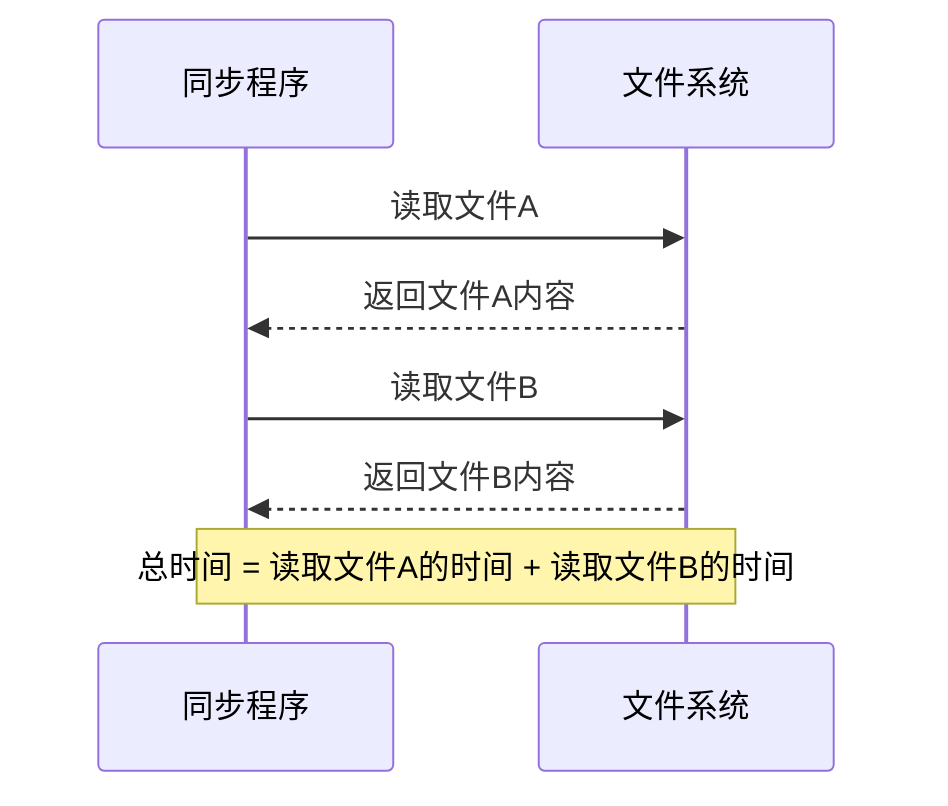
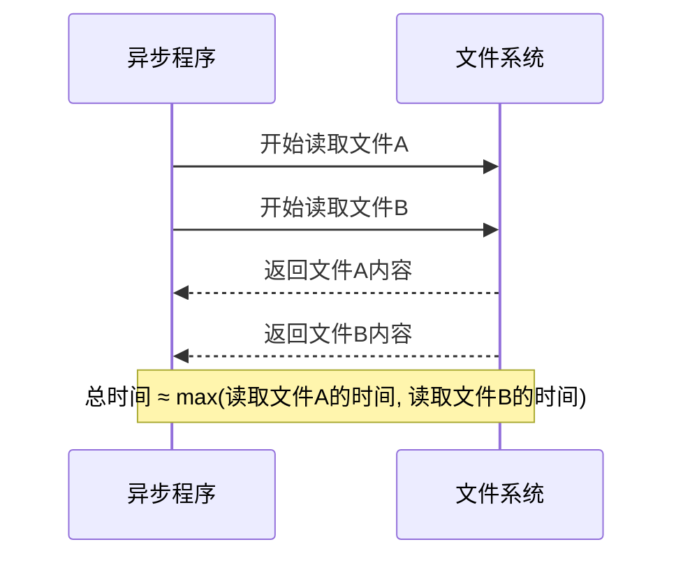

# Python 异步网络编程

在传统的网络编程模型中，我们常常面临一个问题：当程序等待网络I/O操作完成时，CPU通常会被闲置，造成资源浪费。Python异步网络编程正是为了解决这个问题而生，它允许我们在等待一个操作完成的同时执行其他任务，从而提高程序的效率和性能。

## 什么是异步编程？

异步编程是一种编程模式，它允许程序在等待某些操作完成（如I/O操作）的同时继续执行其他任务，而不必等待当前任务完成。这与传统的同步编程形成了鲜明对比，在同步编程中，程序会按顺序执行任务，每次只能执行一个操作。

### 同步vs异步

让我们通过一个简单的例子来理解同步和异步的区别：





## Python 中的异步编程

Python提供了多种实现异步编程的方法，其中最主要的是`asyncio`库。`asyncio`是Python 3.4引入的标准库，用于编写单线程的并发代码，使用`async/await`语法。

### 核心概念

在深入学习Python异步编程之前，让我们先了解几个核心概念：

1. **事件循环（Event Loop）**：异步程序的核心，它管理和调度异步任务的执行。
2. **协程（Coroutine）**：使用`async def`定义的函数，它可以在执行过程中暂停，让出控制权。
3. **任务（Task）**：对协程的进一步封装，用于并行执行多个协程。
4. **Future**：表示异步操作的最终结果。

## asyncio基础

首先，让我们看一个简单的异步程序：

```python
import asyncio

async def say_hello(name, delay):
    await asyncio.sleep(delay)  # 模拟I/O操作
    print(f"Hello, {name}!")
    return f"{name} greeted"

async def main():
    # 创建任务
    task1 = asyncio.create_task(say_hello("Alice", 2))
    task2 = asyncio.create_task(say_hello("Bob", 1))
    
    # 等待任务完成
    result1 = await task1
    result2 = await task2
    
    print(f"Results: {result1}, {result2}")

# 运行主协程
asyncio.run(main())
```

输出：
```
Hello, Bob!
Hello, Alice!
Results: Alice greeted, Bob greeted
```

:::note
虽然Alice的任务先创建，但因为Bob的延迟更短，所以Bob先打招呼。这就是异步编程的魅力所在！
:::

### async/await语法

Python 3.5引入了`async`和`await`关键字，它们是实现异步编程的核心：

- `async def`：定义一个协程函数。
- `await`：用于等待一个协程或Future对象完成。

## 异步网络编程实践

现在我们已经了解了异步编程的基础，让我们看看如何将其应用到网络编程中。

### 异步HTTP请求

使用`aiohttp`库可以轻松实现异步HTTP请求：

```python
import asyncio
import aiohttp
import time

async def fetch_url(url):
    async with aiohttp.ClientSession() as session:
        async with session.get(url) as response:
            return await response.text()

async def main():
    start_time = time.time()
    
    # 同时发起多个请求
    urls = [
        "https://example.com",
        "https://example.org",
        "https://example.net",
    ]
    
    tasks = [asyncio.create_task(fetch_url(url)) for url in urls]
    results = await asyncio.gather(*tasks)
    
    for i, result in enumerate(results):
        print(f"URL {urls[i]} content length: {len(result)}")
    
    end_time = time.time()
    print(f"Total time: {end_time - start_time:.2f} seconds")

asyncio.run(main())
```

输出示例：
```
URL https://example.com content length: 1256
URL https://example.org content length: 1242
URL https://example.net content length: 1233
Total time: 0.56 seconds
```

### 异步TCP服务器

下面是一个使用`asyncio`实现的简单TCP回显服务器：

```python
import asyncio

async def handle_client(reader, writer):
    addr = writer.get_extra_info('peername')
    print(f"Connected by {addr}")
    
    while True:
        data = await reader.read(1024)
        if not data:
            break
            
        message = data.decode()
        print(f"Received {message} from {addr}")
        
        # 回显消息
        writer.write(f"Echo: {message}".encode())
        await writer.drain()
    
    print(f"Closing connection with {addr}")
    writer.close()
    await writer.wait_closed()

async def main():
    server = await asyncio.start_server(
        handle_client, '127.0.0.1', 8888
    )
    
    addr = server.sockets[0].getsockname()
    print(f"Serving on {addr}")
    
    async with server:
        await server.serve_forever()

asyncio.run(main())
```

:::tip
要测试这个服务器，你可以使用`telnet 127.0.0.1 8888`或编写一个异步客户端。
:::

### 异步websocket服务器

以下是一个使用`websockets`库实现的简单聊天服务器：

```python
import asyncio
import websockets

# 存储所有连接的客户端
connected_clients = set()

async def chat_server(websocket, path):
    # 注册新客户端
    connected_clients.add(websocket)
    try:
        # 通知所有人有新用户加入
        await notify_all(f"[系统] 新用户加入，当前用户数: {len(connected_clients)}")
        
        # 接收和处理消息
        async for message in websocket:
            await notify_all(f"[用户] {message}")
    finally:
        # 客户端断开连接
        connected_clients.remove(websocket)
        await notify_all(f"[系统] 用户离开，当前用户数: {len(connected_clients)}")

async def notify_all(message):
    # 向所有连接的客户端广播消息
    if connected_clients:
        await asyncio.gather(
            *[client.send(message) for client in connected_clients]
        )

async def main():
    server = await websockets.serve(chat_server, "localhost", 8765)
    print("WebSocket服务器已启动，监听端口8765...")
    await server.wait_closed()

asyncio.run(main())
```

## 实际案例：异步网站爬虫

下面是一个实际案例，展示如何使用异步编程构建一个高效的网站爬虫：

```python
import asyncio
import aiohttp
from bs4 import BeautifulSoup
import time

# 存储结果
results = []

async def fetch_url(url, session):
    try:
        async with session.get(url) as response:
            return await response.text()
    except Exception as e:
        print(f"Error fetching {url}: {e}")
        return None

async def parse_page(url, session):
    html = await fetch_url(url, session)
    if not html:
        return
    
    soup = BeautifulSoup(html, 'html.parser')
    
    # 提取页面标题和所有链接
    title = soup.title.text if soup.title else "No title"
    links = [a['href'] for a in soup.find_all('a', href=True) if a['href'].startswith('http')]
    
    results.append({
        'url': url,
        'title': title,
        'links_count': len(links)
    })
    
    print(f"Processed {url} - Title: {title} - Links: {len(links)}")

async def main():
    start_time = time.time()
    
    # 要爬取的网站列表
    urls = [
        "https://example.com",
        "https://example.org",
        "https://example.net",
        # 添加更多URL...
    ]
    
    # 限制并发连接数
    connector = aiohttp.TCPConnector(limit=10)
    async with aiohttp.ClientSession(connector=connector) as session:
        tasks = [parse_page(url, session) for url in urls]
        await asyncio.gather(*tasks)
    
    end_time = time.time()
    print(f"\n--- Crawling Report ---")
    print(f"Processed {len(results)} pages in {end_time - start_time:.2f} seconds")
    print(f"Average time per page: {(end_time - start_time) / len(results):.2f} seconds")
    
    # 打印结果摘要
    for i, result in enumerate(results, 1):
        print(f"{i}. {result['url']} - {result['title']} ({result['links_count']} links)")

if __name__ == "__main__":
    asyncio.run(main())
```

:::caution
请注意，爬虫程序应当遵循网站的robots.txt规则，并且不要对服务器造成过大负担。
:::

## 异步网络编程的注意事项

虽然异步编程提供了很多优势，但也有一些需要注意的事项：

1. **CPU密集型任务**：异步编程对I/O密集型任务（如网络操作）非常有效，但对CPU密集型任务不一定有帮助。
2. **调试难度**：异步代码的调试往往比同步代码更复杂。
3. **异常处理**：在异步代码中，必须正确处理异常，否则可能导致程序崩溃。
4. **代码复杂性**：异步代码可能会增加程序的复杂性，尤其是对初学者而言。

### 异常处理示例

```python
import asyncio

async def risky_operation():
    # 这里可能会发生异常
    await asyncio.sleep(1)
    raise ValueError("Something went wrong!")

async def main():
    try:
        await risky_operation()
    except ValueError as e:
        print(f"Caught an error: {e}")
    
    print("Program continues after error")

asyncio.run(main())
```

输出：
```
Caught an error: Something went wrong!
Program continues after error
```

## 实现更高级的异步模式

### 超时控制

有时我们需要给异步操作设置超时限制：

```python
import asyncio

async def slow_operation():
    await asyncio.sleep(3)
    return "Operation completed"

async def main():
    try:
        # 设置1秒超时
        result = await asyncio.wait_for(slow_operation(), timeout=1)
        print(result)
    except asyncio.TimeoutError:
        print("Operation timed out")

asyncio.run(main())
```

输出：
```
Operation timed out
```

### 并发控制

有时我们需要限制并发任务数量，避免系统过载：

```python
import asyncio
import aiohttp
import time

async def fetch_with_semaphore(url, semaphore):
    async with semaphore:
        print(f"Fetching {url}")
        async with aiohttp.ClientSession() as session:
            async with session.get(url) as response:
                await asyncio.sleep(1)  # 模拟处理时间
                return await response.text()

async def main():
    start_time = time.time()
    
    # 创建一个信号量，限制并发数为5
    semaphore = asyncio.Semaphore(5)
    
    # 创建20个任务，但同时最多只有5个在执行
    urls = [f"https://example.com/{i}" for i in range(20)]
    tasks = [fetch_with_semaphore(url, semaphore) for url in urls]
    
    results = await asyncio.gather(*tasks)
    
    end_time = time.time()
    print(f"Fetched {len(results)} URLs in {end_time - start_time:.2f} seconds")

asyncio.run(main())
```

## 总结

Python异步网络编程为我们提供了一种处理大量并发连接的高效方式，而无需使用传统的多线程或多进程方法。通过利用`asyncio`库和`async/await`语法，我们可以编写既高效又易于理解的异步代码。

主要优点包括：
- 提高I/O密集型应用的性能
- 减少资源占用
- 简化并发编程模型
- 灵活的错误处理

学习异步编程可能需要一些时间来适应其思维模式，但一旦掌握，它将成为你Python编程工具箱中的强大工具，特别是在处理网络编程任务时。

## 练习与进一步学习

为了巩固所学知识，建议尝试以下练习：

1. 编写一个异步Web爬虫，爬取多个网页并提取特定信息。
2. 实现一个异步聊天服务器和客户端。
3. 创建一个同时下载多个文件的程序。
4. 比较同步和异步方法处理多个网络请求的性能差异。

### 进一步学习资源

- [Python asyncio官方文档](https://docs.python.org/3/library/asyncio.html)
- [aiohttp库文档](https://docs.aiohttp.org/)
- 《Python并发编程：使用asyncio》书籍

随着你对异步编程理解的加深，你将能够构建更加高效和可扩展的网络应用程序。祝你学习愉快！