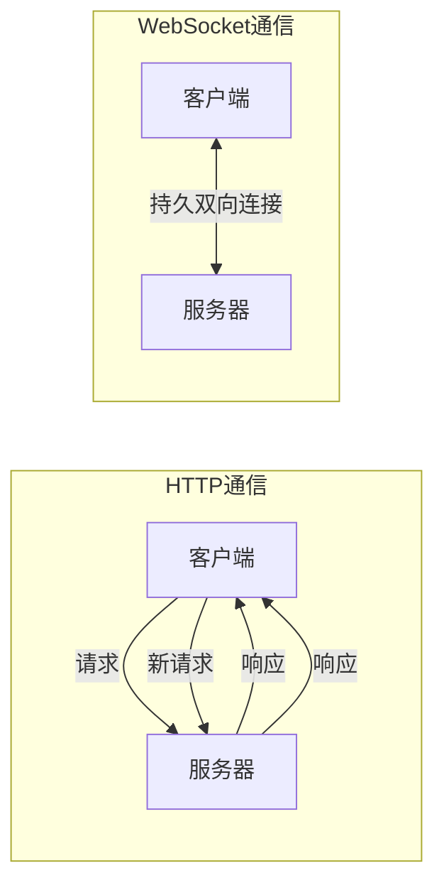

# Python WebSocket

## WebSocket 简介

WebSocket 是一种网络传输协议，提供了在客户端和服务器之间建立持久连接的全双工通信通道。与传统的 HTTP 请求-响应模型不同，WebSocket 允许服务器主动向客户端推送数据，非常适合需要实时更新的应用场景。

### WebSocket 与 HTTP 的区别



:::note 特点对比
- **HTTP**：无状态、短连接、只能客户端发起
- **WebSocket**：有状态、长连接、客户端和服务器均可主动发送数据
:::

## Python WebSocket 库介绍

Python 有多个库可用于实现 WebSocket 通信，最常用的包括：

1. **websockets** - 纯 Python 实现，基于 asyncio
2. **websocket-client** - 用于客户端应用
3. **Flask-SocketIO** - 基于 Flask 框架的 WebSocket 实现
4. **Django Channels** - Django 框架中的 WebSocket 支持

本教程将主要使用 `websockets` 库，因为它设计简洁且易于使用。

## 安装 WebSocket 库

首先，让我们安装 `websockets` 库：

```bash
pip install websockets
```

## 创建简单的 WebSocket 服务器

让我们创建一个基本的 WebSocket 服务器，它能够接收客户端消息并返回响应：

```python
import asyncio
import websockets

# 处理客户端连接的函数
async def echo(websocket):
    async for message in websocket:
        print(f"收到消息: {message}")
        # 将消息回显给客户端
        await websocket.send(f"服务器收到: {message}")

# 启动WebSocket服务器
async def main():
    async with websockets.serve(echo, "localhost", 8765):
        print("WebSocket 服务器已启动，监听端口 8765...")
        await asyncio.Future()  # 运行服务器直到被手动关闭

if __name__ == "__main__":
    asyncio.run(main())
```

保存为 `websocket_server.py` 并运行。服务器将在本地 8765 端口上启动，等待客户端连接。

## 创建 WebSocket 客户端

现在我们创建一个客户端来连接到上面的服务器：

```python
import asyncio
import websockets

async def hello():
    # 连接到服务器
    async with websockets.connect("ws://localhost:8765") as websocket:
        # 发送消息
        await websocket.send("你好，WebSocket!")
        
        # 接收服务器响应
        response = await websocket.recv()
        print(f"服务器响应: {response}")

if __name__ == "__main__":
    asyncio.run(hello())
```

保存为 `websocket_client.py`。首先运行服务器，然后在另一个终端中运行客户端。

**服务器输出**:
```
WebSocket 服务器已启动，监听端口 8765...
收到消息: 你好，WebSocket!
```

**客户端输出**:
```
服务器响应: 服务器收到: 你好，WebSocket!
```

## WebSocket 连接生命周期

WebSocket 连接有以下几个阶段：

1. **建立连接** - 客户端发送 HTTP 握手请求，服务器响应
2. **数据传输** - 双方可以随时发送消息
3. **关闭连接** - 任何一方都可以发起关闭连接

:::tip 握手
WebSocket 连接始于一个 HTTP 请求，该请求包含特殊的头部字段，表明客户端希望升级为 WebSocket 连接。服务器接受后，连接就升级为持久的 WebSocket 连接。
:::

## 构建实时聊天服务器

让我们创建一个更实际的例子 - 一个简单的聊天服务器，允许多个客户端连接并彼此发送消息：

```python
import asyncio
import json
import websockets

# 存储所有连接的客户端
connected_clients = set()

async def chat_server(websocket):
    # 新客户端连接
    connected_clients.add(websocket)
    try:
        # 向所有客户端广播新用户加入消息
        if len(connected_clients) > 0:
            await broadcast({"type": "system", "message": "新用户加入聊天室!"})
        
        # 接收来自客户端的消息
        async for message in websocket:
            data = json.loads(message)
            # 广播消息给所有客户端
            await broadcast({"type": "message", "user": data.get("user", "匿名"), "message": data.get("message", "")})
    
    finally:
        # 客户端断开连接时
        connected_clients.remove(websocket)
        await broadcast({"type": "system", "message": "有用户离开聊天室!"})

# 广播消息给所有连接的客户端
async def broadcast(message):
    if connected_clients:
        # 将消息转换为JSON字符串
        message_str = json.dumps(message)
        # 发送给所有连接的客户端
        await asyncio.gather(
            *[client.send(message_str) for client in connected_clients]
        )

async def main():
    async with websockets.serve(chat_server, "localhost", 8765):
        print("聊天服务器已启动，监听端口 8765...")
        await asyncio.Future()  # 持续运行

if __name__ == "__main__":
    asyncio.run(main())
```

## 聊天客户端

为了测试聊天服务器，我们可以创建一个简单的客户端：

```python
import asyncio
import json
import websockets
import random

async def chat_client():
    # 为测试随机生成用户名
    user_id = f"用户{random.randint(1000, 9999)}"
    
    # 连接到服务器
    async with websockets.connect("ws://localhost:8765") as websocket:
        print(f"已连接到聊天服务器，你的用户名是: {user_id}")
        
        # 创建两个任务：一个发送消息，一个接收消息
        send_task = asyncio.create_task(send_messages(websocket, user_id))
        receive_task = asyncio.create_task(receive_messages(websocket))
        
        # 等待任一任务完成
        await asyncio.gather(send_task, receive_task)

# 发送消息的协程
async def send_messages(websocket, user_id):
    try:
        while True:
            message = input("输入消息 (或输入'exit'退出): ")
            if message.lower() == "exit":
                break
                
            # 构造消息并发送
            await websocket.send(json.dumps({
                "user": user_id,
                "message": message
            }))
    except Exception as e:
        print(f"发送消息出错: {e}")

# 接收消息的协程
async def receive_messages(websocket):
    try:
        async for message in websocket:
            data = json.loads(message)
            
            if data["type"] == "system":
                print(f"系统: {data['message']}")
            else:
                print(f"{data['user']}: {data['message']}")
    except Exception as e:
        print(f"接收消息出错: {e}")

if __name__ == "__main__":
    asyncio.run(chat_client())
```

:::caution 注意
上面的客户端在本教程中无法直接运行，因为`input()`函数会阻塞事件循环。在实际应用中，你需要使用更复杂的方法来处理用户输入，或者使用图形界面。
:::

## 使用 Flask 和 WebSocket 构建Web应用

对于web应用程序，我们可以结合Flask和Flask-SocketIO来创建更易于使用的WebSocket应用：

首先安装所需库：

```bash
pip install flask flask-socketio
```

创建一个简单的Flask应用，集成了WebSocket功能：

```python
from flask import Flask, render_template
from flask_socketio import SocketIO, emit

app = Flask(__name__)
app.config['SECRET_KEY'] = 'your-secret-key'
socketio = SocketIO(app)

@app.route('/')
def index():
    return render_template('index.html')

@socketio.on('connect')
def handle_connect():
    print('客户端已连接')
    emit('system_message', {'data': '欢迎加入聊天室!'})

@socketio.on('disconnect')
def handle_disconnect():
    print('客户端已断开连接')

@socketio.on('chat_message')
def handle_message(data):
    print(f'收到消息: {data}')
    # 广播消息给所有客户端
    emit('chat_message', data, broadcast=True)

if __name__ == '__main__':
    socketio.run(app, debug=True)
```

然后创建一个简单的HTML前端（保存在`templates/index.html`）：

```html
<!DOCTYPE html>
<html>
<head>
    <title>Flask-SocketIO 聊天室</title>
    <script src="https://cdnjs.cloudflare.com/ajax/libs/socket.io/4.0.1/socket.io.js"></script>
    <script type="text/javascript">
        document.addEventListener('DOMContentLoaded', () => {
            // 连接到Socket.IO服务器
            const socket = io();
            const messages = document.getElementById('messages');
            const messageInput = document.getElementById('message-input');
            const sendButton = document.getElementById('send-button');
            const usernameInput = document.getElementById('username');

            // 连接成功
            socket.on('connect', () => {
                addMessage('系统', '已连接到服务器');
            });

            // 接收系统消息
            socket.on('system_message', (data) => {
                addMessage('系统', data.data);
            });

            // 接收聊天消息
            socket.on('chat_message', (data) => {
                addMessage(data.username, data.message);
            });

            // 发送消息
            sendButton.addEventListener('click', () => {
                const username = usernameInput.value || '匿名';
                const message = messageInput.value;
                
                if (message.trim()) {
                    socket.emit('chat_message', {
                        username: username,
                        message: message
                    });
                    messageInput.value = '';
                }
            });

            // 添加消息到聊天窗口
            function addMessage(user, msg) {
                const messageElement = document.createElement('div');
                messageElement.textContent = `${user}: ${msg}`;
                messages.appendChild(messageElement);
                messages.scrollTop = messages.scrollHeight;
            }
        });
    </script>
    <style>
        #messages {
            height: 400px;
            border: 1px solid #ccc;
            overflow-y: scroll;
            margin-bottom: 10px;
            padding: 10px;
        }
        .input-container {
            margin-bottom: 10px;
        }
    </style>
</head>
<body>
    <h1>Flask-SocketIO 聊天室</h1>
    <div id="messages"></div>
    <div class="input-container">
        <input type="text" id="username" placeholder="你的名字" />
    </div>
    <div class="input-container">
        <input type="text" id="message-input" placeholder="输入消息..." />
        <button id="send-button">发送</button>
    </div>
</body>
</html>
```

## WebSocket 安全性考虑

在实际应用中，应注意以下WebSocket安全问题：

1. **使用 WSS（WebSocket Secure）协议** - 类似于 HTTPS，WSS提供加密通信
2. **身份验证** - 确保连接的客户端是合法用户
3. **消息验证** - 验证接收到的消息格式和内容
4. **速率限制** - 防止 DOS（拒绝服务）攻击
5. **输入验证** - 防止注入攻击

## WebSocket 应用场景

WebSocket技术适用于许多需要实时通信的场景：

1. **聊天应用** - 允许用户实时交流
2. **协作编辑工具** - 多人同时编辑文档
3. **实时游戏** - 在线多人游戏
4. **金融应用** - 股票价格、交易数据实时更新
5. **物联网（IoT）** - 设备状态监控和控制
6. **实时数据可视化** - 仪表盘和监控系统

## 总结

WebSocket 是构建实时交互式应用的强大技术。通过Python，我们可以轻松创建WebSocket服务器和客户端，实现即时通信。本教程介绍了：

- WebSocket的基本概念及其与HTTP的区别
- 使用`websockets`库创建简单的客户端和服务器
- 构建实时聊天应用
- 将WebSocket与Flask框架集成
- WebSocket的安全性考虑和应用场景

掌握WebSocket技术将使你能够构建响应迅速、交互性强的现代Web应用。

## 练习

1. 修改聊天服务器，添加用户列表功能，显示当前在线用户
2. 实现私聊功能，允许用户向特定用户发送消息
3. 添加消息历史记录功能，让新加入的用户能看到之前的消息
4. 创建一个简单的实时协作绘图应用，所有连接的用户可以在同一个画布上绘画
5. 实现一个基于WebSocket的简单游戏（如井字棋或简单的多人连线游戏）

## 资源推荐

- [websockets 官方文档](https://websockets.readthedocs.io/)
- [Flask-SocketIO 文档](https://flask-socketio.readthedocs.io/)
- [MDN WebSocket API 文档](https://developer.mozilla.org/zh-CN/docs/Web/API/WebSockets_API)
- 《Python网络编程》书籍
- 《Flask Web开发》书籍中的WebSocket章节

通过这些资源和实践，你将能够熟练使用Python进行WebSocket编程，构建各种实时应用。