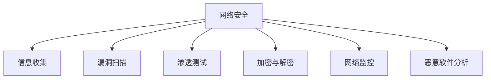

# Python 网络安全

## 介绍

网络安全是当今数字世界中至关重要的一环，而Python因其简洁的语法、强大的库支持和跨平台特性，已成为网络安全专业人员的首选编程语言之一。本文将介绍Python在网络安全领域的基本应用，帮助初学者了解如何使用Python进行网络安全分析、测试和防护。

:::note
本教程假设你已经掌握了Python的基础知识。如果你是Python新手，建议先学习我们的Python基础课程。
:::

## Python 在网络安全中的优势

Python在网络安全领域具有以下优势：

1. **丰富的库支持**：提供了如Scapy、Requests、Beautiful Soup等专业库
2. **快速开发**：语法简洁，可以快速编写和测试安全脚本
3. **良好的社区支持**：有大量开源的安全工具和资源
4. **跨平台兼容性**：可以在不同操作系统上运行
5. **与其他工具的集成能力**：可以轻松与Metasploit、Nmap等工具集成

## 基本网络安全概念

在深入Python网络安全之前，让我们先了解一些基本概念：



### 网络安全的CIA三要素

- **机密性(Confidentiality)**：确保信息只对授权用户可见
- **完整性(Integrity)**：确保数据在传输或存储过程中不被未授权篡改
- **可用性(Availability)**：确保系统和数据在需要时可以访问

## Python 网络安全基础工具

### 1. 网络数据包分析 - Scapy

Scapy是Python中用于网络数据包构建、发送、嗅探和分析的强大工具。

#### 安装Scapy

```bash
pip install scapy
```

#### 基本使用示例

```python
from scapy.all import *

# 发送一个简单的ICMP请求（ping）
response = sr1(IP(dst="8.8.8.8")/ICMP()/"Hello World")
response.show()

# 网络嗅探
def packet_callback(packet):
    if packet.haslayer(IP):
        ip_src = packet[IP].src
        ip_dst = packet[IP].dst
        print(f"IP {ip_src} -> {ip_dst}")

# 嗅探5个数据包
sniff(count=5, prn=packet_callback)
```

输出示例：
```
###[ IP ]### 
  version   = 4
  ihl       = 5
  tos       = 0x0
  len       = 28
  id        = 8670
  flags     = 
  frag      = 0
  ttl       = 128
  proto     = icmp
  chksum    = 0x6e2d
  src       = 8.8.8.8
  dst       = 192.168.1.5
  \options   \
###[ ICMP ]### 
     type      = echo-reply
     code      = 0
     chksum    = 0x0
     id        = 0x0
     seq       = 0x0

IP 192.168.1.5 -> 8.8.8.8
IP 8.8.8.8 -> 192.168.1.5
IP 192.168.1.5 -> 192.168.1.1
IP 192.168.1.1 -> 192.168.1.5
IP 192.168.1.5 -> 173.194.222.100
```

### 2. Web应用安全测试 - Requests

Requests库可以用于Web应用的安全测试。

#### 安装Requests

```bash
pip install requests
```

#### 基本使用示例

```python
import requests

# 发送GET请求
response = requests.get('https://api.github.com')
print(f"状态码: {response.status_code}")
print(f"响应头: {response.headers['content-type']}")

# 基本的安全扫描 - 检查HTTP响应头
def check_security_headers(url):
    response = requests.get(url)
    security_headers = {
        'Strict-Transport-Security': 'HSTS不存在',
        'Content-Security-Policy': 'CSP不存在',
        'X-Content-Type-Options': 'X-Content-Type-Options不存在',
        'X-Frame-Options': 'X-Frame-Options不存在',
        'X-XSS-Protection': 'XSS保护不存在'
    }
    
    print(f"\n检查 {url} 的安全头:")
    for header, message in security_headers.items():
        if header in response.headers:
            print(f"✓ {header}: {response.headers[header]}")
        else:
            print(f"✗ {message}")

check_security_headers('https://www.github.com')
```

输出示例：
```
状态码: 200
响应头: application/json; charset=utf-8

检查 https://www.github.com 的安全头:
✓ Strict-Transport-Security: max-age=31536000; includeSubdomains; preload
✓ Content-Security-Policy: default-src 'none'...
✓ X-Content-Type-Options: nosniff
✓ X-Frame-Options: deny
✗ XSS保护不存在
```

### 3. 暴力破解防护 - 密码哈希与验证

在网络安全中，正确存储密码至关重要。Python的`hashlib`和`bcrypt`库提供了安全的密码哈希功能。

#### 安装bcrypt

```bash
pip install bcrypt
```

#### 密码哈希示例

```python
import hashlib
import bcrypt

# 使用hashlib（不推荐用于密码）
password = "mysecretpassword".encode()
sha256_hash = hashlib.sha256(password).hexdigest()
print(f"SHA-256 哈希: {sha256_hash}")

# 使用bcrypt（推荐用于密码）
# 生成盐值并哈希
salt = bcrypt.gensalt()
hashed = bcrypt.hashpw(password, salt)
print(f"Bcrypt 哈希: {hashed.decode()}")

# 密码验证
def verify_password(stored_hash, provided_password):
    return bcrypt.checkpw(provided_password.encode(), stored_hash)

# 测试验证
print(f"密码正确: {verify_password(hashed, 'mysecretpassword')}")
print(f"密码错误: {verify_password(hashed, 'wrongpassword')}")
```

输出示例：
```
SHA-256 哈希: d5434e71273ba6c9afa7a0f4cbf77e96e29838f60850776868f0c2a22dd39243
Bcrypt 哈希: $2b$12$Q3sMq2z3WQID9sv5JAyadu7ZbcwPd2X/Bx.WFJINdKfEZgpSQ7K72
密码正确: True
密码错误: False
```

## 实际应用案例

### 案例一：端口扫描器

端口扫描是网络安全评估中的基本步骤。以下是一个简单的TCP端口扫描器实现：

```python
import socket
import threading
from queue import Queue

# 目标IP和端口范围
target = "127.0.0.1"
port_range = range(1, 1025)
queue = Queue()
open_ports = []

# 将端口添加到队列
for port in port_range:
    queue.put(port)

# 扫描函数
def port_scan(port):
    try:
        sock = socket.socket(socket.AF_INET, socket.SOCK_STREAM)
        sock.settimeout(1)
        result = sock.connect_ex((target, port))
        if result == 0:
            open_ports.append(port)
            print(f"端口 {port}: 开放")
        sock.close()
    except:
        pass

# 使用多线程扫描
def worker():
    while not queue.empty():
        port = queue.get()
        port_scan(port)
        queue.task_done()

# 创建线程
thread_count = 100
for _ in range(thread_count):
    thread = threading.Thread(target=worker)
    thread.daemon = True
    thread.start()

queue.join()
print(f"扫描完成! 共发现 {len(open_ports)} 个开放端口")
print(f"开放端口: {open_ports}")
```

输出示例：
```
端口 80: 开放
端口 443: 开放
端口 22: 开放
扫描完成! 共发现 3 个开放端口
开放端口: [22, 80, 443]
```

### 案例二：网站目录扫描器

此工具可以帮助识别Web服务器上的隐藏目录：

```python
import requests
import concurrent.futures

def check_directory(base_url, directory):
    url = f"{base_url}/{directory}"
    response = requests.get(url)
    if response.status_code == 200:
        print(f"[+] 发现: {url}")
        return url
    return None

def directory_scanner(base_url, wordlist_file):
    found_directories = []
    
    with open(wordlist_file, 'r') as f:
        directories = [line.strip() for line in f]
    
    print(f"开始扫描 {base_url}")
    print(f"共加载 {len(directories)} 个目录...")
    
    with concurrent.futures.ThreadPoolExecutor(max_workers=10) as executor:
        future_to_dir = {
            executor.submit(check_directory, base_url, directory): directory 
            for directory in directories
        }
        
        for future in concurrent.futures.as_completed(future_to_dir):
            result = future.result()
            if result:
                found_directories.append(result)
    
    return found_directories

# 使用示例：
# base_url = "http://example.com"
# wordlist_file = "common_directories.txt"
# found = directory_scanner(base_url, wordlist_file)
# print(f"扫描完成，共发现 {len(found)} 个目录")
```

:::caution
请注意，未经授权对网站进行扫描可能违反法律法规。请只在获得授权的系统上使用此类工具进行测试。
:::

### 案例三：简单的网络流量监控

下面是一个基于Scapy的简单网络流量监控工具：

```python
from scapy.all import *
from collections import defaultdict
import time

# 流量统计
packet_counts = defaultdict(int)
byte_counts = defaultdict(int)
start_time = time.time()

def analyze_packet(packet):
    if IP in packet:
        src_ip = packet[IP].src
        dst_ip = packet[IP].dst
        
        # 计算数据包数量
        packet_counts[(src_ip, dst_ip)] += 1
        
        # 计算字节数
        if Raw in packet:
            byte_counts[(src_ip, dst_ip)] += len(packet[Raw])
        
        # 每10秒显示一次统计信息
        if time.time() - start_time > 10:
            print("\n=== 流量统计 ===")
            for (src, dst), count in sorted(packet_counts.items(), 
                                           key=lambda x: x[1], reverse=True):
                bytes_sent = byte_counts[(src, dst)]
                print(f"{src} -> {dst}: {count} 数据包, {bytes_sent} 字节")
            
            # 重置计数器
            packet_counts.clear()
            byte_counts.clear()
            start_time = time.time()

# 开始捕获
print("开始监控网络流量...(按Ctrl+C停止)")
sniff(prn=analyze_packet, store=0)
```

## 网络安全防护最佳实践

1. **使用HTTPS**：确保网站使用HTTPS，Python的`requests`库默认支持HTTPS连接。
2. **输入验证**：始终验证用户输入，防止SQL注入、XSS等攻击。
3. **密码安全**：使用如bcrypt等安全的哈希算法存储密码。
4. **定期更新**：保持Python及其库的最新版本，以修复已知的安全漏洞。
5. **最小权限原则**：程序只应拥有完成任务所需的最小权限。

## 总结

Python在网络安全领域是一个强大的工具，从基本的端口扫描到复杂的漏洞分析，Python都提供了灵活而强大的解决方案。本文介绍了Python在网络安全中的应用基础，包括数据包分析、Web安全测试和密码安全等方面。

随着你对Python和网络安全知识的深入，可以进一步探索更高级的技术，如漏洞利用开发、恶意软件分析和逆向工程等。记住，网络安全技能应该被用于保护系统和网络，而不是用于非法活动。

## 练习与延伸阅读

### 练习

1. 编写一个简单的Python脚本，检查给定网站的SSL/TLS配置是否安全。
2. 利用Scapy创建一个ARP扫描器，发现局域网中的设备。
3. 实现一个基于Python的简单防火墙，可以根据规则过滤网络流量。

### 延伸阅读

- 《Black Hat Python》- Justin Seitz
- 《Violent Python》- TJ O'Connor
- OWASP (Open Web Application Security Project) 官方文档
- Python官方安全文档

:::warning
本文所有示例代码仅供学习目的。在实际环境中使用任何网络安全工具前，请确保你有合法权限。未经授权对系统进行安全测试可能违反法律法规。
:::

Happy coding and secure networking with Python!