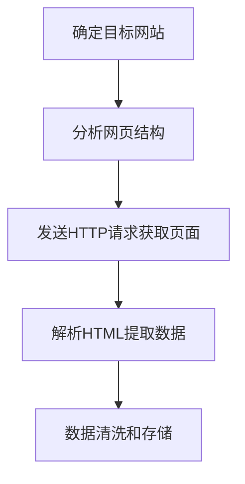

# Python 数据爬取

## 什么是数据爬取？

数据爬取（Web Scraping）是指通过程序自动访问网页并提取所需信息的过程。在信息爆炸的时代，手动从网站获取大量数据既耗时又低效，而Python凭借其简洁的语法和丰富的第三方库，成为了数据爬取的首选语言。

:::note 为什么要学习数据爬取？
- 获取大量研究数据
- 市场分析和竞争情报收集
- 价格监控和比较
- 内容聚合
- 机器学习模型的训练数据收集
:::

## 数据爬取的基本原理

数据爬取的基本流程包括以下步骤：



## 爬虫的法律与道德

在开始学习爬虫技术之前，我们需要了解一些基本的法律和道德问题：

:::caution 爬虫使用注意事项
1. 尊重网站的robots.txt文件
2. 控制爬取速度，不要对服务器造成过大压力
3. 爬取数据仅用于个人学习和研究
4. 不爬取敏感个人信息
5. 遵守网站的使用条款
:::

## Python 爬虫基础库介绍

### 1. Requests库

Requests是Python的HTTP客户端库，用于发送HTTP请求并获取网页内容。

安装Requests：

```bash
pip install requests
```

基本使用示例：

```python
import requests

# 发送GET请求
response = requests.get('https://www.example.com')

# 查看响应状态码
print(response.status_code)  # 输出: 200

# 查看响应内容
print(response.text)  # 输出: 网页的HTML内容
```

### 2. Beautiful Soup库

Beautiful Soup是一个HTML/XML解析库，可以帮助我们从网页中提取数据。

安装Beautiful Soup：

```bash
pip install beautifulsoup4
```

基本使用示例：

```python
import requests
from bs4 import BeautifulSoup

# 获取网页内容
response = requests.get('https://www.example.com')

# 创建Beautiful Soup对象
soup = BeautifulSoup(response.text, 'html.parser')

# 找到所有的标题标签
titles = soup.find_all('h1')

# 打印标题文本
for title in titles:
    print(title.text)
```

## 网页分析与数据提取

在进行网页爬取之前，我们需要分析网页结构，找到数据所在的位置。这通常包括以下步骤：

1. 使用浏览器开发者工具检查网页元素
2. 定位目标数据所在的HTML标签
3. 确定适当的选择器（CSS选择器或XPath）

### CSS选择器

Beautiful Soup支持CSS选择器，这是一种简洁的方式来定位HTML元素。

```python
import requests
from bs4 import BeautifulSoup

url = 'https://news.example.com'
response = requests.get(url)
soup = BeautifulSoup(response.text, 'html.parser')

# 使用CSS选择器找到所有文章标题
articles = soup.select('article h2')

for article in articles:
    print(article.text.strip())
```

## 处理动态网页

许多现代网站使用JavaScript动态加载内容，这使得使用简单的requests库难以获取完整数据。为解决这个问题，我们可以使用Selenium库来模拟浏览器行为。

安装Selenium：

```bash
pip install selenium
```

还需要下载对应浏览器的驱动程序，如ChromeDriver。

使用Selenium爬取动态网页：

```python
from selenium import webdriver
from selenium.webdriver.chrome.service import Service
from selenium.webdriver.common.by import By
import time

# 配置Chrome驱动
service = Service('path/to/chromedriver')
driver = webdriver.Chrome(service=service)

# 打开网页
driver.get('https://www.example.com')

# 等待JavaScript加载内容
time.sleep(3)

# 提取数据
elements = driver.find_elements(By.CSS_SELECTOR, '.product-title')
for element in elements:
    print(element.text)

# 关闭浏览器
driver.quit()
```

## 实际案例：爬取天气信息

下面是一个简单的实际案例，我们将爬取一个天气网站的当天天气信息：

```python
import requests
from bs4 import BeautifulSoup

def get_weather(city):
    """
    获取指定城市的天气信息
    
    Args:
        city: 城市名称
    
    Returns:
        天气信息字典
    """
    # 注意：这是示例URL，实际使用时需要替换为真实的天气网站
    url = f'https://weather.example.com/city/{city}'
    
    try:
        # 发送请求
        headers = {
            'User-Agent': 'Mozilla/5.0 (Windows NT 10.0; Win64; x64) AppleWebKit/537.36 (KHTML, like Gecko) Chrome/91.0.4472.124 Safari/537.36'
        }
        response = requests.get(url, headers=headers)
        response.raise_for_status()  # 如果请求失败则抛出异常
        
        # 解析HTML
        soup = BeautifulSoup(response.text, 'html.parser')
        
        # 提取天气信息
        temperature = soup.select_one('.current-temp').text.strip()
        condition = soup.select_one('.condition').text.strip()
        humidity = soup.select_one('.humidity-value').text.strip()
        
        return {
            'city': city,
            'temperature': temperature,
            'condition': condition,
            'humidity': humidity
        }
    except Exception as e:
        print(f"获取天气信息时出错: {e}")
        return None

# 调用函数获取北京的天气
weather_info = get_weather('beijing')
print(weather_info)

# 输出示例:
# {'city': 'beijing', 'temperature': '26°C', 'condition': '晴', 'humidity': '45%'}
```

## 数据存储

爬取的数据通常需要保存起来以便后续分析。Python提供了多种数据存储方式：

### 1. CSV文件存储

```python
import csv
import requests
from bs4 import BeautifulSoup

# 假设我们已经爬取了一些产品数据
products = [
    {'name': '产品A', 'price': '￥99', 'rating': '4.5'},
    {'name': '产品B', 'price': '￥199', 'rating': '4.7'},
    {'name': '产品C', 'price': '￥299', 'rating': '4.2'}
]

# 将数据保存到CSV文件
with open('products.csv', 'w', newline='', encoding='utf-8') as f:
    writer = csv.DictWriter(f, fieldnames=['name', 'price', 'rating'])
    writer.writeheader()
    writer.writerows(products)

print("数据已保存到products.csv")
```

### 2. 数据库存储 (SQLite)

```python
import sqlite3

# 创建数据库连接
conn = sqlite3.connect('products.db')
cursor = conn.cursor()

# 创建表
cursor.execute('''
CREATE TABLE IF NOT EXISTS products (
    id INTEGER PRIMARY KEY,
    name TEXT,
    price TEXT,
    rating TEXT
)
''')

# 插入数据
products = [
    {'name': '产品A', 'price': '￥99', 'rating': '4.5'},
    {'name': '产品B', 'price': '￥199', 'rating': '4.7'},
    {'name': '产品C', 'price': '￥299', 'rating': '4.2'}
]

for product in products:
    cursor.execute(
        'INSERT INTO products (name, price, rating) VALUES (?, ?, ?)',
        (product['name'], product['price'], product['rating'])
    )

# 提交事务
conn.commit()
conn.close()

print("数据已保存到products.db")
```

## 爬虫进阶技巧

### 1. 使用代理

有时候，频繁的爬虫请求可能会导致IP被封。使用代理可以解决这个问题：

```python
import requests

proxies = {
    'http': 'http://10.10.10.10:8000',
    'https': 'http://10.10.10.10:8000'
}

response = requests.get('https://www.example.com', proxies=proxies)
```

### 2. 处理反爬机制

许多网站都有反爬虫机制，以下是一些应对策略：

- 添加随机延时
- 使用User-Agent池
- 遵循robots.txt规则

```python
import requests
import time
import random

# User-Agent池
user_agents = [
    'Mozilla/5.0 (Windows NT 10.0; Win64; x64) AppleWebKit/537.36 (KHTML, like Gecko) Chrome/91.0.4472.124 Safari/537.36',
    'Mozilla/5.0 (Macintosh; Intel Mac OS X 10_15_7) AppleWebKit/605.1.15 (KHTML, like Gecko) Version/14.0 Safari/605.1.15',
    'Mozilla/5.0 (X11; Linux x86_64) AppleWebKit/537.36 (KHTML, like Gecko) Chrome/92.0.4515.107 Safari/537.36'
]

urls = ['https://example.com/page1', 'https://example.com/page2', 'https://example.com/page3']

for url in urls:
    # 随机选择User-Agent
    headers = {'User-Agent': random.choice(user_agents)}
    
    # 发送请求
    response = requests.get(url, headers=headers)
    
    # 处理响应...
    
    # 随机延时
    time.sleep(random.uniform(1, 3))
```

## 常用爬虫库比较

Python有多个爬虫库可供选择，根据需求不同可以选择适合的工具：

| 库名 | 特点 | 适用场景 |
| --- | --- | --- |
| Requests | 简单易用，基础HTTP功能 | 静态网页爬取 |
| Beautiful Soup | 强大的HTML解析能力 | 结构化数据提取 |
| Scrapy | 全功能爬虫框架，高效且可扩展 | 大规模爬虫项目 |
| Selenium | 能够处理JavaScript和浏览器行为 | 动态网页爬取 |
| PyQuery | 类似jQuery的语法 | 喜欢jQuery语法的开发者 |

## 总结

本文介绍了Python数据爬取的基本概念、工具和技术，包括：

1. 数据爬取的基本原理
2. Python爬虫常用库（Requests、Beautiful Soup、Selenium）的使用
3. 网页分析与数据提取方法
4. 实际案例展示
5. 数据存储方式
6. 爬虫进阶技巧

通过掌握这些知识和技能，初学者可以构建自己的爬虫程序，从网页中提取有用的信息。

:::tip 学习建议
1. 从简单的静态网页开始爬取练习
2. 尊重网站的robots.txt和使用条款
3. 控制爬取频率，避免对目标网站服务器造成压力
4. 多参考开源爬虫项目学习经验
:::

## 练习

1. 爬取一个新闻网站的头条新闻标题和链接
2. 获取一个电商网站的产品信息（名称、价格、评分）
3. 爬取一个天气网站，获取未来一周的天气预报
4. 构建一个简单的图片爬虫，下载特定网站的图片

## 进一步学习资源

- [Python Requests库官方文档](https://docs.python-requests.org/)
- [Beautiful Soup官方文档](https://www.crummy.com/software/BeautifulSoup/bs4/doc/)
- [Scrapy官方教程](https://docs.scrapy.org/en/latest/intro/tutorial.html)
- [Selenium with Python文档](https://selenium-python.readthedocs.io/)
- 《Python网络数据采集》- Ryan Mitchell著

希望这篇教程能帮助你踏上Python数据爬取的学习之旅！随着技能的提升，你将能够处理更复杂的网页和更大规模的数据采集任务。