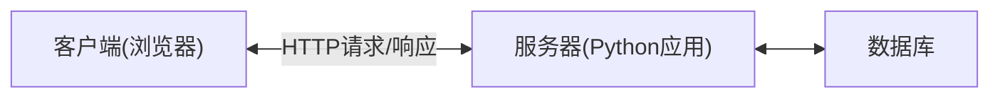

# Python Web开发概述

## 什么是Python Web开发？

Python Web开发是指使用Python编程语言及其相关框架和库来构建网站和Web应用程序的过程。凭借Python的简洁语法和丰富的生态系统，它已经成为Web开发领域中的一个流行选择，尤其适合初学者学习和快速开发原型。

:::note 为什么选择Python做Web开发？
- 简洁易读的语法，降低学习曲线
- 丰富的Web框架生态系统（Django、Flask等）
- 强大的标准库和第三方包支持
- 跨平台兼容性好
- 活跃的社区支持
:::

## Python Web开发的基本架构

Web应用程序通常遵循客户端-服务器架构，在这种模式下：



在Python Web开发中，我们主要关注服务器端的实现，它负责：

1. 处理来自客户端的HTTP请求
2. 执行业务逻辑处理
3. 与数据库交互
4. 生成并返回HTTP响应（通常是HTML、JSON等）

## Python Web开发框架简介

Python提供了多种Web框架，适合不同规模和需求的项目。以下是几个主流框架：

### 1. Django

Django是一个高级的全栈Web框架，提供了大量内置功能，遵循"电池已包含"的理念。

**特点：**
- ORM（对象关系映射）系统
- 内置管理员后台
- 表单处理系统
- 身份验证系统
- 模板引擎

**适用场景：**
- 内容管理系统
- 社交网络
- 新闻网站
- 大型企业应用

### 2. Flask

Flask是一个轻量级的微框架，提供核心功能，同时允许开发者自由选择组件和扩展。

**特点：**
- 轻量且灵活
- 简单易学
- 可扩展性强
- 内置开发服务器和调试器

**适用场景：**
- API开发
- 小型应用
- 原型开发
- 学习Web开发概念

### 3. FastAPI

FastAPI是一个现代化、高性能的Web框架，专注于API开发，基于Python 3.6+的类型提示。

**特点：**
- 极快的性能（基于Starlette和Pydantic）
- 自动生成API文档
- 数据验证
- 异步支持

**适用场景：**
- RESTful API开发
- 微服务架构
- 需要高性能的应用

## 入门示例：使用Flask创建一个简单的Web应用

下面是一个使用Flask创建"Hello World"Web应用的示例：

```python
# 导入Flask类
from flask import Flask

# 创建Flask应用实例
app = Flask(__name__)

# 定义路由和视图函数
@app.route('/')
def hello_world():
    return 'Hello, World!'

# 定义另一个路由
@app.route('/about')
def about():
    return 'This is a simple Flask application.'

# 启动Web服务器
if __name__ == '__main__':
    app.run(debug=True)
```

将上面的代码保存为`app.py`，然后安装Flask并运行应用：

```bash
pip install flask
python app.py
```

运行后，你会看到类似下面的输出：

```
 * Serving Flask app "app"
 * Environment: production
   WARNING: This is a development server. Do not use it in a production deployment.
 * Debug mode: on
 * Running on http://127.0.0.1:5000/ (Press CTRL+C to quit)
```

现在，打开浏览器访问`http://127.0.0.1:5000/`，你将看到"Hello, World!"消息。访问`http://127.0.0.1:5000/about`，则会显示"This is a simple Flask application."。

## 基本Web开发概念

### 1. 路由(Routing)

路由是将URL映射到视图函数的过程。在Flask示例中，`@app.route('/')`装饰器定义了一个路由。

### 2. 视图(Views)

视图是处理Web请求并返回响应的函数。在Django中，视图可以是函数或类。

### 3. 模板(Templates)

模板允许将HTML与Python代码分离，提高代码可维护性。下面是一个Flask模板示例：

```python
from flask import Flask, render_template

app = Flask(__name__)

@app.route('/greeting/<name>')
def greeting(name):
    return render_template('greeting.html', user_name=name)

if __name__ == '__main__':
    app.run(debug=True)
```

对应的`templates/greeting.html`文件：

```html
<!DOCTYPE html>
<html>
<head>
    <title>Greeting</title>
</head>
<body>
    <h1>Hello, {{ user_name }}!</h1>
    <p>Welcome to our website.</p>
</body>
</html>
```

### 4. 模型(Models)

模型定义数据结构和业务逻辑。在Django中，模型与数据库表直接对应：

```python
from django.db import models

class Product(models.Model):
    name = models.CharField(max_length=100)
    description = models.TextField()
    price = models.DecimalField(max_digits=10, decimal_places=2)
    created_at = models.DateTimeField(auto_now_add=True)
    
    def __str__(self):
        return self.name
```

### 5. 表单处理(Forms)

表单用于收集用户输入。下面是Flask中处理表单的简单示例：

```python
from flask import Flask, request, render_template

app = Flask(__name__)

@app.route('/contact', methods=['GET', 'POST'])
def contact():
    if request.method == 'POST':
        name = request.form.get('name')
        email = request.form.get('email')
        message = request.form.get('message')
        # 处理表单数据...
        return f"感谢您的留言，{name}！我们会尽快回复。"
    
    # 如果是GET请求，显示表单
    return render_template('contact.html')

if __name__ == '__main__':
    app.run(debug=True)
```

## 实际应用案例：构建简单博客系统

让我们看一个更完整的例子，使用Flask构建一个简单的博客系统：

```python
from flask import Flask, render_template, request, redirect, url_for
from flask_sqlalchemy import SQLAlchemy
from datetime import datetime

app = Flask(__name__)
app.config['SQLALCHEMY_DATABASE_URI'] = 'sqlite:///blog.db'
db = SQLAlchemy(app)

# 定义博客文章模型
class BlogPost(db.Model):
    id = db.Column(db.Integer, primary_key=True)
    title = db.Column(db.String(100), nullable=False)
    content = db.Column(db.Text, nullable=False)
    author = db.Column(db.String(20), nullable=False, default='匿名')
    date_posted = db.Column(db.DateTime, nullable=False, default=datetime.utcnow)

    def __repr__(self):
        return f"BlogPost('{self.title}', '{self.date_posted}')"

# 首页 - 显示所有博客文章
@app.route('/')
def index():
    posts = BlogPost.query.order_by(BlogPost.date_posted.desc()).all()
    return render_template('index.html', posts=posts)

# 查看单篇文章
@app.route('/post/<int:post_id>')
def post(post_id):
    post = BlogPost.query.get_or_404(post_id)
    return render_template('post.html', post=post)

# 创建新文章
@app.route('/new', methods=['GET', 'POST'])
def new_post():
    if request.method == 'POST':
        post_title = request.form['title']
        post_content = request.form['content']
        post_author = request.form['author']
        new_post = BlogPost(title=post_title, content=post_content, author=post_author)
        db.session.add(new_post)
        db.session.commit()
        return redirect(url_for('index'))
    return render_template('new_post.html')

# 创建数据库表
with app.app_context():
    db.create_all()

if __name__ == '__main__':
    app.run(debug=True)
```

:::tip 数据库设置
在实际开发中，你可能需要使用更强大的数据库如PostgreSQL或MySQL，而不是SQLite。在生产环境中也需要进行适当的安全配置。
:::

## Python Web开发的工作流程

一个典型的Python Web开发工作流程包括：

1. **需求分析**：确定应用功能和用户需求
2. **设计阶段**：设计数据模型和用户界面
3. **开发环境搭建**：安装Python、选择框架并配置开发环境
4. **后端开发**：
   - 实现数据模型
   - 开发API端点/视图
   - 编写业务逻辑
5. **前端开发**：
   - 创建HTML模板
   - 编写CSS样式
   - 实现JavaScript交互
6. **测试**：
   - 单元测试
   - 集成测试
   - 用户验收测试
7. **部署**：将应用部署到生产服务器
8. **维护和更新**：持续改进应用程序

## Python Web开发的主要挑战与最佳实践

### 挑战

1. **安全问题**：如SQL注入、跨站脚本攻击(XSS)、跨站请求伪造(CSRF)
2. **性能优化**：如数据库查询优化、缓存策略
3. **可伸缩性**：处理高流量和用户增长

### 最佳实践

1. **使用虚拟环境**：使用`venv`或`virtualenv`隔离项目依赖
2. **遵循MVC/MVT模式**：保持代码组织良好
3. **采用版本控制**：使用Git管理代码
4. **编写测试**：确保功能正常工作
5. **使用ORM**：避免直接编写SQL查询
6. **实现适当的错误处理**：提供有用的错误消息
7. **定期更新依赖**：保持库和框架的更新以修复安全漏洞

## 总结

Python Web开发为构建各种Web应用提供了强大且灵活的工具集。作为初学者，你可以从以下步骤开始：

1. 学习Python基础知识
2. 选择一个适合初学者的框架（如Flask）
3. 理解Web开发的基本概念
4. 通过构建小项目获得实践经验
5. 随着经验增长，探索更高级的框架和概念

Web开发是一个广阔的领域，Python的简洁性和强大的生态系统使其成为初学者的理想选择。通过不断实践和学习，你可以构建从简单博客到复杂企业应用的各种Web项目。

## 练习与资源

### 练习

1. 使用Flask创建一个简单的待办事项应用
2. 扩展博客示例，添加用户认证功能
3. 创建一个简单的REST API，返回JSON数据
4. 尝试将一个Flask应用连接到不同的数据库（如PostgreSQL或MongoDB）

### 推荐资源

- **在线文档**：
  - Flask官方文档: https://flask.palletsprojects.com/
  - Django官方文档: https://docs.djangoproject.com/
  - MDN Web开发文档: https://developer.mozilla.org/zh-CN/docs/Learn

- **书籍**：
  - 《Flask Web开发：基于Python的Web应用开发实战》
  - 《Django for Beginners》
  - 《Python Web编程：测试驱动开发》

- **在线课程**：
  - Coursera、Udemy和edX上的Python Web开发课程
  - YouTube上的教程系列

通过持续学习和实践，你将能够掌握Python Web开发的技能，并构建出令人印象深刻的Web应用程序。

:::caution 重要提示
本概述仅是Python Web开发的入门指南。Web开发是一个快速发展的领域，建议经常查阅最新文档和资源，以了解最新的工具和最佳实践。
:::