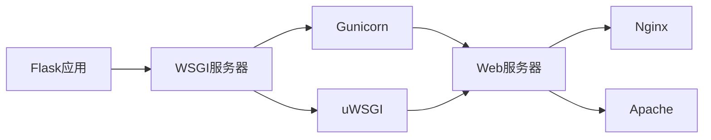

# Python Flask框架

## 什么是Flask？

Flask是Python的一个微型Web框架，由Armin Ronacher开发，基于Werkzeug WSGI工具包和Jinja2模板引擎。作为一个"微"框架，Flask不包含数据库抽象层、表单验证或任何其他已有的库可以胜任的功能。相反，Flask支持扩展，这些扩展可以为你的应用程序添加这些功能，就像它们是在Flask本身中实现的一样。

:::tip
Flask的设计理念是"从简单开始"，你可以从一个简单的单文件应用开始，随着项目的增长再进行扩展。
:::

## 为什么选择Flask？

- **轻量级**：核心简单但可扩展
- **灵活性**：几乎不强制任何依赖或项目布局
- **简单易学**：上手快，API直观
- **良好的文档**：官方文档详尽，社区资源丰富
- **适合小型到中型项目**：特别是API、静态网站、原型开发

## 安装Flask

在开始之前，确保你已经安装了Python（推荐3.6+）。我们可以使用pip来安装Flask：

```bash
pip install flask
```

## 第一个Flask应用

让我们创建一个最简单的Flask应用：

```python
from flask import Flask

# 创建Flask应用实例
app = Flask(__name__)

# 路由定义
@app.route('/')
def hello_world():
    return 'Hello, World!'

# 启动应用
if __name__ == '__main__':
    app.run(debug=True)
```

将上面的代码保存为`app.py`，然后运行：

```bash
python app.py
```

现在，打开浏览器访问`http://127.0.0.1:5000/`，你应该能看到"Hello, World!"消息。

## Flask的核心概念

### 1. 路由（Routing）

Flask使用装饰器来绑定函数与URL：

```python
@app.route('/hello')
def hello():
    return 'Hello, Flask!'

# 带参数的路由
@app.route('/user/<username>')
def show_user_profile(username):
    return f'User {username}'

# 指定参数类型
@app.route('/post/<int:post_id>')
def show_post(post_id):
    return f'Post {post_id}'
```

### 2. HTTP方法

默认情况下，路由只响应GET请求，但可以通过methods参数指定支持的HTTP方法：

```python
@app.route('/login', methods=['GET', 'POST'])
def login():
    if request.method == 'POST':
        # 处理表单提交
        return '处理登录逻辑'
    else:
        # 显示登录表单
        return '显示登录表单'
```

### 3. 模板渲染

Flask使用Jinja2作为模板引擎。首先在项目根目录下创建一个`templates`文件夹，然后在其中添加HTML模板：

`templates/index.html`:
```html
<!DOCTYPE html>
<html>
<head>
    <title>{{ title }}</title>
</head>
<body>
    <h1>Hello, {{ name }}!</h1>
</body>
</html>
```

然后使用`render_template`函数渲染模板：

```python
from flask import render_template

@app.route('/hello/<name>')
def hello_template(name):
    return render_template('index.html', title='Flask模板示例', name=name)
```

### 4. 请求数据处理

处理来自客户端的请求数据：

```python
from flask import request

@app.route('/search')
def search():
    query = request.args.get('q', '')
    return f'搜索结果：{query}'

@app.route('/submit', methods=['POST'])
def submit():
    username = request.form.get('username')
    password = request.form.get('password')
    return f'提交的用户名：{username}'
```

### 5. 重定向和错误处理

```python
from flask import redirect, url_for, abort

@app.route('/redirect')
def redirect_example():
    # 重定向到index路由
    return redirect(url_for('hello_world'))

@app.route('/admin')
def admin():
    # 如果不是管理员，返回403错误
    abort(403)
    return '管理员页面'

# 自定义错误页面
@app.errorhandler(404)
def page_not_found(error):
    return render_template('404.html'), 404
```

## 实战案例：创建一个待办事项应用

让我们创建一个简单的待办事项（Todo）应用程序，展示Flask的实际使用：

### 项目结构

```
todo_app/
  ├── app.py
  ├── static/
  │    └── style.css
  └── templates/
       ├── base.html
       └── index.html
```

### 应用代码

`app.py`:
```python
from flask import Flask, render_template, request, redirect, url_for

app = Flask(__name__)

# 简单的内存数据库
todos = []

@app.route('/')
def index():
    return render_template('index.html', todos=todos)

@app.route('/add', methods=['POST'])
def add():
    todo = request.form.get('todo')
    if todo:
        todos.append({'task': todo, 'done': False})
    return redirect(url_for('index'))

@app.route('/toggle/<int:index>')
def toggle(index):
    if 0 <= index < len(todos):
        todos[index]['done'] = not todos[index]['done']
    return redirect(url_for('index'))

@app.route('/delete/<int:index>')
def delete(index):
    if 0 <= index < len(todos):
        del todos[index]
    return redirect(url_for('index'))

if __name__ == '__main__':
    app.run(debug=True)
```

`templates/base.html`:
```html
<!DOCTYPE html>
<html>
<head>
    <title> - Flask Todo App</title>
    <link rel="stylesheet" href="{{ url_for('static', filename='style.css') }}">
</head>
<body>
    <div class="container">
        
    </div>
</body>
</html>
```

`templates/index.html`:
```html


首页


    <h1>待办事项列表</h1>
    
    <form method="post" action="{{ url_for('add') }}">
        <input type="text" name="todo" placeholder="添加新任务...">
        <button type="submit">添加</button>
    </form>
    
    <ul class="todo-list">
        
            <li class="done">
                <span>{{ todo.task }}</span>
                <div class="actions">
                    <a href="{{ url_for('toggle', index=loop.index0) }}">
                        未完成完成
                    </a>
                    <a href="{{ url_for('delete', index=loop.index0) }}">删除</a>
                </div>
            </li>
        
            <li><em>暂无待办事项</em></li>
        
    </ul>

```

`static/style.css`:
```css
body {
    font-family: Arial, sans-serif;
    line-height: 1.6;
    margin: 0;
    padding: 20px;
    background-color: #f4f4f4;
}

.container {
    max-width: 600px;
    margin: 0 auto;
    background: white;
    padding: 20px;
    border-radius: 5px;
    box-shadow: 0 0 10px rgba(0,0,0,0.1);
}

h1 {
    color: #333;
}

form {
    display: flex;
    margin-bottom: 20px;
}

input[type="text"] {
    flex: 1;
    padding: 10px;
    border: 1px solid #ddd;
    border-radius: 4px 0 0 4px;
}

button {
    padding: 10px 15px;
    background: #5cb85c;
    color: white;
    border: none;
    border-radius: 0 4px 4px 0;
    cursor: pointer;
}

.todo-list {
    list-style: none;
    padding: 0;
}

.todo-list li {
    padding: 10px;
    border-bottom: 1px solid #eee;
    display: flex;
    justify-content: space-between;
    align-items: center;
}

.todo-list li.done span {
    text-decoration: line-through;
    color: #999;
}

.actions a {
    margin-left: 10px;
    color: #0275d8;
    text-decoration: none;
}

.actions a:hover {
    text-decoration: underline;
}
```

## Flask应用部署

将Flask应用部署到生产环境有多种方式：



简单的部署方案（以Gunicorn和Nginx为例）：

1. 安装Gunicorn：
```bash
pip install gunicorn
```

2. 启动Gunicorn服务器：
```bash
gunicorn -w 4 -b 127.0.0.1:8000 app:app
```

3. 配置Nginx作为反向代理：
```
server {
    listen 80;
    server_name example.com;

    location / {
        proxy_pass http://127.0.0.1:8000;
        proxy_set_header Host $host;
        proxy_set_header X-Real-IP $remote_addr;
    }
}
```

:::caution
永远不要在生产环境中使用Flask的内建开发服务器。它不是为生产环境设计的，无法处理高并发和安全考量。
:::

## Flask扩展生态系统

Flask有丰富的扩展生态系统，可以为你的应用添加各种功能：

- **Flask-SQLAlchemy**：ORM数据库支持
- **Flask-WTF**：表单处理和验证
- **Flask-Login**：用户会话管理
- **Flask-RESTful**：构建REST API
- **Flask-Admin**：管理界面
- **Flask-Migrate**：数据库迁移
- **Flask-Mail**：电子邮件支持

示例 - 使用Flask-SQLAlchemy:

```python
from flask import Flask
from flask_sqlalchemy import SQLAlchemy

app = Flask(__name__)
app.config['SQLALCHEMY_DATABASE_URI'] = 'sqlite:///test.db'
db = SQLAlchemy(app)

class User(db.Model):
    id = db.Column(db.Integer, primary_key=True)
    username = db.Column(db.String(80), unique=True, nullable=False)
    email = db.Column(db.String(120), unique=True, nullable=False)

    def __repr__(self):
        return f'<User {self.username}>'

with app.app_context():
    db.create_all()
```

## 总结

Flask是一个强大而灵活的Python Web框架，适合从小型到中型的各种Web应用开发。它的核心简单易学，同时通过丰富的扩展可以满足复杂应用的需求。

在本文中，我们：
- 了解了Flask的基础知识和优势
- 学习了核心概念：路由、HTTP方法、模板、请求处理等
- 通过一个实际的待办事项应用展示了Flask的应用开发
- 简要介绍了部署和扩展生态系统

## 练习任务

1. 扩展待办事项应用，添加优先级和截止日期功能
2. 将待办事项存储在数据库中（使用SQLite和Flask-SQLAlchemy）
3. 添加用户认证功能，让不同用户拥有自己的待办事项列表
4. 创建一个RESTful API，让待办事项可以通过API访问

## 进一步学习的资源

- [Flask官方文档](https://flask.palletsprojects.com/)
- [Flask Mega-Tutorial](https://blog.miguelgrinberg.com/post/the-flask-mega-tutorial-part-i-hello-world)
- [Flask Web开发：基于Python的Web应用开发实战](https://www.amazon.com/Flask-Web-Development-Developing-Applications/dp/1491991739)（图书）
- [Real Python Flask教程](https://realpython.com/tutorials/flask/)

通过持续学习和实践，你将能够使用Flask构建各种类型的Web应用，从简单的个人博客到复杂的企业应用。Flask的简洁设计和灵活架构使其成为Python Web开发的绝佳选择。