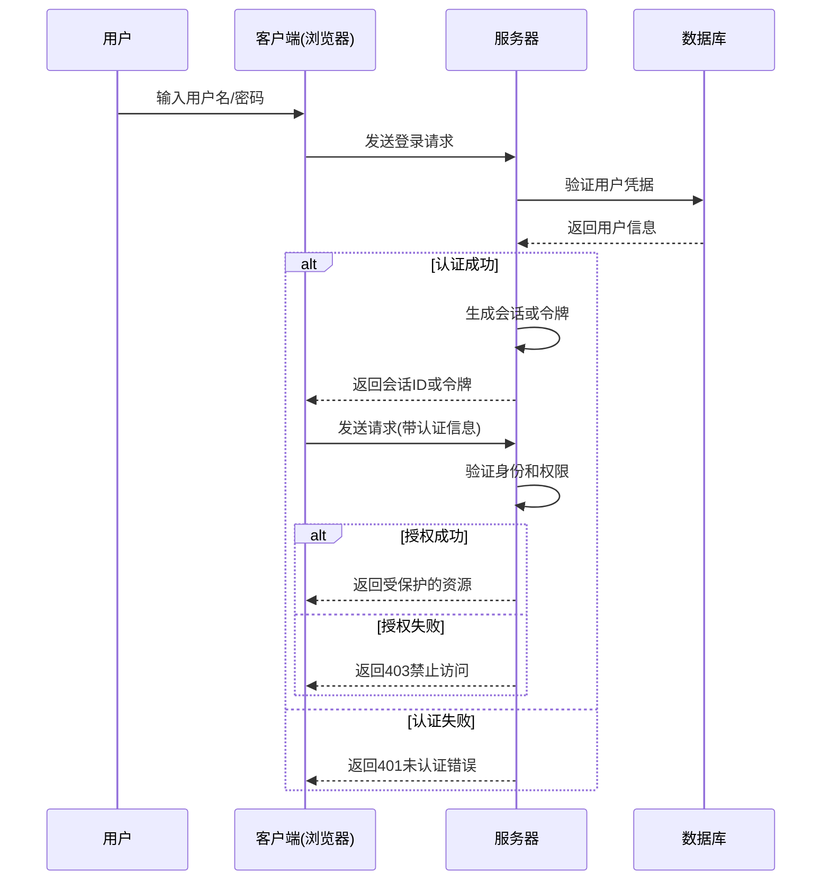

# Python 认证授权

## 介绍

在Web应用开发中，认证（Authentication）和授权（Authorization）是两个至关重要的安全概念。简单来说：
- **认证**是验证用户身份的过程（"你是谁？"）
- **授权**是确定用户权限的过程（"你可以做什么？"）

本文将介绍如何在Python Web应用中实现这两个关键安全机制，帮助初学者理解并实现基本的用户认证和权限控制功能。

## 认证与授权的基本概念

### 认证(Authentication)

认证回答的是"你是谁？"的问题，常见的认证方式包括：

1. 基于用户名和密码
2. 基于令牌(Token)
3. OAuth认证
4. 多因素认证

:::note
认证通常是系统安全的第一道防线，确保用户是他们所声称的那个人。
:::

### 授权(Authorization)

授权解决的是"你能做什么？"的问题：

1. 基于角色的访问控制(RBAC)
2. 基于属性的访问控制(ABAC)
3. 访问控制列表(ACL)

## 在Flask中实现基本认证

Flask是Python中流行的Web框架，下面我们通过Flask实现一个简单的认证系统。

### 1. 安装必要的包

```bash
pip install flask flask-login werkzeug
```

### 2. 创建基本的用户认证系统

```python
from flask import Flask, render_template, redirect, url_for, request, flash
from flask_login import LoginManager, UserMixin, login_user, logout_user, login_required, current_user
from werkzeug.security import generate_password_hash, check_password_hash

app = Flask(__name__)
app.config['SECRET_KEY'] = 'your-secret-key'  # 在实际应用中，应该使用环境变量

login_manager = LoginManager()
login_manager.init_app(app)
login_manager.login_view = 'login'

# 模拟用户数据库
users = {
    'user1': {
        'username': 'user1',
        'password': generate_password_hash('password1'),
        'role': 'user'
    },
    'admin': {
        'username': 'admin',
        'password': generate_password_hash('adminpass'),
        'role': 'admin'
    }
}

class User(UserMixin):
    def __init__(self, id, username, password, role):
        self.id = id
        self.username = username
        self.password = password
        self.role = role

@login_manager.user_loader
def load_user(user_id):
    if user_id in users:
        user_data = users[user_id]
        return User(user_id, user_data['username'], user_data['password'], user_data['role'])
    return None

@app.route('/login', methods=['GET', 'POST'])
def login():
    if request.method == 'POST':
        username = request.form.get('username')
        password = request.form.get('password')
        
        if username in users and check_password_hash(users[username]['password'], password):
            user_data = users[username]
            user = User(username, user_data['username'], user_data['password'], user_data['role'])
            login_user(user)
            return redirect(url_for('dashboard'))
        
        flash('用户名或密码错误')
    
    return render_template('login.html')

@app.route('/logout')
@login_required
def logout():
    logout_user()
    return redirect(url_for('login'))

@app.route('/dashboard')
@login_required
def dashboard():
    return render_template('dashboard.html')

if __name__ == '__main__':
    app.run(debug=True)
```

在这个例子中：
- 我们使用`flask_login`扩展来管理用户会话
- `UserMixin`提供了用户类所需的基本方法
- `login_required`装饰器确保只有登录用户才能访问特定页面

## 实现简单的授权机制

让我们为上述代码添加简单的基于角色的授权：

```python
from functools import wraps

def admin_required(f):
    @wraps(f)
    def decorated_function(*args, **kwargs):
        if current_user.role != 'admin':
            flash('您没有权限访问此页面')
            return redirect(url_for('dashboard'))
        return f(*args, **kwargs)
    return decorated_function

@app.route('/admin')
@login_required
@admin_required
def admin_page():
    return render_template('admin.html')
```

这个装饰器检查当前用户的角色，只有管理员才能访问admin页面。

## 使用JWT实现基于令牌的认证

对于API开发，基于令牌(Token)的认证通常是更好的选择。JWT(JSON Web Token)是一个流行的实现方式：

```python
from flask import Flask, jsonify, request
import jwt
import datetime
from functools import wraps

app = Flask(__name__)
app.config['SECRET_KEY'] = 'your-secret-key'  # 实际应用中请使用环境变量

def token_required(f):
    @wraps(f)
    def decorated(*args, **kwargs):
        token = request.headers.get('Authorization')
        
        if not token:
            return jsonify({'message': '缺少令牌!'}), 401
        
        try:
            data = jwt.decode(token, app.config['SECRET_KEY'], algorithms=["HS256"])
        except:
            return jsonify({'message': '令牌无效!'}), 401
            
        return f(data, *args, **kwargs)
    
    return decorated

@app.route('/login', methods=['POST'])
def login():
    auth = request.authorization
    
    if not auth or not auth.username or not auth.password:
        return jsonify({'message': '需要登录凭据'}), 401
    
    # 这里应该检查用户名和密码是否正确
    if auth.username == 'admin' and auth.password == 'password':
        token = jwt.encode({
            'user': auth.username,
            'role': 'admin',
            'exp': datetime.datetime.utcnow() + datetime.timedelta(hours=24)
        }, app.config['SECRET_KEY'], algorithm="HS256")
        
        return jsonify({'token': token})
    
    return jsonify({'message': '验证失败!'}), 401

@app.route('/protected', methods=['GET'])
@token_required
def protected(user_data):
    return jsonify({'message': f'你好 {user_data["user"]}，这是一个受保护的路由!'})

if __name__ == '__main__':
    app.run(debug=True)
```

## 使用OAuth2进行第三方认证

当你想让用户通过Google、GitHub等第三方服务登录时，OAuth2是常用的解决方案：

```python
from flask import Flask, redirect, url_for, session, request
from authlib.integrations.flask_client import OAuth

app = Flask(__name__)
app.secret_key = 'your-secret-key'

oauth = OAuth(app)
google = oauth.register(
    name='google',
    client_id='你的Google客户端ID',
    client_secret='你的Google客户端密钥',
    access_token_url='https://accounts.google.com/o/oauth2/token',
    access_token_params=None,
    authorize_url='https://accounts.google.com/o/oauth2/auth',
    authorize_params=None,
    api_base_url='https://www.googleapis.com/oauth2/v1/',
    client_kwargs={'scope': 'openid email profile'},
)

@app.route('/')
def home():
    user = session.get('user')
    if user:
        return f'你好 {user["name"]}!'
    return '欢迎来到我的网站！ <a href="/login">登录</a>'

@app.route('/login')
def login():
    redirect_uri = url_for('auth', _external=True)
    return google.authorize_redirect(redirect_uri)

@app.route('/auth')
def auth():
    token = google.authorize_access_token()
    user_info = google.get('userinfo').json()
    session['user'] = user_info
    return redirect('/')

@app.route('/logout')
def logout():
    session.pop('user', None)
    return redirect('/')

if __name__ == '__main__':
    app.run(debug=True)
```

## 实际应用场景：完整的认证授权系统

让我们看一个更完整的案例，结合Flask-SQLAlchemy和Flask-Login实现一个具有用户管理功能的Web应用：

```python
from flask import Flask, render_template, redirect, url_for, flash, request
from flask_sqlalchemy import SQLAlchemy
from flask_login import LoginManager, UserMixin, login_user, logout_user, login_required, current_user
from werkzeug.security import generate_password_hash, check_password_hash
from functools import wraps

app = Flask(__name__)
app.config['SECRET_KEY'] = 'your-secret-key'
app.config['SQLALCHEMY_DATABASE_URI'] = 'sqlite:///users.db'
app.config['SQLALCHEMY_TRACK_MODIFICATIONS'] = False

db = SQLAlchemy(app)
login_manager = LoginManager()
login_manager.init_app(app)
login_manager.login_view = 'login'

# 用户模型
class User(UserMixin, db.Model):
    id = db.Column(db.Integer, primary_key=True)
    username = db.Column(db.String(100), unique=True, nullable=False)
    password = db.Column(db.String(200), nullable=False)
    role = db.Column(db.String(20), nullable=False, default='user')

# 文章模型
class Article(db.Model):
    id = db.Column(db.Integer, primary_key=True)
    title = db.Column(db.String(100), nullable=False)
    content = db.Column(db.Text, nullable=False)
    author_id = db.Column(db.Integer, db.ForeignKey('user.id'), nullable=False)
    author = db.relationship('User', backref=db.backref('articles', lazy=True))

@login_manager.user_loader
def load_user(user_id):
    return User.query.get(int(user_id))

# 角色检查装饰器
def role_required(role):
    def wrapper(fn):
        @wraps(fn)
        def decorated_view(*args, **kwargs):
            if not current_user.is_authenticated or current_user.role != role:
                flash("您没有权限访问此页面")
                return redirect(url_for('home'))
            return fn(*args, **kwargs)
        return decorated_view
    return wrapper

# 路由
@app.route('/')
def home():
    articles = Article.query.all()
    return render_template('home.html', articles=articles)

@app.route('/register', methods=['GET', 'POST'])
def register():
    if request.method == 'POST':
        username = request.form.get('username')
        password = request.form.get('password')
        
        # 检查用户是否已存在
        user = User.query.filter_by(username=username).first()
        if user:
            flash('用户名已存在')
            return redirect(url_for('register'))
        
        # 创建新用户
        new_user = User(
            username=username,
            password=generate_password_hash(password),
            role='user'  # 默认角色
        )
        db.session.add(new_user)
        db.session.commit()
        
        flash('注册成功，现在可以登录')
        return redirect(url_for('login'))
    
    return render_template('register.html')

@app.route('/login', methods=['GET', 'POST'])
def login():
    if request.method == 'POST':
        username = request.form.get('username')
        password = request.form.get('password')
        
        user = User.query.filter_by(username=username).first()
        
        if user and check_password_hash(user.password, password):
            login_user(user)
            flash('登录成功')
            next_page = request.args.get('next')
            return redirect(next_page or url_for('home'))
        
        flash('用户名或密码错误')
        
    return render_template('login.html')

@app.route('/logout')
@login_required
def logout():
    logout_user()
    flash('您已登出')
    return redirect(url_for('home'))

@app.route('/create', methods=['GET', 'POST'])
@login_required
def create_article():
    if request.method == 'POST':
        title = request.form.get('title')
        content = request.form.get('content')
        
        article = Article(
            title=title,
            content=content,
            author=current_user
        )
        db.session.add(article)
        db.session.commit()
        
        flash('文章创建成功')
        return redirect(url_for('home'))
    
    return render_template('create_article.html')

@app.route('/admin')
@login_required
@role_required('admin')
def admin():
    users = User.query.all()
    return render_template('admin.html', users=users)

# 创建管理员账号的命令行接口
@app.cli.command('create-admin')
def create_admin():
    username = input('输入管理员用户名: ')
    password = input('输入管理员密码: ')
    
    admin = User(
        username=username,
        password=generate_password_hash(password),
        role='admin'
    )
    
    db.session.add(admin)
    db.session.commit()
    print('管理员账号创建成功')

if __name__ == '__main__':
    with app.app_context():
        db.create_all()
    app.run(debug=True)
```

在这个例子中：
1. 我们使用SQLAlchemy创建了用户和文章模型
2. 实现了用户注册和登录功能
3. 使用`role_required`装饰器控制对管理页面的访问
4. 提供了创建管理员账户的命令行接口

## 认证与授权的最佳实践

### 安全存储密码

```python
# 不安全的密码存储（永远不要这样做！）
password = "plaintext_password"  # ❌

# 安全的密码存储
from werkzeug.security import generate_password_hash
hashed_password = generate_password_hash("secure_password")  # ✅
```

### 防止SQL注入

```python
# 不安全的查询（易受SQL注入攻击）
username = request.form.get('username')
query = f"SELECT * FROM users WHERE username = '{username}'"  # ❌

# 安全的查询（使用ORM或参数化查询）
user = User.query.filter_by(username=username).first()  # ✅
```

### HTTPS和安全Cookie

确保在生产环境中:
1. 使用HTTPS传输数据
2. 设置安全cookie选项

```python
app.config.update(
    SESSION_COOKIE_SECURE=True,
    SESSION_COOKIE_HTTPONLY=True,
    SESSION_COOKIE_SAMESITE='Lax',
)
```

## 认证授权架构图

下面是一个典型的Web应用认证授权流程：



## 总结

认证和授权是Web应用安全的基石。在Python Web开发中：

1. **认证**验证用户身份，使用密码、令牌或OAuth等方式
2. **授权**控制用户可以执行的操作，通常基于角色或权限
3. 现代Python Web框架提供多种安全工具，如Flask-Login和JWT

安全是一个持续的过程，随着你的Web应用变得更复杂，你需要不断更新和改进你的认证授权系统。始终关注安全最佳实践，并定期审查你的代码以防止安全漏洞。

## 练习与附加资源

### 练习

1. 实现一个基本的Flask应用，包含用户注册、登录和注销功能
2. 添加基于角色的授权，区分普通用户和管理员
3. 修改应用以使用JWT而不是会话进行API认证
4. 实现"记住我"功能，允许用户在一段时间内不用重新登录

### 附加资源

- [Flask-Login文档](https://flask-login.readthedocs.io/)
- [Flask-JWT-Extended](https://flask-jwt-extended.readthedocs.io/)
- [OWASP认证安全最佳实践](https://owasp.org/www-project-cheat-sheets/cheatsheets/Authentication_Cheat_Sheet.html)
- [OAuth 2.0的了解与实现](https://oauth.net/2/)
- [Django认证系统文档](https://docs.djangoproject.com/en/stable/topics/auth/)

:::tip
无论你选择哪种认证授权方式，都要记住"永远不要自己发明加密算法"—使用经过验证的库和标准。
:::

通过学习本文内容，你已经掌握了Python Web应用中认证和授权的基础知识。随着你的技能提升，不断深入研究安全最佳实践，为你的应用和用户提供更好的保护。