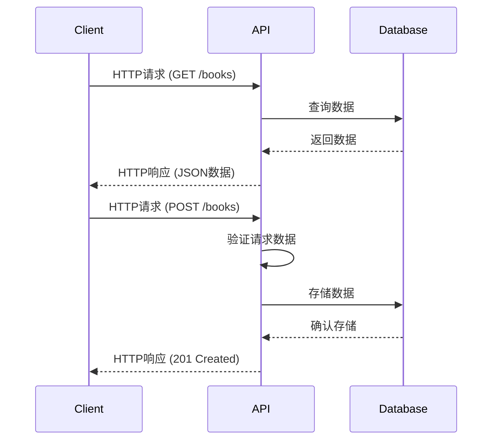

# Python RESTful API

## 什么是RESTful API？

REST(Representational State Transfer)是一种软件架构风格，用于设计网络应用程序。RESTful API是遵循REST原则的应用程序接口，它使用HTTP请求来执行CRUD（创建、读取、更新、删除）操作。

在现代Web开发中，RESTful API扮演着至关重要的角色，它允许客户端（如网页或移动应用）与服务器进行通信，实现数据交换和操作。

### REST的核心原则

1. **无状态** - 每个请求包含所有必要信息
2. **资源导向** - 一切都被视为资源，通过URL进行标识
3. **HTTP方法** - 使用标准HTTP方法执行操作
   - GET: 获取资源
   - POST: 创建资源
   - PUT/PATCH: 更新资源
   - DELETE: 删除资源

## 为什么使用Python构建RESTful API？

Python提供了多种优秀的框架和库来构建RESTful API，这些工具使得API开发变得简单高效：

- 简洁的语法和高可读性
- 丰富的库和框架生态系统
- 快速开发和原型设计
- 强大的社区支持

## Python 构建RESTful API的主要框架

### 1. Flask

Flask是一个轻量级的Python Web框架，非常适合构建小型到中型API。

### 2. Django Rest Framework

基于Django的强大框架，提供了全面的REST功能，适合大型项目。

### 3. FastAPI

新兴的高性能框架，专为API开发设计，具有自动文档生成功能。

## 使用Flask构建简单的RESTful API

让我们使用Flask构建一个简单的书籍管理API。

### 安装必要的包

```bash
pip install flask flask-restful
```

### 创建基本API结构

```python
from flask import Flask, request
from flask_restful import Resource, Api

app = Flask(__name__)
api = Api(app)

# 模拟数据库
books = [
    {"id": 1, "title": "Python基础教程", "author": "张三"},
    {"id": 2, "title": "Flask Web开发", "author": "李四"}
]

class BookList(Resource):
    def get(self):
        return {"books": books}
    
    def post(self):
        new_book = request.get_json()
        book_id = books[-1]["id"] + 1 if books else 1
        new_book["id"] = book_id
        books.append(new_book)
        return new_book, 201

class Book(Resource):
    def get(self, book_id):
        for book in books:
            if book["id"] == book_id:
                return book
        return {"message": "Book not found"}, 404
    
    def put(self, book_id):
        data = request.get_json()
        for book in books:
            if book["id"] == book_id:
                book.update(data)
                return book
        return {"message": "Book not found"}, 404
    
    def delete(self, book_id):
        global books
        for index, book in enumerate(books):
            if book["id"] == book_id:
                deleted_book = books.pop(index)
                return {"message": "Book deleted"}
        return {"message": "Book not found"}, 404

# 注册路由
api.add_resource(BookList, '/books')
api.add_resource(Book, '/books/<int:book_id>')

if __name__ == '__main__':
    app.run(debug=True)
```

### API操作示例

#### 获取所有书籍
**请求**:
```
GET http://localhost:5000/books
```

**响应**:
```json
{
  "books": [
    {"id": 1, "title": "Python基础教程", "author": "张三"},
    {"id": 2, "title": "Flask Web开发", "author": "李四"}
  ]
}
```

#### 添加新书
**请求**:
```
POST http://localhost:5000/books
Content-Type: application/json

{
  "title": "Python高级编程",
  "author": "王五"
}
```

**响应**:
```json
{
  "id": 3,
  "title": "Python高级编程",
  "author": "王五"
}
```

#### 获取特定书籍
**请求**:
```
GET http://localhost:5000/books/1
```

**响应**:
```json
{
  "id": 1,
  "title": "Python基础教程",
  "author": "张三"
}
```

## 使用FastAPI构建RESTful API

FastAPI是一个现代、快速的Web框架，专为API开发而设计，具有自动文档生成功能。

### 安装FastAPI

```bash
pip install fastapi uvicorn
```

### 创建FastAPI应用

```python
from fastapi import FastAPI, HTTPException
from pydantic import BaseModel
from typing import List, Optional

app = FastAPI(title="Book API")

# 数据模型
class Book(BaseModel):
    id: Optional[int] = None
    title: str
    author: str

# 模拟数据库
books_db = [
    Book(id=1, title="Python基础教程", author="张三"),
    Book(id=2, title="FastAPI入门", author="李四")
]

@app.get("/books", response_model=List[Book])
def get_books():
    return books_db

@app.post("/books", response_model=Book, status_code=201)
def create_book(book: Book):
    book_id = max(b.id for b in books_db) + 1 if books_db else 1
    book.id = book_id
    books_db.append(book)
    return book

@app.get("/books/{book_id}", response_model=Book)
def get_book(book_id: int):
    for book in books_db:
        if book.id == book_id:
            return book
    raise HTTPException(status_code=404, detail="Book not found")

@app.put("/books/{book_id}", response_model=Book)
def update_book(book_id: int, updated_book: Book):
    for i, book in enumerate(books_db):
        if book.id == book_id:
            updated_book.id = book_id
            books_db[i] = updated_book
            return updated_book
    raise HTTPException(status_code=404, detail="Book not found")

@app.delete("/books/{book_id}")
def delete_book(book_id: int):
    for i, book in enumerate(books_db):
        if book.id == book_id:
            books_db.pop(i)
            return {"message": "Book deleted"}
    raise HTTPException(status_code=404, detail="Book not found")

if __name__ == "__main__":
    import uvicorn
    uvicorn.run(app, host="0.0.0.0", port=8000)
```

运行FastAPI应用:

```bash
uvicorn main:app --reload
```

:::tip
FastAPI自动为你的API生成了交互式API文档，可以通过访问 http://localhost:8000/docs 查看。
:::

## RESTful API最佳实践

### 1. 使用合适的HTTP方法

```
GET - 获取资源
POST - 创建资源
PUT - 完全替换资源
PATCH - 部分更新资源
DELETE - 删除资源
```

### 2. 使用明确的URL路径

```
/books - 获取所有书籍
/books/{id} - 操作特定书籍
/authors/{author_id}/books - 获取特定作者的所有书籍
```

### 3. 使用适当的状态码

```
200 - OK
201 - Created
204 - No Content
400 - Bad Request
404 - Not Found
500 - Internal Server Error
```

### 4. 实现分页和过滤

```python
@app.get("/books")
def get_books(skip: int = 0, limit: int = 10, author: Optional[str] = None):
    result = books_db
    if author:
        result = [book for book in result if book.author == author]
    return result[skip:skip+limit]
```

### 5. 版本控制

```
/api/v1/books
/api/v2/books
```

## 流程图：RESTful API请求处理过程



## 实际应用案例：构建一个Todo API

现在让我们构建一个简单但完整的待办事项(Todo)API，这是一个常见的实际应用场景。

### 使用Flask和SQLAlchemy

```python
from flask import Flask, request, jsonify
from flask_sqlalchemy import SQLAlchemy
from datetime import datetime

app = Flask(__name__)
app.config['SQLALCHEMY_DATABASE_URI'] = 'sqlite:///todos.db'
app.config['SQLALCHEMY_TRACK_MODIFICATIONS'] = False
db = SQLAlchemy(app)

# 定义Todo模型
class Todo(db.Model):
    id = db.Column(db.Integer, primary_key=True)
    title = db.Column(db.String(100), nullable=False)
    description = db.Column(db.String(200))
    completed = db.Column(db.Boolean, default=False)
    created_at = db.Column(db.DateTime, default=datetime.utcnow)

    def to_dict(self):
        return {
            'id': self.id,
            'title': self.title,
            'description': self.description,
            'completed': self.completed,
            'created_at': self.created_at.isoformat()
        }

# 创建数据库表
with app.app_context():
    db.create_all()

# 获取所有待办事项
@app.route('/todos', methods=['GET'])
def get_todos():
    todos = Todo.query.all()
    return jsonify([todo.to_dict() for todo in todos])

# 获取单个待办事项
@app.route('/todos/<int:todo_id>', methods=['GET'])
def get_todo(todo_id):
    todo = Todo.query.get_or_404(todo_id)
    return jsonify(todo.to_dict())

# 创建新待办事项
@app.route('/todos', methods=['POST'])
def create_todo():
    data = request.get_json()
    if not data.get('title'):
        return jsonify({'error': 'Title is required'}), 400
    
    new_todo = Todo(
        title=data['title'],
        description=data.get('description', ''),
        completed=data.get('completed', False)
    )
    db.session.add(new_todo)
    db.session.commit()
    
    return jsonify(new_todo.to_dict()), 201

# 更新待办事项
@app.route('/todos/<int:todo_id>', methods=['PUT'])
def update_todo(todo_id):
    todo = Todo.query.get_or_404(todo_id)
    data = request.get_json()
    
    todo.title = data.get('title', todo.title)
    todo.description = data.get('description', todo.description)
    todo.completed = data.get('completed', todo.completed)
    
    db.session.commit()
    return jsonify(todo.to_dict())

# 删除待办事项
@app.route('/todos/<int:todo_id>', methods=['DELETE'])
def delete_todo(todo_id):
    todo = Todo.query.get_or_404(todo_id)
    db.session.delete(todo)
    db.session.commit()
    return jsonify({'message': 'Todo deleted'}), 200

if __name__ == '__main__':
    app.run(debug=True)
```

### 使用该API的示例

**创建待办事项:**
```
POST /todos
Content-Type: application/json

{
  "title": "学习RESTful API",
  "description": "完成Python RESTful API教程"
}
```

**获取所有待办事项:**
```
GET /todos
```

**标记待办事项为已完成:**
```
PUT /todos/1
Content-Type: application/json

{
  "completed": true
}
```

**删除待办事项:**
```
DELETE /todos/1
```

:::caution
在实际生产环境中，你还需要添加适当的身份验证和授权机制来保护你的API。
:::

## API测试工具

开发RESTful API时，使用合适的工具进行测试非常重要：

1. **Postman** - 功能强大的API测试工具
2. **curl** - 命令行工具，适合快速测试
3. **HTTPie** - 更用户友好的curl替代品
4. **pytest** - 编写Python API自动化测试

## 总结

在本教程中，我们学习了：

- RESTful API的基础概念和原则
- 使用Flask和FastAPI构建Python RESTful API
- RESTful API的最佳实践
- 一个实际的Todo应用API实现

通过这些知识，你已经能够设计和实现自己的RESTful API，为你的Web应用或移动应用提供后端服务。

## 练习

1. 扩展Todo API，添加用户认证功能
2. 实现Todo API的分页功能
3. 为Todo添加标签(tags)功能，并实现按标签过滤的API
4. 使用FastAPI重新实现Todo API
5. 为你的API编写自动化测试

## 附加资源

- [RESTful API设计最佳实践](https://restfulapi.net/)
- [Flask官方文档](https://flask.palletsprojects.com/)
- [FastAPI官方文档](https://fastapi.tiangolo.com/)
- [Django Rest Framework文档](https://www.django-rest-framework.org/)
- [Python API开发: RESTful APIs with Python and Flask](https://www.udemy.com/course/rest-api-flask-and-python/)

通过继续学习和实践，你将能够掌握更高级的API开发技术，并构建出可靠、高效的Web服务。