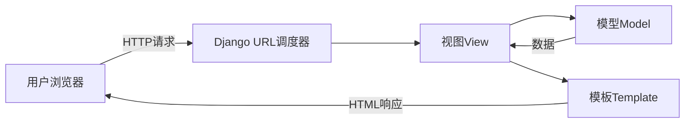

# Python Django框架

## 什么是Django？

Django是Python生态系统中最流行的Web框架之一，由经验丰富的Web开发人员创建，用于处理Web开发中的常见挑战。它遵循"包含电池"的理念，提供了许多内置功能，如用户认证、内容管理、站点地图、RSS源等，帮助开发者快速构建安全、可维护的Web应用。

:::note
Django发音为"姜戈"（jango），以著名的爵士吉他手Django Reinhardt命名。
:::

## Django的主要特点

Django框架拥有许多引人注目的特点，使其成为Python Web开发的首选框架：

1. **快速开发**：Django的设计宗旨是帮助开发者尽可能快地从概念到完成开发应用。
2. **安全性**：内置保护，防止许多常见的安全错误，如SQL注入、跨站脚本攻击等。
3. **可扩展性**：Django可以处理高流量网站的需求，并根据需要进行水平扩展。
4. **丰富的生态系统**：拥有大量的第三方包和扩展。
5. **DRY原则**：遵循"不要重复自己"(Don't Repeat Yourself)原则，鼓励代码复用。
6. **MTV架构**：使用Model-Template-View架构模式（类似于MVC）。



## 安装Django

在开始使用Django之前，我们需要先安装它。Django要求Python 3.6或更高版本。

```bash
# 使用pip安装Django
pip install django

# 验证安装
python -m django --version
```

## 创建第一个Django项目

安装好Django后，让我们创建第一个项目：

```bash
# 创建一个名为'mysite'的项目
django-admin startproject mysite

# 进入项目目录
cd mysite

# 启动开发服务器
python manage.py runserver
```

执行上述命令后，你应该能在浏览器中访问 http://127.0.0.1:8000/ 看到Django的欢迎页面。

## Django项目结构

让我们了解一下Django项目的基本结构：

```
mysite/
    manage.py                # 命令行工具，用于与Django项目交互
    mysite/                  # 项目包
        __init__.py          # 空文件，表明此目录是一个Python包
        settings.py          # 项目配置
        urls.py              # URL声明
        asgi.py              # ASGI兼容的Web服务器入口
        wsgi.py              # WSGI兼容的Web服务器入口
```

## Django应用概念

在Django中，项目由多个应用组成。应用是一个Web应用程序，执行特定功能。让我们创建第一个应用：

```bash
# 创建名为'polls'的应用
python manage.py startapp polls
```

应用的结构如下：

```
polls/
    __init__.py
    admin.py                 # 管理界面配置
    apps.py                  # 应用配置
    migrations/              # 数据库迁移文件
        __init__.py
    models.py                # 数据模型
    tests.py                 # 测试
    views.py                 # 视图函数
```

## Django MTV架构

Django遵循MTV（Model-Template-View）架构模式：

1. **Model（模型）**：定义数据结构，提供与数据库交互的API。
2. **Template（模板）**：负责如何显示数据，即用户界面。
3. **View（视图）**：处理用户请求，从模型获取数据，然后将数据传递给模板。

### 模型（Models）

模型是你的数据的单一、明确的信息来源。它包含了你存储的数据的基本字段和行为。

```python
# polls/models.py
from django.db import models

class Question(models.Model):
    question_text = models.CharField(max_length=200)
    pub_date = models.DateTimeField('date published')
    
    def __str__(self):
        return self.question_text

class Choice(models.Model):
    question = models.ForeignKey(Question, on_delete=models.CASCADE)
    choice_text = models.CharField(max_length=200)
    votes = models.IntegerField(default=0)
    
    def __str__(self):
        return self.choice_text
```

在定义模型后，需要运行数据库迁移来创建数据库表：

```bash
# 创建迁移文件
python manage.py makemigrations polls

# 应用迁移
python manage.py migrate
```

### 视图（Views）

视图是Django应用中的"控制器"部分，处理Web请求并返回Web响应。

```python
# polls/views.py
from django.http import HttpResponse
from .models import Question

def index(request):
    latest_question_list = Question.objects.order_by('-pub_date')[:5]
    output = ', '.join([q.question_text for q in latest_question_list])
    return HttpResponse(output)

def detail(request, question_id):
    try:
        question = Question.objects.get(pk=question_id)
    except Question.DoesNotExist:
        raise Http404("Question does not exist")
    return HttpResponse(f"You're looking at question {question.question_text}")
```

### URL配置

URL配置将URL模式映射到视图：

```python
# polls/urls.py
from django.urls import path
from . import views

app_name = 'polls'
urlpatterns = [
    path('', views.index, name='index'),
    path('<int:question_id>/', views.detail, name='detail'),
]
```

然后，在项目的主urls.py中包含应用的URLs：

```python
# mysite/urls.py
from django.contrib import admin
from django.urls import include, path

urlpatterns = [
    path('polls/', include('polls.urls')),
    path('admin/', admin.site.urls),
]
```

### 模板（Templates）

模板是用于生成HTML的文本文件：

```html
<!-- polls/templates/polls/index.html -->

    <ul>
    
        <li><a href="">{{ question.question_text }}</a></li>
    
    </ul>

    <p>No polls are available.</p>

```

更新视图以使用模板：

```python
# polls/views.py
from django.shortcuts import render
from .models import Question

def index(request):
    latest_question_list = Question.objects.order_by('-pub_date')[:5]
    context = {'latest_question_list': latest_question_list}
    return render(request, 'polls/index.html', context)
```

## Django管理后台

Django提供了一个自动生成的管理界面，可以轻松管理你的网站内容。

```python
# polls/admin.py
from django.contrib import admin
from .models import Question, Choice

admin.site.register(Question)
admin.site.register(Choice)
```

要使用管理界面，首先需要创建一个超级用户：

```bash
python manage.py createsuperuser
```

然后可以访问 http://127.0.0.1:8000/admin/ 来管理你的数据。

## 表单处理

Django简化了表单的处理。以下是一个简单的表单示例：

```python
# polls/forms.py
from django import forms
from .models import Question

class QuestionForm(forms.ModelForm):
    class Meta:
        model = Question
        fields = ['question_text', 'pub_date']
```

使用表单创建一个新视图：

```python
# polls/views.py
from django.shortcuts import render, redirect
from .forms import QuestionForm

def create_question(request):
    if request.method == 'POST':
        form = QuestionForm(request.POST)
        if form.is_valid():
            form.save()
            return redirect('polls:index')
    else:
        form = QuestionForm()
    return render(request, 'polls/create_question.html', {'form': form})
```

对应的模板：

```html
<!-- polls/templates/polls/create_question.html -->
<form method="post">
    
    {{ form.as_p }}
    <button type="submit">Save</button>
</form>
```

## Django REST Framework

如果你想创建一个API，Django REST Framework是一个强大的工具：

```bash
pip install djangorestframework
```

在settings.py中添加：

```python
INSTALLED_APPS = [
    ...
    'rest_framework',
]
```

创建一个序列化器：

```python
# polls/serializers.py
from rest_framework import serializers
from .models import Question

class QuestionSerializer(serializers.ModelSerializer):
    class Meta:
        model = Question
        fields = ['id', 'question_text', 'pub_date']
```

创建API视图：

```python
# polls/views.py
from rest_framework import viewsets
from .models import Question
from .serializers import QuestionSerializer

class QuestionViewSet(viewsets.ModelViewSet):
    queryset = Question.objects.all()
    serializer_class = QuestionSerializer
```

配置API URLs：

```python
# polls/urls.py
from django.urls import path, include
from rest_framework.routers import DefaultRouter
from . import views

router = DefaultRouter()
router.register(r'questions', views.QuestionViewSet)

urlpatterns = [
    # ... 之前的URL模式
    path('api/', include(router.urls)),
]
```

## 部署Django应用

Django应用可以部署到各种环境中，例如：

1. **PythonAnywhere**：简单易用的Python托管平台
2. **Heroku**：流行的PaaS提供商
3. **AWS/GCP/Azure**：主要云服务提供商
4. **VPS提供商**：如DigitalOcean、Linode等

:::caution
永远不要在生产环境中使用`DEBUG = True`设置，这可能会暴露敏感信息。
:::

## 实际案例：博客应用

让我们构建一个简单的博客应用：

1. 创建一个新应用：

```bash
python manage.py startapp blog
```

2. 定义模型：

```python
# blog/models.py
from django.db import models
from django.contrib.auth.models import User

class Post(models.Model):
    title = models.CharField(max_length=200)
    content = models.TextField()
    pub_date = models.DateTimeField(auto_now_add=True)
    author = models.ForeignKey(User, on_delete=models.CASCADE)
    
    def __str__(self):
        return self.title
```

3. 创建视图：

```python
# blog/views.py
from django.shortcuts import render, get_object_or_404
from .models import Post

def post_list(request):
    posts = Post.objects.order_by('-pub_date')
    return render(request, 'blog/post_list.html', {'posts': posts})

def post_detail(request, post_id):
    post = get_object_or_404(Post, id=post_id)
    return render(request, 'blog/post_detail.html', {'post': post})
```

4. 创建模板：

```html
<!-- blog/templates/blog/post_list.html -->
<h1>Blog Posts</h1>
<ul>
  
    <li>
      <h2><a href="">{{ post.title }}</a></h2>
      <p>{{ post.pub_date }} by {{ post.author.username }}</p>
      <p>{{ post.content|truncatewords:30 }}</p>
    </li>
  
</ul>

<!-- blog/templates/blog/post_detail.html -->
<h1>{{ post.title }}</h1>
<p>{{ post.pub_date }} by {{ post.author.username }}</p>
<div>{{ post.content }}</div>
<a href="">Back to posts</a>
```

5. 配置URL：

```python
# blog/urls.py
from django.urls import path
from . import views

app_name = 'blog'
urlpatterns = [
    path('', views.post_list, name='post_list'),
    path('post/<int:post_id>/', views.post_detail, name='post_detail'),
]
```

6. 在主urls.py中包含博客应用的URL：

```python
# mysite/urls.py
from django.urls import include, path

urlpatterns = [
    # ... 其他URL模式
    path('blog/', include('blog.urls')),
]
```

## 小结

Django是一个功能丰富、安全且可扩展的Web框架，使Python开发者能够快速构建高质量的Web应用：

- **模型（Model）**定义数据结构和与数据库的交互
- **模板（Template）**处理数据的表示和渲染
- **视图（View）**处理业务逻辑和请求处理
- Django提供了许多内置功能，如管理界面、表单处理和认证系统
- 扩展生态系统支持REST API、高级搜索等需求

:::tip
学习Django时，建议逐步从简单项目开始，理解每个概念后再添加复杂性。Django官方文档是最好的学习资源之一。
:::

## 练习与进一步学习

### 练习
1. 创建一个简单的待办事项应用，允许用户添加、查看和完成任务
2. 扩展博客应用，添加评论功能
3. 为博客应用创建一个简单的API

### 进一步学习资源
- [Django官方文档](https://docs.djangoproject.com/)
- [Django Girls教程](https://tutorial.djangogirls.org/)
- [Django REST框架文档](https://www.django-rest-framework.org/)
- [Mozilla Django教程](https://developer.mozilla.org/en-US/docs/Learn/Server-side/Django)
- 《Django for Beginners》书籍 by William S. Vincent

通过实践和不断学习，你将成为Django开发的专家，能够构建复杂而强大的Web应用。