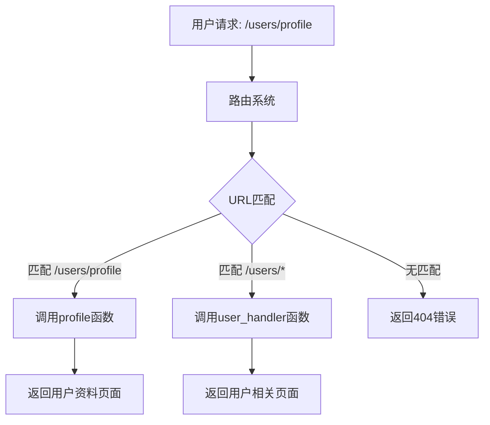

# Python Web路由

## 什么是Web路由？

路由（Routing）是Web应用程序中的核心机制，它**决定了应用如何响应特定的客户端请求**。简单来说，路由就是将URL映射到相应处理函数的过程，使得当用户访问特定URL时，Web应用能够执行对应的代码并返回相应的内容。

:::note
在Web开发中，路由系统负责将用户的HTTP请求（通常是一个URL）转发到处理该请求的适当代码部分。
:::

## 路由的基本概念

在传统的Web应用中，URL通常对应服务器上的物理文件路径。而在现代Web框架中，URL和物理文件路径是分离的，这种分离通过路由系统实现。



## Flask中的路由实现

Flask是Python中最流行的Web框架之一，它提供了简洁优雅的路由机制。

### 基本路由

```python
from flask import Flask

app = Flask(__name__)

@app.route('/')
def home():
    return "欢迎访问主页!"

@app.route('/about')
def about():
    return "关于我们页面"

if __name__ == '__main__':
    app.run(debug=True)
```

在这个例子中：
- 装饰器`@app.route('/')`将URL路径`/`映射到`home`函数
- 当用户访问网站根目录时，会显示"欢迎访问主页!"

### 动态路由

Flask支持在URL中包含变量，这些变量会作为参数传递给视图函数：

```python
@app.route('/user/<username>')
def show_user_profile(username):
    return f'用户: {username}'

@app.route('/post/<int:post_id>')
def show_post(post_id):
    # post_id是一个整数
    return f'帖子ID: {post_id}'
```

上面的例子展示了两种类型的动态路由：
1. 字符串参数：`/user/<username>`匹配`/user/john`，`username`将是`'john'`
2. 整数参数：`/post/<int:post_id>`匹配`/post/10`，`post_id`将是整数`10`

### HTTP方法限制

Flask路由可以限制接受的HTTP方法：

```python
@app.route('/login', methods=['GET', 'POST'])
def login():
    if request.method == 'POST':
        # 处理登录表单提交
        return '处理登录请求'
    else:
        # 显示登录表单
        return '显示登录表单'
```

## Django中的路由实现

Django使用一个集中式的方式处理路由，通常在`urls.py`文件中定义。

### 基本路由

```python
# urls.py
from django.urls import path
from . import views

urlpatterns = [
    path('', views.home, name='home'),
    path('about/', views.about, name='about'),
]

# views.py
from django.http import HttpResponse

def home(request):
    return HttpResponse("欢迎访问主页!")

def about(request):
    return HttpResponse("关于我们页面")
```

### 动态路由

Django也支持URL参数：

```python
# urls.py
urlpatterns = [
    path('user/<str:username>/', views.user_profile, name='user_profile'),
    path('article/<int:article_id>/', views.article_detail, name='article_detail'),
]

# views.py
def user_profile(request, username):
    return HttpResponse(f"用户: {username}")

def article_detail(request, article_id):
    return HttpResponse(f"文章ID: {article_id}")
```

### 正则表达式路由

Django还支持使用正则表达式定义更复杂的URL模式：

```python
from django.urls import path, re_path

urlpatterns = [
    # 匹配形如/archive/2021/01/的URL
    re_path(r'^archive/(?P<year>[0-9]{4})/(?P<month>[0-9]{2})/$', views.archive),
]

def archive(request, year, month):
    return HttpResponse(f"归档: {year}年{month}月")
```

## FastAPI中的路由实现

FastAPI是一个现代化的、高性能的Web框架，它基于Python类型提示构建API。

```python
from fastapi import FastAPI

app = FastAPI()

@app.get("/")
async def root():
    return {"message": "Hello World"}

@app.get("/items/{item_id}")
async def read_item(item_id: int):
    return {"item_id": item_id}

@app.post("/users/")
async def create_user(user_data: dict):
    return {"user_data": user_data}
```

FastAPI的特点是：
- 使用装饰器明确指定HTTP方法（如`@app.get`, `@app.post`）
- 利用Python类型注解进行自动参数验证
- 支持异步处理（使用`async/await`）

## 路由分组和蓝图

在大型Web应用中，合理组织路由代码非常重要。Flask的蓝图（Blueprint）和Django的应用（App）提供了路由分组机制。

### Flask蓝图

```python
# auth_routes.py
from flask import Blueprint

auth_bp = Blueprint('auth', __name__)

@auth_bp.route('/login')
def login():
    return "登录页面"

@auth_bp.route('/register')
def register():
    return "注册页面"

# app.py
from flask import Flask
from auth_routes import auth_bp

app = Flask(__name__)
app.register_blueprint(auth_bp, url_prefix='/auth')

# 现在登录页面的URL是/auth/login
```

### Django应用

```python
# myproject/settings.py (添加应用)
INSTALLED_APPS = [
    # ...其他应用
    'users',
]

# users/urls.py
from django.urls import path
from . import views

app_name = 'users'
urlpatterns = [
    path('login/', views.login, name='login'),
    path('register/', views.register, name='register'),
]

# myproject/urls.py
from django.urls import path, include

urlpatterns = [
    path('users/', include('users.urls')),
]
```

## 路由最佳实践

1. **语义化URL**：设计易于理解和记忆的URL，例如`/articles/2021/python-basics`比`/articles?id=123`更友好。

2. **RESTful路由设计**：按照REST原则设计API路由。
   ```
   GET /users         # 获取所有用户
   POST /users        # 创建新用户
   GET /users/{id}    # 获取特定用户
   PUT /users/{id}    # 更新特定用户
   DELETE /users/{id} # 删除特定用户
   ```

3. **版本控制**：为API添加版本号，便于后续升级。
   ```
   /api/v1/users
   /api/v2/users
   ```

4. **路由分组**：按功能或模块分组路由，提高代码组织性。

5. **URL结尾斜杠**：保持一致性，要么都有斜杠，要么都没有。

## 实际案例：博客系统路由设计

让我们设计一个简单博客系统的路由结构：

```python
# Flask实现
from flask import Flask, render_template

app = Flask(__name__)

@app.route('/')
def home():
    # 获取最新博客文章列表
    articles = get_latest_articles()
    return render_template('home.html', articles=articles)

@app.route('/article/<slug>')
def article_detail(slug):
    # 根据slug获取文章详情
    article = get_article_by_slug(slug)
    if not article:
        abort(404)
    return render_template('article.html', article=article)

@app.route('/category/<category_name>')
def category(category_name):
    # 获取特定分类的文章
    articles = get_articles_by_category(category_name)
    return render_template('category.html', category=category_name, articles=articles)

@app.route('/search')
def search():
    query = request.args.get('q', '')
    if not query:
        return redirect(url_for('home'))
    
    # 搜索文章
    results = search_articles(query)
    return render_template('search.html', query=query, results=results)

# 管理区域需要登录验证
@app.route('/admin/articles')
@login_required
def admin_articles():
    articles = get_all_articles()
    return render_template('admin/articles.html', articles=articles)

@app.route('/admin/articles/new', methods=['GET', 'POST'])
@login_required
def new_article():
    if request.method == 'POST':
        # 处理文章提交
        # ...
        return redirect(url_for('admin_articles'))
    return render_template('admin/edit_article.html')
```

这个案例展示了：
- 首页和文章详情页面的路由
- 使用动态参数（如`<slug>`）处理不同内容
- 处理查询参数（如搜索功能）
- 管理区域的路由保护
- 处理不同HTTP方法

## 总结

Web路由是任何Python Web应用程序的基础组件，它定义了应用如何响应不同的客户端请求。不同的Python Web框架（如Flask、Django和FastAPI）提供了各自的路由机制，但核心概念是相似的：将URL映射到处理函数。

好的路由设计应该：
- 清晰直观，便于理解
- 遵循RESTful原则（如果适用）
- 适当组织，避免代码混乱
- 考虑安全性，保护敏感路由

通过掌握Web路由的概念和技术，你已经迈出了成为Python Web开发者的重要一步！

## 练习

1. 使用Flask实现一个简单的路由系统，包含主页、关于页面和带参数的用户资料页面。

2. 在Django中创建一个新项目，设计一个电子商务网站的URL结构，包括产品列表、产品详情、购物车等页面。

3. 尝试使用FastAPI实现一个简单的RESTful API，提供用户管理功能（创建、读取、更新、删除）。

## 延伸阅读

- [Flask官方文档 - 路由](https://flask.palletsprojects.com/en/2.0.x/quickstart/#routing)
- [Django官方文档 - URL调度器](https://docs.djangoproject.com/en/3.2/topics/http/urls/)
- [FastAPI官方文档 - 路径参数](https://fastapi.tiangolo.com/tutorial/path-params/)
- [RESTful API设计最佳实践](https://restfulapi.net/)

:::tip
路由设计看似简单，但对应用程序的架构和用户体验有深远影响。花时间设计良好的URL结构是值得的投资！
:::