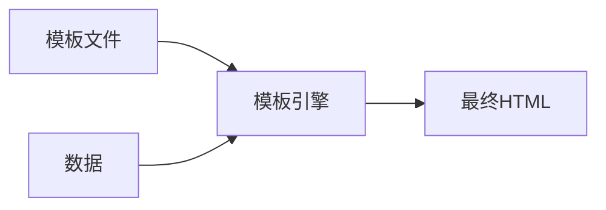

# Python 模板系统

在Web开发中，模板系统是一项非常重要的技术。它允许开发者将HTML页面与Python代码分离，实现前后端的解耦，同时又能够动态地向HTML页面注入数据。本文将全面介绍Python中常用的模板系统，帮助初学者理解其工作原理和应用场景。

## 什么是模板系统？

模板系统本质上是一种处理模板文件的工具，它可以将预定义的模板与数据结合，生成最终的输出文档（通常是HTML页面）。模板文件包含两种类型的内容：

1. **静态部分**：普通的HTML、CSS和JavaScript代码
2. **动态部分**：模板语法，用于嵌入变量、控制流语句等



## 为什么需要模板系统？

在Web开发中使用模板系统有以下几个主要优势：

1. **关注点分离**：将业务逻辑（Python代码）与表现层（HTML）分离
2. **代码复用**：通过模板继承和包含机制减少重复代码
3. **安全性**：自动处理输入转义，防止XSS攻击
4. **提高开发效率**：使前端开发和后端开发可以并行进行

## Python 中常用的模板系统

### 1. Jinja2

Jinja2是Python中最流行的模板引擎之一，被Flask等框架采用为默认模板系统。

#### 安装Jinja2

```bash
pip install Jinja2
```

#### 基本用法

```python
from jinja2 import Template

# 创建一个简单的模板
template_string = "Hello, {{ name }}!"
template = Template(template_string)

# 渲染模板
output = template.render(name="World")
print(output)  # 输出: Hello, World!
```

#### Jinja2常用语法

**1. 变量**

使用 `{{ 变量名 }}` 来输出变量值：

```html
<p>Welcome, {{ username }}!</p>
<p>Your balance: ${{ balance }}</p>
```

**2. 控制结构**

条件语句：

```html

  <p>Welcome back, {{ username }}!</p>

  <p>Please log in.</p>

```

循环：

```html
<ul>

  <li>{{ item.name }} - ${{ item.price }}</li>

</ul>
```

**3. 过滤器**

Jinja2提供了多种过滤器来转换输出：

```html
<!-- 转换为大写 -->
{{ name|upper }}

<!-- 格式化日期 -->
{{ date|date("Y-m-d") }}

<!-- 默认值 -->
{{ user.name|default("Guest") }}
```

**4. 模板继承**

模板继承是避免页面重复内容的强大功能：

base.html:
```html
<!DOCTYPE html>
<html>
<head>
    <title>默认标题</title>
</head>
<body>
    <header>
        <h1>网站标题</h1>
        <nav>导航栏</nav>
    </header>
    
    <main>
        
        
    </main>
    
    <footer>版权所有 © 2023</footer>
</body>
</html>
```

page.html:
```html


我的页面标题


<h2>页面内容</h2>
<p>这是我的内容</p>

```

### 2. Django模板

Django框架自带了一套强大的模板系统，语法与Jinja2相似但有一些差异。

#### Django模板基本用法

在Django视图中渲染模板：

```python
from django.shortcuts import render

def home_view(request):
    context = {
        'username': 'John',
        'items': ['Item 1', 'Item 2', 'Item 3']
    }
    return render(request, 'home.html', context)
```

home.html:
```html
<h1>Welcome, {{ username }}!</h1>

<ul>

    <li>{{ item }}</li>

</ul>
```

### 3. Mako

Mako是另一个高性能的Python模板库，语法更接近Python。

```python
from mako.template import Template

template = Template("Hello, ${name}!")
result = template.render(name="World")
print(result)  # 输出: Hello, World!
```

## 在Flask中使用模板系统

Flask默认使用Jinja2作为模板引擎，下面是一个简单示例：

```python
from flask import Flask, render_template

app = Flask(__name__)

@app.route('/')
def home():
    users = [
        {'name': 'Alice', 'age': 25},
        {'name': 'Bob', 'age': 30},
        {'name': 'Charlie', 'age': 35}
    ]
    return render_template('index.html', title='用户列表', users=users)

if __name__ == '__main__':
    app.run(debug=True)
```

index.html:
```html
<!DOCTYPE html>
<html>
<head>
    <title>{{ title }}</title>
</head>
<body>
    <h1>{{ title }}</h1>
    
    
    <table border="1">
        <tr>
            <th>名字</th>
            <th>年龄</th>
        </tr>
        
        <tr>
            <td>{{ user.name }}</td>
            <td>{{ user.age }}</td>
        </tr>
        
    </table>
    
    <p>没有用户数据</p>
    
</body>
</html>
```

运行上述Flask应用后，访问主页将看到一个包含用户数据的HTML表格。

## 实际案例：构建一个简单的博客系统

下面是使用Flask和Jinja2构建简单博客的示例：

### 1. 项目结构

```
blog_app/
├── app.py
├── static/
│   └── style.css
└── templates/
    ├── base.html
    ├── index.html
    └── post.html
```

### 2. Flask应用代码 (app.py)

```python
from flask import Flask, render_template
from datetime import datetime

app = Flask(__name__)

# 模拟博客文章数据
posts = [
    {
        'id': 1,
        'title': 'Python基础入门',
        'content': '本文介绍Python的基础语法和数据类型...',
        'author': 'Alice',
        'date': datetime(2023, 1, 15)
    },
    {
        'id': 2,
        'title': 'Flask Web开发',
        'content': 'Flask是一个轻量级的Python Web框架...',
        'author': 'Bob',
        'date': datetime(2023, 2, 10)
    }
]

@app.route('/')
def index():
    return render_template('index.html', posts=posts)

@app.route('/post/<int:post_id>')
def post(post_id):
    post = next((p for p in posts if p['id'] == post_id), None)
    if post:
        return render_template('post.html', post=post)
    return "文章不存在", 404

if __name__ == '__main__':
    app.run(debug=True)
```

### 3. 模板文件

base.html (基础模板):
```html
<!DOCTYPE html>
<html>
<head>
    <title>我的博客</title>
    <link rel="stylesheet" href="{{ url_for('static', filename='style.css') }}">
</head>
<body>
    <header>
        <h1>我的Python博客</h1>
        <nav>
            <a href="{{ url_for('index') }}">首页</a>
        </nav>
    </header>
    
    <main>
        
    </main>
    
    <footer>
        <p>版权所有 &copy; {{ now.year }}</p>
    </footer>
</body>
</html>
```

index.html (首页模板):
```html


博客首页


<h2>最新文章</h2>


<article class="post-preview">
    <h3><a href="{{ url_for('post', post_id=post.id) }}">{{ post.title }}</a></h3>
    <p class="meta">作者: {{ post.author }} | 发布日期: {{ post.date.strftime('%Y-%m-%d') }}</p>
    <p class="excerpt">{{ post.content[:100] }}...</p>
    <a href="{{ url_for('post', post_id=post.id) }}" class="read-more">阅读更多</a>
</article>


```

post.html (文章详情页模板):
```html


{{ post.title }}


<article class="post">
    <h2>{{ post.title }}</h2>
    <p class="meta">作者: {{ post.author }} | 发布日期: {{ post.date.strftime('%Y-%m-%d') }}</p>
    
    <div class="content">
        {{ post.content }}
    </div>
    
    <a href="{{ url_for('index') }}" class="back">返回首页</a>
</article>

```

### 4. CSS样式 (static/style.css)

```css
body {
    font-family: Arial, sans-serif;
    line-height: 1.6;
    margin: 0;
    padding: 0;
    color: #333;
}

header, footer {
    background-color: #f4f4f4;
    padding: 1rem;
    text-align: center;
}

main {
    max-width: 800px;
    margin: 0 auto;
    padding: 1rem;
}

.post-preview {
    border-bottom: 1px solid #ddd;
    padding-bottom: 1rem;
    margin-bottom: 1rem;
}

.meta {
    color: #666;
    font-size: 0.9rem;
}

.read-more, .back {
    display: inline-block;
    margin-top: 0.5rem;
    color: #0066cc;
    text-decoration: none;
}
```

这个简单的博客系统展示了如何在实际项目中使用模板系统：

1. 使用模板继承创建统一的页面布局
2. 在模板中展示动态数据（博客文章）
3. 使用URL生成助手（`url_for`）创建链接
4. 使用过滤器格式化日期和截取文本

:::tip
这个示例只是一个简化版本。实际的博客系统还需要数据库支持、用户认证、评论功能等。
:::

## 模板系统最佳实践

1. **保持模板简单**：模板应主要包含展示逻辑，复杂的业务逻辑应放在Python代码中
2. **使用模板继承**：创建基础模板并在其他模板中继承它，减少代码重复
3. **使用包含文件**：将重复使用的HTML片段（如导航栏、页脚）提取为单独的文件
4. **模板中避免过多逻辑**：复杂的条件判断和数据转换应在视图函数中处理
5. **适当注释**：在复杂的模板部分添加注释，以便于其他开发者理解

## 模板系统的安全考量

模板系统可能会带来一些安全风险，特别是当用户输入被直接插入到模板中时。大多数模板系统默认会对变量进行自动转义以防止XSS攻击。

:::warning
在Jinja2中，你可以使用 `|safe` 过滤器来禁用自动转义。只有在你确保内容是安全的情况下才应这样做。
:::

示例：
```html
<!-- 自动转义 -->
{{ user_input }}

<!-- 禁用转义（危险！） -->
{{ user_input|safe }}
```

## 总结

Python模板系统是Web开发中不可或缺的工具，它让前端展示与后端逻辑分离，同时提供了强大的功能来创建动态的Web页面。本文介绍了几种主流的Python模板系统（Jinja2、Django模板和Mako），并通过实例展示了它们的使用方法。

作为初学者，建议先掌握一种模板系统（如Jinja2）的基本用法，然后在实际项目中不断练习和应用。随着经验的积累，你将能够更好地利用模板系统的高级特性，创建更复杂、更动态的Web应用。

## 练习

1. 使用Flask和Jinja2创建一个简单的个人资料页面，显示用户的姓名、年龄、兴趣爱好等信息。
2. 在上一个练习的基础上，添加一个导航栏和页脚，并使用模板继承来避免代码重复。
3. 创建一个产品展示页面，使用循环显示多个产品，并为每个产品添加详情链接。
4. 尝试使用Jinja2的宏功能，创建一个可重用的表单组件。

## 进一步学习资源

- [Jinja2官方文档](https://jinja.palletsprojects.com/)
- [Flask模板教程](https://flask.palletsprojects.com/en/latest/tutorial/templates/)
- [Django模板指南](https://docs.djangoproject.com/en/stable/topics/templates/)
- [Python Web开发实战](https://realpython.com/tutorials/web-dev/) (Real Python)

通过这些资源的学习，你将能够更深入地理解Python模板系统，并在实际开发中灵活应用，构建出更加专业的Web应用。