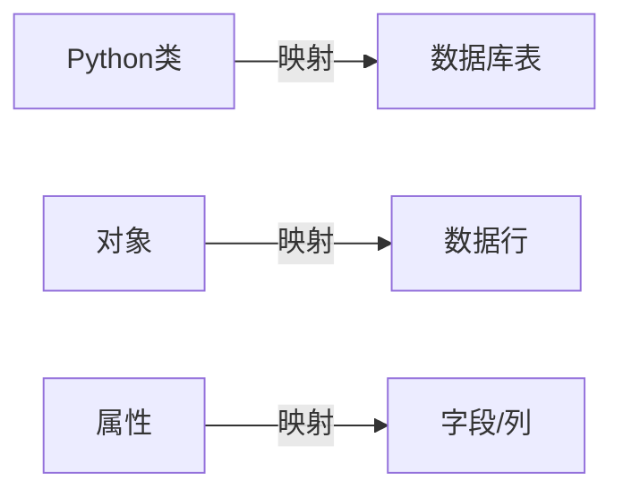

# Python ORM

在Web开发中，数据库交互是不可避免的一部分。传统的做法是编写SQL语句来操作数据库，但这往往需要开发者熟悉SQL语法，且容易出现安全问题。**对象关系映射(Object-Relational Mapping, ORM)** 技术的出现，为我们提供了一种更加Python化的方式来与数据库交互。

## 什么是ORM？

ORM是一种编程技术，它将数据库中的表与面向对象编程语言中的类建立映射关系：

- 数据表 → Python类
- 数据行 → 类的实例(对象)
- 字段/列 → 类的属性

:::tip ORM的优势
- 用Python代码代替SQL语句，减少学习成本
- 自动处理数据类型转换
- 提供更高层次的抽象，提高开发效率
- 自动防止SQL注入攻击
- 支持多种数据库后端，无需修改代码
:::



## Python 中常用的ORM框架

Python生态中有多种ORM解决方案，其中最受欢迎的是：

1. **SQLAlchemy** - 一个功能强大、灵活的独立ORM框架
2. **Django ORM** - Django框架内置的ORM系统
3. **Peewee** - 一个简单、轻量级的ORM库
4. **Tortoise ORM** - 专为异步IO(asyncio)设计的ORM

本文将主要介绍SQLAlchemy和Django ORM的基本使用。

## SQLAlchemy入门

SQLAlchemy是Python中最流行的ORM框架之一，它提供了全面的SQL抽象功能。

### 安装SQLAlchemy

```bash
pip install sqlalchemy
```

### 建立连接

```python
from sqlalchemy import create_engine
from sqlalchemy.ext.declarative import declarative_base
from sqlalchemy.orm import sessionmaker

# 创建引擎
engine = create_engine('sqlite:///example.db', echo=True)

# 创建基类
Base = declarative_base()

# 创建会话工厂
Session = sessionmaker(bind=engine)
```

### 定义模型

```python
from sqlalchemy import Column, Integer, String, Float

class User(Base):
    __tablename__ = 'users'
    
    id = Column(Integer, primary_key=True)
    username = Column(String(50), unique=True, nullable=False)
    email = Column(String(100), unique=True)
    age = Column(Integer)
    
    def __repr__(self):
        return f"<User(username='{self.username}', email='{self.email}')>"
```

### 创建表

```python
# 创建所有定义的表
Base.metadata.create_all(engine)
```

### 基本CRUD操作

#### 创建记录

```python
# 创建会话
session = Session()

# 创建用户
new_user = User(username='johndoe', email='john@example.com', age=30)
session.add(new_user)
session.commit()
```

#### 查询记录

```python
# 查询所有用户
all_users = session.query(User).all()
for user in all_users:
    print(user)

# 查询特定用户
john = session.query(User).filter_by(username='johndoe').first()
print(f"找到用户: {john.username}, 邮箱: {john.email}")

# 使用更复杂的过滤条件
from sqlalchemy import or_
adult_users = session.query(User).filter(User.age >= 18).all()
specific_users = session.query(User).filter(
    or_(User.username == 'johndoe', User.email.like('%@gmail.com'))
).all()
```

#### 更新记录

```python
# 更新记录
john = session.query(User).filter_by(username='johndoe').first()
john.age = 31
session.commit()
```

#### 删除记录

```python
# 删除记录
john = session.query(User).filter_by(username='johndoe').first()
session.delete(john)
session.commit()
```

## Django ORM使用

Django是一个全栈Web框架，拥有自己内置的ORM系统。如果你使用Django开发Web应用，无需额外安装ORM库。

### Django模型定义

在Django中，模型定义在各应用的`models.py`文件中：

```python
from django.db import models

class Product(models.Model):
    name = models.CharField(max_length=100)
    description = models.TextField(blank=True, null=True)
    price = models.DecimalField(max_digits=10, decimal_places=2)
    stock = models.PositiveIntegerField(default=0)
    created_at = models.DateTimeField(auto_now_add=True)
    updated_at = models.DateTimeField(auto_now=True)
    
    def __str__(self):
        return self.name
```

### 生成数据库迁移

Django使用迁移系统来同步模型变化到数据库：

```bash
python manage.py makemigrations
python manage.py migrate
```

### Django ORM的CRUD操作

#### 创建记录

```python
# 方法1
product = Product(name='笔记本电脑', price='5999.00', stock=100)
product.save()

# 方法2
Product.objects.create(name='手机', price='2999.00', stock=200)
```

#### 查询记录

```python
# 获取所有产品
all_products = Product.objects.all()

# 获取特定产品
laptop = Product.objects.get(name='笔记本电脑')

# 过滤产品
expensive_products = Product.objects.filter(price__gt=3000)
available_products = Product.objects.filter(stock__gt=0)

# 排序
products_by_price = Product.objects.order_by('price')  # 升序
products_by_price_desc = Product.objects.order_by('-price')  # 降序
```

#### 更新记录

```python
# 更新单个记录
laptop = Product.objects.get(name='笔记本电脑')
laptop.price = 6999.00
laptop.save()

# 批量更新
Product.objects.filter(price__gt=5000).update(description='高端产品')
```

#### 删除记录

```python
# 删除单个记录
laptop = Product.objects.get(name='笔记本电脑')
laptop.delete()

# 批量删除
Product.objects.filter(stock=0).delete()
```

## ORM的高级特性

### 关系映射

ORM最强大的特性之一是能够表达和处理数据库中的关系。

#### SQLAlchemy中的关系

```python
from sqlalchemy import Column, Integer, String, ForeignKey
from sqlalchemy.orm import relationship

class Author(Base):
    __tablename__ = 'authors'
    
    id = Column(Integer, primary_key=True)
    name = Column(String(50), nullable=False)
    
    # 建立与Book的关系
    books = relationship("Book", back_populates="author")

class Book(Base):
    __tablename__ = 'books'
    
    id = Column(Integer, primary_key=True)
    title = Column(String(100), nullable=False)
    author_id = Column(Integer, ForeignKey('authors.id'))
    
    # 建立与Author的关系
    author = relationship("Author", back_populates="books")
```

#### Django中的关系

```python
class Author(models.Model):
    name = models.CharField(max_length=100)
    
    def __str__(self):
        return self.name

class Book(models.Model):
    title = models.CharField(max_length=200)
    # 一对多关系
    author = models.ForeignKey(Author, on_delete=models.CASCADE, related_name='books')
    
    def __str__(self):
        return self.title
```

### 查询关系数据

#### SQLAlchemy

```python
# 查询作者及其所有书籍
session = Session()
author = session.query(Author).filter_by(name="J.K. Rowling").first()
for book in author.books:
    print(f"《{book.title}》由{author.name}编写")

# 联表查询
from sqlalchemy.orm import joinedload
authors_with_books = session.query(Author).options(joinedload(Author.books)).all()
```

#### Django

```python
# 查询作者及其所有书籍
author = Author.objects.get(name="J.K. Rowling")
for book in author.books.all():
    print(f"《{book.title}》由{author.name}编写")

# 使用select_related进行高效查询
books = Book.objects.select_related('author').all()
for book in books:
    print(f"《{book.title}》由{book.author.name}编写")  # 不会产生额外查询
```

## 实际案例：图书管理系统

下面我们将使用SQLAlchemy创建一个简单的图书管理系统，展示ORM在实际项目中的应用。

```python
from sqlalchemy import create_engine, Column, Integer, String, Float, ForeignKey, Table, Text
from sqlalchemy.ext.declarative import declarative_base
from sqlalchemy.orm import relationship, sessionmaker
from datetime import datetime

# 创建引擎和基类
engine = create_engine('sqlite:///library.db', echo=True)
Base = declarative_base()
Session = sessionmaker(bind=engine)

# 创建多对多关系的中间表
book_category = Table('book_category', Base.metadata,
    Column('book_id', Integer, ForeignKey('books.id')),
    Column('category_id', Integer, ForeignKey('categories.id'))
)

class Author(Base):
    __tablename__ = 'authors'
    
    id = Column(Integer, primary_key=True)
    name = Column(String(100), nullable=False)
    biography = Column(Text)
    
    books = relationship("Book", back_populates="author")
    
    def __repr__(self):
        return f"<Author(name='{self.name}')>"

class Category(Base):
    __tablename__ = 'categories'
    
    id = Column(Integer, primary_key=True)
    name = Column(String(50), nullable=False, unique=True)
    
    books = relationship("Book", secondary=book_category, back_populates="categories")
    
    def __repr__(self):
        return f"<Category(name='{self.name}')>"

class Book(Base):
    __tablename__ = 'books'
    
    id = Column(Integer, primary_key=True)
    title = Column(String(200), nullable=False)
    isbn = Column(String(20), unique=True)
    published_date = Column(String(10))
    price = Column(Float)
    author_id = Column(Integer, ForeignKey('authors.id'))
    
    author = relationship("Author", back_populates="books")
    categories = relationship("Category", secondary=book_category, back_populates="books")
    
    def __repr__(self):
        return f"<Book(title='{self.title}')>"

# 创建表
Base.metadata.create_all(engine)

# 示例使用
def populate_sample_data():
    session = Session()
    
    # 添加作者
    author1 = Author(name="J.K. Rowling", biography="英国著名作家，《哈利·波特》系列的作者")
    author2 = Author(name="George Orwell", biography="英国作家，《1984》和《动物农场》的作者")
    
    # 添加分类
    fantasy = Category(name="奇幻")
    fiction = Category(name="小说")
    dystopian = Category(name="反乌托邦")
    
    # 添加书籍
    book1 = Book(
        title="哈利·波特与魔法石",
        isbn="9787020033430",
        published_date="1997",
        price=29.9,
        author=author1,
        categories=[fantasy, fiction]
    )
    
    book2 = Book(
        title="1984",
        isbn="9787530210291",
        published_date="1949",
        price=25.0,
        author=author2,
        categories=[fiction, dystopian]
    )
    
    # 添加到会话并提交
    session.add_all([author1, author2, fantasy, fiction, dystopian, book1, book2])
    session.commit()
    
    # 关闭会话
    session.close()

def query_examples():
    session = Session()
    
    # 查询所有书籍及其作者
    print("所有书籍及其作者:")
    books = session.query(Book).all()
    for book in books:
        print(f"书名: {book.title}, 作者: {book.author.name}")
    
    print("\n奇幻类书籍:")
    # 查询特定分类的书籍
    fantasy = session.query(Category).filter_by(name="奇幻").first()
    for book in fantasy.books:
        print(f"书名: {book.title}, 价格: {book.price}")
    
    print("\nJ.K. Rowling的所有书籍:")
    # 查询特定作者的所有书籍
    rowling = session.query(Author).filter_by(name="J.K. Rowling").first()
    for book in rowling.books:
        categories = [cat.name for cat in book.categories]
        print(f"书名: {book.title}, 分类: {', '.join(categories)}")
    
    # 关闭会话
    session.close()

# 运行示例
if __name__ == "__main__":
    populate_sample_data()
    query_examples()
```

输出结果：

```
所有书籍及其作者:
书名: 哈利·波特与魔法石, 作者: J.K. Rowling
书名: 1984, 作者: George Orwell

奇幻类书籍:
书名: 哈利·波特与魔法石, 价格: 29.9

J.K. Rowling的所有书籍:
书名: 哈利·波特与魔法石, 分类: 奇幻, 小说
```

## ORM的性能注意事项

ORM为我们提供了很多便利，但使用不当可能导致性能问题：

:::caution 常见性能陷阱
1. **N+1查询问题**：循环中查询关联对象，导致大量额外查询
2. **加载过多数据**：不使用过滤条件或选择特定字段，加载所有记录和所有字段
3. **不恰当的关系加载**：不使用预加载(eager loading)技术
:::

### 优化策略

#### SQLAlchemy优化

```python
# 使用joinedload预加载关联对象
books = session.query(Book).options(joinedload(Book.author)).all()

# 只选择需要的字段
book_titles = session.query(Book.title, Book.price).all()

# 使用limit控制结果数量
recent_books = session.query(Book).order_by(Book.id.desc()).limit(10).all()
```

#### Django优化

```python
# 使用select_related预加载外键关系
books = Book.objects.select_related('author').all()

# 使用prefetch_related预加载多对多关系
books = Book.objects.prefetch_related('categories').all()

# 只获取需要的字段
authors = Author.objects.values('name', 'id')

# 使用切片限制结果数量
recent_books = Book.objects.order_by('-id')[:10]
```

## 总结

ORM技术极大地简化了Python应用程序与数据库的交互，提供了面向对象的方式来操作数据库，使代码更加Pythonic和可维护。我们学习了：

1. ORM的概念及其优势
2. SQLAlchemy的基本使用及其强大的关系映射能力
3. Django ORM的使用方法和便捷特性
4. 复杂关系的映射和查询
5. 实际案例中ORM的应用
6. 性能优化策略

在实际开发中，ORM能够帮助你专注于业务逻辑而不是SQL语句的细节，同时通过抽象层帮助你避免许多常见的数据库操作错误。

### 学习资源

如果你想深入学习Python ORM，以下资源可能对你有所帮助：

- [SQLAlchemy官方文档](https://docs.sqlalchemy.org/)
- [Django ORM官方文档](https://docs.djangoproject.com/en/stable/topics/db/)
- 《Essential SQLAlchemy》一书
- 《Django for Professionals》一书中关于ORM的章节

### 练习

1. 使用SQLAlchemy创建一个简单的博客系统模型，包含用户、文章和评论三个实体及它们之间的关系。
2. 使用Django ORM实现一个在线商店的数据模型，包括产品、类别、用户和订单。
3. 尝试针对一个已有的数据库表结构，使用ORM的反向工程功能生成对应的模型类。
4. 分析你现有项目中的ORM使用，找出可能的性能瓶颈并进行优化。

掌握ORM是Python Web开发的重要一步，它将帮助你以更高效、更安全的方式与数据库交互！